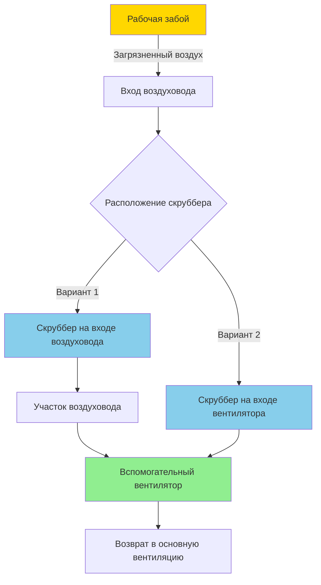

## Нагнетание vs Отсос вспомогательной вентиляции

Вспомогательные вентиляционные системы в подземных горных работах используют две основные конфигурации: нагнетание и отсос. Выбор между этими методами определяет характер воздушного потока, эффективность контроля загрязнений и операционные ограничения на рабочей забое.

### Физические принципы работы

**Системы нагнетания** подают свежий воздух через жесткие или гибкие воздуховоды от последнего проходного соединения к рабочей забое. Вентилятор создает положительное давление в воздуховоде, образуя струю чистого воздуха, которая воздействует на забой и увлекает возвратный воздух при движении обратно по выработке.

**Системы отсоса** извлекают загрязненный воздух с рабочей забоя через воздуховоды, создавая отрицательное давление, которое втягивает свежий воздух от последнего проходного соединения вдоль пола и боков выработки.

Обмен импульсом в системах нагнетания описывается:

$$\dot{m}_{\text{jet}} v_{\text{jet}} = \dot{m}_{\text{entrained}} v_{\text{mixed}}$$

Где скорость струи уменьшается с расстоянием от выхода воздуховода согласно:

$$\frac{v(x)}{v_0} = 6.2\sqrt{\frac{D}{x}}$$

Для систем отсоса, скорость захвата на расстоянии $x$ от входа в воздуховод:

$$v_{\text{capture}}(x) = \frac{Q}{A_{\text{face}} + \pi x^2}$$

### Сравнение систем

| Параметр | Нагнетание | Отсос |
|----------|-----------|-------|
| Качество воздуха на забое | Среднее - зависит от разбавления | Превосходное - захват у источника |
| Расстояние воздуховод-забой | 3-15 м типично | 1.5-4.5 м типично |
| Контроль расслоения метана | Плохой - эффекты плавучести | Отличный - захват у кровли |
| Удаление дизельных частиц | Удовлетворительное - только разбавление | Отличное с скруббером |
| Риск циркуляции | Высокий при неправильном размещении | Низкий - отрицательное давление |
| Восприимчивость к повреждению воздуховода | Среднее | Высокое - вблизи взрывов/операций |
| Сложность установки | Низкая | Средняя |
| Нормативные требования | Соответствие MSHA 75.325 | Соответствие MSHA 75.325, 75.326 |

### Характеристики вентиляции нагнетанием

**Преимущества:**
- Воздуховод остается в стороне от операций на забое, снижая повреждения
- Более простая установка и переместение
- Более низкая стоимость капитальных вложений в систему воздуховодов
- Эффективно для жарких сухих условий, требующих охлаждения

**Недостатки:**
- Загрязнители проходят через зону дыхания рабочего перед разбавлением
- Увеличенное расстояние воздуховод-забой снижает скорость воздуха на забое
- Зоны циркуляции развиваются, если угол воздействия струи превышает 15-20° от перпендикуляра
- Метан может накапливаться у кровли из-за плавучести ($\Delta\rho/\rho \approx 0.45$ для CH₄)

Эффективное расстояние вентиляции для систем нагнетания:

$$L_{\text{max}} = 6.2D\sqrt{\frac{v_0}{v_{\text{min}}}}$$

Где $v_{\text{min}}$ – минимально приемлемая скорость воздуха на забое (типично 15-30 м/мин согласно стандартам MSHA).

### Характеристики вентиляции отсосом

**Преимущества:**
- Загрязнители захватываются у источника перед поступлением в дыхательную зону рабочего
- Эффективный контроль метана путем захвата у уровня кровли
- Совместимость с пылевыми скрубберами и фильтровальным оборудованием
- Превосходящий метод для жарких влажных условий (удаляет тепло у источника)

**Недостатки:**
- Воздуховод расположен вблизи забоя требует частого переместения
- Более высокие затраты на повреждение и техническое обслуживание
- Короткое замыкание потока, если вход слишком близко к последнему проходному соединению
- Отрицательное давление может вытягивать газы пласта из пород

Эффективность захвата метана на уровне кровли:

$$\eta_{\text{capture}} = 1 - e^{-\frac{v_{\text{roof}}A_{\text{roof}}}{Q_{\text{CH_4}}}}$$

### Системы вентиляции с перекрытием

Системы с перекрытием используют нагнетание и отсос одновременно во время перехода от одной длины воздуховода к другой, предотвращая прерывание вентиляции при удлинении воздуховода.

**Последовательность операций с перекрытием:**

1. Основная система вентилирует забой (нагнетание или отсос)
2. Вторичная система установлена и запущена перед остановкой основной
3. Обе системы работают во время переходного периода (5-15 минут)
4. Основная система останавливается и переместается
5. Вторичная система становится основной для следующего цикла

Разность давлений при перекрытии:

$$\Delta P_{\text{overlap}} = \Delta P_{\text{forcing}} + \Delta P_{\text{exhausting}} - \Delta P_{\text{interference}}$$

Эффекты помех снижают эффективность объединенной системы на 15-30% из-за конкурирующих полей давления.

### Интеграция скруббера с системами отсоса

Конфигурации отсоса позволяют интегрировать пылевые скрубберы (фильтровальные системы) на входе воздуховода или входе вентилятора, удаляя дизельные частицы (DPM) и дыхаемую пыль.

Перепад давления скруббера должен быть включен при выборе вентилятора:

$$\Delta P_{\text{total}} = \Delta P_{\text{duct}} + \Delta P_{\text{scrubber}} + \Delta P_{\text{fittings}}$$

Для HEPA-фильтрации: $\Delta P_{\text{scrubber}}$ = 100-200 Па чистый, 250-375 Па загруженный.

### Рассмотрение размещения воздуховодов

**Размещение системы нагнетания:**
- Выход воздуховода 3-15 м от забоя в зависимости от производительности вентилятора
- Центральная линия целевой точки 1.2-1.8 м над полом в центре забоя
- Избегать углов воздействия > 20° для предотвращения циркуляции
- Закреплять воздуховод к боку или кровле для предотвращения повреждения оборудованием

**Размещение системы отсоса:**
- Вход воздуховода 1.5-4.5 м от забоя (ближе для контроля метана)
- Вход расположен на уровне кровли для захвата стратифицированного газа
- Минимум 9 м от последнего проходного соединения для предотвращения короткого замыкания
- Раструб входа снижает потери входа на 60-70%

Доля воздуха короткого замыкания:

$$f_{\text{short}} = \frac{1}{1 + (L_{\text{duct}}/D_{\text{duct}})^2(A_{\text{heading}}/A_{\text{duct}})}$$

### Контроль циркуляции

Циркуляция происходит, когда возвратный воздух повторно поступает в прием вентиляционной системы, снижая подачу свежего воздуха к рабочей забое.

**Механизмы циркуляции системы нагнетания:**
1. Воздействие струи создает тороидальный вихрь на забое
2. Недостаточное расстояние воздуховод-забой позволяет диффузию струи
3. Препятствия отклоняют воздушную струю к выходу воздуховода

**Методы контроля:**
- Поддерживать минимальное расстояние воздуховод-забой согласно спецификациям производителя вентилятора
- Расположить воздуховод для направления воздуха перпендикулярно забою
- Удалить препятствия в конусе расширения струи (приблизительно половинный угол 15°)
- Испытание с дымовой трубкой для определения зон циркуляции

**Циркуляция системы отсоса:**
- Короткое замыкание между последним проходным соединением и входом воздуховода
- Вызвано чрезмерной близостью входа воздуховода к источнику свежего воздуха

**Методы контроля:**
- Поддерживать минимум 9 м разделения (или $L > 3D_{\text{heading}}$)
- Установить выпрямители потока на последнем проходном соединении
- Барьерные завесы для направления воздушного потока вдоль пола перед достижением входа

Доля циркуляции для систем нагнетания:

$$R = \frac{C_{\text{outlet}} - C_{\text{fresh}}}{C_{\text{face}} - C_{\text{fresh}}}$$

Где $C$ представляет концентрацию индикаторного газа. MSHA требует $R < 0.25$ для соответствия 75.325.

### Нормативная база

Нормы MSHA (30 CFR часть 75) регулируют вспомогательную вентиляцию:

- **75.325**: Требует, чтобы воздух, достигающий рабочей забоя, содержал как минимум 19.5% кислорода, не более 0.5% CO₂ и поддерживал стандарты качества
- **75.326**: Требования по объему воздуха в зависимости от скорости продвижения забоя и выделения метана
- **75.330**: Контроль вентиляции забоя и требования по скорости воздуха (минимум 18 м/мин на входе)

Выбор системы должен учитывать нормативное требование непрерывной вентиляции во время всех операций на забое, влияя на реализацию системы перекрытия и планирование резервирования.

### Методология выбора

**Выберите нагнетание когда:**
- Низкое выделение метана (< 0.01 м³/мин на тонну производства)
- Высокие скорости продвижения, требующие частого переместения воздуховода
- Ограниченный бюджет капитальных вложений для систем воздуховодов
- Жаркие сухие условия, где охлаждение воздуха благоприятно

**Выберите отсос когда:**
- Условия с метаном (> 0.02 м³/мин на тонну метана)
- Уровни DPM приближаются к допустимому пределу воздействия
- Нормативное внимание к качеству воздуха на рабочей забое
- Требуется интеграция со скруббером

**Выберите перекрытие когда:**
- Нулевой перерыв в вентиляции обязателен
- История применения мер MSHA указывает на пробелы в вентиляции
- Производительность обосновывает затраты на сложность системы

Матрица решений должна включать факторы, специфичные для объекта, включая размеры выработки, производственное оборудование, тепловые условия и характеристики газов пласта для оптимизации защиты рабочих и операционной эффективности.
