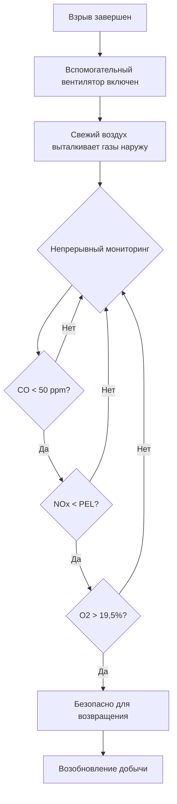

Локальная вентиляция подает свежий воздух непосредственно к активным забоям и тупиковым выработкам, где основная система вентиляции не может достичь. Этот целевой воздушный поток удаляет загрязняющие вещества в источнике их образования, очищает газы взрыва и поддерживает дыхательную атмосферу в проходящих проходках. Физика, регулирующая локальную вентиляцию, включает передачу импульса от вспомогательных вентиляторов через системы воздуховодов, диффузию загрязняющих веществ в рабочем пространстве и взаимодействие между подаваемым воздушным потоком и потерями на утечку.

## Требования к вентиляции забоя

Минимальное количество воздушного потока на рабочем забое зависит от скорости образования загрязняющих веществ, допустимых пределов концентрации и геометрии тупиковой выработки. Нормативные требования MSHA (30 CFR 75.325) устанавливают минимальные скорости и количества воздуха в зависимости от конкретных операций.

**Расчет минимального воздушного потока:**

$$Q_{\text{face}} = \frac{G}{C_{\text{max}} - C_{\text{ambient}}}$$

Где:
- $Q_{\text{face}}$ = требуемый воздушный поток на забое (м³/ч)
- $G$ = скорость образования загрязняющих веществ (масса/время)
- $C_{\text{max}}$ = максимально допустимая концентрация (ppm или мг/м³)
- $C_{\text{ambient}}$ = фоновая концентрация в подаваемом воздухе

Для операций с дизельным оборудованием требование к воздушному потоку значительно возрастает:

$$Q_{\text{diesel}} = 100 \times \text{HP}_{\text{total}}$$

Это эмпирическое соотношение (100 м³/ч на эффективную лошадиную силу) учитывает образование дизельного твёрдого топлива, оксидов азота и монооксида углерода от процессов сгорания.

### Стандарты воздушного потока на рабочем забое

| Тип операции | Минимальный воздушный поток | Нормативная база |
|----------------|-----------------|------------------|
| Проходка без оборудования | 1700 м³/ч | 30 CFR 75.325(a) |
| Проходка с дизельным оборудованием | 100 м³/ч на HP | 30 CFR 75.325(e) |
| Взрывные работы | Достаточно для очистки газов за 30 мин | 30 CFR 75.323 |
| Механизированный блок добычи | 5100 м³/ч минимум | 30 CFR 75.325(a)(1) |

## Время очистки взрывных газов

После взрыва токсичные газы, включая оксиды азота (NOₓ), монооксид углерода (CO) и диоксид углерода (CO₂), рассеиваются по всей тупиковой выработке. Время очистки зависит от эффективности вентиляции и характеристик перемешивания.

**Теоретическое время очистки (предположение хорошего перемешивания):**

$$t_{\text{clear}} = -\frac{V}{Q} \ln\left(\frac{C_{\text{final}}}{C_{\text{initial}}}\right)$$

Где:
- $t_{\text{clear}}$ = время достижения безопасной концентрации (минуты)
- $V$ = объём тупиковой выработки (м³)
- $Q$ = скорость вентиляционного воздушного потока (м³/ч)
- $C_{\text{final}}$ / $C_{\text{initial}}$ = отношение концентраций

MSHA требует возвращения в выработку только после того, как проверка атмосферы подтвердит концентрации ниже допустимых пределов воздействия. Консервативная практика предполагает 3–5 кратного воздухообмена для адекватной очистки, что дает:

$$t_{\text{practical}} = \frac{3V}{Q} \text{ до } \frac{5V}{Q}$$

### Процесс очистки взрывных газов

## Системы линейных преград

Линейная преграда (вентиляционная труба или воздуховод) подает воздух от вспомогательного вентилятора к рабочему забою. Система может работать в режиме нагнетания (положительное давление) или отсоса (отрицательное давление), каждый со своими отличительными преимуществами.

**Принудительная вентиляция:**
- Подает свежий воздух непосредственно на забой
- Поддерживает положительное давление в рабочей зоне
- Пыль и газы мигрируют в сторону выходного воздухопровода
- Утечка через воздуховод приводит к потере воздуха до достижения забоя

**Вентиляция отсоса:**
- Захватывает загрязняющие вещества в источнике
- Создает отрицательное давление на забое
- Лучший контроль газов при взрывных работах
- Утечка через воздуховод вызывает попадание потенциально загрязненного воздуха

### Утечка воздуховода и падение давления

Утечка воздуха через швы и ткань воздуховода снижает эффективный воздушный поток:

$$Q_x = Q_0 e^{-kL}$$

Где:
- $Q_x$ = воздушный поток на расстоянии $L$ от вентилятора (м³/ч)
- $Q_0$ = воздушный поток на выходе вентилятора (м³/ч)
- $k$ = коэффициент утечки (на 100 м)
- $L$ = длина воздуховода (единицы 100 м)

Типичные коэффициенты утечки варьируются от 0,015 до 0,05 на 100 м для гибкого воздуховода в хорошем состоянии.

Потери на трение в воздуховодах следуют соотношению Дарси-Вейсбаха:

$$\Delta P = \frac{f L \rho v^2}{2D}$$

Где:
- $\Delta P$ = падение давления (Па)
- $f$ = коэффициент трения (безразмерный)
- $L$ = длина воздуховода (м)
- $\rho$ = плотность воздуха (кг/м³)
- $v$ = скорость воздуха (м/ч)
- $D$ = диаметр воздуховода (м)

## Интеграция подавления пыли

Эффективная вентиляция забоя интегрирует системы водяного распыления для подавления дыхательной пыли. Картина воздушного потока вентиляции не должна нарушать завесы распыления или переносить пыль за пределы рабочего забоя в основную систему вентиляции.

**Скорость захвата для контроля пыли:**

$$v_{\text{capture}} = \frac{Q}{A_{\text{face}}}$$

Минимальные скорости захвата варьируются от 15–30 м/ч для угольной пыли, с более высокими значениями, требуемыми для интенсивных механических операций.

### Комбинированная стратегия вентиляции и контроля пыли

## Нормативные требования для тупиковых выработок

Нормативные требования MSHA строго контролируют вентиляцию в тупиковых выработках для предотвращения накопления метана и других опасных газов.

**30 CFR 75.325(a):** Линейная преграда, труба или другие одобренные методы должны направлять воздух в пределах 3 м от рабочего забоя в битуминозных угольных шахтах.

**30 CFR 57.8520 (металлические/неметаллические):** Минимум 95 м³/ч должно достигать забоя тупиковых работ, где работают или проходят люди.

**Ограничения расстояния:**
- Расстояние от конца воздуховода до забоя: ≤3 м (угольные шахты)
- Максимальная длина тупиковой выработки без вентиляции: 6 м

### Требования мониторинга соответствия

| Параметр | Частота | Нормативная ссылка |
|-----------|-----------|---------------------|
| Количество воздушного потока на забое | Каждую смену | 30 CFR 75.325(d) |
| Концентрация метана | Непрерывный (в угольных шахтах) | 30 CFR 75.323 |
| Процент кислорода | Перед каждой сменой | 30 CFR 75.323 |
| Проверка состояния воздуховода | Еженедельно | 30 CFR 75.370 |

## Рассмотрения при проектировании системы

Правильное проектирование системы локальной вентиляции учитывает:

1. **Выбор вентилятора:** Возможность создаваемого давления должна преодолевать потери на трение воздуховода и обеспечивать требуемые скорости выброса
2. **Диаметр воздуховода:** Большие диаметры снижают трение, но увеличивают стоимость и сложность обращения
3. **Материал воздуховода:** Гибкая ткань для временных применений, жесткая сталь для постоянных установок
4. **Расположение монтажа:** Вентилятор размещен вне опасной зоны с впуском из свежего воздухопровода
5. **Перекрывающаяся вентиляция:** Установка новой системы воздуховода перед снятием старой системы во время продвижения проходки

Эффективность системы локальной вентиляции в корне зависит от поддержания непрерывного воздушного потока, минимизации потерь на утечку и позиционирования выхода воздуховода для максимального захвата загрязняющих веществ в источнике. Регулярная проверка и техническое обслуживание систем вспомогательных вентиляторов составляют необходимые элементы управления безопасностью в шахте.
