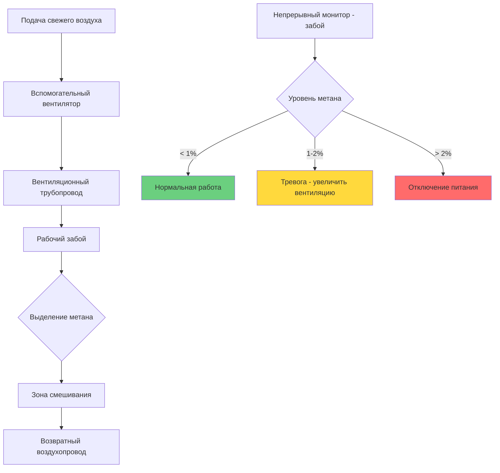
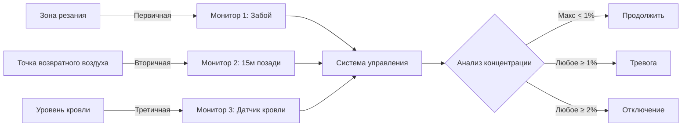

## Обзор

Разбавление метана в системах вентиляции представляет основную защиту от взрывоопасных атмосфер в подземных угольных операциях. Это приложение принципиально отличается от комфортной HVAC своей критичностью для безопасности жизни: недостаточная вентиляция создает условия, при которых концентрация метана достигает нижнего предела взрываемости (LEL) 5% по объему, при этом MSHA требует принятия мер при 1% и автоматического отключения питания при 2%.

Физика разбавления метана включает постоянное смешивание свежего воздуха с воздухом, содержащим метан, поддерживая концентрации ниже нормативных пределов благодаря достаточному объемному потоку. В отличие от разбавления загрязняющих веществ в промышленной вентиляции, плотность метана (0,554 кг/м³ при стандартных условиях против 1,204 кг/м³ для воздуха) создает движимое плавучестью расслоение, которое усложняет анализ смешивания.

## Основы выделения метана

### Механизмы выделения

Метан выделяется из угольных пластов через три различных физических процесса:

1. **Десорбция**: молекулы метана, связанные с микропорами угля, высвобождаются при снижении давления вышележащих пород в результате добычи. Изотерма Ленгмюра описывает это равновесие:

$$V = \frac{V_L P}{P_L + P}$$

где $V$ = содержание газа (м³/т), $V_L$ = константа объема Ленгмюра, $P$ = давление газа (кПа), и $P_L$ = константа давления Ленгмюра.

2. **Вытеснение**: разрушение целика угля при резании выталкивает свободный газ из трещин с производительностью, пропорциональной добыче тоннажа.

3. **Диффузия**: градиенты концентрации приводят миграцию метана из нетронутого угля на рабочий забой, описываемую законом Фика с коэффициентами диффузии типично 1×10⁻⁶ до 5×10⁻⁶ м²/с.

### Количественная оценка скорости выделения

Общая скорость выделения метана объединяет эти механизмы:

$$Q_{CH_4} = q_p T + q_d T + q_f A$$

где:
- $Q_{CH_4}$ = общее выделение метана (м³/мин)
- $q_p$ = выделение, связанное с производством (м³/т)
- $q_d$ = скорость десорбции (м³/т)
- $T$ = скорость производства (т/мин)
- $q_f$ = скорость выделения на забое (м³/м²·мин)
- $A$ = площадь открытого забоя (м²)

Типичные диапазоны для операций на битуминозных углях:

| Параметр | Типичный диапазон | Газообильные шахты |
|-----------|---------------|----------------|
| $q_p$ | 2-8 м³/т | 15-25 м³/т |
| $q_d$ | 0,5-2 м³/т | 3-8 м³/т |
| $q_f$ | 0,01-0,05 м³/м²·мин | 0,08-0,15 м³/м²·мин |

## Расчеты воздухообмена при разбавлении

### Минимальная скорость вентиляции

Требуемый воздухообмен для поддержания концентрации метана ниже нормативного предела выводится из баланса масс:

$$Q_{air} = \frac{100 \cdot Q_{CH_4}}{C_{max}}$$

где:
- $Q_{air}$ = требуемый объем воздуха (м³/мин)
- $Q_{CH_4}$ = скорость выделения метана (м³/мин)
- $C_{max}$ = максимально допустимая концентрация (%)

Для уровня действия MSHA 1%:

$$Q_{air} = 100 \cdot Q_{CH_4}$$

### Применение коэффициента безопасности

Консервативное проектирование применяет коэффициенты безопасности, учитывающие:
- неопределенность измерений (±15% типично для портативных детекторов)
- короткие замыкания вентиляции и мертвые зоны
- изменчивость скорости производства
- увеличение скорости выделения при обрушениях кровли

Стандартная практика применяет минимальный коэффициент безопасности 2,0:

$$Q_{design} = 2.0 \cdot Q_{air} = 200 \cdot Q_{CH_4}$$

Для рабочей секции, выделяющей 5 м³/мин метана:

$$Q_{design} = 200 \times 5 = 1000 \text{ м³/мин}$$

### Вентиляция забоя для газообильных пластов

Забои с высоким выделением требуют систем вспомогательных вентиляторов, подающих воздух непосредственно в зону резания. Критическим параметром проектирования является скорость у забоя, которая должна превышать минимальные значения для предотвращения накопления метана:

$$v_{face} = \frac{Q_{aux}}{A_{face}}$$

Минимальные скорости у забоя:

| Выделение метана | Минимальная скорость у забоя | Типичное $Q_{aux}$ (5м×3м забой) |
|-------------------|----------------------|-------------------------------|
| Низкое (<2 м³/мин) | 0,3 м/с | 270 м³/мин |
| Среднее (2-5 м³/мин) | 0,5 м/с | 450 м³/мин |
| Высокое (5-10 м³/мин) | 0,8 м/с | 720 м³/мин |
| Очень высокое (>10 м³/мин) | 1,2 м/с | 1080 м³/мин |

## Предотвращение расслоения через динамику потока

### Вызванное плавучестью расслоение

Более низкая плотность метана создает восходящую силу плавучести:

$$F_b = (\rho_{air} - \rho_{CH_4}) g V = 0.65 \text{ Н/м³}$$

В стоячих условиях эта сила приводит метан к накоплению у кровли. Число Ричардсона количественно определяет тенденцию расслоения:

$$Ri = \frac{g \Delta\rho H}{\rho v^2}$$

где $H$ = высота входного отверстия, $v$ = скорость воздуха, $\Delta\rho$ = разница плотности. Турбулентное смешивание предотвращает расслоение при $Ri < 0.1$, требуя:

$$v > \sqrt{\frac{10 g \Delta\rho H}{\rho}} = \sqrt{10 \times 9.81 \times 0.65 \times H}$$

Для высоты входного отверстия 2,5м:

$$v > \sqrt{10 \times 9.81 \times 0.65 \times 2.5} = 4.0 \text{ м/с}$$

### Режим вентиляционного потока

## Нормативная база MSHA

### Пороги концентрации

MSHA Title 30 CFR устанавливает три критических порога:

| Концентрация | Нормативное действие | Физическое обоснование |
|---------------|------------------|----------------|
| 1,0% | Проверить вентиляцию, выявить источник | 20% от LEL, уровень действия |
| 1,5% | Вывести персонал пока <1% | 30% от LEL, повышенный риск |
| 2,0% | Обесточить оборудование, эвакуировать | 40% от LEL, автоматическое отключение |

Уровень действия 1% обеспечивает коэффициент безопасности 5:1 ниже 5% LEL, учитывая локальную изменчивость концентрации и задержку измерения.

### Требования к мониторингу

Системы непрерывного мониторинга должны:
- Производить отбор проб с интервалом ≤30 секунд
- Обеспечивать сигналы тревоги при 1%, 1,5% и 2% уставках
- Интегрироваться с системами управления машинами для автоматического отключения
- Поддерживать точность калибровки ±0,1% абсолютной ошибки

## Интеграция непрерывного мониторинга

### Стратегия размещения датчиков

Оптимальные места расположения детекторов учитывают физику переноса метана:

**Принципы размещения детектора:**

1. **Монитор забоя**: 3-5м от головки резания, на уровне дыхания (1,5м), точка максимального воздействия
2. **Монитор возвратного воздуха**: 15-20м позади забоя, на уровне кровли, выявляет расслоения
3. **Датчик кровли**: на забое, продлен на 0,3м от кровли, выявляет раннее расслоение

### Регулирование вентиляции в реальном времени

Продвинутые системы модулируют скорость вспомогательного вентилятора на основе измеренного метана:

$$\omega_{fan} = \omega_{nominal} \cdot \left(1 + K_p \cdot \frac{C_{measured} - C_{target}}{C_{target}}\right)$$

где $K_p$ = коэффициент пропорциональности (типично 2-5), обеспечивающий автоматическую оптимизацию вентиляции при поддержании соответствия нормам.

## Пример проектирования: секция комбайна непрерывного действия

**Заданные параметры:**
- Производительность: 400 т/смену (8 часов)
- Содержание метана в угле: 12 м³/т
- Размеры забоя: 5,5м ширина × 3,2м высота
- Длина выработки: 150м

**Расчет выделения метана:**

$$T = \frac{400 \text{ т}}{8 \times 60 \text{ мин}} = 0.833 \text{ т/мин}$$

$$Q_{CH_4} = 12 \text{ м³/т} \times 0.833 \text{ т/мин} = 10.0 \text{ м³/мин}$$

**Требуемый воздухообмен (предел 1% с коэффициентом безопасности 2,0):**

$$Q_{design} = 200 \times 10.0 = 2000 \text{ м³/мин}$$

**Проверка скорости у забоя:**

$$v_{face} = \frac{2000}{5.5 \times 3.2} = 114 \text{ м/мин} = 1.9 \text{ м/с}$$

Это превышает минимум 1,2 м/с для очень высоких скоростей выделения, подтверждая адекватное турбулентное смешивание для предотвращения расслоения.

## Эксплуатационные соображения

### Переменные сценарии выделения

Скорость выделения метана резко возрастает при:
- **Обрушениях кровли**: выделение в 5-10× нормального уровня при освобождении газа из разломанных пород
- **Геологических нарушениях**: разломы и трещины обеспечивают пути миграции
- **Падении барометрического давления**: снижение атмосферного давления улучшает десорбцию (увеличение концентрации на 0,1% на 10 мбар)

Системы вентиляции должны приспосабливаться к этим переходным процессам через:
- диапазон модуляции скорости вентилятора 50-100%
- автоматический ответ на показания мониторов
- возможность ручного переопределения для аварийной вентиляции

### Сезонные и суточные эффекты

Температура поверхностного воздуха влияет на воздухообмен в шахте через естественное вентиляционное давление:

$$\Delta P_{NV} = \rho g H \left(\frac{1}{T_{surface}} - \frac{1}{T_{mine}}\right)$$

Летние условия снижают помощь естественной тяги механической вентиляции, требуя увеличенной мощности вентилятора для поддержания расчетных воздухообменов.

## Заключение

Проектирование вентиляции разбавления метана принципиально применяет закономерности массопередачи для поддержания концентраций взрывоопасного газа ниже нормативных пределов. Требуемый коэффициент разбавления 100:1 для соответствия 1% (200:1 со стандартными коэффициентами безопасности) требует значительных объемов воздухообмена, выделяя вентиляцию шахт как одно из самых требовательных приложений HVAC. Успех требует интеграции предсказания скорости выделения метана, анализа турбулентного смешивания для предотвращения расслоения и непрерывного мониторинга с системами автоматического управления—все в рамках предписывающей нормативной базы MSHA, которая приоритизирует безопасность горняков через консервативные коэффициенты проектирования.
