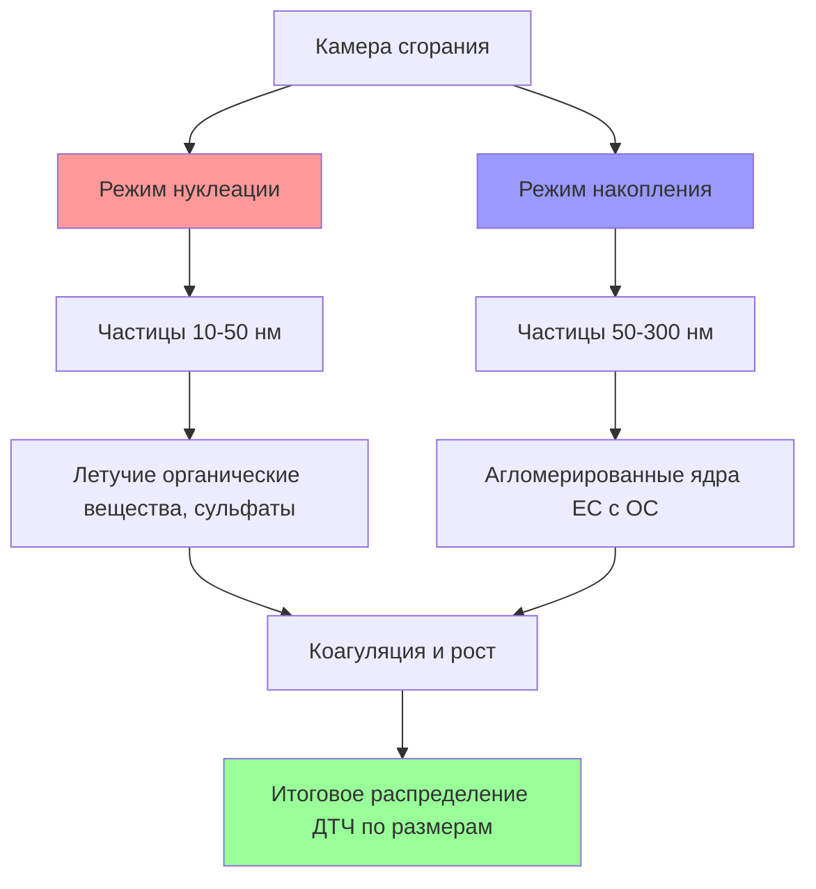
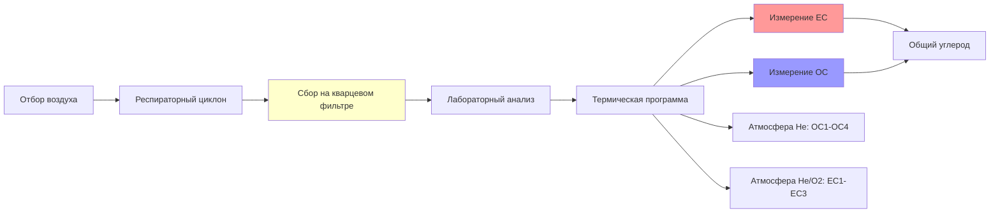

## Обзор

Дизельные твёрдые частицы (ДТЧ) представляют наиболее значительную проблему качества воздуха в подземных горных операциях с использованием дизельного оборудования. ДТЧ состоят из сложных углеродистых частиц с адсорбированными углеводородами и сульфатами, размещаемых преимущественно в респираторном диапазоне (<10 μm), что позволяет им проникать глубоко в лёгкие. Регулирования MSHA (30 CFR 57.5060) устанавливают строгие пределы воздействия из-за канцерогенной природы дизельного выхлопа, требуя непрерывного мониторинга и стратегий контроля.

## Анализ состава

### Основные компоненты

ДТЧ существуют в виде трёхфазной аэрозольной системы, состоящей из ядер углерода с адсорбированными летучими и полулетучими соединениями:

| Компонент | Массовая доля | Характеристики |
|-----------|---------------|-----------------|
| Элементарный углерод (EC) | 30-60% | Графитная структура, термически стабилен, нерастворим |
| Органический углерод (OC) | 15-40% | Полициклические ароматические углеводороды (ПАУ), алифатические соединения |
| Сульфаты | 5-20% | Серная кислота, сульфат аммония, гигроскопичные |
| Вода | 5-15% | Конденсированная влага, переменная с влажностью |
| Следовые металлы | 1-5% | Железо, кальций, цинк из износа двигателя и присадок топлива |

Элементарный углерод образуется при высокотемпературном пиролизе и неполном сгорании в богатых топливом зонах камеры сгорания. Процесс нуклеации углерода следует:

$$C_nH_m + \text{O}_2 \rightarrow \text{ядра копоти} + \text{CO} + \text{H}_2\text{O} + \text{тепло}$$

Органический углерод происходит из несгоревшего топлива и смазочного масла, которые адсорбируются на ядре элементарного углерода при охлаждении выхлопа. Органическая фракция включает сотни соединений, с ПАУ, представляющими основные канцерогенные компоненты.

### Механизм образования сульфатов

Сера в дизельном топливе окисляется при сгорании, образуя диоксид серы, который впоследствии преобразуется в сульфатные частицы посредством каталитического окисления:

$$\text{S (топливо)} + \text{O}_2 \rightarrow \text{SO}_2 \xrightarrow{\text{катализатор}} \text{SO}_3 + \text{H}_2\text{O} \rightarrow \text{H}_2\text{SO}_4 \text{ (аэрозоль)}$$

Концентрация аэрозоля серной кислоты прямо коррелирует с содержанием серы в топливе, делая обязательным использование ультранизкосерного дизельного топлива (УЛСТ, <15 ppm S) в подземной горнодобывающей промышленности для минимизации сульфатных ДТЧ.

## Распределение частиц по размерам

ДТЧ демонстрируют бимодальное распределение по размерам, отражающее различные механизмы образования:

### Характеристики распределения по размерам

Средний массовый аэродинамический диаметр (СМАД) ДТЧ обычно варьируется от 0,1 до 0,3 μm, с пиками концентрации по числу в режиме нуклеации (20-50 нм) и массовой концентрацией, доминируемой режимом накопления (100-300 нм).

Анализ респираторной фракции:

$$\text{RF} = \int_0^{10} \frac{dM}{d\log D_p} \cdot S(D_p) \, d\log D_p$$

Где:
- $\text{RF}$ = респираторная фракция
- $D_p$ = аэродинамический диаметр частицы (μm)
- $S(D_p)$ = размер-селективная эффективность отбора образца
- $\frac{dM}{d\log D_p}$ = функция массового распределения по размерам

Для ДТЧ приблизительно 90-98% массы попадают в респираторный диапазон, что делает их особенно опасными для шахтёров.

## Источники образования и коэффициенты эмиссии

Подземные горные ДТЧ происходят исключительно из дизельного оборудования, работающего в замкнутых пространствах с ограниченным обменом вентиляции.

### Коэффициенты эмиссии по типам оборудования

| Тип оборудования | Коэффициент эмиссии (мг/л.с.-ч) | Основной режим работы |
|----------------|--------------------------------|------------------------|
| Погрузчик с гидравлическим ковшом | 0,5-2,5 | Циклы загрузки/разгрузки, высокие переходные нагрузки |
| Самосвалы | 0,3-1,5 | Установившаяся работа, подъёмы на подъём |
| Установки для крепления пород | 0,2-0,8 | Низкая нагрузка, продолжительные периоды холостого хода |
| Буровые установки | 0,4-1,2 | Переменная нагрузка, позиционные движения |
| Транспортные средства для персонала | 0,3-1,0 | Умеренная установившаяся работа |

Коэффициенты эмиссии зависят от коэффициента нагрузки двигателя, состояния техническго обслуживания, качества топлива и высоты. Скорость образования следует:

$$G_{\text{ДТЧ}} = \sum_{i=1}^n (EF_i \cdot HP_i \cdot LF_i \cdot t_i)$$

Где:
- $G_{\text{ДТЧ}}$ = всего образованных ДТЧ (мг)
- $EF_i$ = коэффициент эмиссии для оборудования $i$ (мг/л.с.-ч)
- $HP_i$ = номинальная мощность в лошадиных силах
- $LF_i$ = коэффициент нагрузки (безразмерный, 0-1)
- $t_i$ = время работы (часы)

## Методы измерения: NIOSH 5040

Протокол термооптического анализа метода NIOSH 5040 служит окончательным стандартом для измерения ДТЧ в подземных шахтах, обеспечивая раздельное количественное определение фракций элементарного и органического углерода.

### Протокол термооптического анализа

Метод применяет поэтапное программирование температуры в контролируемых атмосферах:

**Фаза 1 - Выделение органического углерода (атмосфера гелия):**
- OC1: 310°C
- OC2: 480°C
- OC3: 615°C
- OC4: 900°C

**Фаза 2 - Выделение элементарного углерода (2% O₂/98% He):**
- EC1: 600°C
- EC2: 675°C
- EC3: 750°C
- EC4: 850°C

Оптическая коррекция учитывает индуцированное пиролизом обугливание органических соединений во время фазы гелия. Мониторинг пропускания через фильтр позволяет дифференцировать между нативным элементарным углеродом и пиролизированным органическим углеродом.

### Требования к отбору образца

MSHA требует личного отбора образца для оценки воздействия ДТЧ:

$$C_{\text{ДТЧ}} = \frac{(EC + OC) \cdot 1000}{Q \cdot t}$$

Где:
- $C_{\text{ДТЧ}}$ = концентрация ДТЧ (μg/м³)
- $EC$ = масса элементарного углерода (мг)
- $OC$ = масса органического углерода (мг)
- $Q$ = скорость отбора образца (л/мин)
- $t$ = длительность отбора образца (мин)

Текущее предельное значение воздействия MSHA: **160 μg/м³ общего углерода (TC)** как 8-часовое временно-взвешенное среднее.

## Стратегии мониторинга воздействия

Эффективный контроль ДТЧ требует интегрированных подходов к мониторингу, объединяющих личный отбор образца, мониторинг площади и надзор в реальном времени.

### Разработка сетевой системы многоточечного мониторинга

Стратегическое размещение станций мониторинга фиксирует схемы дисперсии ДТЧ:

1. **Мониторинг источника** - рядом с активным дизельным оборудованием
2. **Мониторинг транспорта** - основные воздушные пути вентиляции
3. **Дыхательная зона рабочего** - личные насосы отбора образца
4. **База свежего воздуха** - справочные уровни фонового излучения

Требование вентиляции разбавления выводится из баланса образования-удаления:

$$Q_{\text{вент}} = \frac{G_{\text{ДТЧ}}}{C_{\text{целевая}} - C_{\text{фон}}} \cdot SF$$

Где:
- $Q_{\text{вент}}$ = требуемая скорость вентиляции (м³/мин)
- $G_{\text{ДТЧ}}$ = общая скорость образования ДТЧ (μg/мин)
- $C_{\text{целевая}}$ = целевая концентрация (μg/м³)
- $C_{\text{фон}}$ = уровень ДТЧ свежего воздуха (μg/м³)
- $SF$ = коэффициент безопасности (обычно 1,5-2,0)

### Технологии мониторинга в реальном времени

Системы непрерывного мониторинга обеспечивают немедленную обратную связь для оптимизации системы вентиляции:

| Технология | Принцип измерения | Время ответа | Точность |
|------------|----------------------|---------------|----------|
| Фотоакустическая | Поглощение света EC | 1-10 секунд | ±15% |
| Микровесы с качающимся конусом (TEOM) | Обнаружение массовой нагрузки | 1 минута | ±10% |
| Aethalometer | Оптическое поглощение на 880 нм | 1 секунда | ±20% |
| Рассеяние света | Прокси концентрации частиц | 1 секунда | ±30% |

Приборы в реальном времени коррелируют с результатами NIOSH 5040 через калибровочные коэффициенты, учитывающие вариации состава ДТЧ между шахтами.

## Соответствие нормативно-правовым актам

Регулирования MSHA (30 CFR Part 57, Subpart D) требуют комплексных программ контроля ДТЧ, включающих:

- Ежеквартальный личный отбор образца воздействия для затронутых рабочих
- Ежегодные обследования вентиляции с картированием ДТЧ
- Утверждение дизельного оборудования и протоколы обслуживания
- Инженерные элементы управления (системы фильтрации, вентиляция)
- Административные элементы управления (ротация оборудования, расписание работ)

Шахты должны продемонстрировать, что концентрации ДТЧ остаются ниже предела 160 μg/м³ посредством задокументированных записей отбора образца и планов корректирующих действий при превышениях.

---

*Связанные темы: [Принципы вентиляции шахт](../../), [Фильтрация дизельного двигателя](../filtration/), [Мониторинг качества воздуха](../../../air-quality-monitoring/)*
