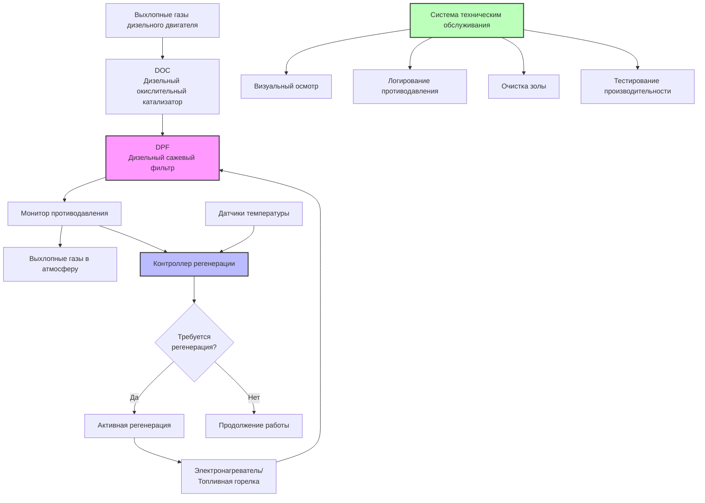

Системы очистки дизельных выхлопов представляют критически важную технологию для контроля выбросов дизельной сажи (DPM) в подземных шахтах. Эти системы снижают вредные выбросы в источнике, дополняя стратегии вентиляции для поддержания качества воздуха в пределах допустимого воздействия MSHA.

## Системы дизельных сажевых фильтров

Дизельные сажевые фильтры (DPF) улавливают и удаляют твёрдые частицы из потоков выхлопных газов посредством физической фильтрации. Фильтры с проточными стенками представляют наиболее распространённую конфигурацию, пропуская выхлопной газ через пористые керамические стенки, которые задерживают частицы, позволяя газу проходить.

**Материалы фильтрующего элемента:**

- Керамические подложки из кордиерита
- Карбид кремния для повышенной термостойкости
- Металлофибровые фильтры для тяжёлых условий эксплуатации
- Спечённые металлические элементы для специальных условий

Эффективность DPF зависит от конструкции фильтра, скорости потока и распределения по размерам частиц. Эффективность сбора следует:

$$\eta_{DPF} = 1 - \exp\left(-\frac{4\alpha h t}{\pi d_p D}\right)$$

где $\eta_{DPF}$ — эффективность сбора, $\alpha$ — плотность упаковки, $h$ — толщина фильтра, $t$ — диаметр волокна, $d_p$ — диаметр частицы и $D$ — диаметр фильтра.

Современные системы DPF достигают снижения на 85–95 % по массе твёрдых частиц и снижения на 90–99 % по количеству частиц для надлежащим образом обслуживаемых установок. Однако DPF создают противодавление выхлопных газов, которое увеличивается с накоплением твёрдых частиц, требуя периодической регенерации.

## Технология каталитического нейтрализатора

Дизельные окислительные катализаторы (DOC) снижают содержание газообразных загрязняющих веществ, включая оксид углерода, углеводороды и растворимую органическую фракцию DPM. Подложки катализаторов содержат благородные металлы (платину, палладий), которые способствуют окислительным реакциям.

**Окислительные реакции:**

$$\text{CO} + \frac{1}{2}\text{O}_2 \xrightarrow{\text{катализатор}} \text{CO}_2$$

$$\text{HC} + \text{O}_2 \xrightarrow{\text{катализатор}} \text{CO}_2 + \text{H}_2\text{O}$$

DOC работают эффективно при температурах выхлопных газов выше 200°C. В приложениях подземного производства формулировки катализаторов должны выдерживать вибрацию, термические циклы и возможное отравление катализатора от серы топлива и присадок в смазочных материалах.

Каталитические системы DPF объединяют функцию окислительного катализатора с фильтрацией твёрдых частиц. Покрытие катализатором способствует непрерывной пассивной регенерации путём окисления захватанной сажи при более низких температурах, чем требуют некаталитические фильтры.

## Варианты доочистки выхлопных газов

Выбор технологии доочистки зависит от характеристик двигателя, цикла работы и эксплуатационных ограничений:

| Технология | Снижение PM | Снижение CO/HC | Противодавление | Регенерация |
|------------|-------------|-----------------|-----------------|-------------|
| Дизельный окислительный катализатор | 20–50 % | 70–90 % | Низкое | Отсутствует |
| Некаталитический DPF | 85–95 % | Минимальное | Высокое | Требуется активная |
| Каталитический DPF | 85–95 % | 60–80 % | Высокое | Пассивная/активная |
| Каталитический проволочный фильтр | 60–80 % | 50–70 % | Среднее | Пассивная |
| Одноразовый фильтр | 70–85 % | Минимальное | Среднее | Замена |

**Критерии выбора системы:**

- Профиль температуры выхлопных газов двигателя
- Доступное пространство для установки
- Доступность технического обслуживания и способность
- Цикл работы и количество рабочих часов
- Доступность вентиляционного воздуха для охлаждения

## Требования к регенерации

Регенерация DPF удаляет накопленные твёрдые частицы для восстановления эффективности фильтрации и ограничения увеличения противодавления. Регенерация окисляет захватанные углеродные частицы в газ CO₂.

**Пассивная регенерация** происходит непрерывно во время работы, когда температура выхлопных газов превышает 250–300°C. Скорость реакции следует кинетике Аррениуса:

$$r = A \exp\left(-\frac{E_a}{RT}\right)$$

где $r$ — скорость окисления, $A$ — предэкспоненциальный множитель, $E_a$ — энергия активации (обычно 140–180 кДж/моль для каталитического окисления сажи), $R$ — газовая постоянная и $T$ — абсолютная температура.

**Активная регенерация** использует внешний источник тепла, когда пассивная регенерация оказывается недостаточной. Методы включают:

- Электронагревательные элементы в корпусе фильтра
- Топливные горелки выше по потоку от DPF
- Дроссельное управление выхлопными газами для повышения температуры
- Стационарные станции регенерации

Подземное горнодобывающее оборудование обычно требует активной регенерации каждые 80–200 рабочих часов в зависимости от нагрузки двигателя, содержания серы в топливе и конструкции фильтра. Продолжительность регенерации колеблется от 20–60 минут за цикл.

## График технического обслуживания

Надлежащее техническое обслуживание обеспечивает постоянную эффективность контроля выбросов и предотвращает повреждение оборудования от чрезмерного противодавления.

**Интервалы планового технического обслуживания:**

- Ежедневный визуальный осмотр на предмет повреждений, утечек
- Еженедельный мониторинг противодавления (предупреждение при 20–25 кПа выше базового значения)
- Ежемесячный осмотр катализатора на предмет физических повреждений
- Каждые 500 часов: очистка золы, осмотр подложки
- Каждые 1000 часов: комплексное тестирование системы
- Ежегодное сертификационное тестирование в соответствии с требованиями MSHA

Накопление золы из содержащих металлы соединений, полученных из смазочного материала, создаёт негорючий остаток, требующий периодической очистки. Интервалы очистки золы зависят от скорости расхода смазочного материала и его формулировки.

## Требования соответствия MSHA

Администрация по безопасности и охране здоровья шахтёров (MSHA) регулирует дизельные выбросы посредством требований одобрения и тестирования в 30 CFR Part 7, Subpart E.

**Процесс одобрения MSHA:**

- Производитель подаёт заявку с данными тестирования
- MSHA присваивает номер одобрения
- Периодическое повторное тестирование требуется для сохранения одобрения
- Полевые модификации требуют переодобрения

Оборудование должно поддерживать уровни выбросов ниже:

$$\text{DPM} \leq 2,5 \text{ мг/м}^3 \text{ (8-часовое TWA)}$$

Одобренные MSHA двигатели и системы доочистки получают таблички идентификации с указанием номеров одобрения, допустимых условий эксплуатации и требований технического обслуживания. Операторы должны поддерживать системы в соответствии со спецификациями производителя для сохранения статуса одобрения.

**Требования к документации:**

- Журналы технического обслуживания с датами и процедурами
- Измерения противодавления до/после регенерации
- Спецификации топлива и смазочного материала
- Результаты ежегодного тестирования выбросов
- Записи о подготовке операторов

Неcоответствующее оборудование должно быть выведено из эксплуатации до исправления недостатков и проверки. Надлежащий выбор системы очистки выхлопных газов, эксплуатация и техническое обслуживание напрямую влияют на защиту здоровья рабочих и нормативное соответствие в подземных горнодобывающих операциях.
