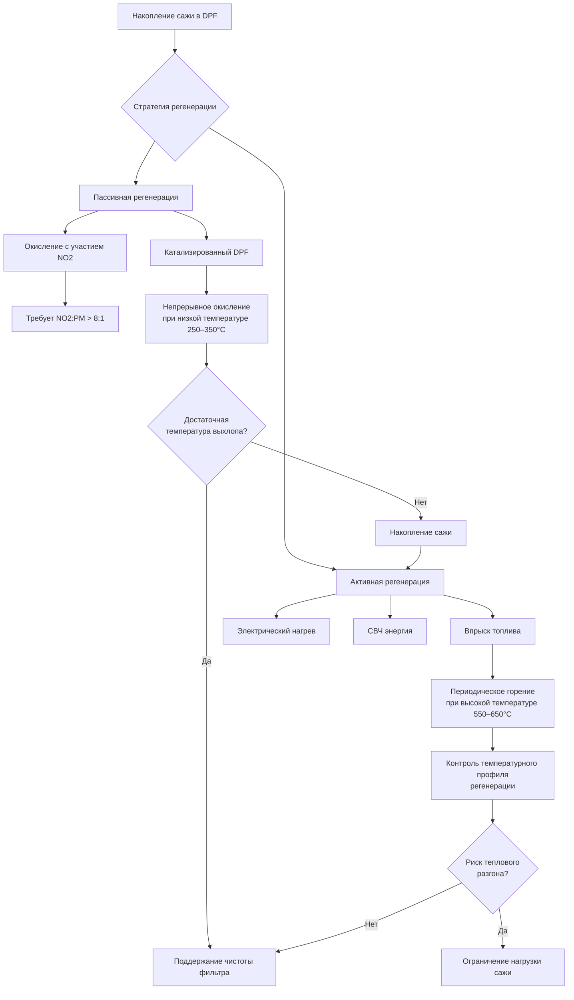

Фильтрация дизельных твёрдых частиц представляет наиболее прямой инженерный контроль для снижения воздействия на рабочих вредных продуктов сгорания в подземной горнодобывающей среде. Системы фильтрации применяют две различные стратегии: контроль источника посредством установленных на выхлопе дизельных фильтров твёрдых частиц (DPF) на мобильном оборудовании и контроль в точке воздействия посредством систем фильтрации окружающего воздуха в кабине.

## Технология дизельного фильтра твёрдых частиц

### Конструкция фильтра и механизмы захвата

Дизельные фильтры твёрдых частиц используют керамические или кремниевые подложки с геометрией параллельных каналов. Конфигурация со стенками потока заставляет выхлопные газы проходить через пористые стенки канала с типичными средними диаметрами пор 10–20 мкм, создавая извилистый путь, который захватывает твёрдые частицы посредством четырёх одновременных механизмов:

- **Инерционное столкновение** - частицы с достаточным импульсом не могут следовать по линиям тока газа вокруг волокон подложки
- **Перехват** - частицы, следующие по линиям тока, контактируют с волокнами, когда радиус частицы превышает расстояние до поверхности волокна
- **Диффузия** - броуновское движение вызывает отклонение частиц размером менее 0,3 мкм от линий тока и их контакт с поверхностями захвата
- **Гравитационное осаждение** - актуально только для частиц размером более 1 мкм в области низких скоростей

Эффективность захвата отдельным волокном для диффузионно-управляемого захвата подчиняется:

$$\eta_D = 2.6 \left(\frac{\mu}{U_0 \rho_p d_p d_f}\right)^{1/3}$$

где $\mu$ — динамическая вязкость газа, $U_0$ — скорость подхода, $\rho_p$ — плотность частиц, $d_p$ — диаметр частицы, $d_f$ — диаметр волокна.

### Эффективность фильтрации и падение давления

Чистые дизельные фильтры твёрдых частиц достигают 85–95% эффективности массового захвата частиц размером более 0,1 мкм, при этом эффективность приближается к 99% по мере увеличения нагрузки сажи и вклада поверхностной фильтрации. Падение давления на подложке фильтра подчиняется закону Дарси, модифицированному для сжимаемого потока:

$$\Delta P = \frac{\mu L U_0}{k_0} + \frac{\mu L_c U_0}{k_c}$$

где $L$ — толщина стенки подложки, $k_0$ — проницаемость чистой подложки (типично $1–3 \times 10^{-13}$ м²), $L_c$ — толщина слоя сажи, $k_c$ — проницаемость слоя сажи.

Приемлемые пределы падения давления составляют 25–40 кПа до того, как необходимо проводить регенерацию для предотвращения чрезмерного противодавления двигателя и потери мощности.

## Методы регенерации фильтра

### Термодинамика пассивной регенерации

Пассивная регенерация опирается на каталитическое окисление захваченных частиц углерода при температурах выхлопных газов, типично присутствующих при нормальной работе оборудования. Скорость, ограничивающая реакцию окисления:

$$\text{C} + \frac{1}{2}\text{O}_2 \rightarrow \text{CO}$$

происходит при значимых скоростях выше 250°C, когда катализаторы группы платины снижают энергию активации со 180 кДж/моль примерно до 120 кДж/моль. Выражение скорости по Аррениусу:

$$r = A e^{-E_a/RT} [\text{O}_2]^n$$

демонстрирует экспоненциальную чувствительность к температуре. Каждое увеличение температуры выхлопа на 50°C примерно удваивает скорость окисления.

Катализированные системы, содержащие оксид церия или платину, повышают окисление NO в NO2, который действует как более активный окисляющий агент:

$$\text{C} + 2\text{NO}_2 \rightarrow \text{CO}_2 + 2\text{NO}$$

Этот путь происходит при температурах 200–250°C, расширяя пригодность пассивной регенерации для оборудования с низким циклом работы в горнодобывающей промышленности.

### Системы активной регенерации

Когда температуры выхлопа остаются недостаточными для пассивной регенерации, активные системы впрыскивают энергию для повышения температуры фильтра выше порога 550°C для быстрого окисления углерода. Типичные подходы включают:

| Метод | Повышение температуры | Источник энергии | Длительность цикла | Пригодность для шахт |
|-------|----------------------|------------------|-------------------|----------------------|
| Впрыск топлива после горелки | 300–400°C | Дизельное топливо | 15–30 мин | Ограниченная - риск взрыва |
| Электрические нагревательные элементы | 200–350°C | Аккумулятор/генератор | 30–60 мин | Умеренная - требование мощности |
| СВЧ нагрев | 400–500°C | Выделенный генератор | 10–20 мин | Низкая - сложность оборудования |
| Стационарная станция регенерации | 500–600°C | Внешняя горелка | 60–120 мин | Предпочтительная для подземных |

Тепловыделение во время регенерации подчиняется:

$$Q = \Delta H_c \cdot m_{\text{soot}} \cdot X$$

где $\Delta H_c = 32,8$ МДж/кг — теплота сгорания углерода, $m_{\text{soot}}$ — накопленная масса, $X$ — доля выгорания. Неконтролируемая регенерация фильтров с чрезмерной нагрузкой сажи (>10 г/л объёма подложки) создаёт риск теплового разгона, когда выделение тепла превышает тепловую ёмкость подложки и конвективное охлаждение.

## Системы фильтрации окружающего воздуха в кабине оператора

### Требования к проектированию защитной кабины

MSHA 30 CFR 57.5066 требует наличие защитных кабин на дизельном оборудовании в подземных металлических/неметаллических шахтах для защиты операторов от воздействия DPM. Эффективная защита кабины требует:

1. **Положительное избыточное давление** - поддержание 25–50 Па выше давления окружающего шахтного воздуха
2. **Высокоэффективная фильтрация твёрдых частиц** - MERV 16 или лучше
3. **Активная угольная фильтрация газовой фазы** - для летучих органических соединений
4. **Герметичная конструкция кабины** - минимизация инфильтрации через уплотнения дверей и кабельные проходки

Коэффициент защиты, достигаемый герметичной фильтрованной кабиной, подчиняется:

$$PF = \frac{C_{\text{outside}}}{C_{\text{inside}}} = \frac{Q_{\text{supply}}}{Q_{\text{supply}} + Q_{\text{infiltration}}(1 - \eta)}$$

где $Q_{\text{supply}}$ — расход отфильтрованного подаваемого воздуха, $Q_{\text{infiltration}}$ — расход нефильтрованной утечки, $\eta$ — эффективность захвата фильтра.

### Производительность HEPA фильтра

Высокоэффективные фильтры для удаления твёрдых частиц (HEPA), используемые в приложениях шахтных кабин, должны достигать минимум 99,97% эффективности для частиц размером 0,3 мкм — наиболее проникающего размера частиц, где механизмы диффузии и перехвата демонстрируют минимальную комбинированную эффективность. Материал фильтра состоит из стеклянных волокон с диаметром распределения 0,5–5 мкм в случайной ориентации для максимизации вероятности захвата частиц.

Первоначальное падение давления на HEPA материале коррелирует с скоростью сталкивения лицевой поверхности:

$$\Delta P = \frac{4 \mu L U}{\pi d_f^2 \alpha} \cdot f(\alpha)$$

где $\alpha$ — пористость материала (типично 0,05–0,15 для HEPA материала), $f(\alpha)$ — эмпирический коэффициент коррекции сопротивления. Стандартные системы кабин работают при скоростях натекания 1,3–2,5 м/с, создавая первоначальное падение чистого давления 150–250 Па.

## Требования к техническому обслуживанию и контролю

### Интервалы обслуживания фильтра

Интервалы обслуживания DPF зависят от цикла работы оборудования, размера двигателя и содержания серы в топливе:

- **Тяжелое оборудование** (>200 л.с., непрерывная работа) - осмотр каждые 500–1000 часов
- **Легкое оборудование** (<100 л.с., прерывистое использование) - осмотр каждые 1000–2000 часов
- **Катализированные системы DPF** - замена катализатора каждые 5000–8000 часов из-за термического деградирования

Системы фильтрации кабины требуют более частого внимания:

- **Предварительные фильтры** (MERV 8–11) - замена каждые 1–3 месяца на основе падения давления
- **Финальные HEPA фильтры** - замена при превышении дифференциального давления 500 Па или каждые 6–12 месяцев
- **Активные угольные слои** - замена каждые 3–6 месяцев или при обнаружении прорыва

### Проверка производительности

MSHA требует периодической проверки эффективности фильтрации кабины посредством:

1. **Дымовой тест** - визуальное подтверждение доставки отфильтрованного воздуха и отсутствия инфильтрации
2. **Измерение разницы давлений** - проверка поддержания положительного избыточного давления
3. **Испытание качества воздуха** - концентрация элементного углерода внутри и снаружи кабины

Коэффициент защиты кабины должен превышать 10:1 в соответствии с рекомендациями MSHA, означая, что воздействие оператора на DPM не должно превышать 10% концентрации DPM в окружающем шахтном воздухе при надлежащей работе системы кабины.

Технология фильтрации дизельных твёрдых частиц обеспечивает поддающееся количественной оценке снижение воздействия при надлежащей спецификации, обслуживании и проверке. Комбинация контроля источника посредством высокоэффективных систем DPF и контроля воздействия посредством герметичных фильтрованных кабин оператора представляет текущую лучшую практику управления DPM в подземных горнодобывающих операциях.
