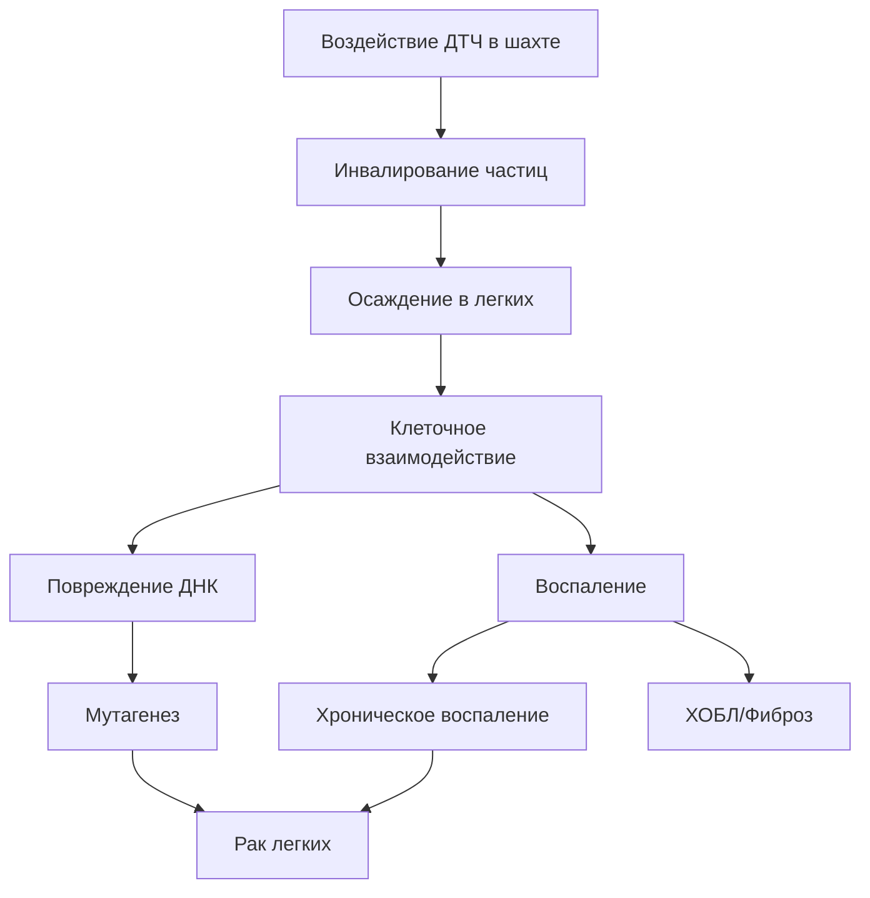
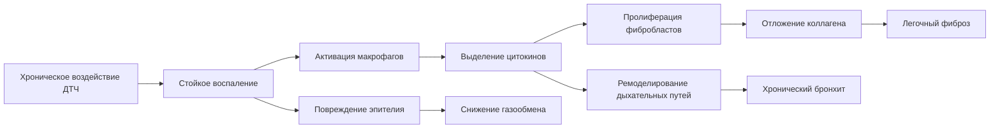

# Опасность для здоровья от дизельных твердых частиц в подземных шахтах

Дизельные твердые частицы (ДТЧ) представляют один из наиболее значительных рисков для профессионального здоровья в подземных горнодобывающих операциях. Замкнутое пространство и широкое использование дизельного оборудования создают условия, при которых рабочие подвергаются хроническому воздействию сложного аэрозоля, содержащего известные канцерогены и респираторные раздражители. Понимание физических механизмов взаимодействия частиц с тканью человека критически важно для реализации эффективных мер контроля воздействия.

## Классификация канцерогенности и доказательства

Международное агентство по исследованию рака (МАИР) переклассифицировало выхлопные газы дизельных двигателей из группы 2A (вероятно канцерогенно) на **группу 1 (канцерогенно для человека)** в 2012 году. Это решение было основано на достаточных эпидемиологических данных, связывающих воздействие дизельного выхлопа с повышенным риском рака легких, особенно у населения подземных шахт.

### Эпидемиологические доказательства

Крупномасштабные когортные исследования установили четкие дозо-ответные зависимости между кумулятивным воздействием ДТЧ и смертностью от рака легких:

- **Исследование воздействия дизельного выхлопа на горняков (DEMS)**: Продемонстрировало повышенный риск рака легких при кумулятивном воздействии, измеренном в дыхательном элементарном углероде (РЭУ)
- **Зависимость экспозиция-ответ**: Относительный риск увеличивается примерно на 1,08 на каждые 100 мкг/м³-года кумулятивного воздействия РЭУ
- **Период латентности**: Риск рака проявляется через 15-30 лет воздействия, что затрудняет прямое наблюдение у отдельных рабочих

Механизм канцерогенности включает множественные пути. Полициклические ароматические углеводороды (ПАУ), адсорбированные на углеродном ядре, подвергаются метаболической активации с образованием аддуктов ДНК. Одновременно поверхность частицы генерирует активные формы кислорода через реакции типа Фентона, создавая окислительный стресс в ткани легкого.

## Размер частиц и физика осаждения в легких

Распределение дизельных твердых частиц по размерам критически определяет место осаждения в дыхательной системе. Физика переноса и осаждения частиц следует хорошо установленным принципам аэрозольной механики.

### Механизмы осаждения в зависимости от размера частиц

| Диаметр частицы | Основной механизм осаждения | Область осаждения | Эффективность осаждения |
|-------------------|------------------------------|-------------------|------------------------|
| > 10 мкм | Инерционный удар | Носоглоточная область | 90-95% |
| 2,5 - 10 мкм | Оседание | Трахеобронхиальная | 50-70% |
| 0,1 - 2,5 мкм | Диффузия + Оседание | Альвеолярная | 20-40% |
| < 0,1 мкм | Броуновская диффузия | Альвеолярная | 40-60% |

Дизельные твердые частицы состоят в основном из **агломерированных частиц в диапазоне 0,05-1,0 мкм**, со средним массовым аэродинамическим диаметром (СМАД) обычно между 0,15-0,30 мкм. Этот диапазон размеров обеспечивает высокое проникновение в альвеолы.

### Расчет доли осаждения в альвеолах

Доля осаждения в альвеолах для сферических частиц может быть приблизительно рассчитана с использованием:

$$
\eta_{alv} = 0,5 \left( 1 - \frac{1}{1 + 0,0155 \sqrt{d_p}} \right) \exp\left(-0,416\sqrt{d_p}\right) + 0,155\sqrt{d_p}
$$

где $d_p$ — диаметр частицы в микрометрах. Для типичных ДТЧ частиц при $d_p = 0,2$ мкм:

$$
\eta_{alv} \approx 0,25
$$

Это указывает на то, что примерно 25% массы вдыхаемых ДТЧ осаждается в альвеолярной области, где механизмы очистки частиц наиболее медленные и канцерогенное воздействие наиболее критично.

## Респираторные эффекты для здоровья

Помимо рака, воздействие ДТЧ вызывает острые и хронические неопухолевые респираторные эффекты через множественные физиологические механизмы.

### Острые эффекты

- **Раздражение дыхательных путей**: Газообразные компоненты (NO₂, SO₂) и химия поверхности частиц запускают немедленные воспалительные ответы
- **Бронхоспазм**: Наблюдается у чувствительных лиц при концентрациях выше 200 мкг/м³ общего углерода
- **Нарушение мукоцилиарного клиренса**: Осаждение частиц нарушает частоту биения ресничек, снижая способность очистки на 30-50%

### Хронические эффекты

Длительное воздействие приводит к стойким структурным изменениям в ткани легкого:

Каскад воспаления инициируется, когда альвеолярные макрофаги поглощают частицы ДТЧ, но не могут эффективно переварить углеродное ядро. Это неудачный фагоцитоз вызывает хроническое выделение воспалительных медиаторов (TNF-α, IL-1β, IL-6) и активных форм кислорода.

## Предельные значения профессионального воздействия

MSHA установила первое комплексное ограничение воздействия ДТЧ для подземных металлических и неметаллических шахт в 2001 году, впоследствии уточненное в 2006 году.

### Нормативно-правовая база MSHA

| Нормативный акт | Дата вступления в силу | Предельное значение воздействия | Метод измерения |
|------------|----------------|----------------|---------------------|
| 30 CFR 57.5060 | Январь 2006 | 160 мкг/м³ ОУ | NIOSH 5040 |
| Окончательное правило | Январь 2008 | 160 мкг/м³ ОУ | NIOSH 5040 |

**ОУ = Общий углерод** измеренный как сумма элементарного углерода (ЭУ) и органического углерода (ОУ).

Предельное значение воздействия основано на 8-часовом временно взвешенном среднем значении (ВВС):

$$
\text{ВВС} = \frac{\sum_{i=1}^{n} C_i \cdot t_i}{8 \text{ часов}}
$$

где $C_i$ — концентрация ДТЧ в период $i$ и $t_i$ — продолжительность в часах.

### Протокол отбора проб и анализа

MSHA требует отбора проб с использованием:
- **Фильтр**: 37 мм, кварцевый стекловолоконный фильтр с размером пор 0,8 мкм
- **Скорость потока**: 2,0 л/мин для личного отбора проб
- **Анализ**: Термооптический анализ в соответствии с методом NIOSH 5040, измеряющий элементарный углерод как основной маркер

Соотношение между общим углеродом и элементарным углеродом в шахтных условиях обычно следует:

$$
\text{ЭУ} \approx 0,7 \to 0,9 \times \text{ОУ}
$$

Это соотношение варьируется в зависимости от технологии двигателя, типа топлива и практики обслуживания.

## Дозо-ответные зависимости

Количественное определение риска для здоровья требует понимания кумулятивного воздействия в течение трудовой жизни. Показатель кумулятивного воздействия интегрирует концентрацию и продолжительность:

$$
\text{Кумулятивное воздействие} = \int_0^T C(t) \, dt \approx \sum_{i=1}^{N} C_i \cdot \Delta t_i
$$

выраженный в единицах мкг/м³-года.

Для практической оценки риска избыточный пожизненный риск рака легких можно оценить с использованием:

$$
\text{Избыточный риск} = \beta \times \text{Кумулятивное воздействие}
$$

где $\beta \approx 8 \times 10^{-5}$ на мкг/м³-год на основе данных DEMS. Горняк, подвергающийся воздействию 160 мкг/м³ в течение 40 лет, накапливает 6 400 мкг/м³-года, что соответствует примерно 0,5% избыточному пожизненному риску рака легких.

## Иерархия профилактики и управления

Защита здоровья рабочих требует интегрированных вентиляционных и административных мер контроля:

1. **Контроль источника**: Дизельные окислительные катализаторы, дизельные фильтры твердых частиц снижают выбросы на 85-95%
2. **Разбавляющая вентиляция**: Поддерживайте минимум 50 м³/ч на лошадиную силу тормоза для разбавления ДТЧ ниже предельных значений воздействия
3. **Средства индивидуальной защиты**: Респираторы обеспечивают временную защиту, но не могут заменить инженерные меры контроля
4. **Мониторинг воздействия**: Непрерывный или периодический отбор проб для проверки эффективности контроля

Требование к вентиляции для поддержания концентрации ниже допустимого предельного значения воздействия следует:

$$
Q = \frac{G}{C_{ПЗВ} - C_{окр}}
$$

где $Q$ — требуемый расход воздуха (м³/мин), $G$ — скорость генерации ДТЧ (мкг/мин), и $C_{ПЗВ}$ — допустимое предельное значение воздействия.

## Компоненты

- Канцерогенный потенциал
- Респираторные эффекты для здоровья
- Предельные значения ДТЧ
- Нормативные акты MSHA
