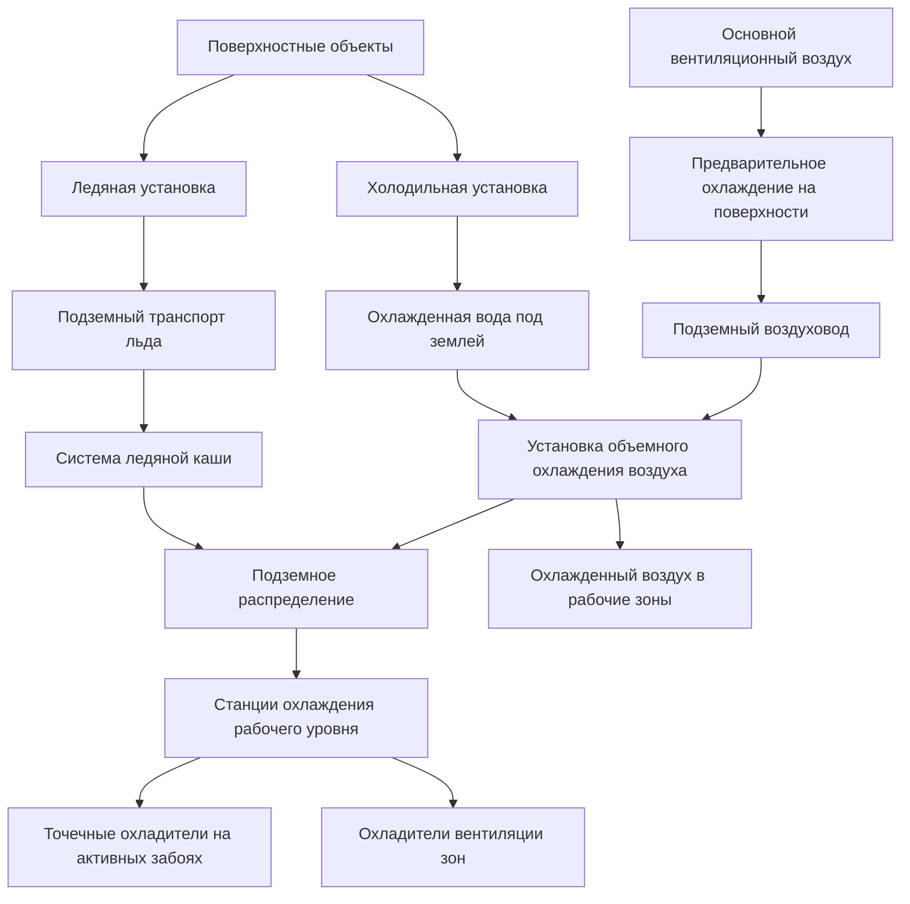
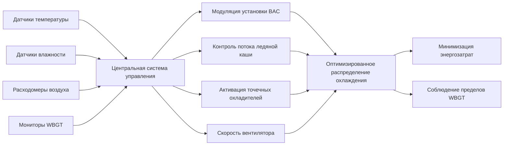

Стратегии охлаждения подземных шахт решают проблемы суровых термических условий, создаваемых температурой девственной горной породы, автокомпрессионным нагреванием, тепловыделением оборудования и метаболизмом человека. При расширении горнодобывающих операций на глубины более 1500 метров охлаждение становится необходимым для безопасности рабочих и операционной жизнеспособности. Эффективное управление тепловыми процессами требует интегрированного подхода, сочетающего вентиляцию, холодильную технику и локализованное охлаждение для поддержания влажно-шаровой температуры (WBGT) в физиологических пределах.

## Расчеты индекса теплового стресса

Тепловая нагрузка в шахтах количественно определяется с помощью влажно-шаровой температуры (WBGT), которая интегрирует температуру по сухому термометру, влажность и радиационное тепло. WBGT рассчитывается по-разному для внутренних и внешних сред:

**WBGT в помещении (применимо к подземным шахтам):**

$$\text{WBGT} = 0,7 \times T_{wb} + 0,3 \times T_{g}$$

Где:
- $T_{wb}$ = естественная влажно-шаровая температура (°C)
- $T_{g}$ = шаровая температура (°C)

**WBGT на открытом воздухе (поверхностные объекты):**

$$\text{WBGT} = 0,7 \times T_{wb} + 0,2 \times T_{g} + 0,1 \times T_{db}$$

Где $T_{db}$ — температура по сухому термометру.

Рекомендуемые NIOSH пределы воздействия (REL) для теплового стресса варьируют в зависимости от интенсивности метаболической работы и статуса акклиматизации. Для непрерывной работы в горнодобывающей среде:

| Интенсивность работы | Метаболическое тепло (Вт) | Предел WBGT (акклиматизированный) | Предел WBGT (неакклиматизированный) |
|-----------|-------------------|---------------------------|----------------------------|
| Легкая | 200 | 30,0°C | 29,0°C |
| Умеренная | 300 | 28,0°C | 26,5°C |
| Тяжелая | 400 | 26,0°C | 24,0°C |
| Очень тяжелая | 500 | 25,0°C | 22,0°C |

MSHA требует режимов работы-отдыха, когда WBGT превышает эти пороги, что напрямую влияет на производительность. Системы охлаждения призваны поддерживать WBGT ниже пределов для непрерывной работы.

## Расчет полной тепловой нагрузки шахты

Эффективное проектирование системы охлаждения требует точного количественного определения всех источников тепла. Полная чувствительная тепловая нагрузка составляет:

$$Q_{total} = Q_{rock} + Q_{auto} + Q_{equipment} + Q_{human} + Q_{oxidation} + Q_{water}$$

**Тепло девственной горной породы ($Q_{rock}$):**

Тепловой поток от поверхностей горной породы зависит от времени экспозиции и разницы температур:

$$Q_{rock} = A \times h \times (T_{rock} - T_{air})$$

Где:
- $A$ = площадь открытой поверхности горной породы (м²)
- $h$ = коэффициент конвективной теплопередачи (5-15 Вт/м²·K)
- $T_{rock}$ = температура девственной горной породы (°C)
- $T_{air}$ = температура вентиляционного воздуха (°C)

Для вновь взорванных горных забоев начальный тепловой поток может достигать 40-50 Вт/м², снижаясь экспоненциально по мере охлаждения поверхностных слоев. Со временем (недели-месяцы) тепловой поток в равновесии стабилизируется на уровне 10-20 Вт/м².

**Автокомпрессионное нагревание ($Q_{auto}$):**

Для поступающего воздуха, опускающегося на глубину $H$:

$$Q_{auto} = \dot{m} \times c_p \times \frac{g \times H}{c_p} = \dot{m} \times g \times H$$

Упрощая:

$$\Delta T_{auto} = \frac{g \times H}{c_p} = \frac{9,81 \times H}{1005} \approx 0,00976 \times H \text{ (°C)}$$

Для шахты глубиной 2500 метров автокомпрессионное нагревание добавляет примерно 24,4°C к температуре поступающего воздуха, представляя необратимую тепловую нагрузку, требующую удаления путем холодильной техники.

**Тепло оборудования ($Q_{equipment}$):**

Вся механическая и электрическая энергия в конечном итоге преобразуется в тепло:

$$Q_{equipment} = \sum (P_{i} \times \eta_{i} \times DF_{i})$$

Где:
- $P_i$ = установленная мощность оборудования $i$ (кВт)
- $\eta_i$ = коэффициент нагрузки (0,5-0,9 типичное значение)
- $DF_i$ = коэффициент разнообразия (0,6-0,85 для нескольких единиц)

Дизельное оборудование преобразует энергию топлива в тепло с примерно 35% механической эффективностью и 65% тепловым отведением. Дизельный погрузчик мощностью 300 л.с. отводит примерно 150 кВт тепла в атмосферу шахты.

## Архитектура системы охлаждения

## Системы охлаждения ледяных установок

Охлаждение на основе льда использует высокую скрытую теплоту плавления ($h_{fg} = 334$ кДж/кг) для эффективного транспорта тепловой энергии. Производство льда происходит на поверхности с использованием традиционного холодильного оборудования, со льдом, транспортируемым под землю для распределения.

**Требуемая энергия производства льда:**

$$Q_{ice} = m_{ice} \times (h_{fg} + c_{p,ice} \times \Delta T)$$

Для производства льда из воды при 10°C в лед при 0°C:

$$Q_{ice} = m_{ice} \times (334 + 4,18 \times 10) = m_{ice} \times 375,8 \text{ кДж/кг}$$

**Характеристики системы:**

| Параметр | Типичный диапазон | Примечания |
|-----------|--------------|-------|
| Производительность | 500-2000 тонн/день | Крупные глубокие шахты |
| Емкость хранилища | 1000-5000 тонн | Резерв 1-3 дня |
| Форма льда | Хлопья, блоки или каша | Хлопья наиболее распространены для обращения |
| Метод транспорта | Пневматический, конвейер или шахта | Пневматический типичен для вертикальных шахт |
| Температура распределения | 0-4°C | Ледяно-водяная смесь |

**Распределение ледяной каши:**

Системы ледяной каши циркулируют смеси лед-вода (обычно 20-40% льда по массе) через изолированные сети трубопровода. Смесь остается при 0°C во время плавления, обеспечивая изотермальное охлаждение с превосходными характеристиками теплопередачи.

Поток каши требует особого внимания к падению давления. Уравнение Дарси-Вейсбаха модифицируется для двухфазного потока:

$$\Delta P = f \times \frac{L}{D} \times \frac{\rho \times v^2}{2} \times \Phi$$

Где $\Phi$ — двухфазный множитель (1,2-1,8 для ледяной каши).

**Преимущества ледяных систем:**

- Высокая тепловая емкость на единицу объема (скрытое тепло)
- Изотермальная эффективность охлаждения при 0°C
- Отсутствие обращения с хладагентом под землей
- Простое распределение с использованием существующей инфраструктуры
- Тепловое хранилище обеспечивает буферизацию нагрузки

**Недостатки:**

- Затраты энергии на производство льда (COP обычно 2,5-3,5)
- Логистика обращения и транспорта
- Управление водой в подземных работах
- Ограничено температурой подачи 0°C

## Установки объемного охлаждения воздуха

Установки объемного охлаждения воздуха (BAC) устанавливают холодильное оборудование под землей в стратегических местах для охлаждения основных потоков вентиляционного воздуха. Эти централизованные системы обеспечивают базовое охлаждение больших горнодобывающих районов.

**Анализ цикла холодильной установки:**

Подземные установки BAC обычно используют аммиак (R-717) или современные хладагенты HFC в циклах паровой компрессии. Коэффициент эффективности охлаждения составляет:

$$\text{COP}_{cooling} = \frac{Q_{evap}}{W_{comp}} = \frac{h_1 - h_4}{h_2 - h_1}$$

Где значения энтальпии соответствуют входу испарителя (4), выходу испарителя (1) и нагнетанию компрессора (2).

Типичное значение COP для подземных установок находится в диапазоне 2,5–4,0, на что влияют:
- Температура испарителя (5-10°C для охлаждения воздуха)
- Температура конденсатора (30-45°C в зависимости от метода отведения тепла)
- Свойства хладагента и эффективность цикла

**Стратегии отведения тепла:**

Подземные холодильные установки должны отводить тепло конденсатора. Используются три подхода:

1. **Отведение тепла в возвратный воздуховод:** Тепло конденсатора отводится в возвратный вентиляционный воздух, который несет тепло на поверхность. Требует достаточной емкости возвратного воздуха для предотвращения чрезмерного повышения температуры.

$$\Delta T_{return} = \frac{Q_{condenser}}{\dot{m}_{air} \times c_{p,air}}$$

Для охлаждения 5 МВт с мощностью компрессора 4 МВт (всего 9 МВт отведения) и 200 м³/с возвратного воздуха:

$$\Delta T_{return} = \frac{9,000,000}{200 \times 1,2 \times 1005} = 37,3 \text{°C повышение}$$

Это существенное повышение температуры может приближаться к температурам самовозгорания горючих материалов, требуя тщательного проектирования.

2. **Охладители на поверхности:** Циркуляция охлажденной воды между подземными испарителями и поверхностным отведением тепла. Требует трубопровода большого диаметра с изоляцией и энергии насоса.

3. **Охлаждение шахтной водой:** Использование естественной холодной грунтовой воды для охлаждения конденсатора, где она доступна. Эффективно в затопленных рабочих с постоянным водоснабжением.

**Спецификации установок BAC:**

| Компонент | Типичный размер | Соображения проектирования |
|-----------|---------------|----------------------|
| Емкость испарителя | 2000-10000 кВт | Подход со стороны воздуха 3-5°C |
| Мощность компрессора | 800-3500 кВт | Винтовые или центробежные |
| Снижение температуры воздуха | 8-15°C | Зависит от условий входа |
| Скорость воздушного потока | 100-400 м³/с | Основные впускные воздуховоды |
| Заряд хладагента | 1000-5000 кг | Обнаружение утечек критично |

Установки BAC обычно расположены на 500-1000 метров выше активных рабочих уровней для минимизации автокомпрессионного переподогрева охлажденного воздуха.

## Системы точечных охладителей

Точечные охладители обеспечивают локализованное охлаждение отдельных рабочих зон, направляя кондиционированный воздух в дыхательную зону рабочего. Эти установки варьируют от портативных 10 кВт до полупостоянных 100 кВт.

**Сравнение типов точечных охладителей:**

| Технология | Диапазон емкости | Метод охлаждения | Применение | Эффективность |
|-----------|---------------|----------------|------------|------------|
| Прямое расширение | 10-50 кВт | Испарение хладагента | Активные забои | COP 2,5-3,5 |
| Охлаждение охлажденной водой | 20-100 кВт | Ледяная каша/охлажденная вода | Фиксированные местоположения | COP 3,0-4,0 |
| Вихревая трубка | 1-5 кВт | Расширение сжатого воздуха | Ограниченные пространства | COP 0,2-0,3 |
| Испарительное | 5-30 кВт | Испарение воды | Низкая влажность только | COP 10-20 |

**Точечные охладители прямого расширения:**

Самодостаточные холодильные установки со встроенными компрессором, испарителем и конденсатором. Тепло конденсатора обычно отводится в возвратный вентиляционный воздух через воздуховоды.

Охлаждение, подаваемое непосредственно в место работы рабочего:

$$Q_{delivered} = \dot{m}_{air} \times c_{p,air} \times (T_{in} - T_{out})$$

Для охладителя 1000 CFM (0,472 м³/с) с падением температуры 15°C:

$$Q = 0,472 \times 1,2 \times 1005 \times 15 = 8510 \text{ Вт} \approx 8,5 \text{ кВ охлаждения}$$

**Точечные охладители с охлажденной водой:**

Кассетные установки, подключенные к сетям ледяной каши или охлажденной воды. Более простое обслуживание (без компрессоров) и более высокая эффективность, но требуют инфраструктуры распределения.

**Охладители с вихревой трубкой:**

Вихревые трубки Ранку-Хилша разделяют сжатый воздух на горячий и холодный потоки за счет тангенциального впрыска и термического разделения. Ограниченная эффективность, но полезна для ограниченных пространств, требующих охлаждения без пламени:

$$T_{cold} = T_{inlet} - \frac{\Delta P}{\rho \times c_p} \times \eta_{vortex}$$

Типичные температурные перепады 20-30°C достижимы со сжатым воздухом 100 psi (690 кПа), но стоимость энергии сжатого воздуха ограничивает применение точечным охлаждением для 1-2 рабочих.

## Кондиционирование вентиляционного воздуха

Предварительное охлаждение поступающего вентиляционного воздуха на поверхности перед спуском снижает тепловую нагрузку под землей. Охлаждение на поверхности использует температуру окружающего воздуха и эффективность теплоотведения холодильной башни.

**Термодинамика поверхностной установки охлаждения:**

Для поступающего воздуха при 30°C, охлажденного до 15°C со скоростью потока 200 м³/с:

$$Q_{cooling} = \dot{m} \times c_p \times \Delta T = (200 \times 1,2) \times 1,005 \times 15 = 3618 \text{ кВт}$$

Эта нагрузка охлаждения требует значительной холодильной емкости, но установка на поверхности позволяет использовать эффективное оборудование с благоприятными температурами конденсатора.

**Взаимодействие автокомпрессии:**

Охлажденный поверхностный воздух испытывает автокомпрессионное нагревание во время спуска. Для шахты 2000 м:

$$\Delta T_{auto} = 0,00976 \times 2000 = 19,5 \text{°C}$$

Воздух, охлажденный с 30°C до 15°C на поверхности, прибывает на глубину при примерно 34,5°C, все еще холоднее неконденционного воздуха при 49,5°C. Охлаждение на поверхности 15°C преобразуется в снижение 15°C на глубине несмотря на автокомпрессию.

**Производительность холодильной башни:**

Поверхностные установки используют испарительные холодильные башни для отведения тепла:

$$Q_{tower} = \dot{m}_{water} \times c_{p,water} \times (T_{in} - T_{out})$$

Температурный подход к влажно-шаровой (обычно 3-5°C) определяет эффективность башни. COP холодильной башни (отведенное тепло на единицу энергии вентилятора/насоса) обычно превышает 20, делая поверхностное теплоотведение намного более эффективным, чем отведение под землей в возвратный воздух.

## Интеграция и управление системой

Интегрированные системы охлаждения шахт используют распределенные сети управления для оптимизации потребления энергии при сохранении тепловой безопасности:

1. **Непрерывный мониторинг:** Датчики WBGT на всех активных рабочих зонах с регистрацией данных в соответствии с требованиями MSHA
2. **Прогнозирующее управление:** Емкость охлаждения корректируется на основе графика производства и нагрузки оборудования
3. **Распределение по требованиям:** Ледяная каша и охлажденная вода направляются в зоны с наибольшей тепловой нагрузкой
4. **Оптимизация энергии:** Поверхностная холодильная техника предпочтительно используется над подземными установками, когда это термодинамически выгодно

**Анализ затрат на энергию:**

Полная стоимость охлаждения включает:

$$C_{total} = C_{refrigeration} + C_{pumping} + C_{ice\\_handling} + C_{ventilation}$$

Типичные затраты энергии для глубоких горячих шахт достигают 15-30 долл. США за тонну добытой руды, представляя 10-20% от полных операционных затрат. Оптимизация системы может снизить затраты на охлаждение на 20-40% посредством:

- Переноса нагрузки на внепиковые электрические тарифы
- Теплового хранилища с использованием ледяного запаса
- Рекуперации тепла из систем сжатого воздуха
- Интеграции вентиляции по требованиям

## Соответствие нормативным требованиям MSHA и NIOSH

Нормативные требования MSHA требуют мониторинга термической окружающей среды, но не предписывают конкретные пределы WBGT. Вместо этого MSHA полагается на рекомендации NIOSH и пороговые значения воздействия (TLV) ACGIH.

**Ключевые нормативные требования:**

- **30 CFR 57.5060:** Программы мониторинга атмосферы должны включать оценку теплового стресса
- **Публикация NIOSH 2016-106:** Критерии для рекомендуемого стандарта по воздействию профессионального тепла
- **TLV ACGIH:** Режимы работы-отдыха на основе WBGT и метаболического уровня

Программы соответствия должны включать:

1. Обследования теплового стресса с документированием WBGT в репрезентативных местоположениях работы
2. Медицинское наблюдение за рабочими в жарких условиях
3. Протоколы акклиматизации для новых рабочих (постепенное воздействие 7-14 дней)
4. Гидратация и удобства для отдыха на станциях охлаждения
5. Процедуры экстренного реагирования на тепловое заболевание

**Режимы работы-отдыха по ACGIH:**

Для тяжелой работы (400 Вт метаболический уровень) при WBGT выше 26°C:

| Диапазон WBGT | Режим работы-отдыха | Влияние производительности |
|------------|------------------|-------------------|
| 26-28°C | 75% работа, 25% отдых | 15% снижение |
| 28-30°C | 50% работа, 50% отдых | 40% снижение |
| 30-32°C | 25% работа, 75% отдых | 70% снижение |
| >32°C | Работа запрещена | 100% остановка |

Эти потери производительности подчеркивают экономический императив для эффективного охлаждения в глубоких горячих шахтах.

## Методология проектирования

Комплексное проектирование охлаждения шахт следует систематическому анализу:

1. **Количественное определение тепловой нагрузки:** Рассчитать все источники тепла, включая девственную породу, автокомпрессию, оборудование и метаболизм человека
2. **Определение целевого WBGT:** Установить максимально приемлемый WBGT на основе интенсивности работы и акклиматизации
3. **Распределение емкости охлаждения:** Распределить охлаждение между поверхностным предварительным кондиционированием, установками BAC и точечными охладителями
4. **Проектирование системы распределения:** Рассчитать размер трубопроводов, воздуховодов и воздуховодов для термической и гидравлической производительности
5. **Оптимизация энергии:** Минимизировать полные затраты энергии, учитывая COP холодильной техники, потери при транспорте и электрические тарифы
6. **Стратегия управления:** Реализовать модуляцию по требованиям с переопределениями безопасности

Эффективное управление тепловыми процессами в подземных шахтах требует интегрированной инженерии, сочетающей термодинамику, механику жидкостей и принципы физиологического теплового стресса. Хорошо спроектированные системы охлаждения поддерживают безопасные условия работы при контроле затрат энергии в одной из самых термически требовательных сред промышленности.
