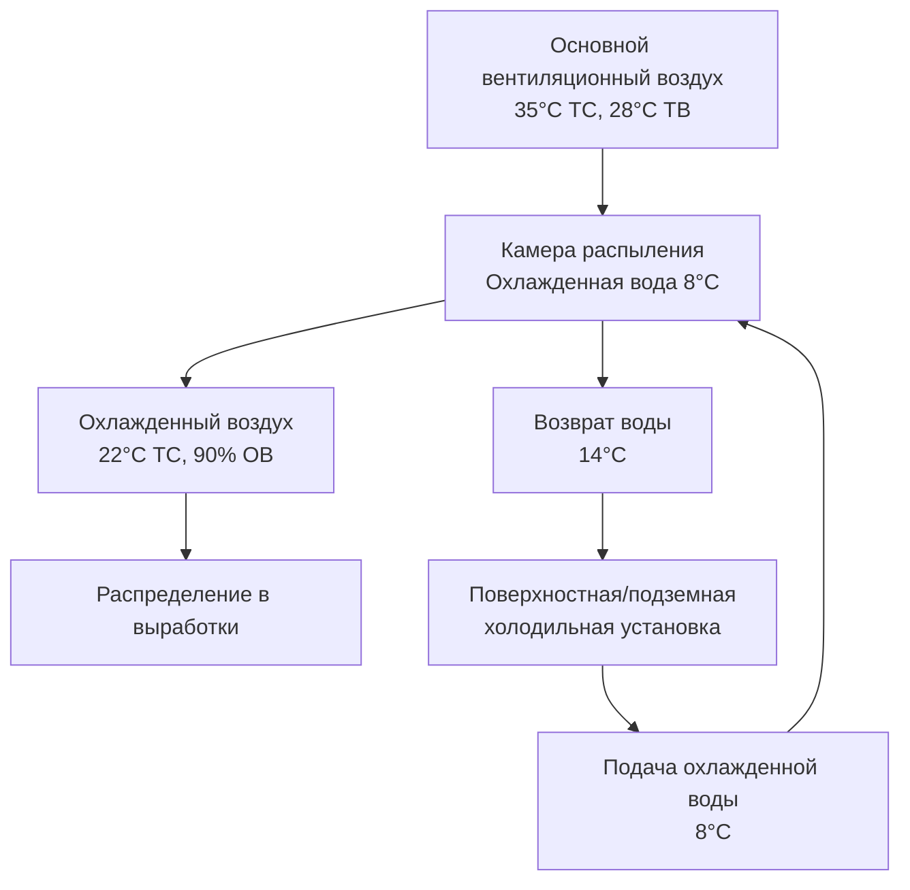
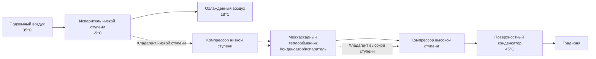

## Обзор

Системы охлаждения шахт удаляют тепло из подземных выработок, где температуры девственной скалы, адиабатическое сжатие, оборудование и метаболизм человека создают невыносимые тепловые условия. Фундаментальная задача — отвод тепла: удаление тепловой энергии с глубин, превышающих 3000 м, где температура стенок скалы достигает 60°C, требует холодильной производительности в десятки мегаватт.

Физика, управляющая охлаждением шахт, отличается от поверхностного HVAC. Тепловой поток от стенок скалы следует закону Фурье: $q = -k \nabla T$, создавая непрерывную тепловую нагрузку, которая увеличивается с площадью поверхности выработок и температурным перепадом. Адиабатическое сжатие добавляет явное тепло примерно 1°C на 100 м глубины согласно соотношению $\Delta T = \frac{g \cdot h}{c_p}$, где $g$ — ускорение свободного падения (9,81 м/с²), $h$ — глубина, $c_p$ — удельная теплоемкость воздуха (1005 Дж/кг·К).

## Поверхностные и подземные холодильные установки

Стратегическое размещение холодильного оборудования определяет эффективность системы, капитальные затраты и сложность эксплуатации. Поверхностные установки избегают враждебной подземной среды, но сталкиваются с термодинамическими потерями при транспортировке охлажденной среды на глубину.

### Поверхностные холодильные установки

Поверхностные установки централизуют холодильное оборудование в доступных зданиях с неограниченной производительностью отвода тепла. Производство охлажденной воды происходит в поверхностных условиях, затем распределяется через изолированные трубопроводы к подземным теплообменникам.

**Термодинамическая потеря:** Подача охлажденной воды от поверхности на глубину требует преодоления статического давления столба жидкости и потерь на трение. Работа насоса преобразуется в тепло со скоростью $\dot{Q}_p = \dot{m} \cdot g \cdot h$, переподогревая охлажденную воду. Для шахты глубиной 2000 м с циркуляцией 100 кг/с воды гравитационное нагревание добавляет примерно 2 МВт тепловой нагрузки.

**Преимущества:**
- Неограниченная производительность градирни на поверхности
- Доступная среда для обслуживания
- Пониженный риск пожара в подземной части
- Упрощенная подземная инфраструктура

**Недостатки:**
- Нагревание от работы насоса (0,98 кВт на 100 м на кг/с)
- Теплопоступление в трубопровод через скальный массив
- Высокие начальные капитальные затраты на трубопроводы
- Повышение температуры воды снижает эффективность охлаждения на глубине

### Подземные холодильные установки

Установка холодильного оборудования в подземной части исключает паразитные потери в трубопроводах, но создает операционные сложности в враждебной среде.

**Термодинамическое преимущество:** Холодопроизводство происходит в месте использования, исключая переподогревание от работы насоса. Охлажденная вода циркулирует локально, минимизируя потери при распределении.

**Вызов отвода тепла:** Тепло конденсатора должно возвращаться на поверхность через контуры теплой воды или воздушные потоки. Соотношение коэффициента эффективности (COP) показывает, что температуры конденсации в подземной части напрямую влияют на потребление электроэнергии: $COP = \frac{Q_c}{W} = \frac{T_c}{T_h - T_c}$ для идеальных циклов.

| Параметр | Поверхностная установка | Подземная установка |
|-----------|------------------------|----------------------|
| Доступность холодильного оборудования | Отличная | Ограниченная |
| Производительность отвода тепла | Неограниченная | Ограничена расходом возврата |
| Паразитные потери | Высокие (работа насоса + потери в трубопроводах) | Низкие (только локальное распределение) |
| Риск пожара | Низкий | Повышенный (хладагент + электричество) |
| Капитальные затраты | Очень высокие (трубопроводы) | Высокие (оборудование + инфраструктура) |
| Эффективность на глубине | Снижается с глубиной | Поддерживает проектный COP |

## Системы объемного охлаждения воздуха

Охладители объемного воздуха (BAC) — это крупные теплообменники, которые обрабатывают основной поток вентиляционного воздуха, снижая температуру сухого термометра перед поступлением воздуха в рабочие зоны.

### Принципы работы

Водяные распылители или оребренные трубные теплообменники контактируют с воздушным потоком, передавая явное и скрытое тепло охлажденной воде. Холодильная производительность следует:

$$Q_{total} = \dot{m}_{air} \cdot (h_1 - h_2)$$

где $h_1$ и $h_2$ — энтальпии воздуха на входе и выходе (кДж/кг). Для охлаждения только явного тепла через змеевики:

$$Q_s = \dot{m}_{air} \cdot c_p \cdot (T_1 - T_2)$$

### Производительность камеры распыления

Камеры распыления распыляют охлажденную воду в воздушный поток, достигая условий, близких к адиабатическому насыщению. Эффективность зависит от времени контакта и площади поверхности капель распыла. Психрометрический процесс перемещает воздух в направлении кривой насыщения по линии постоянной температуры влажного термометра, когда температура воды распыла равна температуре влажного термометра.

Для температуры воды распыла ниже температуры влажного термометра воздуха процесс объединяет охлаждение явного тепла (снижение температуры сухого термометра) и осушение (снижение относительной влажности), следуя:

$$\dot{m}_{water} \cdot c_{p,w} \cdot \Delta T_w = \dot{m}_{air} \cdot \Delta h$$

## Системы точечного охлаждения

Точечные охладители обеспечивают локальное охлаждение конкретных забоев, где объемное охлаждение воздуха невозможно достичь или требуется дополнительное охлаждение. Эти портативные или полустационарные устройства обычно имеют холодильную производительность от 10 до 100 кВт.

### Прямые холодильные установки (DX) для точечного охлаждения

Автономные DX-установки охлаждают воздух напрямую, отводя тепло в отдельный воздушный или водяной поток. Холодильный цикл работает в месте использования:

**Испаритель:** Охлаждает воздух забоя при температуре $T_c$
**Конденсатор:** Отводит тепло в воздух возврата при повышенной температуре $T_h$
**COP:** Обычно 2,5–3,5 для подземных условий

**Тепловой баланс:** Общее отведенное тепло в воздух возврата равно холодильной производительности плюс работа компрессора: $Q_h = Q_c + W$

### Охладители на охлажденной воде для точечного охлаждения

Кассетные теплообменники, питаемые от центральных контуров охлажденной воды, обеспечивают более простое локальное оборудование без обращения с хладагентом. Холодильная производительность следует:

$$Q = U \cdot A \cdot \Delta T_{lm}$$

где $U$ — общий коэффициент теплопередачи (Вт/м²·К), $A$ — площадь поверхности змеевика (м²), $\Delta T_{lm}$ — логарифмическая средняя разность температур между воздушными и водяными потоками.

## Градирни и отвод тепла

Каждая подземная холодильная установка требует окончательного отвода тепла в окружающую среду. Градирни на поверхностных сооружениях выполняют эту функцию благодаря испарительному охлаждению воды конденсатора.

### Физика испарительного охлаждения

Испарение воды потребляет скрытое тепло 2442 кДж/кг (при 25°C), обеспечивая исключительную эффективность охлаждения. Производительность градирни зависит от температуры влажного термометра окружающего воздуха, а не температуры сухого термометра.

Температура подхода (разность между температурой холодной воды и влажным термометром окружающего воздуха) указывает на эффективность градирни:

$$\text{Подход} = T_{water,out} - T_{wb,ambient}$$

Типичные конструкции достигают подхода 3–5°C. Диапазон (перепад температур через градирню) равен:

$$\text{Диапазон} = T_{water,in} - T_{water,out} = \frac{Q}{\dot{m}_{water} \cdot c_{p,w}}$$

### Потребление воды

Скорость испарения примерно 1% от скорости циркуляции на каждые 5,5°C диапазона, плюс продувка для контроля концентрации минералов. Для системы отвода тепла 10 МВт с диапазоном 15°C:

$$\dot{m}_{evap} \approx 0,027 \cdot \dot{m}_{circ} = 0,027 \times \frac{10,000}{4,18 \times 15} = 4,3 \text{ кг/с} = 372 \text{ м}^3/\text{сутки}$$

## Распределение охлажденной воды

Крупные системы охлаждения шахт распределяют охлажденную воду через обширные сети трубопроводов от центральных установок к распределенным охладителям. Гидравлическое проектирование сбалансировано между скоростью потока (влияет на потери на трение) и диаметром трубопровода (капитальные затраты).

### Выбор размеров трубопроводов

Потери давления на трение следуют уравнению Дарси–Вейсбаха:

$$\Delta P = f \cdot \frac{L}{D} \cdot \frac{\rho v^2}{2}$$

где $f$ — коэффициент трения (функция числа Рейнольдса и шероховатости), $L$ — длина трубопровода, $D$ — диаметр, $\rho$ — плотность, $v$ — скорость.

Типичные проектные скорости варьируются от 1,5 до 3,0 м/с, балансируя энергозатраты против стоимости трубопровода. Экономичный диаметр трубопровода минимизирует полную стоимость жизненного цикла:

$$D_{opt} \propto Q^{0,45}$$

для проектирования с постоянной скоростью.

### Требования к изоляции

Трубопроводы охлажденной воды, проходящие через горячую скалу, испытывают постоянное теплопоступление. Необходимая толщина изоляции сбалансирована между теплопоступлением и капитальными затратами:

$$q = \frac{2 \pi L (T_{rock} - T_{water})}{\frac{1}{h_i r_i} + \frac{\ln(r_2/r_1)}{k_{pipe}} + \frac{\ln(r_3/r_2)}{k_{ins}} + \frac{1}{h_o r_3}}$$

где индексы $i$ обозначают внутреннюю поверхность, $o$ — внешнюю поверхность, 1 — внутренний радиус трубопровода, 2 — внешний радиус трубопровода, 3 — внешний радиус изоляции.

## Каскадная холодильная установка для глубоких шахт

Сверхглубокие шахты (>3000 м) сталкиваются с условиями, при которых одноступенчатая холодильная установка с паровым сжатием становится непрактичной. Каскадные системы используют несколько холодильных ступеней с разными хладагентами, оптимизированными для их диапазонов температур работы.

### Термодинамическое обоснование

Предел степени сжатия одноступенчатой установки ограничивает практическое применение. Для хладагента с температурами насыщения -5°C (испаритель) и 45°C (конденсатор) степень давления может превысить 6:1. Каскадные системы разбивают это на две или три ступени:

**Низкая ступень:** Испаряется при -5°C, конденсируется при 15°C (соотношение ≈ 3:1)
**Высокая ступень:** Испаряется при 10°C, конденсируется при 45°C (соотношение ≈ 3:1)

Общий COP улучшается, потому что каждая ступень работает близко к оптимальному соотношению сжатия:

$$COP_{cascade} > COP_{single-stage}$$

### Выбор хладагента

Контуры низкой ступени используют хладагенты с низкими нормальными точками кипения (R-508B, R-23) для эффективной работы при низких температурах. Контуры высокой ступени используют обычные хладагенты (R-134a, R-513A), подходящие для умеренных температурных подъемов.

## Критерии выбора системы

| Диапазон глубины | Рекомендуемая основная система | Дополнительная/вспомогательная система |
|------------------|------------------------------|------------------------------------|
| < 1000 м | Поверхностное объемное охлаждение воздуха | DX точечные охладители |
| 1000–2000 м | Поверхностная холодильная установка + подземные охладители объемного воздуха | Точечные охладители на охлажденной воде |
| 2000–3000 м | Подземные холодильные установки | Распределенные охладители объемного воздуха + точечные охладители |
| > 3000 м | Каскадная подземная холодильная установка | Многоступенчатое распределение охлажденной воды |

Фундаментальное ограничение — это термодинамическая эффективность против капитальных затрат. Поверхностные системы минимизируют подземную сложность в ущерб паразитным потерям. Подземные системы максимизируют эффективность, но требуют значительных инвестиций в инфраструктуру и операционный опыт в опасной среде. Глубокие шахты неизбежно требуют сложных каскадных или многоступенчатых подходов для поддержания приемлемой холодильной эффективности при экстремальных температурных перепадах.
