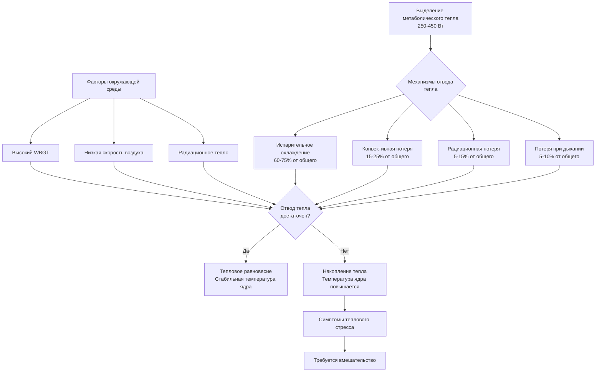
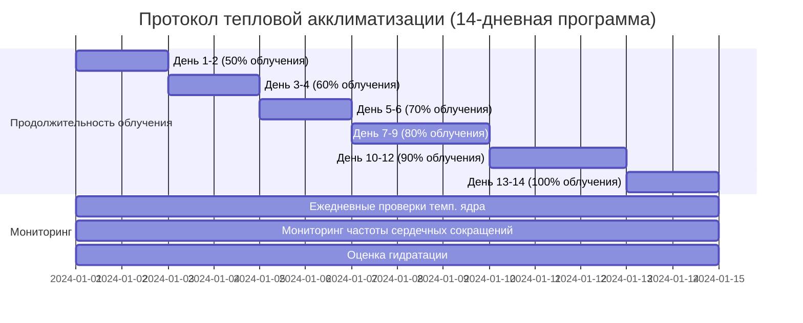

## Физическая основа теплового стресса в глубоких шахтах

Тепловой стресс в глубоких шахтах представляет одну из наиболее суровых производственных тепловых сред. По мере расширения горных работ на глубину свыше 3000 м, сочетание геотермического нагрева, выделения метаболического тепла и ограниченного отвода тепла создает потенциально летальные условия, требующие сложного инженерного контроля.

### Источники геотермического тепла

Основным источником тепла в глубоких шахтах является геотермическая энергия из внутренних слоев Земли. Температура целика горной породы увеличивается с глубиной в соответствии с геотермическим градиентом:

$$T_{\text{rock}} = T_{\text{surface}} + G \cdot z$$

где:
- $T_{\text{rock}}$ = температура целика горной породы (°C)
- $T_{\text{surface}}$ = температура поверхности (°C)
- $G$ = геотермический градиент (типично 0,025-0,030°C/м)
- $z$ = глубина ниже поверхности (м)

На глубине 3000 м с типичным градиентом 0,027°C/м и температурой поверхности 15°C температура целика горной породы достигает примерно 96°C. В золотодобывающих шахтах Южной Африки, превышающих 3900 м, температуры горной породы приближаются к 120°C.

### Механизмы передачи тепла

Тепло переходит из горячей горной породы в рудничную атмосферу посредством трех механизмов:

**Кондукция через стенки горной породы:**

$$q_{\text{cond}} = k \cdot A \cdot \frac{(T_{\text{rock}} - T_{\text{air}})}{L}$$

где $k$ — теплопроводность (типично 2,5-3,5 Вт/м·К для твердых горных пород), $A$ — площадь открытой поверхности, $L$ — глубина проникновения тепла.

**Конвекция к вентиляционному воздуху:**

$$q_{\text{conv}} = h \cdot A \cdot (T_{\text{surface}} - T_{\text{air}})$$

Коэффициент конвективной передачи тепла $h$ варьируется от 5-25 Вт/м²·К в зависимости от скорости воздушного потока.

**Излучение от оборудования и поверхностей горной породы:**

$$q_{\text{rad}} = \epsilon \cdot \sigma \cdot A \cdot (T_{\text{hot}}^4 - T_{\text{cold}}^4)$$

где $\epsilon$ — степень черноты (0,8-0,95 для горной породы), $\sigma$ — постоянная Стефана-Больцмана (5,67×10⁻⁸ Вт/м²·К⁴).

## Пределы влажной температуры и WBGT

### Критические пороги температуры

Влажная температура (WT) определяет максимальный потенциал охлаждения через испарение. Когда WT приближается к температуре кожи (примерно 35°C), испарительное охлаждение становится неэффективным и физиологический тепловой стресс становится острым.

MSHA и международные стандарты устанавливают уровни действия на основе влажно-шарового температурного индекса (WBGT):

| Диапазон WBGT (°C) | Классификация работы | Требуемые действия |
|-------------------|----------------------|-------------------|
| < 25,0 | Нормальные операции | Стандартный мониторинг |
| 25,0 - 27,5 | Умеренный тепловой стресс | Усиленный мониторинг, гидратация |
| 27,5 - 30,0 | Высокий тепловой стресс | Циклы работа-отдых, требуется акклиматизация |
| 30,0 - 32,5 | Тяжелый тепловой стресс | Ограниченная продолжительность работы, обязательны системы охлаждения |
| > 32,5 | Экстремальный тепловой стресс | Операции ограничены, только экстренное охлаждение |

### Расчет WBGT

Влажно-шаровая температура объединяет несколько тепловых параметров:

**На открытом воздухе (с солнечной нагрузкой):**
$$\text{WBGT} = 0,7 \cdot T_{\text{wb}} + 0,2 \cdot T_{\text{g}} + 0,1 \cdot T_{\text{db}}$$

**В помещении/под землей (без солнечной нагрузки):**
$$\text{WBGT} = 0,7 \cdot T_{\text{wb}} + 0,3 \cdot T_{\text{g}}$$

где:
- $T_{\text{wb}}$ = естественная влажная температура (°C)
- $T_{\text{g}}$ = температура черного шара (°C)
- $T_{\text{db}}$ = температура сухого термометра (°C)

Естественная влажная температура представляет теоретическую минимальную температуру, достижимую через испарение при 100% эффективности:

$$T_{\text{wb}} = T_{\text{db}} \cdot \arctan[0.151977(RH\% + 8.313659)^{0.5}] + \arctan(T_{\text{db}} + RH\%) - \arctan(RH\% - 1.676331) + 0.00391838(RH\%)^{1.5} \arctan(0.023101 \cdot RH\%) - 4.686035$$

Для практического применения в полевых условиях психрометрические диаграммы или портативные приборы предоставляют WT непосредственно.

## Тепловой баланс и метаболическая нагрузка

Тепловой стресс рабочих результирует из уравнения теплового баланса:

$$M - W = E_{\text{resp}} + C_{\text{resp}} + E_{\text{skin}} + C_{\text{conv}} + R + S$$

где:
- $M$ = производство метаболического тепла (Вт)
- $W$ = внешняя выполняемая работа (Вт)
- $E_{\text{resp}}$ = испарительная потеря тепла через дыхание (Вт)
- $C_{\text{resp}}$ = конвективная потеря тепла через дыхание (Вт)
- $E_{\text{skin}}$ = испарительная потеря тепла с кожи (Вт)
- $C_{\text{conv}}$ = конвективный теплообмен с окружающей средой (Вт)
- $R$ = радиационный теплообмен (Вт)
- $S$ = накопление тепла в организме (Вт)

Когда $S$ становится положительным и устойчивым, температура ядра тела повышается, что приводит к тепловому стрессу. Тяжелая горная работа генерирует 250-450 Вт метаболического тепла, требующего эффективных механизмов отвода.

## Циклы работа-отдых и физиологические пределы

### Предельные времена облучения с взвешиванием во времени

Допустимое время облучения снижается экспоненциально с увеличением WBGT. Стандарты MSHA требуют циклов работы-отдыха на основе метаболической интенсивности и WBGT:

| Метаболическая интенсивность | WBGT 25-27°C | WBGT 27-30°C | WBGT 30-32°C |
|------------------------------|--------------|--------------|--------------|
| Легкая (< 200 Вт) | 75% работы | 50% работы | 25% работы |
| Умеренная (200-350 Вт) | 50% работы | 25% работы | Работа запрещена |
| Тяжелая (> 350 Вт) | 25% работы | Работа запрещена | Работа запрещена |

Процент работы представляет долю каждого часа, проведенного в зоне теплового облучения, с остатком в виде отдыха в охлаждаемых зонах.

### Протоколы акклиматизации

Тепловая акклиматизация повышает физиологическую переносимость тепла посредством:

- Увеличения объема плазмы (расширение на 12-20%)
- Ранее наступления потоотделения (снижение пороговой температуры)
- Увеличения интенсивности потоотделения (1,5-2,0 л/ч в сравнении с 1,0 л/ч неакклиматизированных)
- Снижения сердечно-сосудистой нагрузки (более низкая частота сердечных сокращений при той же интенсивности работы)
- Улучшения сохранения натрия (снижение потерь соли в поте)

Стандартный протокол акклиматизации для рабочих глубоких шахт:

Полная акклиматизация развивается в течение 10-14 дней с постепенным облучением. Деакклиматизация начинается после 3-4 дней без облучения, со значительной потерей через 2-3 недели.

## Персональное охлаждающее оборудование

### Технология охлаждающего жилета

Персональное охлаждающее оборудование обеспечивает локализованный отвод тепла, когда экологическое охлаждение оказывается недостаточным. Существуют три основные технологии:

**Жилеты с материалом фазового перехода (PCM):**
- Используют материалы с температурой плавления 15-20°C
- Обеспечивают охлаждающую способность 100-150 Вт в течение 2-3 часов
- Охлаждающая мощность: $q = m_{\text{PCM}} \cdot h_{\text{fusion}} / t_{\text{melt}}$
- Требуют замены/перезарядки после полного фазового перехода

**Жидкостные охлаждающие костюмы:**
- Циркулируют охлажденную воду (10-15°C) по трубопроводной сети
- Обеспечивают 150-300 Вт непрерывного охлаждения
- Отвод тепла: $q = \dot{m} \cdot c_p \cdot (T_{\text{return}} - T_{\text{supply}})$
- Требуют пупочного подсоединения к охладителю или ледяному резервуару

**Жилеты испарительного охлаждения:**
- Используют испарение воды из ткани
- Обеспечивают 100-200 Вт охлаждения при низкой влажности
- Эффективность ограничена окружающей влажной температурой
- Неработоспособны при WBT, превышающем 30°C

| Технология | Охлаждающая мощность (Вт) | Продолжительность | Мобильность | Стоимость |
|-----------|------------------------|-------------------|-----------|-----------|
| Жилет PCM | 100-150 | 2-3 часа | Отличная | Средняя |
| Жидкостное охлаждение | 150-300 | Непрерывная | Ограниченная (привязаны) | Высокая |
| Испарительное | 100-200 | 4-6 часов | Отличная | Низкая |

### Стратегия применения

Персональное охлаждающее оборудование продлевает безопасное время работы, но не может заменить адекватную вентиляцию и инфраструктуру охлаждения. Дополнительное безопасное время работы может быть оценено:

$$t_{\text{additional}} = \frac{q_{\text{cooling}} \cdot t_{\text{work}}}{M - q_{\text{env}} - q_{\text{cooling}}}$$

где $q_{\text{env}}$ представляет отвод тепла в окружающую среду без персонального охлаждения, и $q_{\text{cooling}}$ — производительность системы персонального охлаждения.

## Инженерные контрольные системы и мониторинг

Эффективное управление тепловым стрессом в сверхглубоких шахтах требует интегрированных инженерных контролей:

- Точечное охлаждение в местах работы (кондиционируемые убежища)
- Системы распределения ледяной кашицы для питьевой воды (0-4°C)
- Охлажденная подача воздуха на забои (12-18°C на входе)
- Методы горных работ, устойчивые к теплу, минимизирующие открытие горной породы
- Мониторинг физиологических параметров в реальном времени (температура ядра, частота сердечных сокращений)
- Системы автоматического принудительного ограничения работы

Международные стандарты (ISO 7243, ISO 7933) и нормативы MSHA требуют непрерывного мониторинга WBGT в зонах, где температура сухого термометра превышает 30°C или когда происходят инциденты, связанные с заболеванием от тепла. Мониторинг температуры ядра с использованием проглатываемых датчиков предоставляет прямую физиологическую оценку при превышении WBGT 30°C.

Переход к более глубоким горным работам требует все более изощренного терморегулирования. На глубинах, превышающих 4000 м, даже при максимальном инженерном контроле, тепловой стресс может в конечном итоге наложить абсолютные ограничения на присутствие человека, потенциально требуя автономных горных систем или радикальной инвестиции в инфраструктуру охлаждения, приближающуюся к стоимости самой операции добычи.
