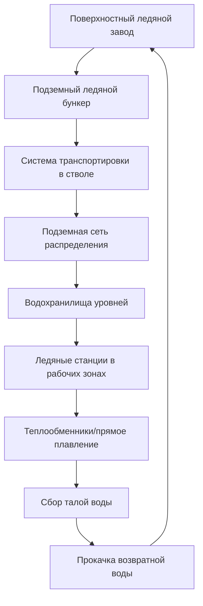

Ледяные системы охлаждения используют скрытую теплоту плавления для обеспечения эффективного накопления и распределения тепловой энергии при глубоких подземных горных работах. Эти системы обеспечивают холодопроизводительность путем транспортировки льда или ледяной суспензии в рабочие зоны, где фазовый переход из твердого состояния в жидкое поглощает тепло при постоянной температуре, обеспечивая превосходное удаление тепла по сравнению с охлаждением только за счет чувствительного тепла.

## Физические принципы ледяного охлаждения

Основное преимущество ледяного охлаждения вытекает из скрытой теплоты плавления воды. Когда лед тает при 0°C, он поглощает энергию без изменения температуры согласно:

$$Q_{latent} = m \cdot h_{fg}$$

где $Q_{latent}$ — энергия охлаждения (кДж), $m$ — масса льда (кг), а $h_{fg}$ — скрытая теплота плавления (334 кДж/кг для воды).

Эта емкость скрытой теплоты представляет объемную плотность энергии примерно 93 кВт·ч/м³, значительно выше чувствительного охлаждения одной холодной воды. Для сравнения, охлаждение воды с 10°C до 0°C обеспечивает только:

$$Q_{sensible} = m \cdot c_p \cdot \Delta T = m \cdot 4.18 \cdot 10 = 41.8 \text{ кДж/кг}$$

Общая холодопроизводительность, объединяющая оба эффекта — чувствительный и скрытый — становится:

$$Q_{total} = m \cdot [c_{p,ice} \cdot \Delta T_{ice} + h_{fg} + c_{p,water} \cdot \Delta T_{water}]$$

Для льда, подаваемого при -5°C и тающего в воду при 5°C, это дает примерно 376 кДж/кг общей холодопроизводительности.

## Системы производства льда

### Поверхностные ледяные заводы

Центральные предприятия по производству льда на поверхности производят лед через стандартные холодильные циклы, работающие при температурах испарителя от -10°C до -15°C. Существуют два основных метода производства:

**Системы прямого расширения**: Испарители хладагента, погруженные в перемешиваемые баки с водой, замораживают ледяные слои на поверхностях труб. Циклы разморозки периодически нагревают трубы для выпуска ледяных кусков на хранение.

**Ледяные накопители**: Охлаждённый гликоль или рассол циркулирует через теплообменники, погруженные в баки с водой. Лед накапливается на поверхностях теплообменника до разморозки.

| Тип системы | Производительность | Энергетическая эффективность | Капитальные затраты |
|-------------|-------------------|-------------------------------|---------------------|
| Прямое расширение | 45-180 т/сут | COP 2.5-3.0 | Средние |
| Ледяной накопитель | 90-450 т/сут | COP 2.2-2.8 | Высокие |
| Ледяная крошка | 18-90 т/сут | COP 2.0-2.5 | Низкие |

### Подземное производство льда

Некоторые операции устанавливают оборудование для производства льда под землей, чтобы исключить потери при транспортировке. Это требует значительной инфраструктуры электроснабжения и создает дополнительные проблемы с отводом тепла, поскольку тепло конденсатора холодильной системы должно быть удалено через вентиляцию или системы охлаждения водой.

## Системы распределения льда

### Транспортировка блочного льда

Традиционные системы производят лед блоками (обычно 25-50 кг каждый), транспортируемыми под землю через скип или клетку. Блочный лед хранится в теплоизолированных бункерах на подземных уровнях и распределяется в рабочие зоны с помощью вагонеток на рельсах или конвейерных систем.

Эффективность транспортировки становится критической, так как теплопрядок во время доставки снижает подаваемую холодопроизводительность:

$$\eta_{transport} = \frac{Q_{delivered}}{Q_{produced}} = 1 - \frac{q_{gain} \cdot t_{transport}}{m \cdot h_{fg}}$$

где $q_{gain}$ — скорость теплопрядка (кВт) и $t_{transport}$ — время транспортировки (часы).

### Системы ледяной суспензии

Современные установки все чаще используют ледяную суспензию — прокачиваемую смесь тонких ледяных кристаллов, взвешенных в воде или рассоле. Типичная суспензия содержит 20-40% льда по массе, позволяя распределение по трубопроводам, подобно холодной воде, при сохранении преимуществ скрытой теплоты.

Доля упаковки льда $\phi$ определяет холодопроизводительность на единицу объема:

$$q_{volume} = \phi \cdot \rho_{ice} \cdot h_{fg} + (1-\phi) \cdot \rho_{water} \cdot c_{p,water} \cdot \Delta T$$

Для 30% ледяной суспензии ($\phi = 0.30$), это дает примерно 110 кВт·ч/м³ холодопроизводительности — в три раза выше, чем в обычных системах холодной воды.

## Расчеты скорости плавления

Скорость плавления льда в подземных теплообменниках зависит от эффективности теплопередачи и разности температур между горячим шахтным воздухом и смесью льда/воды. Для вынужденной конвекции над ледяными поверхностями:

$$\dot{m}_{melt} = \frac{h \cdot A \cdot (T_{air} - T_{ice})}{h_{fg}}$$

где $h$ — коэффициент конвективной теплопередачи (Вт/м²·К), $A$ — площадь контакта (м²), и $T_{air}$ — температура поступающего воздуха (°C).

Для теплообменников прямого контакта воздуха и льда со скоростями воздуха 2-4 м/с типичные коэффициенты теплопередачи варьируются от 25-50 Вт/м²·К. Это дает удельные скорости плавления 3-6 кг льда на м² контактной поверхности в час при поступлении воздуха с температурой 32°C.

## Лед в сравнении с обычной холодильной машиной

Экономическое и техническое сравнение между ледяным охлаждением и прямой механической холодильной машиной зависит от нескольких факторов:

| Параметр | Ледяные системы | Прямая холодильная машина |
|----------|-----------------|--------------------------|
| Накопление энергии | Отличное (сдвиг в часы низких тарифов) | Отсутствует (непрерывная работа) |
| Сложность распределения | Высокая (физическая обработка) | Средняя (только трубопроводы) |
| Подземное оборудование | Минимальное | Существенное |
| Отвод тепла под землей | Отсутствует | Значительный (1.3-1.4 × охлаждение) |
| Интенсивность обслуживания | Низкая | Высокая (движущееся оборудование) |
| Ответ на пиковые нагрузки | Отличный (накопленная емкость) | Ограниченный (установленная емкость) |
| Капитальные затраты на кВт | Средние | Высокие (подземная установка) |

Тепловое преимущество ледяных систем становится очевидным при рассмотрении полного термодинамического цикла. Прямая подземная холодильная машина должна отводить все поглощенное тепло плюс тепло работы компрессора под землей, требуя:

$$Q_{reject} = Q_{cooling} \cdot \left(\frac{1}{COP} + 1\right)$$

Для COP 3.0 это создает 1.33 кВт отвода тепла на каждый 1 кВт охлаждения — частично компенсируя пользу. Ледяные системы отводят это тепло на поверхности, где температуры окружающей среды ниже и емкость отвода тепла выше.

## Применение в глубоких шахтах Южной Африки

Золотые и платиновые шахты Южной Африки пионерили ледяное охлаждение для операций, выходящих за пределы глубины 3000 м, где температуры девственной скалы превышают 50°C. Эти экстремальные условия делают ледяное охлаждение особенно выгодным.

### Типичные параметры установки

- Производительность: 180-540 т льда в сутки
- Глубина доставки: 2000-3500 м
- Температуры рабочих зон: 28-35°C по влажному термометру до охлаждения
- Целевое охлаждение: 8-12°C снижение в рабочих зонах
- Отношение льда к холодопроизводительности: 0.6-0.8 кг льда на кВт·ч подаваемого охлаждения

### Опыт эксплуатации

Крупные установки на шахтах TauTona, Mponeng и Beatrix продемонстрировали устойчивые скорости доставки льда, превышающие 360 т/сут на глубины более 3500 м. Системы достигли эффективности охлаждения рабочих зон 65-80%, с потерями, связанными с:

- Теплопрядок при транспортировке: 8-12%
- Хранение и обработка: 5-8%
- Неэффективность распределения: 10-15%

Затраты энергии на производство льда обычно варьируются от 0.08-0.12 кВт·ч на кг льда, делая сдвиг нагрузки в периоды низких тарифов экономически значимым. Многие операции производят лед исключительно в периоды низких тарифов (обычно 22:00-06:00), накапливая достаточную емкость для охлаждения на 24 часа.

## Рекомендации по проектированию

Эффективное проектирование системы ледяного охлаждения требует тщательного анализа:

1. **Соответствие производства спросу**: Размер ледяного завода на пиковый суточный спрос плюс 15-20% резервная мощность
2. **Емкость хранения**: Предусмотреть минимум 8-12 часов холодопроизводительности при пиковом спросе
3. **Логистика транспортировки**: Минимизировать этапы обработки и время транспортировки для снижения тепловых потерь
4. **Проектирование распределения**: Оптимизировать размер труб для систем суспензии, чтобы уравновесить энергию прокачки против времени транспортировки
5. **Интеграция с вентиляцией**: Согласовать ледяное охлаждение с картиной потоков воздуха для максимизации эффективности

Удельная холодопроизводительность на единицу массы льда варьируется в зависимости от метода реализации, но обычно составляет 250-320 кДж/кг на практике — представляя 75-95% использования теоретической емкости скрытой теплоты с учетом всех потерь системы.

## Заключение

Ледяные системы охлаждения предоставляют технически и экономически жизнеспособные решения для контроля теплового стресса в глубоких шахтах, особенно там, где экстремальные глубины создают температуры девственной скалы, превышающие 45°C. Преимущество скрытой теплоты, способность сдвигать электрические нагрузки и минимальное подземное механическое оборудование делают эти системы конкурентоспособными с обычной холодильной машиной несмотря на сложности обработки. Продолжающееся развитие технологий ледяной суспензии и улучшенные методы распределения повышают эффективность системы и снижают эксплуатационные затраты.
