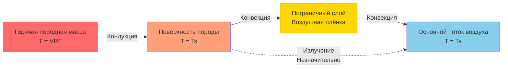
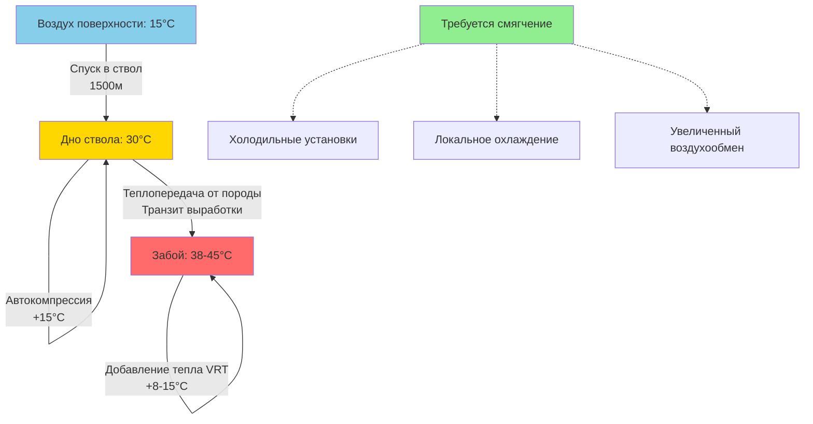

## Основы температуры целика

Температура целика (VRT) представляет собой невозмущённую температуру породного слоя на глубине, управляемую геотермальным градиентом Земли. Этот параметр становится доминирующим источником тепла в операциях глубокой добычи, часто превышая все другие тепловые нагрузки, включая метаболическое тепло, оборудование и процессы окисления.

Геотермальный градиент описывает скорость увеличения температуры с глубиной ниже земной поверхности. В большинстве горнодобывающих регионов этот градиент составляет **1°C на каждые 30-40 м вертикальной глубины** (приблизительно 0,025-0,033°C/м). Температура поверхности плюс геотермальный вклад определяют VRT на любой заданной глубине:

$$T_{VRT} = T_{surface} + \frac{z}{30 \text{ to } 40}$$

где $T_{VRT}$ — температура целика (°C), $T_{surface}$ — средняя годовая температура поверхности (°C), и $z$ — глубина ниже поверхности (м).

На глубине 1500 м с температурой поверхности 15°C и градиентом 1°C на 35 м VRT достигает приблизительно 58°C, создавая серьёзные вызовы для поддержания приемлемых условий труда в соответствии с нормами MSHA согласно 30 CFR 57.5060.

## Механизмы геотермальной теплопередачи

Тепло переходит от горячей породной массы к более холодному воздуху шахты через три различных механизма, причём кондукция доминирует при начальной передаче:

Установившийся тепловой поток от породы к воздуху следует закону Фурье в сочетании с законом охлаждения Ньютона:

$$q'' = \frac{T_{VRT} - T_a}{\frac{L}{k} + \frac{1}{h}}$$

где $q''$ — тепловой поток (Вт/м²), $L$ — глубина теплопроникновения в породу (м), $k$ — теплопроводность породы (обычно 2,5-3,5 Вт/м·K), $h$ — коэффициент конвективной теплопередачи на границе раздела порода-воздух (5-25 Вт/м²·K), и $T_a$ — температура основного потока воздуха (°C).

Глубина теплопроникновения зависит от продолжительности вентиляции. Недавно выработанные выработки демонстрируют максимальные скорости теплопередачи (100-150 Вт/м²), которые экспоненциально затухают по мере охлаждения поверхности породы. После нескольких месяцев непрерывной вентиляции тепловой поток стабилизируется на уровне 20-40 Вт/м² в зависимости от скорости воздуха и перепада VRT.

## Методы измерения VRT

Точное определение VRT требует методов измерения, которые исключают преходящие тепловые эффекты от вентиляции и деятельности по разработке:

| Метод | Требуемая глубина | Точность | Время до равновесия | Применение |
|-------|-------------------|----------|----------------------|------------|
| **Термометрия скважины** | 10-15 м в целик | ±0,5°C | 48-72 часа | Золотой стандарт VRT |
| **Измерение производственной скважины** | Минимум 3-5 м | ±1-2°C | 24-48 часов | Практический полевой метод |
| **Экстраполяция из нескольких неглубоких скважин** | По 2-3 м каждая | ±1-3°C | 12-24 часа на скважину | Быстрая оценка |
| **Обратный расчёт теплопроводности** | Только поверхность | ±3-5°C | Немедленно | Предварительные оценки |

Метод скважины включает бурение горизонтально в борт или кровлю, введение калиброванных датчиков сопротивления (RTD) на несколько глубин, герметизацию скважины теплоизоляцией и мониторинг до стабилизации показаний. Самый глубокий датчик обеспечивает наиболее надёжное значение VRT, так как измерения ближе к выработке показывают эффекты охлаждения от вентиляции.

## Нагрев при автокомпрессии

Воздух, спускающийся по стволам или наклонам, подвергается адиабатической компрессии, повышая температуру ещё до контакта с горячей породой. Этот эффект автокомпрессии следует сухому адиабатическому градиенту:

$$\frac{dT}{dz} = -\frac{g}{c_p} = -0,00976 \text{ K/m} \approx -1°C/100\text{ м}$$

где $g$ — ускорение свободного падения (9,81 м/с²) и $c_p$ — удельная теплоёмкость воздуха при постоянном давлении (1005 Дж/кг·K).

При вертикальном спуске на 1500 м нагрев при автокомпрессии увеличивает температуру поступающего воздуха приблизительно на **15°C** до любого контакта с теплом породы. В сочетании с эффектами VRT это создаёт температуры поступающего воздуха, регулярно превышающие 40°C в глубоких операциях.

Повышение температуры при автокомпрессии независимо от расхода воздуха и происходит во всех нисходящих воздуховодах. Восходящие воздухоходы испытывают обратный эффект (охлаждение при автораспределении), но эта выгода обычно нивелируется накопленным теплом от оборудования, взрывных работ и теплопередачи с поверхности породы во всей шахте.

## Влияние на проектирование системы вентиляции

Температура целика фундаментально ограничивает проектирование вентиляции глубоких шахт. MSHA требует, чтобы температуры по влажному термометру не превышали 30,6°C в рабочих зонах согласно 30 CFR 57.5060, но температуры по сухому термометру, приближающиеся к 50°C, являются обычными в ультраглубоких операциях (>2500 м).

### Расчёт тепловой нагрузки

Общее добавление чувствительного тепла из источников VRT включает как автокомпрессию, так и теплопередачу с поверхности породы:

$$Q_{total} = Q_{auto} + Q_{rock} = \dot{m} c_p \Delta T_{auto} + q'' A_{surface}$$

где $\dot{m}$ — массовый расход воздуха (кг/с), $\Delta T_{auto}$ — повышение температуры при автокомпрессии (K), и $A_{surface}$ — открытая площадь поверхности породы (м²).

Для типовой проходческой выработки (5 м × 5 м сечение, 1000 м длины, 50 м³/ч воздухообмен, 1500 м глубины):

- Тепло автокомпрессии: $\dot{Q}_{auto} = 60 \times 1005 \times 15 = 905$ кВт
- Тепло поверхности породы (40 Вт/м², 20000 м² поверхности): $\dot{Q}_{rock} = 40 \times 20000 = 800$ кВт
- **Общая тепловая нагрузка VRT: 1705 кВт**

Эта тепловая нагрузка требует либо огромной холодильной мощности (часто 5-15 МВт для всей шахты), либо чрезвычайно высоких расходов воздуха (>400 м³/ч для крупных операций), оба представляют значительные капитальные и операционные расходы.

### Стратегии проектирования

| Стратегия | Эффективность | Капитальные затраты | Операционные затраты | Ограничения |
|-----------|---------------|----------------------|----------------------|------------|
| **Увеличенный воздухообмен** | Умеренная (разбавление только) | Низко-Средне | Высокие (мощность вентилятора) | Убывающая отдача, шум |
| **Холодильные установки** | Высокая (активное охлаждение) | Очень высокие | Очень высокие (энергия) | Сложное обслуживание, место |
| **Лёд/материалы с фазовым переходом** | Высокая (локальное охлаждение) | Средние | Средние | Логистика, перезарядка |
| **Теплоизоляция горячей породы** | Низко-Умеренная | Низкие | Минимальные | Задержка тепла, не устранение |
| **Водяные распылители** | Умеренная (испарительное) | Низкие | Низко-Средние | Увеличение влажности |

Современные глубокие шахты обычно используют комбинации этих стратегий, с поверхностными или подземными холодильными установками, обеспечивающими охлаждённую воду, распределяемую теплообменниками по всей шахте, дополняемой локальным охлаждением в зонах интенсивной работы.

---

**Примечание по нормативам:** Соблюдение MSHA в соответствии с 30 CFR 57.5060 и 30 CFR 57.5061 требует мониторинга окружающей среды и корректирующих действий при превышении температур по влажному термометру. Точная характеристика VRT на стадиях планирования шахты необходима для проектирования соответствующих нормам систем вентиляции до начала добычи.
