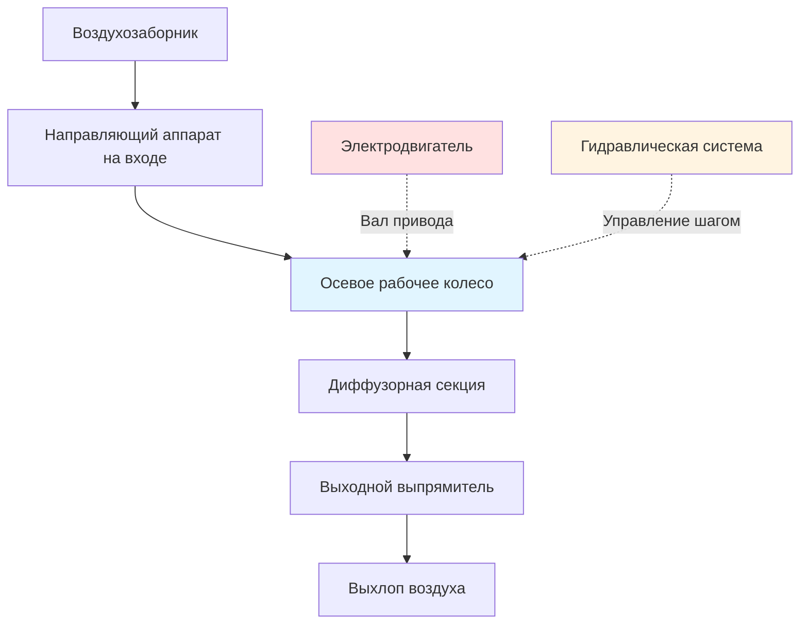

Осевые главные вентиляторы представляют собой преобладающий тип вентиляторов для систем вентиляции шахт, обеспечивая высокие объемы подачи воздуха с превосходной эффективностью по сравнению с центробежными конструкциями. Эти вентиляторы перемещают воздух параллельно оси ствола с помощью аэродинамических лопаток рабочего колеса, что делает их идеальными для задач подземных горных работ, требующих больших объемов воздуха при умеренном давлении.

## Конструкция осевых вентиляторов для горных работ

Шахтные осевые вентиляторы отличаются прочной конструкцией, способной выдерживать непрерывную работу в суровых условиях. Рабочее колесо состоит из лопаток аэродинамического профиля, установленных на центральном диске, и заключено в цилиндрический корпус. Профили лопаток соответствуют секциям NACA или кастомным аэродинамическим профилям, оптимизированным для работы в шахтах, и обычно варьируются от 4 до 16 лопаток в зависимости от диаметра вентилятора и требований к производительности.

Диаметры вентиляторов для главной вентиляции шахт обычно составляют от 1,5 до 7 метров, при этом крупные установки обеспечивают подачу более 1 000 м³/с. Частота вращения рабочего колеса варьируется от 300 до 1 200 об/мин, что выбирается для баланса между эффективностью, уровнем шума и конструктивными требованиями.

## Системы лопаток с регулируемым шагом

Современные шахтные вентиляторы оснащены механизмами регулировки шага лопаток, позволяющими изменять угол лопаток как во время работы, так и при остановке. Эта возможность обеспечивает критическую гибкость эксплуатации:

**Регулировка во время работы (On-the-Fly):**
- Гидравлические или электрические приводы изменяют шаг лопаток в рабочем режиме
- Адаптация к изменяющимся условиям сопротивления шахты
- Оптимизация под сезонные колебания температуры
- Диапазон регулировки обычно составляет ±15° от расчетного положения

**Регулировка при остановке:**
- Ручное или моторизованное изменение шага при остановленном вентиляторе
- Больший диапазон регулировки (часто ±30°)
- Постоянные изменения конфигурации шахты
- Возможность модернизации для оптимизации производительности

Угол лопаток напрямую влияет на производительность вентилятора согласно формуле:

$$Q = \frac{\pi D^2}{4} \times C_x \times U$$

где $Q$ — объемный расход, $D$ — диаметр вентилятора, $C_x$ — коэффициент осевого потока (функция угла лопатки), а $U$ — скорость на конце лопатки.

## Характеристики и кривые производительности

Работа осевого вентилятора характеризуется зависимостью давления от объема в рабочем диапазоне. Полное развиваемое давление определяется по формуле:

$$P_t = \rho \times U^2 \times \psi$$

где $\rho$ — плотность воздуха, $U$ — скорость на конце лопатки, а $\psi$ — коэффициент давления, определяемый геометрией и углом лопаток.

Кривые производительности имеют характерную форму:
- **Крутая область:** Низкий расход, высокое давление (эксплуатация не рекомендуется из-за нестабильности)
- **Расчетная точка:** Максимальная эффективность, стабильная работа
- **Плоская область:** Высокий расход, сниженное давление (типичный рабочий диапазон)

## Характеристики осевых вентиляторов

| Параметр | Типичный диапазон | Применение в шахтах |
|------|-----|-------|
| **Диаметр вентилятора** | 1,5 - 7,0 м | Главная вентиляция: 3-6 м |
| **Объемный расход** | 50 - 1 200 м³/с | Средняя шахта: 200-600 м³/с |
| **Полное давление** | 1 000 - 6 000 Па | Типичное: 2 500-4 000 Па |
| **Скорость на конце лопатки** | 50 - 120 м/с | Оптимальная: 70-90 м/с |
| **КПД (пиковый)** | 82% - 91% | Современные конструкции: 86-89% |
| **Диапазон мощности** | 100 - 5 000 кВт | Крупные шахты: 1 000-3 000 кВт |
| **Диапазон угла лопатки** | -15° до +45° | Рабочий: 15-35° |

## Возможности по давлению и объему

Осевые вентиляторы отлично подходят для задач с большим объемом и умеренным давлением. Законы подобия определяют производительность при различных скоростях:

$$\frac{Q_2}{Q_1} = \frac{N_2}{N_1}$$

$$\frac{P_2}{P_1} = \left(\frac{N_2}{N_1}\right)^2$$

$$\frac{W_2}{W_1} = \left(\frac{N_2}{N_1}\right)^3$$

где $Q$ — расход, $P$ — давление, $W$ — мощность, а $N$ — частота вращения.

Одноступенчатые осевые вентиляторы обычно развивают полное давление 2 000-4 500 Па. Для более глубоких шахт, требующих более высокого давления, двухступенчатые конструкции с противолежащим вращением могут достигать 6 000-8 000 Па, сохраняя преимущества осевого потока.

## Соображения по эффективности

Общая эффективность вентилятора объединяет аэродинамическую, механическую и электрическую эффективность:

$$\eta_{total} = \eta_{aero} \times \eta_{mech} \times \eta_{motor}$$

Пиковая аэродинамическая эффективность достигается в расчетной точке, где угол лопастей, расход воздуха и давление соответствуют оптимальным условиям. Работа вне расчетного режима снижает эффективность согласно формуле:

$$\eta = \eta_{max} - k_1(Q - Q_{design})^2 - k_2(P - P_{design})^2$$

Факторы, влияющие на эффективность:
- **Качество профиля лопастей:** Точность изготовления влияет на управление пограничным слоем
- **Зазор на торце:** Поддерживать <0,5% от диаметра для минимизации потерь на утечку
- **Число Рейнольдса:** Масштабные эффекты у крупных вентиляторов повышают эффективность
- **Шероховатость поверхности:** Покрытия лопастей и протоколы очистки
- **Входные условия:** Равномерное распределение потока имеет критическое значение

## Конфигурации монтажа

**Конфигурация нагнетания:**
- Вентилятор подает свежий воздух в шахту
- Создает избыточное давление в подземных выработках
- Преимущества: Чистый воздух проходит через вентилятор, легкий доступ для обслуживания
- Сложности: Утечки из системы под избыточным давлением, сложность распределения

**Конфигурация вытяжки:**
- Вентилятор удаляет загрязненный воздух из шахты
- Создает разрежение в подземных выработках
- Преимущества: Естественное распределение воздуха, улавливание всех загрязнений
- Недостатки: Коррозионный воздух проходит через вентилятор, необходимость обработки влаги

Эффективность монтажа по давлению определяется как:

$$\eta_{installation} = \frac{P_{static-delivered}}{P_{fan-total}}$$

Правильный дизайн диффузора (угол расхождения 7–12°) и установки с расширением (evasé) позволяют восстановить кинетическое давление, обеспечивая эффективность монтажа 0,85–0,95 для вентиляторов вытяжки и 0,75–0,85 для конфигураций нагнетания.

Выбор осевого вентилятора требует совмещения кривых сопротивления системы с характеристическими кривыми вентилятора при заданной плотности воздуха, обычно учитывая шахтный воздух при температуре 20–30°C, где повышенная влажность влияет на плотность на 2–5%.
