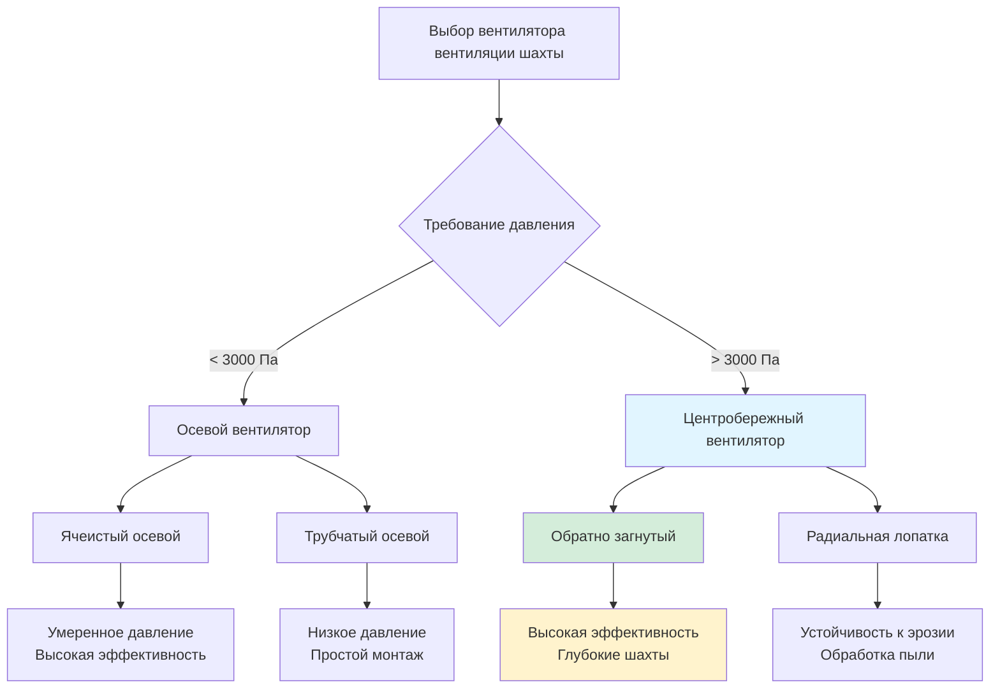

## Основы центробережных вентиляторов

Центробережные вентиляторы доминируют в приложениях вентиляции глубоких шахт, где статическое давление превышает возможности осевых конструкций. Эти вентиляторы передают энергию воздуху через центробережную силу, создаваемую вращающимися рабочими колесами, преобразуя давление скорости в статическое давление в корпусе вентилятора. Фундаментальное соотношение, управляющее производительностью центробережного вентилятора:

$$P_s = \rho \cdot \psi \cdot u_2^2$$

где $P_s$ — статическое давление (Па), $\rho$ — плотность воздуха (кг/м³), $\psi$ — коэффициент давления (безразмерный) и $u_2$ — скорость на периферии рабочего колеса (м/с).

## Типы центробережных вентиляторов

### Вентиляторы с обратно загнутыми лопатками

Вентиляторы с обратно загнутыми (BC) лопатками имеют лопатки, наклоненные в сторону, противоположную направлению вращения, обычно под углом 15-35° от радиуса. Эти конструкции обеспечивают наивысшую эффективность (75-85%) и самоограничивающие характеристики мощности. Треугольник скоростей на выходе из рабочего колеса:

$$u_2 = \frac{\pi D_2 N}{60}$$

где $D_2$ — диаметр рабочего колеса (м) и $N$ — частота вращения (об/мин).

Вентиляторы BC демонстрируют неперегружающиеся кривые мощности — мощность двигателя достигает пика при примерно 60-70% максимального расхода и снижается при более высоких расходах. Эта характеристика защищает двигатели при изменениях в системе или отказах дверей.

### Вентиляторы с радиальными лопатками

Вентиляторы с радиальными лопатками имеют прямые лопатки, расходящиеся от ступицы к ободу. Хотя они менее эффективны (65-75%), чем конструкции BC, радиальные вентиляторы обрабатывают запыленный воздух и устойчивы к эрозии в абразивных средах. Они развивают более высокие давления при более низких расходах, что делает их подходящими для систем с высоким сопротивлением.

### Вентиляторы с прямозагнутыми лопатками

Вентиляторы с прямозагнутыми лопатками редко используются в вентиляции шахт из-за перегружающих характеристик и более низкой эффективности. Резко возрастающая кривая мощности может перегрузить двигатели при высоких расходах воздуха.

## Возможности высокого давления

Центробережные вентиляторы регулярно развивают статическое давление 5 000-15 000 Па в приложениях глубоких шахт, со специализированными конструкциями, достигающими 25 000 Па. Возможность развития давления масштабируется с квадратом скорости на периферии:

$$\frac{P_2}{P_1} = \left(\frac{N_2}{N_1}\right)^2$$

Многоступенчатые центробережные вентиляторы достигают экстремальных давлений путем расположения двух или более рабочих колес в серию. Каждая ступень добавляет давление поэтапно, с межступенчатыми диффузорами, преобразующими скорость в статическое давление между ступенями.

## Применение в глубоких шахтах

Шахты глубиной более 1 500 м требуют центробережных вентиляторов для преодоления потерь на трение в стволе и напорного столба. Требование общего давления:

$$P_{total} = P_{friction} + P_{shock} + \rho g h$$

где $h$ — вертикальная глубина (м) и $g$ — ускорение свободного падения (9,81 м/с²).

Центробережные вентиляторы превосходны в:

- **Вентиляции ствола**: Сопротивление сходящегося и восходящего стволов
- **Бустерные вентиляторы**: Подземные станции, требующие повышения давления
- **Вспомогательные системы**: Высокосопротивляющаяся трубопроводная вентиляция
- **Приложения с переменной плотностью**: Глубокие стволы с температурной стратификацией

## Характеристики помпажа и срыва потока

Помпаж возникает, когда расход снижается ниже диапазона стабильной работы вентилятора, вызывая обратный поток и колебания давления. Линия помпажа представляет левую границу стабильной работы на кривой вентилятора. Критический запас помпажа:

$$SM = \frac{P_{surge} - P_{op}}{P_{op}} \times 100\%$$

Минимально рекомендуемый запас помпажа для вентиляторов шахт составляет 15-20%. Срыв потока возникает в результате отделения пограничного слоя на поверхностях лопаток, снижающего развитие давления и эффективность. В отличие от осевых вентиляторов с резким срывом, центробережные вентиляторы демонстрируют постепенное развитие срыва.

**Методы предотвращения помпажа:**
- Выбор точки работы в 20% справа от линии помпажа
- Системы управления против помпажа с измерением расхода
- Переменные направляющие лопатки входа для модуляции расхода
- Клапаны сброса для быстрого снижения давления

## Корпусы вентиляторов и соединения дрейфа

Корпусы центробережных вентиляторов преобразуют скорость выпуска рабочего колеса в статическое давление посредством постепенного расширения. Спираль (улитка) корпуса следует геометрии логарифмической спирали:

$$r = r_2 \cdot e^{\theta \tan\alpha}$$

где $r_2$ — радиус рабочего колеса, $\theta$ — угловое положение и $\alpha$ — угол спирали (обычно 60-75°).

**Соображения при проектировании корпуса:**

- **Материал**: Армированный бетон или стальной лист (толщина 6-12 мм)
- **Зазор отсечки**: 5-8% диаметра рабочего колеса
- **Диффузор выпуска**: Расширение под углом раствора 10-15°
- **Люки доступа**: Входные отверстия для персонала и обслуживания

Соединения дрейфа интегрируют выпуск вентилятора с шахтными воздухопроводами. Надлежащая конструкция переходного участка минимизирует потери на удар:

$$\Delta P_{shock} = K \cdot \frac{\rho V^2}{2}$$

где $K$ — коэффициент потерь (0,1-0,3 для хорошо спроектированных переходов).

## Сравнение с осевыми вентиляторами

| **Параметр** | **Центробережный (BC)** | **Центробережный (Радиальный)** | **Ячеистый осевой** |
|---------------|---------------------|-------------------------|----------------|
| **Диапазон давления (Па)** | 3 000-15 000 | 4 000-20 000 | 1 000-4 000 |
| **Пиковая эффективность (%)** | 75-85 | 65-75 | 80-88 |
| **Занимаемая площадь** | Большая | Большая | Компактная |
| **Сложность монтажа** | Высокая | Высокая | Средняя |
| **Толерантность к пыли** | Хорошая | Отличная | Плохая |
| **Запас помпажа** | 15-20% | 20-25% | 10-15% |
| **Характеристика мощности** | Неперегружающаяся | Перегружающаяся | Перегружающаяся |
| **Чувствительность к вибрации** | Средняя | Низкая | Высокая |
| **Типичная глубина шахты** | > 1 500 м | > 2 000 м | < 1 000 м |

## Критерии выбора вентилятора

Законы подобия вентилятора управляют масштабированием производительности:

$$\frac{Q_2}{Q_1} = \frac{N_2}{N_1}, \quad \frac{P_2}{P_1} = \left(\frac{N_2}{N_1}\right)^2, \quad \frac{W_2}{W_1} = \left(\frac{N_2}{N_1}\right)^3$$

Выбирайте центробережные вентиляторы, когда:

1. Сопротивление системы превышает 3 000 Па
2. Глубина шахты требует развития высокого статического давления
3. Неперегружающие характеристики мощности защищают инфраструктуру
4. Место позволяет установить больший корпус
5. Пыль или влага требуют надежной конструкции рабочего колеса

Конструкции с обратно загнутыми лопатками оптимизируют эффективность для приложений с чистым воздухом, в то время как радиальные лопатки подходят для абразивных или содержащих твердые частицы сред. Надлежащий запас помпажа обеспечивает стабильную работу при колебаниях нагрузки, встречаемых в сетях вентиляции шахт.

## Мониторинг производительности

Критические параметры мониторинга включают:

- **Повышение давления**: Дифференциальное статическое давление от входа к выходу
- **Расход воздуха**: Измерение трубкой Пито или анемометром
- **Вибрация**: Смещение и ускорение на опорах подшипников
- **Температура**: Температура подшипников и обмоток двигателя
- **Потребление мощности**: Электрический вход двигателя

Отклонения от базовой производительности указывают на эрозию лопаток, накопление отложений или механическую деградацию, требующие вмешательства при техническом обслуживании.
