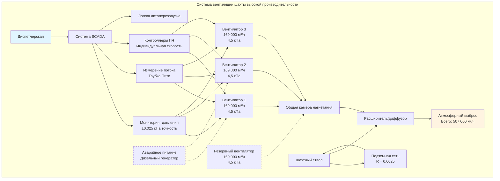

## Требования к вентиляторам крупных шахт

Вентиляторы вентиляции высокой производительности, обслуживающие глубокие или обширные подземные горнодобывающие операции, требуют тщательного проектирования для подачи воздушных потоков, превышающих 100 000 м³/ч, при преодолении значительного сопротивления системы. Эти основные вентиляторы представляют собой первичную систему безопасности жизни подземных рабочих и должны работать непрерывно с исключительной надежностью.

**Критические параметры проектирования:**

- **Производительность по потоку:** 100 000 – 1 000 000+ м³/ч для крупных горнодобывающих комплексов
- **Развиваемое статическое давление:** 2,0 – 7,5 кПа в зависимости от глубины шахты и сопротивления
- **Мощность двигателя:** 150 – 1 500+ кВт на один вентилятор
- **Режим работы:** Непрерывная эксплуатация (24/7/365)
- **Требования к избыточности:** Емкость N+1 или 2N для аварийного резерва
- **Целевые показатели эффективности:** 75-85% общей эффективности вентилятора в расчетной точке

Выбор вентилятора должен учитывать планы расширения шахты, сезонные колебания температуры, влияющие на плотность воздуха, и деградацию воздуховодов с течением времени, что увеличивает сопротивление.

## Методы расчета расхода воздуха

Требования к воздушному потоку в шахте определяются несколькими факторами, включая численность персонала, работу дизельного оборудования, тепловые нагрузки и требования к разбавлению взрывоопасных газов.

**Вентиляция для персонала:**

$$Q_{\text{personnel}} = N_{\text{workers}} \times q_{\text{person}}$$

где $N_{\text{workers}}$ — максимальное количество рабочих одновременно под землей, а $q_{\text{person}}$ обычно составляет 100-200 м³/ч на человека в зависимости от нормативных требований.

**Вентиляция дизельного оборудования:**

$$Q_{\text{diesel}} = \sum (P_{\text{brake}} \times K_{\text{diesel}})$$

где $P_{\text{brake}}$ — тормозная мощность каждого дизельного агрегата в кВт, а $K_{\text{diesel}}$ составляет 1,7-2,5 м³/ч на кВт.

**Отвод тепловой нагрузки:**

$$Q_{\text{heat}} = \frac{q_{\text{total}}}{c_p \times \rho \times \Delta T_{\text{allowable}}}$$

где $q_{\text{total}}$ — общая тепловая нагрузка (кВт), $c_p$ — удельная теплоемкость воздуха (1,005 кДж/кг·°C), $\rho$ — плотность воздуха (кг/м³), и $\Delta T_{\text{allowable}}$ — допустимое повышение температуры.

**Общее требование системы:**

$$Q_{\text{total}} = \max(Q_{\text{personnel}}, Q_{\text{diesel}}, Q_{\text{heat}}) \times SF$$

где $SF$ — коэффициент безопасности, обычно составляющий 1,15–1,25.

## Сопротивление шахты и согласование вентилятора

Сетевое сопротивление вентиляции шахты возрастает приблизительно с квадратом скорости воздушного потока. Точный расчет сопротивления необходим для надлежащего выбора вентилятора.

**Уравнение Аткинсона для сопротивления шахты:**

$$H = RQ^2$$

где $H$ — потеря давления (кПа), $R$ — сопротивление шахты (кПа·с²/м⁶ × 10⁻⁶), и $Q$ — расход воздуха (м³/ч).

**Определение сопротивления системы:**

Расчет сопротивления шахты требует детального обследования воздуховодов, включая:

- Размеры воздуховодов (площадь поперечного сечения, периметр, длина)
- Шероховатость поверхности (коэффициент трения: 0,00015–0,015 м в зависимости от состояния стен)
- Потери на удар в стыках, поворотах и препятствиях (K-факторы: 0,1–2,0)
- Сопротивления шлюзов и дверей

Кривая полного сопротивления системы должна пересекаться с характеристической кривой вентилятора в требуемой точке работы. Для оптимальной эффективности это пересечение должно происходить в пределах 85–115% от точки наилучшей эффективности вентилятора (BEP).

**Законы подобия вентилятора для регулировки точки работы:**

$$\frac{Q_2}{Q_1} = \frac{N_2}{N_1}, \quad \frac{H_2}{H_1} = \left(\frac{N_2}{N_1}\right)^2, \quad \frac{P_2}{P_1} = \left(\frac{N_2}{N_1}\right)^3$$

где $N$ — частота вращения вентилятора (об/мин), $Q$ — расход, $H$ — давление, и $P$ — мощность.

## Многовентиляторные установки

Крупные горнодобывающие операции часто используют несколько вентиляторов в параллельной или последовательной конфигурации для достижения требуемых характеристик потока и давления.

**Параллельное подключение:**

Вентиляторы, включенные параллельно, увеличивают общую производительность по потоку, сохраняя аналогичное развиваемое давление:

$$Q_{\text{total}} = Q_1 + Q_2 + ... + Q_n \text{ (при постоянном давлении)}$$

Параллельные вентиляторы должны иметь близко совпадающие характеристики, чтобы предотвратить дисбаланс потока. Каждый вентилятор должен иметь отдельные дроссельные заслонки и приборы контроля.

**Последовательное подключение:**

Вентиляторы, включенные последовательно, увеличивают общее давление, сохраняя аналогичный поток:

$$H_{\text{total}} = H_1 + H_2 + ... + H_n \text{ (при постоянном потоке)}$$

Последовательные конфигурации менее распространены при вентиляции шахт, но могут использоваться для исключительно глубоких или высокосопротивительных шахт.

**Массивы вентиляторов:**

Современные крупные шахты часто используют 2–6 вентиляторов в параллельных конфигурациях с:
- Индивидуальным управлением через преобразователь частоты для согласования нагрузки
- Автоматическим переводом в режим на основе спроса шахты
- Избыточностью для обслуживания и аварийного резерва
- Алгоритмами распределения нагрузки для оптимизации совокупной эффективности

## Системы управления и мониторинга

Вентиляторы высокой производительности в шахтах требуют сложных систем управления и мониторинга для обеспечения безопасной и эффективной работы.

**Существенные параметры мониторинга:**

- Измерение воздушного потока в реальном времени (массивы трубок Пито или станции с анемометрами)
- Статическое давление на входе и выходе вентилятора (±0,025 кПа точность)
- Частота вращения вентилятора, ток двигателя, потребляемая мощность
- Температура подшипников и уровни вибрации
- Давление в шахтном стволе и станции мониторинга под землей
- Концентрации метана, CO и O₂ в стратегических местах

**Стратегии управления:**

Преобразователи частоты позволяют использовать несколько режимов управления:

1. **Управление с постоянным давлением:** Поддержание фиксированного статического давления независимо от изменений сопротивления шахты
2. **Управление с постоянным потоком:** Поддержание целевого воздушного потока с использованием обратной связи от измерения потока
3. **Управление на основе спроса:** Регулировка общего потока в зависимости от подземной деятельности и концентраций газов
4. **Управление с оптимизацией:** Балансировка нескольких вентиляторов для минимального общего энергопотребления

**Автоматические функции безопасности:**

- Автоматический перезапуск после прерывания электроснабжения (критично для безопасности жизни)
- Экстренное ускорение до полной скорости при обнаружении газа
- Автоматическое переключение на резервный вентилятор при отказе основного
- Блокировки минимального потока для предотвращения срыва или застоя вентилятора

## Рассмотрения энергопотребления

Крупные вентиляторы шахт представляют значительные электрические нагрузки, причем годовые затраты на электроэнергию часто превышают 40 000 USD для крупных установок.

**Расчет потребляемой мощности:**

$$P = \frac{Q \times H}{3600 \times \eta_{\text{fan}} \times \eta_{\text{motor}} \times \eta_{\text{drive}}}$$

где $P$ — мощность (кВт), $Q$ — расход (м³/ч), $H$ — статическое давление (кПа), и коэффициенты полезного действия выражены в виде десятичных дробей.

Для системы 283 000 м³/ч при 3,75 кПа с эффективностью вентилятора 80%, КПД двигателя 96% и КПД ПЧ 97%:

$$P = \frac{283 000 \times 3,75}{3600 \times 0,80 \times 0,96 \times 0,97} = 421 \text{ кВт}$$

Годовое энергопотребление при 0,08 USD/кВт·ч: 421 кВт × 8 760 ч × 0,08 USD = 293 773 USD.

**Стратегии оптимизации энергопотребления:**

| Стратегия | Потенциальная экономия | Соображения реализации |
|-----------|----------------------|------------------------|
| Установка ПЧ на вентиляторы с постоянной скоростью | 20-40% | Требует интеграции системы управления |
| Модернизация эффективности вентилятора | 5-12% | Может потребоваться замена вентилятора |
| Улучшение воздуховодов (снижение R) | 10-30% | Капиталоемко, но постоянное преимущество |
| Управление на основе спроса | 15-25% | Требует комплексного мониторинга |
| Несколько меньших вентиляторов вместо одного крупного | 8-15% | Лучшая эффективность при частичной нагрузке |
| Высокоэффективные двигатели (IE3/IE4) | 2-5% | Указывают при новых установках |

## Спецификации вентиляторов крупных шахт

| Параметр | Малая установка | Средняя установка | Крупная установка | Примечания |
|----------|-----------------|-------------------|------------------|-----------|
| **Расход воздуха** | 56 000–141 000 м³/ч | 141 000–339 000 м³/ч | 339 000–679 000 м³/ч | Общая емкость системы |
| **Статическое давление** | 2,0–3,0 кПа | 3,0–5,0 кПа | 4,5–7,5 кПа | Функция глубины шахты |
| **Тип вентилятора** | Осевой или центробежный | Осевой (одноступенчатый) | Осевой (многоступенчатый) | Осевой предпочтителен для высоких потоков |
| **Мощность двигателя** | 150–375 кВт | 375–1 120 кВт | 1 120–2 240+ кВт | На один блок вентилятора |
| **Диаметр вентилятора** | 1,8–2,4 м | 2,4–3,7 м | 3,7–6,1 м | Рабочее колесо осевого вентилятора |
| **Диапазон скоростей** | 300–600 об/мин | 250–450 об/мин | 200–350 об/мин | Управляемый через ПЧ |
| **Эффективность (полная)** | 75-80% | 78-83% | 80-85% | В расчетной точке |
| **Уровень звука** | 88–100 дБ(A) | 93–105 дБ(A) | 98–110 дБ(A) | На расстоянии 0,9 м от корпуса |
| **Избыточность** | N+1 (2 вентилятора) | N+1 (3–4 вентилятора) | N+1 или 2N (5–8 вентиляторов) | Требование надежности |
| **Капитальная стоимость** | 375 000–1 125 000 USD | 1 125 000–3 000 000 USD | 3 000 000–9 000 000 USD | Полная установка |

**Распространенные производители:** Howden, TLT-Babcock, Robinson, Joy, ABB, Siemens (высокоэффективные двигатели).

Выбор и эксплуатация вентиляторов вентиляции высокой производительности в шахтах требуют многопрофильной экспертизы, охватывающей аэродинамику, электротехнику, планирование горных работ и нормативные требования безопасности. Надлежащее проектирование системы с адекватной производительностью, эффективностью и избыточностью необходимо для защиты здоровья рабочих и обеспечения производительных горнодобывающих операций.
