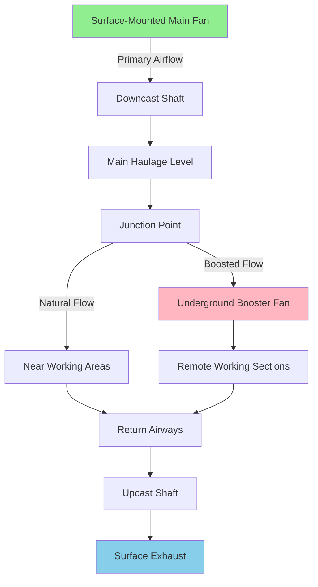

## Конфигурации вентиляторов поверхностного монтажа

Вентиляторы поверхностного монтажа являются основным подходом к вентиляции для большинства горнодобывающих операций. Эти установки размещают большие центробежные или осевые вентиляторы на воротниках стволов или входах штолен, создавая движущую силу для систем воздушного потока на всей шахте.

**Размещение вентилятора вытяжки**

Наиболее распространённая конфигурация размещает вентиляторы на стволе вытяжки (восходящий поток), вытягивая загрязненный воздух из подземных рабочих зон. Эта схема поддерживает отрицательное давление по всей шахте, предотвращая неконтролируемое утечки воздуха на поверхность и обеспечивая, что любые утечки поступают внутрь, а не выходят из шахты. Скорость вытяжки на выходе вентилятора обычно составляет 10-20 м/с.

**Размещение вентилятора подачи**

Вентиляторы подачи (нисходящий поток) нагнетают свежий воздух в шахту через впускные стволы. Хотя менее распространено для основной вентиляции из-за проблем с давлением, эта конфигурация предлагает преимущества в специальных приложениях, где требуется нагрев или охлаждение воздуха подачи перед входом.

**Последовательные и параллельные схемы**

Крупные операции часто используют несколько поверхностных вентиляторов в последовательной или параллельной конфигурации. Последовательные установки увеличивают общее развитие давления: $\Delta P_{total} = \Delta P_1 + \Delta P_2$. Параллельные схемы увеличивают объёмную пропускную способность: $Q_{total} = Q_1 + Q_2$. Требования резервирования обычно требуют конфигурации N+1, обеспечивающей непрерывную работу во время технического обслуживания или отказа.

## Приложения подземных бустерных вентиляторов

Подземные бустерные вентиляторы дополняют основные системы поверхностной вентиляции, увеличивая воздушный поток к удаленным рабочим зонам или преодолевая локальное сопротивление.

**Стратегическое размещение**

Бустерные вентиляторы устанавливаются в точках сопряжения, входах штолен или местах вентиляционных восстающих скважин для направления воздуха в определённые рабочие зоны. Типичные установки расположены на расстоянии 305-1524 м от активных забоев, где естественное вентиляционное давление от поверхностных вентиляторов снижается ниже эффективного уровня.

**Расчёты каскадирования**

Давление бустерного вентилятора должно преодолевать нижнее сопротивление, учитывая доступное давление выше по потоку. Уравнение каскадирования: $\Delta P_{booster} = R_{downstream} \times Q^2 - P_{available}$, где $R_{downstream}$ представляет коэффициент сопротивления в килопаскалях на квадрат кубических метров в час.

**Координация с основной вентиляцией**

Бустерные вентиляторы должны координироваться с кривыми работы основной системы вентиляции, чтобы предотвратить обратный поток или застой. Характеристика комбинированной системы следует: $\Delta P_{system} = \Delta P_{main} + \Delta P_{booster} = (R_{main} + R_{branch})Q^2$.

## Сравнительный анализ

| Критерий | Поверхностный монтаж | Подземный монтаж |
|-----------|----------------------|------------------|
| **Диапазон производительности** | 47,2-944,0 м³/ч | 4,72-94,4 м³/ч |
| **Развитие давления** | 2,5-10,0 кПа | 0,5-3,7 кПа |
| **Стоимость установки** | 500 000-5 000 000 USD | 50 000-500 000 USD |
| **Доступ для обслуживания** | Неограниченный наземный доступ | Ограничен доступом через ствол/штолню |
| **Электроснабжение** | Прямое подключение к сети | Требуется подземное распределение |
| **Защита окружающей среды** | Необходимы защитные кожухи | Стабильная температурная среда |
| **Аварийный отклик** | Внешний доступ сохранён | Может быть недоступен во время событий |
| **Рабочая среда** | -40°C до 49°C окружающая | 10°C до 32°C типичная |

## Доступ для обслуживания

**Доступность поверхностных вентиляторов**

Поверхностные установки обеспечивают неограниченный доступ для профилактического обслуживания, проверок и аварийного ремонта. Кран-доступ облегчает удаление рабочего колеса, замену подшипников и переключение двигателя без перерывов в добыче. Типичные окна обслуживания приходятся на смены или запланированные простои с полными переоборудованиями, достижимыми за 24-72 часа.

**Подземные ограничения**

Обслуживание подземных бустерных вентиляторов требует координации с горнодобывающими операциями, расписанием стволов и управлением вентиляцией. Ограничения доступа ограничивают размер оборудования и требуют специализированного такелажа для замены компонентов. Удаление вентилятора часто требует временных вентиляционных корректировок, влияющих на графики производства. Аварийный ремонт может потребовать изменения вентиляционного контура для поддержания воздушного потока во время простоя оборудования.

## Защита от атмосферных воздействий для поверхностных вентиляторов

Установки поверхностного монтажа требуют комплексных систем защиты окружающей среды, адресующих экстремальные температуры, осадки, ветровые нагрузки и атмосферные загрязнители.

**Проектирование кожуха**

Вентиляторные домики применяют изолированные металлические панели или бетонную конструкцию, обеспечивающие термическую стабильность и акустическое ослабление. Системы отопления поддерживают минимальную рабочую температуру 4°C, чтобы предотвратить застывание смазки подшипников и образование льда на конструкциях. Вентиляционные отверстия содержат жалюзи, предотвращающие проникновение дождя и снега, при этом позволяя отвод тепла во время работы.

**Работа при низких температурах**

Установки в арктических и субарктических регионах требуют отапливаемых кожухов, поддерживающих 10-21°C внутренней температуры. Рекуперация тепла от неэффективности двигателя дополняет нагрузки на отопление здания. Нагрев воздуха на входе предотвращает образование льда на направляющих лопатках и диффузорах.

## Аварийные соображения

**Преимущества поверхностных вентиляторов**

Наружное размещение обеспечивает доступность во время подземных чрезвычайных ситуаций. Обратимые вентиляторы позволяют выброс дыма из маршрутов эвакуации во время пожара. Несколько агрегатов обеспечивают резервирование, поддерживающее минимальную вентиляцию при отказе одного агрегата. Аварийные подключения питания облегчают подключение дизельного генератора при перебоях электроэнергии.

**Уязвимости подземных вентиляторов**

Пожар, взрыв или нестабильность грунта могут сделать подземные бустеры неработоспособными или недоступными. Обходные воздуховоды вокруг мест размещения бустеров позволяют аварийную маршрутизацию вентиляции при отказе вентиляторов или необходимости их изоляции. Взрывозащитная конструкция (класс II, подразделение 1 или 2) предотвращает воспламенение атмосфер, содержащих взрывчатую пыль. Системы удаленного мониторинга обнаруживают отказы и позволяют немедленные корректировки вентиляционного контура.

**Резервные положения**

Критические вентиляционные секции, обслуживаемые подземными бустерами, требуют резервных агрегатов или спроектированных естественных вентиляционных маршрутов, поддерживающих минимальные скорости на забое 0,15-0,25 м/с при отключении вентиляторов. Аварийные процедуры определяют протоколы изоляции, альтернативные маршруты и пороги эвакуации при отказах бустеров, компрометирующих вентиляцию рабочей зоны ниже нормативных минимумов.

Поверхностные основные вентиляторы обеспечивают надежную, доступную, высокопроизводительную вентиляцию для общих систем шахт, в то время как подземные бустеры расширяют эффективную вентиляцию на удаленные зоны, где давление поверхностного вентилятора рассеивается. Оптимальное проектирование вентиляции шахты стратегически сочетает оба подхода, используя поверхностные установки для основного воздушного потока и подземные агрегаты для целевого дополнения.
