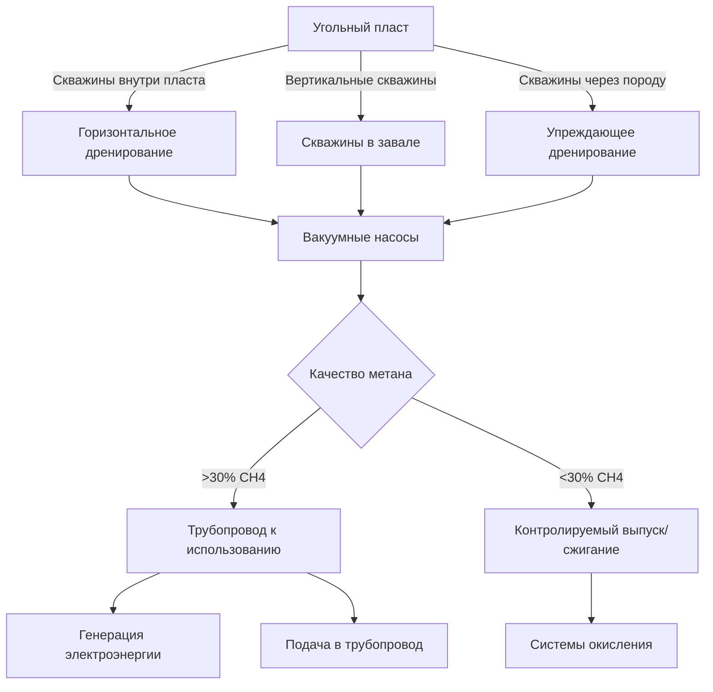

Контроль метана (CH₄) представляет наиболее критичный аспект безопасности при вентиляции подземных угольных шахт. Метан — бесцветный газ без запаха, выделяемый из угольных пластов при добыче, образует взрывоопасные смеси с воздухом при концентрациях 5–15%. Системы вентиляции должны непрерывно разбавлять метан до безопасных концентраций ниже границ взрывоопасности, а системы мониторинга должны обнаруживать скопления метана и запускать автоматические защитные действия.

## Образование и выделение метана

Угольные пласты содержат метан, образовавшийся в процессе углефикации — геологическом процессе преобразования органического материала в уголь. Содержание метана увеличивается с ростом ранга угля: от 1–2 м³/т в суббитуминозных углях до 15–25 м³/т в антрацитовых пластах.

**Механизмы выделения метана**

Горные работы высвобождают метан тремя физическими процессами:

- **Десорбция**: снижение давления при извлечении угля позволяет адсорбированному метану десорбироваться с внутренних поверхностей угля в соответствии с поведением изотермы Ленгмюра
- **Диффузия**: градиенты концентрации способствуют миграции метана из матрицы угля через трещины и расселины
- **Вытеснение**: подземные воды или воздух вытесняют свободный газ из полостей угля и окружающих пород

Скорости выделения зависят от проницаемости угля (обычно 0,1–10 миллидарси), скорости подвигания забоя и масштаба нарушения пород. Типичный лавный забой может выделять 10–30 CFM метана во время добычи, с дополнительными выделениями из ранее отработанных участков.

## Взрывоопасные характеристики

Горение метана следует уравнению:

$$\text{CH}_4 + 2\text{O}_2 \rightarrow \text{CO}_2 + 2\text{H}_2\text{O} + 891 \text{ кДж/моль}$$

Нижний предел взрывоопасности (НПВ) 5,0% CH₄ представляет минимальную концентрацию, поддерживающую распространение пламени при стандартных условиях. При концентрации ниже НПВ недостаточно топлива для устойчивого горения. Верхний предел взрывоопасности (ВПВ) 15,0% CH₄ отмечает кислородное голодание, при котором горение не может происходить.

**Факторы, влияющие на взрывоопасность**

| Параметр | Влияние на НПВ | Влияние на ВПВ |
|----------|---|---|
| Повышение температуры (+100°C) | Снижается на 0,3–0,5% | Повышается на 1–2% |
| Повышение давления (2 атм) | Снижается на 0,2–0,4% | Повышается на 2–3% |
| Присутствие угольной пыли | Значительно снижается | Умеренно снижается |
| Инертный газ (N₂, CO₂) | Повышается (безопаснее) | Снижается (более узкий диапазон) |

Угольная пыль, взвешенная в метано-воздушных смесях, драматически увеличивает интенсивность взрыва и скорость распространения пламени. Концентрации пыли от 50–100 г/м³ могут поддерживать распространение пламени даже вне нормального диапазона взрывоопасности метана, создавая гибридные взрывы, требующие комбинированных стратегий контроля метана и пыли.

## Основы разбавляющей вентиляции

Разбавляющая вентиляция поддерживает концентрации метана ниже нормативных ограничений путём обеспечения надлежащего расхода воздуха. Основное уравнение разбавления выводится из баланса массы:

$$Q_{\text{req}} = \frac{q_{\text{CH}_4}}{C_{\text{max}} - C_{\text{intake}}} \times SF$$

Где:
- $Q_{\text{req}}$ = требуемый расход воздуха (CFM)
- $q_{\text{CH}_4}$ = скорость выделения метана (CFM)
- $C_{\text{max}}$ = максимально допустимая концентрация (доля в долях)
- $C_{\text{intake}}$ = концентрация метана во входном воздухе (обычно 0)
- $SF$ = коэффициент безопасности (1,25–1,5)

**Пример расчёта**: участок с непрерывным добычником выделяет 8,5 CFM метана. Рассчитайте требуемый расход воздуха для поддержания максимальной концентрации 1,0% с коэффициентом безопасности 1,3:

$$Q_{\text{req}} = \frac{8,5}{0,010 - 0} \times 1,3 = 1 105 \text{ CFM}$$

Это представляет минимальную вентиляцию забоя; фактические объёмы должны учитывать дополнительных рабочих, тепло от оборудования и потери в выработках.

## Нормативные требования MSHA

Управление по безопасности и здоровью в горнодобывающей промышленности (MSHA) устанавливает ограничения концентрации метана согласно 30 CFR Part 75 для подземных угольных шахт:

**Ограничения концентрации**

| Место | Максимум CH₄ | Требуемые действия |
|---|---|---|
| Возвратная выработка забоя | 1,0% | Обычные операции |
| Последняя открытая перемычка | 1,0% | Обычные операции |
| У датчиков забоя | 1,0% | Продолжение добычи |
| Любое место | 1,5% | Обесточивание оборудования, вывод персонала |
| Любое место | 2,0% | Эвакуация участка, восстановление вентиляции |
| Система отвода | 2,0% | Норма для запечатанных зон |
| Извлечение целиков | 2,0% | Максимум при отступающей добыче |

При концентрации метана 1,5% MSHA 30 CFR 75.323 требует немедленного обесточивания всего электрооборудования (кроме одобренных устройств внутренней безопасности) и вывода персонала до возврата концентраций ниже 1,0%.

**Минимальные стандарты расхода воздуха**

- Рабочие участки: минимум 9 000 CFM согласно MSHA 30 CFR 75.325(a)
- Каждый механизированный добычной узел: минимум 3 000 CFM
- Последняя открытая перемычка: минимальная скорость воздуха 18 м/мин
- Ленточные выработки: минимум 10 000 CFM или достаточно для мощности привода ленты

## Системы дренирования метана

Шахты с высокими выделениями метана применяют дренирование метана (дегазификацию) для извлечения метана до его попадания в вентиляционный воздух. Дренирование снижает требования к вентиляции и позволяет захватить метан для коммерческого использования или контролируемого выпуска.

**Методы дренирования**

1. **Вертикальные скважины в завале**: пробуриваются с поверхности в обрушенные зоны позади лавы
   - типичные глубины: 150–600 м
   - расстояние между скважинами: 150–300 м вдоль панели
   - эффективность захвата: 30–60% выделений завала
   - концентрация метана: 25–60%

2. **Горизонтальные скважины внутри пласта**: пробуриваются перед добычей из подземных выработок
   - длина: 150–450 м перед забоем
   - диаметр: 5–10 см
   - время дренирования: 3–12 месяцев до добычи
   - эффективность захвата: 20–40% содержания в пласте

3. **Скважины через породу**: пробуриваются в вышележащие/подстилающие пласты
   - целевые зоны: 15–90 м над/под пластом
   - захватывают выделения из нарушенных пород
   - эффективны во время и после добычи

Прикладываемый вакуум колеблется от 13–51 см рт. ст. в зависимости от проницаемости угля и конфигурации системы дренирования. Общая пропускная способность системы дренирования может достигать 1 000–5 000 CFM в шахтах с высокой газоотдачей.

## Системы мониторинга метана

Системы непрерывного мониторинга атмосферы (СИМА) обнаруживают опасные скопления метана до достижения взрывоопасных концентраций.

**Технологии датчиков**

| Тип | Принцип | Диапазон | Время отклика | Преимущества |
|---|---|---|---|---|
| Каталитический элемент | Окисление с нагревом | 0–5% CH₄ | 10–30 сек | Точный, широко используемый |
| Инфракрасное поглощение | ИК-спектроскопия | 0–100% CH₄ | 1–5 сек | Не требует кислорода, стабильный |
| Теплопроводность | Передача тепла | 0–100% CH₄ | 5–15 сек | Широкий диапазон |
| Лазерный метан | Перестраиваемый диодный лазер | 0–100% CH₄ | <1 сек | Возможно дистанционное обнаружение |

**Требования к размещению датчиков (30 CFR 75.342)**

- Рабочий забой: в пределах 30 см от крыши, 18 м от забоя
- Оператор непрерывного добычника: на корпусе добычника или шлеме оператора
- Возвратный воздух: последняя открытая перемычка
- Ленточные выработки: у пунктов передачи и в точке разгрузки
- Запечатанные зоны: мониторинг для обнаружения утечек

СИМА интегрируется с общешахтными системами управления для:
- запуска визуальных/звуковых сигналов тревоги при 1,0% CH₄
- автоматического обесточивания оборудования при 1,5% CH₄
- записи данных концентрации для соответствия нормативам
- передачи данных реального времени на наземные станции мониторинга

## Устройства управления вентиляцией

Контроль метана требует направления надлежащего расхода воздуха через рабочие участки при предотвращении загрязнения входного воздуха.

**Промежуточные завесы**: тяжёлая виниловая или брезентовая ткань, простирающаяся от крыши до 15–30 см от пола, создающая вспомогательное разделение вентиляции в выработках. Типичная масса ткани: 200–300 г/м² для долговечности в активных участках добычи.

**Перепуски/Подпуски**: постоянные бетонные или стальные конструкции, позволяющие одной выработке пересекать другую без смешивания. Перепад давления на перепуске должен оставаться <5 Па для предотвращения утечек.

**Регуляторы**: регулируемые двери или жалюзи, создающие контролируемое сопротивление для балансирования распределения расхода воздуха. Перепады давления регулятора рассчитываются по формуле:

$$\Delta P = R \times Q^2$$

где $R$ — сопротивление регулятора (Па/(м³/ч)²) и $Q$ — расход воздуха (м³/ч). Регуляторы требуют периодической регулировки при эволюции вентиляционной сети шахты.

**Перепускные завесы**: односторонние барьеры потока, предотвращающие обратный поток в параллельных выработках. Критичны для поддержания надлежащего направления потока при нарушениях вентиляции.

## Системы отвода воздуха из завалов

Запечатанные заброшенные зоны (завалы) позади лавных забоев продолжают выделять метан, требующий контролируемой вентиляции. Системы отвода направляют контролируемый расход воздуха по периметру завала, вынося метан в возвратный воздух.

**Критерии проектирования**

- Минимальный расход воздуха: достаточный для поддержания <2,0% CH₄ в отводных выработках
- Скорость воздуха: 6–18 м/мин в отводных выработках (избегать чрезмерной турбулентности)
- Мониторинг: непрерывные датчики у вентилятора отвода и контрольных точек
- Оценка: еженедельные измерения согласно MSHA 30 CFR 75.334

Вентиляторы отвода обычно работают при 2 500–25 000 м³/ч в зависимости от размеров панели и скоростей выделения метана в завале. Несколько отводов могут требовать координации для предотвращения короткого замыкания между панелями.

## Протоколы экстренного реагирования

Несмотря на превентивные меры, скопления метана могут возникнуть, требуя немедленных действий:

**Иерархия реагирования**

1. **1,0–1,5% CH₄**: Увеличение вентиляции, расследование источника, продолжение мониторинга
2. **1,5–2,0% CH₄**: Обесточивание оборудования согласно 30 CFR 75.323, вывод персонала, восстановление вентиляции
3. **>2,0% CH₄**: Эвакуация участка, запрет входа до <1,0%, тщательное расследование
4. **Событие возгорания**: Активизация плана экстренного реагирования, учёт персонала, управление вентиляцией

Возможность реверса главного вентилятора, требуемая согласно MSHA 30 CFR 75.311, обеспечивает эвакуацию дыма в чрезвычайной ситуации при подземных пожарах. Однако реверс должен быть тщательно оценен, так как он может распространить метан из запечатанных зон в активные рабочие зоны.

Современные шахты поддерживают системы безопасной связи внутренней безопасности, автономные самоспасатели (АСС) для персонала и стратегически расположенные камеры убежища, предоставляющие временное безопасное убежище при задержках эвакуации.

## Интеграция с планированием добычи

Эффективный контроль метана требует координации с проектированием шахты и оперативным планированием:

- разведочное бурение до добычи для характеристики содержания и распределения метана
- последовательность разработки панелей для минимизации взаимодействия завалов и кумулятивных выделений
- скорости добычи, согласованные с пропускной способностью вентиляции и эффективностью дренирования
- планирование непредвиденных обстоятельств для неожиданных зон с высокой газоотдачей
- резерв пропускной способности вентиляционной системы для будущего расширения

Шахты в пластах с высокой газоотдачей могут применять специализированные методы добычи (лавная добыча, поэтапное извлечение) для управления метаном в пределах пропускной способности вентиляционной системы, принимая сниженные темпы добычи для поддержания запасов безопасности.

Контроль метана остаётся фундаментальным требованием для спасения жизни в подземной добыче угля, требующим непрерывной бдительности, надлежащим образом спроектированных вентиляционных систем, эффективного мониторинга и строгого соблюдения нормативных требований для предотвращения взрывоопасных атмосфер и защиты горняков.
