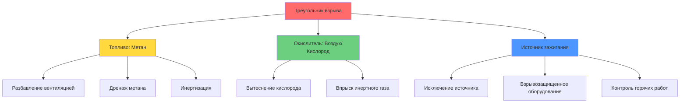
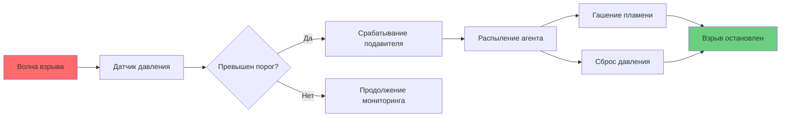

## Обзор

Предотвращение взрывов метана в подземных угольных шахтах требует многоуровневой защиты, которая решает проблемы как концентрации топлива, так и источников зажигания. Опасность взрыва существует, когда концентрация метана достигает нижнего предела взрываемости (НКПР) в 5% по объему в воздухе, при наличии источника зажигания, обеспечивающего достаточную энергию (обычно 0,28 мДж для метана).

## Треугольник взрыва и стратегия предотвращения

Сгорание метана требует одновременного наличия трех элементов: топлива (CH₄), окислителя (O₂) и энергии зажигания. Исключите любой один элемент, и сгорание не может произойти.

## Контроль НКПР на основе вентиляции

### Принципы разбавляющей вентиляции

Основной подход к предотвращению взрывов — поддержание концентрации метана ниже 1% (20% НКПР) в соответствии с MSHA 30 CFR 75.323. Требуемая скорость вентиляции подчиняется уравнению баланса массы:

$$Q_{req} = \frac{q_{CH_4}}{C_{max} - C_{amb}}$$

Где:
- $Q_{req}$ = требуемая скорость воздушного потока (м³/ч)
- $q_{CH_4}$ = скорость выделения метана (м³/ч)
- $C_{max}$ = максимально допустимая концентрация (0,01 для 1%)
- $C_{amb}$ = окружающая концентрация метана (обычно 0)

### Применение коэффициента безопасности

Нормативные акты требуют поддерживать концентрации значительно ниже НКПР для учета:

1. **Изменчивости вентиляции** — колебания воздушного потока от перегородок, открывания дверей
2. **Скачков выбросов** — внезапное выделение метана при обрушении кровли или изменении давления
3. **Неэффективности смешивания** — неполное разбавление в тупиковых выработках
4. **Задержки мониторинга** — временная задержка между ростом концентрации и обнаружением

Эффективный коэффициент безопасности составляет:

$$SF = \frac{НКПР}{C_{рабочий}} = \frac{5\%}{1\%} = 5$$

## Исключение источников зажигания

### Пороговая энергия и механизмы зажигания

Метан требует минимальной энергии зажигания (МЭЗ) 0,28 мДж при стехиометрической концентрации (9,5% CH₄). Распространенные источники зажигания в шахтах:

| Источник зажигания | Типичная энергия | Мера контроля MSHA |
|----------------|----------------|----------------------|
| Электрическая дуга | 1–1000 мДж | Взрывозащищенные кожухи (75.500) |
| Искра от трения | 10–100 мДж | Каменная пыль, водяные распылители |
| Горячая поверхность | >650°C постоянно | Мониторинг температуры |
| Открытое пламя | >1000 мДж | Запрещено в опасных по газу зонах |
| Статический разряд | 1–10 мДж | Системы заземления/соединения |
| Взрывчатые вещества | >>1000 мДж | Допустимые только взрывчатые вещества |

### Проектирование взрывозащищенного оборудования

Электрическое оборудование в подземных угольных шахтах должно соответствовать стандартам внутренней безопасности или взрывозащиты согласно 30 CFR 75.500–75.507. Две основные философии проектирования:

**Конструкция внутренней безопасности**: Ограничивает доступную энергию ниже МЭЗ при всех условиях отказа.

$$E_{доступная} = \frac{1}{2}LI^2 + \frac{1}{2}CV^2 < 0,28 \text{ мДж}$$

Где $L$ — индуктивность цепи, $I$ — ток, $C$ — емкость и $V$ — напряжение.

**Взрывозащищенные кожухи**: Содержат внутренние взрывы и предотвращают внешнее зажигание путем:
- Гашения пламени в щели (<0,51 мм для метана)
- Рассеивания тепла через металлические стенки
- Сброса давления без выпуска пламени

## Дренаж метана (дегазация)

### Проектирование системы дренажа

Предварительный дренаж снижает выделение метана в рабочих секциях путем извлечения газа непосредственно из угольных пластов перед добычей. Давлением управляемый поток следует закону Дарси, модифицированному для сжимаемости газа:

$$q = \frac{\pi k h (P_s^2 - P_w^2)}{1,422 \times 10^6 \mu \ln(r_e/r_w)}$$

Где:
- $q$ = скорость потока газа (м³/день при стандартных условиях)
- $k$ = проницаемость (мД)
- $h$ = толщина пласта (м)
- $P_s$ = давление в пласте (кПа)
- $P_w$ = давление в скважине (кПа)
- $\mu$ = вязкость газа (сП)
- $r_e/r_w$ = отношение радиусов дренажа

### Сравнение методов дренажа

| Метод | Применение | Эффективность | Сложность реализации |
|--------|-------------|------------|---------------------------|
| Вертикальные скважины | Предварительная добыча, глубокие пласты | 40–70% снижение | Высокая (поверхностное бурение) |
| Горизонтальные скважины | Активные зоны добычи | 30–50% снижение | Средняя (подземное бурение) |
| Скважины в отработанном пространстве | Улавливание газа из отработки | 50–80% газа отработки | Высокая (поверхностное/подземное) |
| Скважины между пластами | Дренаж нескольких пластов | 20–40% снижение | Низкая (простое бурение) |

## Стратегии инертизации

### Системы впрыска азота

Инертизация вытесняет кислород ниже минимальной концентрации, необходимой для сгорания (12% O₂ для метана). Стехиометрическое уравнение сгорания:

$$CH_4 + 2O_2 \rightarrow CO_2 + 2H_2O$$

показывает, что метану требуется 2 моля O₂ на 1 моль CH₄. При 12% O₂ максимальная температура пламени падает ниже порога теплового разгона.

Скорость впрыска инертного газа для герметизированных зон:

$$Q_{N_2} = V_{герметич} \times \left(\frac{C_{O_2,нач} - C_{O_2,ц}}{C_{O_2,ц}}\right) \times \frac{1}{t_{инерт}}$$

Где $V_{герметич}$ — объем герметизированной зоны, концентрации кислорода в долях единицы и $t_{инерт}$ — целевое время инертизации.

### Сценарии применения

- **Герметизация заброшенных зон** — долгосрочная инертизация предотвращает самовозгорание
- **Аварийное реагирование** — быстрая инертизация останавливает продолжающиеся взрывы
- **Предварительная инертизация** — предварительная обработка высокорисковых зон перед входом

## Взрывные барьеры и подавление

### Пассивные барьерные системы

Каменные пылевые барьеры (30 CFR 75.335) действуют по принципам передачи импульса и гашения пламени. При прибытии волн давления взрыва:

$$\Delta P_{срабатывание} \geq 3,4 \text{ кПа} \rightarrow \text{активация барьера}$$

Распределенная каменная пыль (обычно 90–180 кг на барьер) поглощает тепловую энергию:

$$Q_{поглощенная} = m_{пыль} \times c_p \times \Delta T$$

Это эндотермическое охлаждение снижает температуру пламени ниже точки самовоспламенения (650°C), прекращая дефлаграцию.

### Активные системы подавления

Современное подавление использует включение воды или химического агента, срабатываемое по давлению:

Требования к времени отклика:
- Обнаружение: <10 мс
- Открытие клапана: <50 мс
- Полное распыление: <200 мс

Полный отклик системы должен произойти до того, как фронт пламени пройдет за барьер.

## Интегрированная система предотвращения

Эффективное предотвращение взрывов объединяет несколько уровней:

1. **Первичный контроль**: Вентиляция поддерживает <1% CH₄
2. **Вторичный контроль**: Дренаж метана снижает нагрузку выбросов
3. **Третичный контроль**: Исключение источников зажигания
4. **Аварийное смягчение**: Барьеры ограничивают распространение взрыва

Этот многоуровневый подход обеспечивает, что отказ одного компонента не приведет к катастрофическим последствиям.

## Мониторинг и соответствие нормам

MSHA требует:
- Непрерывного мониторинга метана в возвратных выработках (75.323)
- Осмотра ручными детекторами на активных забоях
- Автоматического отключения при 2% CH₄ (75.323-4)
- Квартального осмотра взрывных барьеров (75.335)

Вероятность взрыва экспоненциально снижается с каждым независимым уровнем контроля, следуя принципу анализа дерева отказов:

$$P_{взрыв} = P_{НКПР} \times P_{зажигание} \times (1 - P_{барьер})$$

Поддержание $P_{взрыв} < 10^{-6}$ в час работы является целевым показателем отрасли.
