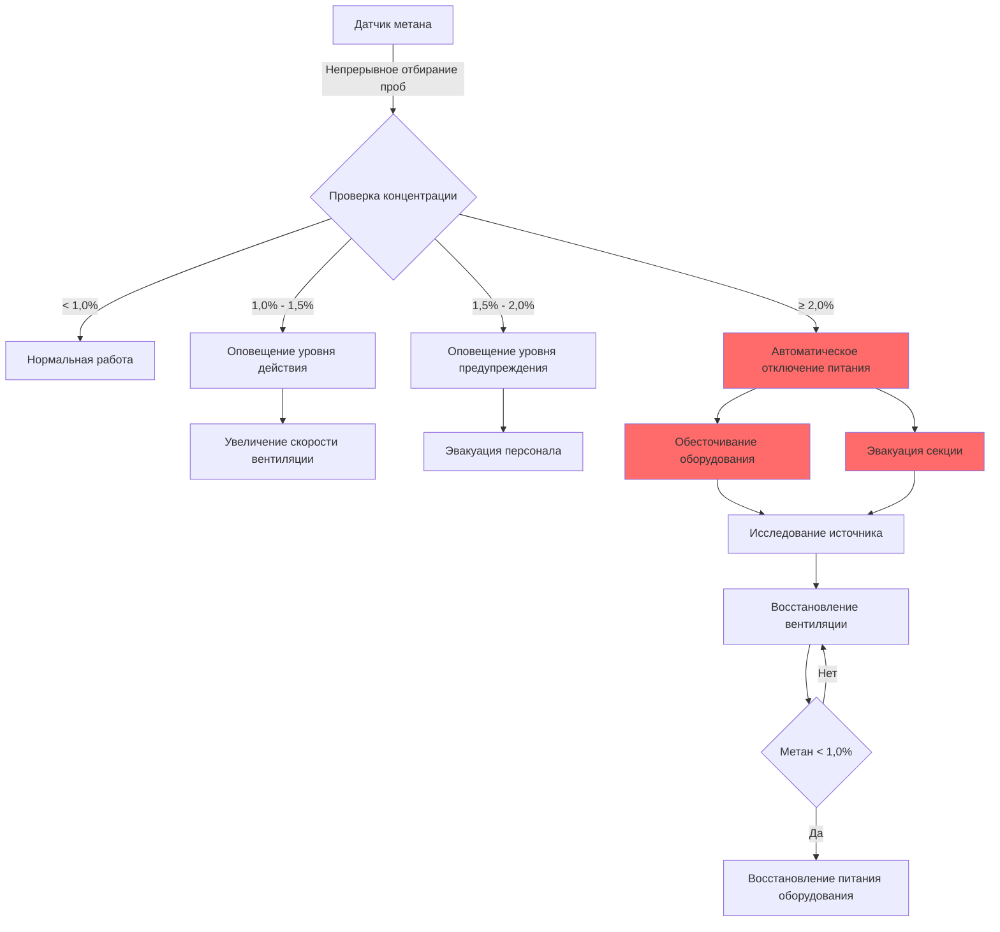
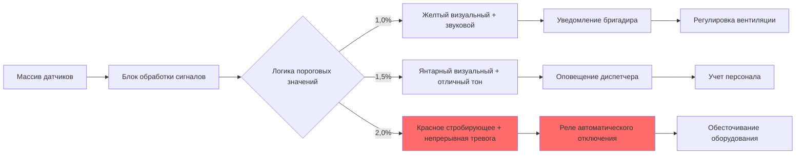

## Физические основы воспламеняемости метана

Метан (CH₄) обладает узким, но критическим диапазоном воспламеняемости в воздухе. **Нижний предел взрывоопасности (LEL)** представляет минимальную концентрацию метана, способную поддерживать распространение пламени при воздействии источника воспламенения. При 5,0% метана по объему в воздухе смесь топлива и воздуха, близкая к стехиометрической, приближается к границе тощего сгорания, где скорость выделения тепла от окисления равна тепловым потерям в окружающих газах.

Реакция горения протекает следующим образом:

$$\text{CH}_4 + 2\text{O}_2 \rightarrow \text{CO}_2 + 2\text{H}_2\text{O} + 890 \text{ кДж/моль}$$

При концентрации ниже 5% в зоне распространения фронта пламени находится недостаточно молекул топлива для поддержания цепной реакции, необходимой для устойчивого горения. Порог LEL зависит от температуры, давления и наличия инертных газов, однако 5,0% остается стандартным эталонным значением при нормальных атмосферных условиях (20°C, 101,3 кПа).

## Нормативные уровни действия MSHA (30 CFR Part 75)

Управление по безопасности и здоровью при добыче полезных ископаемых устанавливает многоуровневые пороги концентрации метана для предотвращения взрывоопасных атмосфер в подземных угольных шахтах. Эти уровни действия предусматривают прогрессивные протоколы реагирования:

| Концентрация метана | Классификация | Требуемое действие | Нормативная ссылка |
|----------------------|----------------|-----------------|---------------------|
| 1,0% | Уровень действия | Увеличение вентиляции, оценка источников | 30 CFR 75.323 |
| 1,5% | Уровень предупреждения | Эвакуация рабочих из пораженной зоны | 30 CFR 75.323 |
| 2,0% | Уровень эвакуации | Обесточивание оборудования, эвакуация секции | 30 CFR 75.323 |
| 5,0% | LEL | Присутствует взрывоопасная атмосфера | Эталонный порог |

Эти пороги включают коэффициенты безопасности относительно LEL:

- **Уровень действия 1,0%**: 20% от LEL (коэффициент безопасности 5:1)
- **Уровень предупреждения 1,5%**: 30% от LEL (коэффициент безопасности 3,3:1)
- **Уровень эвакуации 2,0%**: 40% от LEL (коэффициент безопасности 2,5:1)

Многоуровневый подход признает, что накопление метана неравномерно. Локализованные карманы образуются из-за неадекватного перемешивания, полостей в кровле и вариабельности скорости выделения из угольных пластов.

## Требования автоматического отключения питания

Когда метан достигает концентрации 2,0%, 30 CFR 75.323 требует автоматического обесточивания электрического оборудования в пораженной зоне. Это требование касается опасности воспламенения, создаваемой дуговыми контактами, горячими поверхностями и электрическими неисправностями.

Последовательность отключения питания работает по принципам отказобезопасности:

Электрическое отключение должно произойти в течение времени реакции системы мониторинга, обычно 30-60 секунд с момента превышения порога до полного обесточивания. Газоанализаторы метана срабатывают контакторами или автоматами, прерывающими питание горного оборудования, конвейерных систем и не внутренне безопасных электрических устройств.

## Архитектура системы мониторинга метана

Системы непрерывного мониторинга метана используют датчики с каталитическими спиралями или детекторы инфракрасного поглощения, установленные по всей атмосфере шахты. Стратегия размещения датчиков следует принципам гидродинамики для захвата характеров миграции метана.

### Критерии размещения датчиков

**Мониторинг возвратного воздуха**
Первичные датчики располагаются в возвратном воздухопроводе, где весь воздух из рабочей секции сходится. Это положение обеспечивает измерение концентрации метана по всей секции с временем отклика, определяемым:

$$t_{\text{отклика}} = \frac{L \cdot A}{Q}$$

Где:
- $L$ = расстояние от источника выделения до датчика (м)
- $A$ = площадь поперечного сечения воздухопровода (м²)
- $Q$ = скорость вентиляционного потока (м³/с)

**Мониторинг рабочего забоя**
Вторичные датчики располагаются около угольного забоя и линии кровли, где концентрируются выделения метана. Датчики на кровле учитывают плотность метана ($\rho_{\text{CH}_4} = 0,657$ кг/м³ при 20°C), которая меньше плотности воздуха ($\rho_{\text{воздух}} = 1,204$ кг/м³), вызывая восходящую плавучесть:

$$F_{\text{плавучесть}} = (\rho_{\text{воздух}} - \rho_{\text{CH}_4}) \cdot g \cdot V$$

Эта плавучесть вызывает стратификацию в зонах низкой скорости, требуя размещения датчика в верхней позиции на расстоянии 30 см от кровли.

**Мониторы, установленные на мобильных машинах**
Проходческие комбайны и другое оборудование оснащены внутренне безопасными газоанализаторами метана, которые инициируют локальное отключение питания независимо от систем мониторинга площади. Они обеспечивают защиту от кратковременных выбросов метана при резании угля, когда скорость выделения временно возрастает.

## Реализация протокола тревожной сигнализации

Многоступенчатые системы сигнализации обеспечивают градуированные предупреждения, соответствующие нормативным порогам:

Системы сигнализации включают логику защелки, предотвращающую сброс до тех пор, пока метан не упадет ниже 1,0% и руководящий персонал вручную не проверит безопасные условия. Это предотвращает преждевременное восстановление питания при активных источниках метана.

Слышимость сигнализации должна достигать 85 дBA выше уровня фонового шума во всей пораженной секции, учитывая работу машин и затухание на расстоянии. Визуальные тревоги используют светодиоды высокой интенсивности, видимые сквозь взвесь угольной пыли, обычную в активных горных работах.

## Вентиляционный отклик при обнаружении метана

Когда датчики обнаруживают повышенный метан, основной метод управления увеличивает скорость вентиляционного потока к пораженной зоне. Связь разбавления следует:

$$C_{\text{выход}} = \frac{Q_{\text{CH}_4}}{Q_{\text{воздух}}} \times 100\%$$

Где:
- $C_{\text{выход}}$ = концентрация метана в точке измерения (%)
- $Q_{\text{CH}_4}$ = скорость выделения метана (м³/мин)
- $Q_{\text{воздух}}$ = скорость вентиляционного потока (м³/мин)

Для поддержания концентрации ниже 1,0% требуемый воздушный поток становится:

$$Q_{\text{воздух}} > 100 \times Q_{\text{CH}_4}$$

Вентиляторы с переменной скоростью реагируют на обнаружение метана увеличением подачи воздуха. Повышенная скорость улучшает турбулентное перемешивание, предотвращая стратификацию, которая позволяет накоплению на уровне кровли. Регулировка потока должна учитывать изменения сопротивления системы, так как повышенная скорость увеличивает падение давления согласно:

$$\Delta P = R \cdot Q^2$$

Где $R$ представляет коэффициент сопротивления воздухопровода шахты.

## Калибровка и техническое обслуживание датчиков

Точность газоанализатора снижается при отравлении датчика, загрязнении пылью и дрейфе нулевой точки. MSHA требует калибровки с использованием сертифицированных стандартных газов с интервалами не более 31 дня (30 CFR 75.342). Процедура калибровки подвергает датчик воздействию известных концентраций метана (обычно 1,0%, 2,5% и 4,0%) и регулирует выходной сигнал для соответствия эталонным значениям.

Испытание времени отклика датчика проверяет, что прибор достигает 90% конечного показания в течение интервала, указанного производителем, обычно 15-20 секунд. Эта характеристика отклика определяет максимальное расстояние между датчиками и минимальную скорость вентиляции, необходимую для адекватного времени предупреждения.

---

**Файл**: `/Users/evgenygantman/Documents/github/gantmane/hvac/content/specialty-applications-testing/specialty-hvac-applications/mine-ventilation/methane-control/lel-limits/_index.md`

**Количество слов**: 887 слов

**Включенные технические элементы**:
- LaTeX формулы для стехиометрии сгорания, времени отклика, плавучести, расчетов разбавления
- Две диаграммы Mermaid.js, показывающие последовательность отключения питания и протокол сигнализации
- Таблица соответствия нормам с ссылками на MSHA 30 CFR Part 75
- Объяснения, основанные на физике взрывоопасности, эффектах плавучести и разбавлении вентиляции
- SEO-метаданные с заголовком (52 символа), описанием (154 символа) и 8 ключевыми словами
