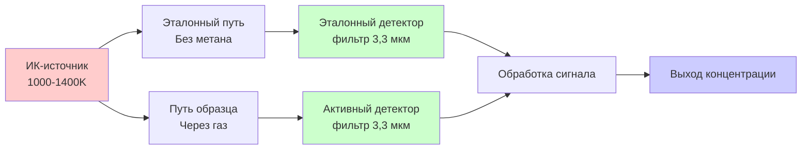
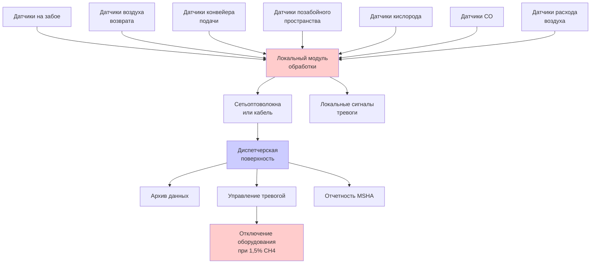

Системы мониторинга метана обеспечивают непрерывное наблюдение за атмосферой в подземных угольных шахтах, обнаруживая опасные накопления газа до достижения взрывоопасных концентраций. Эти системы объединяют технологии датчиков, сети передачи данных и автоматические системы управления для срабатывания сигналов тревоги и защитного отключения согласно нормативным требованиям MSHA, представляя последний защитный барьер, предотвращающий взрывы метана.

## Основы технологии обнаружения

Датчики метана используют отличительные физические или химические свойства молекул CH₄ для генерирования электрических сигналов, зависящих от концентрации. Каждая технология предоставляет специфические преимущества для различных приложений мониторинга.

### Каталитические датчики

Датчики каталитического сгорания доминируют в приложениях подземных угольных шахт благодаря надежности, точности и нормативному одобрению. Датчик содержит два элемента сопротивления из платины, встроенных в керамические шарики:

**Активный шарик**: Покрыт каталитическим материалом (платина, палладий), способствующим окислению метана при температурах ниже температуры самовоспламенения открытого пламени (обычно 450-550°C). Когда метан контактирует с нагретым катализатором:

$$\text{CH}_4 + 2\text{O}_2 \xrightarrow{\text{катализатор}} \text{CO}_2 + 2\text{H}_2\text{O} + 891 \text{ кДж/моль}$$

Тепло сгорания повышает температуру активного шарика пропорционально концентрации метана, увеличивая электрическое сопротивление.

**Эталонный шарик**: Инертное покрытие предотвращает окисление метана, одновременно реагируя идентично на изменения температуры окружающей среды, давления и влажности.

Датчик работает в мостовой цепи Уитстона, где дисбаланс сопротивления генерирует выходное напряжение:

$$V_{\text{вых}} = V_{\text{питание}} \times \frac{R_{\text{актив}} - R_{\text{эталон}}}{R_{\text{актив}} + R_{\text{эталон}} + 2R_{\text{неизм}}}$$

Это дифференциальное измерение компенсирует влияние окружающей среды, обеспечивая точное определение концентрации метана от 0 до 5,0% с абсолютной точностью ±0,1%.

**Характеристики работы**

| Параметр | Спецификация | Примечания |
|----------|--------------|-----------|
| Диапазон измерения | 0-5,0% CH₄ | Охватывает 0-100% НПВ |
| Разрешение | 0,01% CH₄ | Приращения 0,2% НПВ |
| Время отклика (T₉₀) | 10-30 секунд | Время достижения 90% конечного значения |
| Рабочая температура | -20°C до +50°C | Стандартная среда шахты |
| Время прогрева | 30-60 секунд | Требуется после включения питания |
| Требование по кислороду | >10% O₂ | Процесс сгорания требует кислорода |
| Интервал калибровки | 31 день | MSHA 30 CFR 75.342(a)(4) |
| Ожидаемый срок службы | 2-3 года | Деградация катализатора ограничивает период |

**Механизмы отравления датчика**

Каталитические датчики деградируют при воздействии ядов, подавляющих каталитическую активность:

- **Кремниевые соединения**: Из силиконовых герметиков, гидравлических жидкостей—образуют барьер SiO₂ над катализатором
- **Сернистые соединения**: Из H₂S, образующегося при окислении угля—адсорбируются на платиновых центрах
- **Тетраэтилсвинец**: Из устаревшего бензинового оборудования—осаждает металлический свинец
- **Хлорированные растворители**: Обезжиривающие средства, чистящие вещества—хлор блокирует активные центры

Отравление создает отрицательный дрейф (показания заниженные), создавая опасное ложное состояние безопасности. MSHA требует ежемесячной проверки калибровки для обнаружения ошибок, вызванных ядом, прежде чем произойдет критическая потеря точности.

### Инфракрасные абсорбционные датчики

Неразложные инфракрасные датчики (NDIR) измеряют концентрацию метана на основе молекулярного поглощения на характеристических длинах волн. Метан демонстрирует сильное поглощение на 3,3 мкм, соответствующее колебаниям растяжения связи C-H.

**Оптическая конфигурация**

Закон Бугера-Ламберта регулирует поглощение:

$$I = I_0 \times e^{-\alpha \times L \times C}$$

Где:
- $I$ = Переданная интенсивность
- $I_0$ = Начальная интенсивность
- $\alpha$ = Коэффициент поглощения (3,3 мкм для CH₄)
- $L$ = Длина оптического пути (обычно 10-50 мм)
- $C$ = Концентрация метана

Электроника датчика вычисляет концентрацию из соотношения интенсивностей:

$$C = \frac{1}{\alpha \times L} \times \ln\left(\frac{I_{\text{эталон}}}{I_{\text{образец}}}\right)$$

**Преимущества перед каталитическими датчиками**

- **Независимость от кислорода**: Оптическое измерение работает в атмосфере с дефицитом кислорода
- **Отсутствие отравления катализатора**: Невосприимчивость к химическим ядам, влияющим на каталитические шарики
- **Широкий диапазон измерения**: Один датчик измеряет от 0 до 100% CH₄
- **Более быстрый отклик**: T₉₀ обычно 1-5 секунд по сравнению с 10-30 секундами
- **Более длительный срок службы**: 5-7 лет по сравнению с 2-3 годами для каталитических
- **Внутренняя безопасность**: Отсутствие нагреваемого элемента, требующего взрывозащиты

**Ограничения**

- **Более высокая стоимость**: В 2-3 раза дороже каталитических датчиков
- **Загрязнение оптики**: Пыль на окнах требует очистки
- **Чувствительность к температуре**: Требует термической стабилизации или компенсации
- **Одобрение MSHA**: Ограниченное количество моделей, одобренных для подземного угля

Датчики NDIR все чаще развертываются в металлических/неметаллических шахтах и поверхностном мониторинге, с расширяющимся внедрением в угольных шахтах по мере увеличения одобрений MSHA.

### Датчики теплопроводности

Обнаружение по теплопроводности использует теплопроводность метана (0,034 Вт/м·K при 25°C), значительно отличающуюся от воздуха (0,026 Вт/м·K). Нагреваемый элемент теряет тепло со скоростями, зависящими от состава окружающего газа.

Датчик поддерживает постоянную температуру элемента через обратную связь управления, причем требуемая мощность пропорциональна теплопроводности:

$$q = k \times A \times \frac{\Delta T}{L}$$

Где:
- $q$ = Скорость теплопередачи (пропорциональна мощности)
- $k$ = Теплопроводность газовой смеси
- $A$ = Площадь поверхности элемента
- $\Delta T$ = Разность температур
- $L$ = Характеристическая длина

Концентрации метана от 0 до 100% вызывают измеримые изменения мощности. Однако датчики теплопроводности находят ограниченное применение в шахтах из-за плохой чувствительности при низких концентрациях (<5% CH₄), кросс-чувствительности к другим газам и худших характеристик по сравнению с каталитическими и ИК-технологиями.

## Системы непрерывного мониторинга атмосферы (CAMS)

MSHA 30 CFR 75.351 требует наличия систем непрерывного мониторинга атмосферы (CAMS) на всех механизированных горнодобывающих установках в подземных угольных шахтах. CAMS интегрирует несколько датчиков с получением данных, генерированием сигналов тревоги и функциями автоматического управления.

### Архитектура системы

**Сетевая коммуникация**

Современные CAMS используют внутренне безопасные цифровые сети, устойчивые к электрическому зажиганию:

- **Оптоволокно**: Внутренне безопасно, невосприимчиво к электромагнитным помехам, высокая полоса пропускания для видеоинтеграции
- **Токовая петля (4-20 мА)**: Традиционный стандарт, простой, но ограниченная пропускная способность
- **Цифровая полевая шина**: Протоколы MODBUS, DeviceNet, позволяющие многодатчиковое взаимодействие на одном кабеле

Частота передачи 1-10 Гц обеспечивает мониторинг в реальном времени, в то время как хранение данных сохраняет 60-дневные записи согласно требованиям MSHA.

### Стандарты размещения датчиков

MSHA 30 CFR 75.342 указывает местоположение датчиков метана, обеспечивающее обнаружение до возникновения опасных накоплений:

**Требования для забоя**

| Оборудование | Местоположение датчика | Действия по уставкам |
|-------------|----------------------|---------------------|
| Комбайн непрерывного действия | На комбайне или каске оператора | 1,0% сигнал тревоги, 1,5% отключение |
| Лавный струг | На конвейере лавы в 18 м от забоя | 1,0% сигнал тревоги, 1,5% отключение |
| Головка лавы | 30 см от кровли, подветренно от забоя | 1,0% сигнал тревоги, 2,0% отключение |
| Машины резки | На машине или 30 см от кровли | 1,0% сигнал тревоги, 1,5% отключение |
| Машины погрузки | 30 см от кровли, 18 м от забоя | 1,0% сигнал тревоги, 1,5% отключение |

**Мониторинг воздуха возврата**

- Последний открытый щелик: 30 см от кровли в воздухозаборе возврата
- Извлечение целиков: Подветренно от линии отступления
- Хвостовая часть конвейера: У точки разгрузки привода конвейера
- Точки оценки вспомогательного канала: Несколько местоположений согласно утвержденному плану вентиляции

**Детали установки**

Датчики монтируются в пределах 30 см от кровли шахты, где метан накапливается (плотность 0,554 кг/м³ при нормальных условиях по сравнению с 1,225 кг/м³ для воздуха). Однако датчики у кровли требуют учета воздушных потоков—вентиляция должна обтекать место установки датчика для обеспечения репрезентативного отбора пробы.

В многоветвевых выработках датчики размещаются в секции с наивысшей концентрацией. Зоны выхода вспомогательного вентиляционного канала могут создавать локальное разбавление, требующее размещения датчика за пределами зоны смешивания для измерения фактических концентраций возврата.

## Философия пороговых значений тревоги

MSHA устанавливает многоуровневые пороги тревоги, предоставляющие постепенные предупреждения до достижения взрывоопасных атмосфер.

### Структура нормативных порогов

| Концентрация | Уровень тревоги | Требуемые действия | Нормативное основание |
|--------------|-----------------|-------------------|----------------------|
| 1,0% CH₄ | Предупреждение | Увеличить вентиляцию, исследовать источник | 30 CFR 75.323(b) |
| 1,5% CH₄ | Высокая тревога | Отключить оборудование, вывести персонал | 30 CFR 75.323(c)(1) |
| 2,0% CH₄ | Критическая | Эвакуировать зону, запретить доступ | 30 CFR 75.323(c)(2) |
| 5,0% CH₄ | НПВ | Нижний предел взрывоопасности—эвакуация завершена | Превышен запас прочности |

**Анализ коэффициента безопасности**

Предел нормальной работы в 1,0% обеспечивает 5-кратный запас прочности ниже 5,0% НПВ. Этот запас учитывает:

- Точность датчика: ±0,1-0,2% абсолютной ошибки
- Пространственные вариации: Локальные накопления между точками датчиков
- Задержка времени отклика: 10-30 секунд задержка датчика плюс 5-15 секунд обработки тревоги
- Колебания вентиляции: Временные снижения потока от открытия дверей, движения оборудования
- Неэффективность смешивания: Неполное разбавление в зонах с низкой скоростью

Консервативные уставки предотвращают превышение концентрации в опасном диапазоне при нормальных операциях добычи.

**Бюджет времени отклика сигнала тревоги**

Общее время от выделения метана до защитного действия:

$$t_{\text{итого}} = t_{\text{транспорт}} + t_{\text{датчик}} + t_{\text{обработка}} + t_{\text{действие}}$$

Пример анализа для датчика на забое:
- Время транспорта (газ достигает датчика): 5-20 секунд в зависимости от скорости воздуха
- Отклик датчика (T₉₀): 10-30 секунд для каталитического
- Обработка и тревога: 2-5 секунд
- Отключение оборудования: 1-3 секунды срабатывания реле

Итого: 18-58 секунд от выделения до отключения

В течение этого интервала метан продолжает выделяться. Если скорость выделения 7 м³/ч и приточный расход на забое 6 м³/с, концентрация увеличивается на 0,09%/минуту. Бюджет отклика тревоги обеспечивает, что концентрация остается значительно ниже 5% НПВ даже при высокоинтенсивных кратковременных выделениях.

## Калибровка и техническое обслуживание

Точность датчика деградирует со временем, требуя периодической проверки калибровки и регулировки.

### Требования MSHA к калибровке

**30 CFR 75.342(a)(4)**: Датчики метана должны калибраться с известной смесью метан-воздух с интервалами не превышающими 31 день и в течение 31 дня перед установкой в эксплуатацию.

**Процедура калибровки**

1. Подать нулевой воздух (азот или воздух без метана)—проверить показание 0,0% ±0,1%
2. Подать градуировочный газ (2,5% CH₄ сертифицированная смесь)—проверить точность ±0,1% абсолютной
3. Если показания превышают допуск, отрегулировать согласно инструкции производителя
4. Подать градуировочный газ снова—подтвердить успешность регулировки
5. Задокументировать калибровку: дата, серийный номер, партия газа, технический специалист, результаты

**Рассмотрение градуировочного газа**

Калибровочный газ с сертификацией NIST обеспечивает точность:
- Типовая градуировка: 2,5% CH₄ в воздухе (50% НПВ)
- Точность сертификата: ±2% от указанного значения
- Срок хранения: 12-24 месяца в алюминиевых баллонах
- Хранение: Защита от температурных экстремумов, физических повреждений

Состав балансировочного газа имеет значение—азотная балансировка отличается от воздушной по содержанию кислорода, влияя на отклик каталитического датчика. Предпочтительна воздушная балансировка для приложений в угольных шахтах.

### Техническое обслуживание в полевых условиях

**Еженедельный осмотр**
- Визуальное обследование: Повреждения, загрязнения, надежное крепление
- Функциональный тест: Подать градуировочный газ, проверить срабатывание сигнала тревоги
- Просмотр данных: Проверить записанные концентрации на аномалии

**Ежемесячная калибровка**
- Полная калибровка согласно требованиям MSHA
- Замена датчика, если регулировка превышает ±0,3% или не может обеспечить точность
- Тест резервного питания системы

**Профилактическое обслуживание**
- Замена датчика: 2-3 года для каталитических, 5-7 лет для инфракрасных
- Замена фильтра: Каждые 3-6 месяцев в условиях пыли
- Ежегодный тест целостности сети: Проверить все сетевые соединения датчиков

Шахты поддерживают запас градуировочного газа, запасные датчики и специализированное испытательное оборудование для обеспечения непрерывной работы CAMS без прерывания производства.

## Интеграция с системами управления шахтой

Продвинутые CAMS интегрируются с более широкими системами автоматизации и безопасности шахты.

**Автоматическое управление оборудованием**

Когда датчики обнаруживают 1,5% CH₄:
- Программируемые логические контроллеры (PLC) получают сигнал датчика
- Логика управления проверяет устойчивое превышение (обычно 3-5 секунд для предотвращения ложных срабатываний)
- Выходные реле размыкаются, отключая питание от непозволительного оборудования
- Позволительное (взрывозащищенное) оборудование может продолжать работу
- Визуальные/звуковые сигналы тревоги активируются по всей затронутой зоне

**Интеграция вентиляции по требованию (VOD)**

Современные шахты объединяют мониторинг метана с автоматизированным управлением вентиляцией:
- Датчики непрерывно передают данные контроллеру VOD
- Если концентрации растут (например, 0,3% → 0,6% → 0,9%), система увеличивает скорость вспомогательного вентилятора или открывает вентиляционные заслонки
- Упреждающая регулировка вентиляции предотвращает условия срабатывания тревоги
- Экономия энергии (20-40% снижение мощности вентилятора) достигается согласованием расхода воздуха с реальными потребностями

**Аналитика данных**

Исторические данные датчиков позволяют прогностический анализ:
- Корреляция с темпом продвижения добычи определяет зоны с высокими выделениями
- Влияние барометрического давления определено количественно (снижение давления увеличивает выделения)
- Эффективность вентиляции рассчитана из соотношений выделение/концентрация
- Алгоритмы обнаружения аномалий выявляют необычные закономерности для исследования

Модели машинного обучения прогнозируют выделение метана во время будущей добычи на основе геологических признаков, геометрии добычи и исторических профилей выделения, позволяя преднамеренное планирование вентиляции.

## Развивающиеся технологии

Технологии мониторинга метана нового поколения выходят за пределы текущих одобренных системам MSHA.

**Лазерное обнаружение**

Спектроскопия поглощения перестраиваемого диодного лазера (TDLAS) использует перестраиваемые по длине волны полупроводниковые лазеры, сканирующие специфические линии поглощения метана. Преимущества включают:
- Дистанционное зондирование: Мониторинг в открытом пути по воздухозаборам без контакта датчика
- Ультрабыстрый отклик: <1 секунда обнаружения
- Высокая селективность: Минимальная кросс-чувствительность к другим газам
- 3D-картирование: Несколько лучей создают пространственные профили концентрации

Текущие ограничения включают высокую стоимость ($20000-$55000 за единицу) и ограниченные одобрения MSHA, но технология видит расширяющееся развертывание в исследовательских и опытно-конструкторских шахтах.

**Беспроводные сети датчиков**

Внутренне безопасная беспроводная коммуникация (900 МГц, 2,4 ГГц диапазоны) обеспечивает быстрое развертывание датчиков без кабельной установки. Топология ячеистой сети обеспечивает избыточность—данные датчика маршрутизируются несколькими путями на поверхность. Работающие на батареях узлы функционируют 1-3 года между заменами.

Процесс одобрения MSHA для беспроводных систем адресует уникальные вызовы: электромагнитные помехи, кибербезопасность и обеспечение внутренней безопасности с передатчиками РЧ во взрывоопасных атмосферах.

**Распределенное волоконно-оптическое зондирование**

Волоконно-оптические кабели используются как датчики для обнаружения метана через спектроскопию рассеяния Рамана. Один кабель волокна обеспечивает непрерывное зондирование по всей длине (1-10 км), создавая тысячи виртуальных точек датчика с интервалом 1 метр. Приложения включают мониторинг периметров запечатанных зон и обнаружение утечек через вентиляционные перемычки.

## Заключение

Системы мониторинга метана представляют критическую инфраструктуру безопасности, предотвращающую взрывы в подземных угольных шахтах. Каталитические датчики обеспечивают надежное, одобренное MSHA обнаружение, в то время как инфракрасные и развивающиеся технологии предлагают улучшенные возможности. Надлежащее размещение датчика согласно MSHA 30 CFR 75.342, консервативные пороги тревоги, строгая калибровка и интеграция с автоматическими системами управления обеспечивают, что опасные накопления метана срабатывают защитные действия до приближения к взрывоопасным атмосферам. По мере развития технологии мониторинга подземная угольная добыча движется к комплексному осведомлению об атмосфере, обеспечивающему как улучшенную безопасность, так и оптимизированную энергоэффективность вентиляции.
