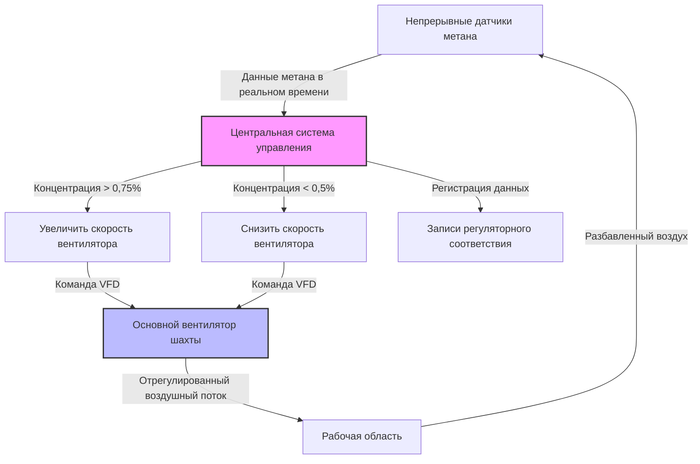

## Основная физика разбавления

Контроль метана посредством вентиляции основывается на принципе массового баланса, при котором свежий воздух непрерывно разбавляет выделяемый метан до концентраций ниже взрывоопасного диапазона (5-15% по объёму). Эффективность разбавления зависит от объёма воздушного потока, скорости выделения метана и эффективности смешивания в рабочей области.

Основное уравнение разбавления устанавливает взаимосвязь между концентрацией метана и вентиляцией:

$$C_{CH_4} = \frac{Q_{CH_4}}{Q_{air} + Q_{CH_4}} \times 100\%$$

Где:
- $C_{CH_4}$ = концентрация метана (%)
- $Q_{CH_4}$ = скорость выделения метана (м³/ч)
- $Q_{air}$ = объём вентиляционного воздуха (м³/ч)

Для практических приложений, где $Q_{CH_4} \ll Q_{air}$, это упрощается до:

$$Q_{air} = \frac{Q_{CH_4}}{C_{CH_4}} \times 100$$

Нормативные требования MSHA согласно 30 CFR 75.325 устанавливают, что концентрация метана должна оставаться ниже 1,0% в рабочих областях и ниже 2,0% в возвратных выработках, определяя проектные целевые показатели с существенными запасами безопасности ниже нижнего предела взрывоопасности.

## Нормативные минимальные объёмы воздуха

30 CFR Part 75 устанавливает нормативные минимальные объёмы вентиляции независимо от рассчитанных требований разбавления:

| Местоположение | Минимальный объём воздуха | Нормативная ссылка |
|----------|---------------------|---------------------|
| Рабочий забой (механизированный) | 425 м³/ч | 30 CFR 75.325(a)(1) |
| Рабочий забой (немеханизированный) | 142 м³/ч | 30 CFR 75.325(a)(2) |
| Ленточные выработки с горючей лентой | 0,25 м/с скорость | 30 CFR 75.350(b) |
| Области извлечения подпорных столбов | 425 м³/ч минимум | 30 CFR 75.325(a)(1) |

Эти минимальные значения представляют базовые требования; фактическая вентиляция должна обеспечивать большее из двух значений: нормативный минимум или рассчитанное требование разбавления на основе выделения метана.

## Прогнозирование выделения метана

Точное прогнозирование скоростей выделения метана определяет проектирование системы вентиляции. Скорость выделения объединяет вклады из нескольких источников:

$$Q_{CH_4,total} = Q_{face} + Q_{floor} + Q_{roof} + Q_{gob}$$

### Выделение метана на забое

Прямое выделение во время выемки следует эмпирической зависимости:

$$Q_{face} = k \times P \times \rho_{coal} \times m$$

Где:
- $k$ = коэффициент содержания метана (м³/т)
- $P$ = объём добычи (т/ч)
- $\rho_{coal}$ = плотность угля (типично 1,3-1,4 г/см³)
- $m$ = высота выемки (м)

### Десорбция с зависимостью от времени

Открытые поверхности демонстрируют убывающее выделение согласно кинетике первого порядка:

$$Q(t) = Q_0 \times e^{-\lambda t}$$

Где $\lambda$ представляет константу скорости десорбции (типично 0,1-0,5 ч⁻¹), зависящую от ранга угля, содержания газа и проницаемости трещин.

## Системы переменного объёма воздуха

Современные эксплуатируемые в условиях метана шахты внедряют управление переменным объёмом воздуха (VAV) для согласования подачи вентиляции с динамическими закономерностями выделения метана:

Системы VAV обеспечивают несколько преимуществ при эксплуатации:

- **Энергоэффективность**: Потребление энергии вентилятора масштабируется с кубом воздушного потока ($P \propto Q^3$)
- **Продлённый срок службы оборудования**: Сокращённые часы работы на максимальной мощности
- **Улучшенные условия на забое**: Минимизация чрезмерной вентиляции в периоды низкой добычи
- **Динамический отклик**: Автоматическая регулировка при внезапных событиях выделения метана

## Проектирование системы выветривания

Системы выветривания вентилируют заброшенные области (выработанное пространство), где продолжается выделение метана из разломанного перекрытия. Объём воздуха выветривания должен поддерживать концентрацию метана ниже 2,0% согласно 30 CFR 75.334:

$$Q_{bleeder} = \frac{Q_{gob,emission}}{0.02} \times 1.2$$

Коэффициент безопасности 1,2 учитывает неравномерное смешивание и неопределённость измерения. Скорости выделения газа из выработанного пространства обычно экспоненциально снижаются со временем, но могут сохраняться в течение лет:

$$Q_{gob}(t) = Q_{initial} \times e^{-t/\tau}$$

Где $\tau$ представляет характеристическое время затухания (типично 6-24 месяца в зависимости от проницаемости перекрытия и колебаний атмосферного давления).

### Типы конфигурации выветривания

| Конфигурация | Применение | Преимущества | Ограничения |
|--------------|-------------|------------|-------------|
| Прямое выветривание | Панели с одной выработкой | Простая разработка | Ограниченное распределение воздуха |
| Выветривание между панелями | Множественные смежные панели | Общие выветривающие выработки | Сложная балансировка воздуха |
| Напорное выветривание | Глубокое залегание, высокое выделение газа | Управление положительным давлением в выработанном пространстве | Более высокое потребление энергии |

## Механика вентиляции выработанного пространства

Движение воздуха через материал выработанного пространства следует неламинарному потоку из-за высокой проницаемости:

$$\Delta P = \alpha Q + \beta Q^2$$

Где $\alpha$ представляет вязкое сопротивление, а $\beta$ представляет инерционное сопротивление. Квадратичный член доминирует при типичных скоростях вентиляции через разломанную породу.

Эффективная проницаемость выработанного пространства колеблется от 10 до 100 дарси, что на порядки выше, чем в целостных угольных пластах, но пути потока остаются сильно извилистыми и подвержены прогрессирующему уплотнению по мере оседания перекрытия.

### Эффекты барометрического дыхания

Изменения атмосферного давления индуцируют переходное выделение газа из выработанного пространства независимо от вентиляции:

$$\frac{dQ_{CH_4}}{dt} = -V_{gob} \times \frac{C_{CH_4}}{P_{atm}} \times \frac{dP_{atm}}{dt}$$

Падение атмосферного давления (типично 1,3-4,0 кПа в течение 12-24 часов) может временно увеличить выделение метана на 20-40%, требуя резервов мощности системы вентиляции для приспособления к этим событиям.

## Пример расчёта объёма воздуха

Для лавы, производящей 800 т/ч с измеренным содержанием метана 250 м³/т:

**Скорость выделения метана:**
$$Q_{CH_4} = 800 \text{ т/ч} \times 250 \text{ м³/т} = 200,000 \text{ м³/ч} = 200,000 \text{ м³/ч}$$

**Требуемая вентиляция (целевое значение 1,0%):**
$$Q_{air} = \frac{200,000}{0.01} = 20,000,000 \text{ м³/ч}$$

**С запасом 25%:**
$$Q_{design} = 20,000,000 \times 1.25 = 25,000,000 \text{ м³/ч}$$

Это значительно превышает нормативный минимум 425 м³/ч, что демонстрирует, что выделение метана определяет проектирование в условиях с высоким содержанием газа.

## Компоненты

- [Вентиляция разбавления метана](methane-dilution-ventilation/)
- [Расчёт минимального количества воздуха](minimum-air-quantity-calculation/)
- [Объём воздуха на тонну угля](cfm-per-ton-of-coal/)
- [Нормативные требования к вентиляции](regulatory-requirements-ventilation/)
