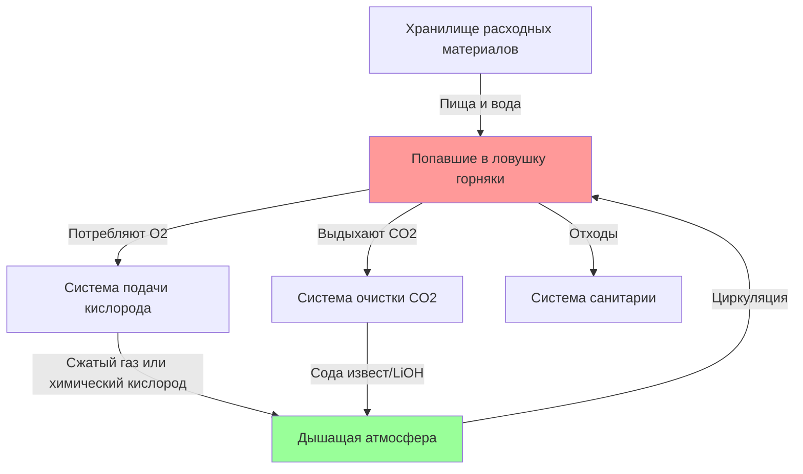
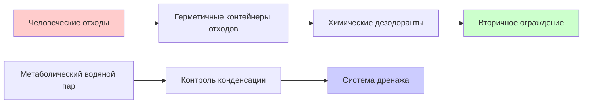

## Мандат закона MINER на 96 часов

Закон о совершенствовании шахт и новом реагировании на чрезвычайные ситуации (MINER) от 2006 года установил требование о минимальной продолжительности выживания в течение 96 часов для подземных камер спасения угольных шахт после катастрофы на шахте Sago. Этот федеральный мандат согласно 30 CFR 7.503 требует, чтобы камеры спасения обеспечивали выживание попавших в ловушку горняков в течение минимум 96 часов (4 дня) с адекватным кислородом, удалением CO2, продовольствием, водой и санитарными удобствами.

Период в 96 часов представляет статистическое окно, в течение которого операции по спасению можно разумно ожидать достичь попавших в ловушку горняков на основе исторических данных о чрезвычайных ситуациях в шахтах. Эта продолжительность обеспечивает критический запас безопасности сверх типичного времени реагирования на спасение в 24-48 часов.

## Расчеты метаболического газообмена

### Скорость потребления кислорода

Потребление кислорода человеком в условиях малоподвижности в камере спасения следует предсказуемым метаболическим закономерностям. Базальная скорость метаболизма для отдыхающего взрослого человека в условиях замкнутого пространства составляет:

$$\dot{V}_{O_2} = 0,25 \text{ л/мин} = 15 \text{ л/ч} = 360 \text{ л/день на человека}$$

За весь период 96 часов на человека:

$$V_{O_2,total} = 360 \frac{\text{л}}{\text{день}} \times 4 \text{ дня} = 1440 \text{ л} = 1,44 \text{ м}^3$$

Преобразование в массу при стандартных условиях (STP: 0°C, 1 атм):

$$m_{O_2} = \frac{V \times M}{V_m} = \frac{1440 \text{ л} \times 32 \text{ г/моль}}{22,4 \text{ л/моль}} = 2057 \text{ г} = 2,06 \text{ кг на человека}$$

При типичных условиях в камере спасения (25°C, 1 атм) требуемый объем кислорода увеличивается:

$$V_{25°C} = V_{STP} \times \frac{T_{25°C}}{T_{STP}} = 1440 \text{ л} \times \frac{298 \text{ K}}{273 \text{ K}} = 1572 \text{ л на человека}$$

### Скорость генерации углекислого газа

Дыхательный коэффициент (RQ) для типичного смешанного метаболизма составляет примерно 0,85, что означает, что производство CO2 составляет 85% от потребления O2 по объему:

$$\dot{V}_{CO_2} = 0,85 \times \dot{V}_{O_2} = 0,85 \times 15 \text{ л/ч} = 12,75 \text{ л/ч на человека}$$

Общее производство CO2 в течение 96 часов:

$$V_{CO_2,total} = 12,75 \frac{\text{л}}{\text{ч}} \times 96 \text{ ч} = 1224 \text{ л} = 1,22 \text{ м}^3 \text{ на человека}$$

Преобразование в массу:

$$m_{CO_2} = \frac{1224 \text{ л} \times 44 \text{ г/моль}}{22,4 \text{ л/моль}} = 2404 \text{ г} = 2,40 \text{ кг на человека}$$

Этот CO2 должен непрерывно удаляться для поддержания концентрации атмосферного CO2 ниже 0,5% (5000 ppm) согласно стандартам MSHA.

## Определение размеров системы жизнеобеспечения

### Требования к подаче кислорода

Для типичной камеры спасения вместимостью 15 человек общие требования кислорода:

$$V_{O_2,chamber} = 1572 \text{ л/человека} \times 15 \text{ человек} = 23580 \text{ л} = 23,6 \text{ м}^3$$

При хранении в сжатом газе при давлении 1034 бара (150 бар):

$$V_{compressed} = \frac{V_{atm} \times P_{atm}}{P_{storage}} = \frac{23580 \text{ л} \times 1 \text{ бар}}{150 \text{ бар}} = 157 \text{ л}$$

Системы химического получения кислорода (свечи хлората натрия или супероксид калия) предоставляют альтернативные источники кислорода с типичными емкостями 600-800 л на килограмм реагента.

### Емкость очистки CO2

Сода известь (смесь Ca(OH)2 и NaOH) удаляет CO2 посредством экзотермической реакции:

$$\text{CO}_2 + 2\text{NaOH} \rightarrow \text{Na}_2\text{CO}_3 + \text{H}_2\text{O} + 41,4 \text{ кДж/моль}$$

Теоретическая емкость очистки: 1 кг соды известь поглощает примерно 0,30 кг CO2.

Для 15 человек в течение 96 часов:

$$m_{CO_2,total} = 2,40 \text{ кг/человека} \times 15 \text{ человек} = 36 \text{ кг}$$

Требуемая масса соды извести:

$$m_{scrubber} = \frac{36 \text{ кг}}{0,30} = 120 \text{ кг}$$

С коэффициентом безопасности 25%: минимум 150 кг.

## Требования к хранилищу расходных материалов

| Ресурс | На человека (96 ч) | Камера 15 человек | Соображения хранения |
|--------|-------------------|-------------------|----------------------|
| **Вода** | 8 л (2 л/день × 4 дня) | 120 л | Герметичные контейнеры, питьевого качества |
| **Пища** | 8000 ккал (2000 ккал/день × 4 дня) | 120000 ккал | Батончики высокой плотности, срок хранения 3 года |
| **Кислород** | 1572 л (при 25°C, 1 атм) | 23580 л | Сжатое или химическое получение |
| **Скруббер CO2** | 10 кг соды известь | 150 кг | Герметичные контейнеры, защита от влаги |

### Требования к воде

Минимальное потребление воды учитывает:
- Метаболическая потребность в воде: 1,5 л/день
- Потеря воды при дыхании: 0,4 л/день
- Неощутимая перспирация: 0,5 л/day

Итого: минимум 2 л/день, при 7,6 л/day обеспечивается комфортный уровень гидратации.

### Требования к пищевой энергии

Базальная скорость метаболизма для малоподвижных взрослых в условиях замкнутого пространства:

$$BMR = 1500-1800 \text{ ккал/день}$$

При факторах стресса (психологический стресс, холодное воздействие) дневная потребность увеличивается до минимум 2000 ккал/день. Батончики высокой плотности для чрезвычайных ситуаций (400-500 ккал на батончик) обеспечивают компактные решения для хранения.

## Системы управления отходами

Скорость образования отходов на человека в течение 96 часов:
- Твердые отходы: 600-800 г/день × 4 дня = 2,4-3,2 кг
- Жидкие отходы: 1,2-1,5 л/день × 4 дня = 4,8-6,0 л

Для 15 человек: 36-48 кг твердых отходов, 72-90 л жидких отходов.

Портативные системы химических туалетов с герметичными контейнерами и ферментативными или химическими дезодорантами (гипохлорит кальция, агенты без формальдегида) поддерживают санитарные условия. Вторичное ограждение предотвращает загрязнение атмосферы камеры спасения.

## Требования к мониторингу атмосферы

Непрерывный мониторинг поддерживает условия выживания:

| Параметр | Лимит MSHA | Частота мониторинга |
|----------|------------|----------------------|
| Кислород (O2) | >19,5% | Непрерывно |
| Углекислый газ (CO2) | <0,5% (5000 ppm) | Непрерывно |
| Оксид углерода (CO) | <50 ppm | Непрерывно |
| Температура | 10-35°C | Каждые 15 мин |
| Влажность | 30-70% ОВ | Каждые 30 мин |

Превышение порогов CO2 быстро ухудшает когнитивные функции и эффективность дыхания. Связь между концентрацией CO2 и физиологическими эффектами:

- 0,5% (5000 ppm): Максимум MSHA, повышенное дыхание
- 1,0% (10000 ppm): Сонливость, нарушенное принятие решений
- 3,0% (30000 ppm): Учащенное дыхание, головная боль, спутанность сознания
- 5,0% (50000 ppm): Быстрая потеря сознания

## Соображения запаса безопасности

Нормативы MSHA требуют, чтобы камеры спасения поддерживали емкость с запасом безопасности 25% выше заявленной занятости. Для камеры 15 человек расходные материалы должны поддерживать 19 человек в течение 96 часов или 15 человек в течение 120 часов.

Этот запас учитывает:
- Индивидуальные различия в метаболизме (±15%)
- Факторы окружающей среды, повышающие потребление
- Потенциальное ухудшение качества расходных материалов при хранении
- Продленные операции спасения сверх 96 часов

## Проверочное тестирование

Камеры спасения проходят сертификационное тестирование согласно 30 CFR Часть 7, Подраздел L, включая:
1. Тестирование продолжительности 96 часов с имитацией занятости
2. Поддержание концентрации кислорода >19,5%
3. Поддержание концентрации CO2 <0,5%
4. Проверка контроля температуры и влажности
5. Подтверждение инвентаризации расходных материалов

Тестирование проводится на одобренных MSHA объектах с непрерывным мониторингом атмосферы и документированным соответствием всем параметрам жизнеобеспечения в течение полного периода 96 часов.
