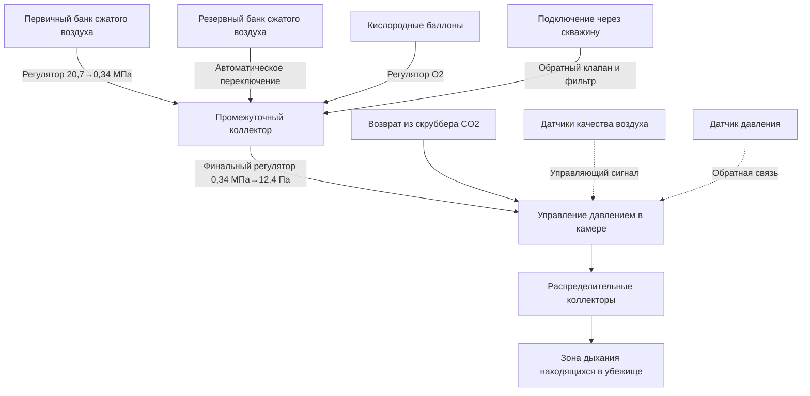

## Подача воздуха в убежища горных рудников

Убежища горных рудников требуют надежных, резервных систем подачи воздуха, которые поддерживают дышащую атмосферу и избыточное давление для номинальной емкости в течение минимум 96 часов согласно нормативам MSHA (30 CFR 7.504). Система подачи воздуха выполняет три критические функции: обеспечение кислородом для дыхания, разбавление диоксида углерода и метаболических загрязнителей, поддержание избыточного давления для предотвращения проникновения токсичной атмосферы рудника.

## Требования к кислородному снабжению

Минимальное количество кислорода должно учитывать скорость метаболического потребления в условиях стресса. MSHA требует 64 литра на человека в час при стандартных условиях (30 CFR 7.504), что соответствует приблизительно 0,064 м³ на человека в час.

Общее требование кислорода описывается следующим образом:

$$V_{O_2} = n \cdot Q_{met} \cdot t \cdot SF$$

Где:
- $V_{O_2}$ = общий объем кислорода (м³ при STP)
- $n$ = количество находящихся в убежище людей
- $Q_{met}$ = скорость потребления кислорода при метаболизме (0,064 м³/человека·ч)
- $t$ = номинальная продолжительность (96 ч минимум)
- $SF$ = коэффициент безопасности (обычно 1,25)

Для убежища на 15 человек с рассчитанной на 96 часов вместимостью:

$$V_{O_2} = 15 \times 0,064 \times 96 \times 1,25 = 115 \text{ м}^3$$

## Основные системы подачи воздуха

### Сжатый дыхательный воздух

Системы сжатого дыхательного воздуха накапливают атмосферный воздух под высоким давлением (обычно 15,3–41,4 МПа) в композитных или стальных баллонах. Накопленный воздух должен соответствовать спецификациям дыхательного воздуха Grade D согласно CGA G-7.1.

Преимущество массового накопления следует из закона идеального газа при повышенном давлении:

$$m = \frac{PV}{RT}$$

При давлении 20,7 МПа в сравнении с атмосферным давлением коэффициент плотности составляет приблизительно 204:1, что позволяет компактное накопление больших объемов воздуха. Батарея из шести баллонов объемом 8,5 м³ (водяная емкость) при 20,7 МПа обеспечивает приблизительно 1,733 м³ воздуха при атмосферном давлении.

Снижение давления происходит через многоступенчатые регуляторы, которые понижают давление от давления накопления до давления подачи в камеру (обычно 12,4–49,7 Па избыточного давления).

### Системы кислородных баллонов

Медицинские кислородные баллоны (чистота не менее 99,5%) обеспечивают концентрированный кислород для метаболических потребностей. Давления накопления составляют 15,3–16,5 МПа в баллонах, одобренных DOT.

Система распределения кислорода включает:
- Первичный банк регуляторов, понижающий давление накопления до промежуточного давления
- Вторичные регуляторы, контролирующие расход
- Датчики кислорода, инициирующие автоматическую подачу макияжного потока
- Возможность ручного переопределения

### Подача воздуха через скважину

Подключение через скважину обеспечивает непрерывную подачу свежего воздуха с поверхности или из незагрязненных участков рудника. Система требует:

**Расчет диаметра скважины:**

$$D = \sqrt{\frac{4Q}{\pi v}}$$

Где:
- $D$ = минимальный диаметр скважины
- $Q$ = требуемый расход (м³/ч)
- $v$ = допустимая скорость воздуха (обычно 2,5–5,1 м/с)

Для подачи 254 м³/ч при скорости 4,1 м/с:

$$D = \sqrt{\frac{4 \times 254}{\pi \times 4,1}} = 0,15 \text{ м} = 15 \text{ см}$$

Системы через скважину включают обратные клапаны, искрогасители и возможность изоляции для предотвращения загрязнения при пожарах или событиях газовой инфильтрации.

## Архитектура системы подачи воздуха

## Поддержание избыточного давления

Поддержание избыточного давления относительно атмосферы рудника предотвращает инфильтрацию токсичных газов, дыма или воздуха с дефицитом кислорода. MSHA требует минимум 12,4 Па избыточного давления (30 CFR 7.505).

Дифференциал давления описывается следующим образом:

$$\Delta P = \rho g h$$

Для воздуха при стандартных условиях 12,4 Па требует непрерывной подачи макияжного воздуха для компенсации утечек через уплотнения дверей и проходки.

**Расчет скорости утечки:**

$$Q_{leak} = C \cdot A \cdot \sqrt{\Delta P}$$

Где:
- $Q_{leak}$ = скорость утечки (м³/ч)
- $C$ = коэффициент утечки (зависит от геометрии уплотнения)
- $A$ = общая площадь утечки (м²)
- $\Delta P$ = дифференциал давления (Па)

Типичные убежища требуют подачу макияжного воздуха 4,8–14,2 м³/ч для поддержания избыточного давления.

## Система распределения воздуха

Внутреннее распределение воздуха поддерживает равномерную концентрацию кислорода и предотвращает стратификацию. Система включает:

**Определение размера коллектора распределения:**

$$v = \frac{Q}{A} = \frac{Q}{\pi D^2/4}$$

Коллекторы, рассчитанные на скорость 4,2–5,1 м/с, минимизируют падение давления при обеспечении надлежащего распределения. Размещение диффузора следует анализу смешивания для достижения эффективности воздухообмена $E_a \geq 0,9$.

## Мониторинг качества воздуха

Системы непрерывного мониторинга отслеживают критические параметры:

| Параметр | Лимит MSHA | Тип датчика | Время отклика |
|-----------|------------|-------------|---------------|
| Кислород | 18–23% | Электрохимический | <30 секунд |
| Диоксид углерода | <0,5% (5000 ppm) | NDIR | <60 секунд |
| Оксид углерода | <50 ppm | Электрохимический | <60 секунд |
| Давление в камере | >12,4 Па | Дифференциальный | Непрерывный |
| Температура | <35°C | Термопара | Непрерывный |
| Влажность | 20–80% ОВ | Емкостной | <120 секунд |

Размещение датчика следует анализу стратификации, с датчиками кислорода, размещенными на высоте дыхания, и датчиками CO₂ возле пола (плотность CO₂ = 1,98 кг/м³ против воздуха = 1,20 кг/м³).

## Резервные и резервные системы

Нормативы MSHA требуют резервной возможности подачи воздуха с автоматическим переключением. Архитектура резервной системы включает:

**Переключение при истощении первичного банка:**

Когда давление первичного банка падает ниже порога (обычно 3,4 МПа), автоматические переключающие клапаны активируют резервные баллоны. Критерий переключения:

$$P_{switch} = P_{min} + \Delta P_{reg} + \Delta P_{safety}$$

Где резервы давления обеспечивают непрерывный поток во время перехода.

**Аварийное производство кислорода:**

Химические генераторы кислорода обеспечивают резервное питание с использованием свечей хлората:

$$4\text{NaClO}_3 \rightarrow 3\text{NaClO}_4 + \text{NaCl} \text{  (250–300°C)}$$

$$\text{NaClO}_4 \rightarrow \text{NaCl} + 2\text{O}_2 \text{  (>400°C)}$$

Каждая свеча генерирует приблизительно 6,5 человеко-часов кислорода, но выделяет значительное количество тепла, требующего теплового управления.

## Пример определения размера системы

Для убежища на 20 человек с рассчитанной на 96 часов вместимостью:

**Требование кислорода:**
$$V_{O_2} = 20 \times 0,064 \times 96 \times 1,25 = 153 \text{ м}^3$$

**Макияжный воздух для поддержания избыточного давления:**
$$V_{makeup} = 9,5 \text{ м}^3\text{/ч} \times 96 = 912 \text{ м}^3$$

**Общее требуемое накопление воздуха:**
$$V_{total} = 153 + 912 = 1,065 \text{ м}^3$$

При давлении накопления 20,7 МПа, требуемая водяная емкость баллона:

$$V_{cylinder} = \frac{1,065}{204} = 5,2 \text{ м}^3$$

Это требует приблизительно двух батарей по десять баллонов объемом 0,28 м³ (общая водяная емкость 5,6 м³) обеспечивая резервирование.

## Рассмотрения по установке и техническому обслуживанию

Системы подачи воздуха требуют ежеквартальную проверку, включающую проверку давления баллонов, тестирование функции регулятора, калибровку датчиков и определение утечек. Максимально допустимая скорость утечки не должна снижать продолжительность нахождения в камере ниже номинальной вместимости.

Замена баллонов следует анализу истощения давления, учитывающему температурные эффекты на плотность накопленного газа:

$$\frac{P_1}{T_1} = \frac{P_2}{T_2}$$

Компенсация температуры обеспечивает адекватное снабжение в диапазонах температур окружающей среды рудника (типично 10–32°C).

Система подачи воздуха представляет наиболее критический компонент безопасности жизни убежищ, требующий строгих протоколов проектирования, тестирования и технического обслуживания для обеспечения надежности в условиях чрезвычайной ситуации.
