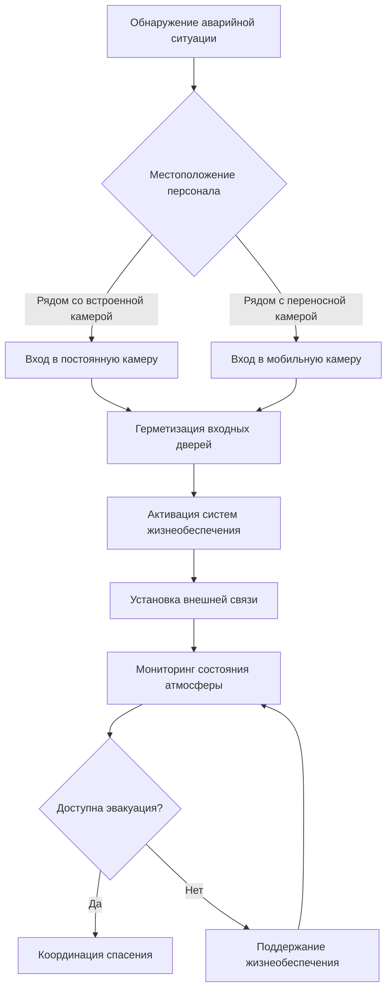

## Назначение и нормативно-правовая база

Аварийные укрытия и камеры спасения служат критически важными системами жизнеобеспечения при подземных горнодобывающих работах, обеспечивая временную защиту во время чрезвычайных ситуаций в шахтах, включая пожары, взрывы или загрязнение атмосферы. Эти герметичные помещения поддерживают пригодные для жизни условия посредством управляемых атмосферных систем до тех пор, пока спасательные операции смогут безопасно эвакуировать персонал.

Нормативные требования MSHA согласно 30 CFR Part 7 устанавливают всеобъемлющие стандарты производительности для альтернативных камер спасения, требуя конкретных параметров для контроля атмосферы, структурной целостности и продолжительности выживаемости. Нормативная база была разработана после нескольких крупных аварий в шахтах, в частности трагедии на шахте Сайго в 2006 году, которая выявила критические пробелы в подготовке к чрезвычайным ситуациям.

## Встроенные и переносные камеры

### Сравнение типов камер

| Характеристика | Встроенные камеры | Переносные камеры |
|----------------|-------------------|-------------------|
| Метод строительства | Постоянная бетонная/стальная конструкция | Префабрикованные модульные блоки |
| Время установки | 2-4 недели | 4-8 часов |
| Диапазон вместимости | 15-100+ человек | 8-30 человек |
| Возможность перемещения | Отсутствует | Полная мобильность |
| Структурная целостность | Превосходная устойчивость к взрывам | Сертифицированная MSHA защита |
| Стоимость капитального оборудования | 150 000-500 000 USD | 40 000-150 000 USD |
| Доступ к техническому обслуживанию | Осмотр на месте | Удаление для обслуживания |

**Встроенные камеры** обеспечивают максимальную структурную защиту благодаря усиленным бетонным стенам (обычно толщиной 20-30 см) с металлической арматурой. Эти постоянные конструкции интегрируются с шахтной инфраструктурой, обеспечивая превосходную устойчивость к взрывам и большую вместимость. Тепловая масса бетонной конструкции обеспечивает естественное температурное буферирование, снижая нагрузку охлаждения при длительном пребывании.

**Переносные камеры** используют стальные конструкции (толщина листа 4,8-6,4 мм) с модульной сборкой, позволяя переустанавливать их по мере продвижения горнодобывающих работ. Современные конструкции включают композитные материалы для внешней оболочки, обеспечивая устойчивость к взрывам при минимизации веса для транспортировки через шахтные выработки.

## Требования к вместимости и расчеты

Нормативные требования MSHA предусматривают достаточную вместимость камеры спасения, чтобы вместить всех работников в затронутой зоне шахты. Расчеты вместимости должны учитывать как количество людей, так и минимальный пригодный для жизни объем на одного человека.

### Требования по объему

Минимальное требование внутреннего объема:

$$V_{min} = N \times V_{person} \times SF$$

Где:
- $V_{min}$ = Минимальный объем камеры (м³)
- $N$ = Количество человек
- $V_{person}$ = 0,42 м³ на одного человека (минимум MSHA)
- $SF$ = Коэффициент безопасности (обычно 1,2-1,5)

Для камеры на 20 человек:

$$V_{min} = 20 \times 0,42 \times 1,3 = 10,92 \text{ м}^3$$

### Продолжительность подачи кислорода

Система подачи кислорода должна обеспечивать 96 часов дыхаемого воздуха. Общее требование кислорода:

$$O_2_{total} = N \times R_{O_2} \times t \times 1,25$$

Где:
- $O_2_{total}$ = Общий требуемый кислород (литры)
- $N$ = Количество человек
- $R_{O_2}$ = 15 л/час на одного человека (метаболическое потребление в состоянии покоя)
- $t$ = 96 часов (нормативный минимум)
- 1,25 = Коэффициент запаса

Для 20 человек:

$$O_2_{total} = 20 \times 15 \times 96 \times 1,25 = 36 000 \text{ л}$$

При стандартных условиях (1 атм, 20°C) это требует приблизительно 43,8 м³ хранилища сжатого кислорода.

## Стандарты строительства

### Требования к конструкции

Камеры должны выдерживать:
- **Избыточное давление**: Минимальная устойчивость к взрывной волне 103 кПа
- **Воздействие**: Защита от падающих пород и обломков
- **Температура**: Поддержание внутренних условий между 10-35°C
- **Герметизация**: Газонепроницаемая конструкция, предотвращающая поступление загрязненного воздуха

### Системы контроля атмосферы

Система жизнеобеспечения поддерживает пригодность для жизни благодаря четырем основным функциям:

**Удаление углекислого газа**: Системы поглощения, использующие гидроксид лития (LiOH) или гидроксид кальция (Ca(OH)₂), химически поглощают CO₂:

$$\text{LiOH} + \text{CO}_2 \rightarrow \text{LiHCO}_3$$

Производительность поглотителя должна удалять CO₂ с метаболической производительностью приблизительно 0,0006 м³/человека·час.

**Дополнительное кислородоснабжение**: Баллоны со сжатым газом или химические генераторы кислорода поддерживают концентрацию O₂ между 18-23% по объему. Скорость подачи должна уравновешивать метаболическое потребление, предотвращая гипероксические условия.

## Критерии размещения

Эффективное размещение камеры спасения требует анализа нескольких факторов:

1. **Расстояние от забоя**: Максимальное расстояние пути 610 м (рекомендация MSHA)
2. **Учет высоты**: Размещение выше ожидаемых зон накопления воды
3. **Позиция в системе вентиляции**: Размещение в приточных выработках, когда возможно
4. **Стабильность конструкции**: Установка в устойчивой породе вдали от активных зон добычи
5. **Доступность**: Четкие маршруты доступа с указателями каждые 30 м

### Анализ стратегического размещения

Оптимальное количество камер определяется распределением общей численности работников:

$$N_{chambers} = \left\lceil \frac{W_{total}}{C_{chamber}} \right\rceil \times SF_{redundancy}$$

Где:
- $N_{chambers}$ = Требуемое количество камер
- $W_{total}$ = Общее количество работников в зоне
- $C_{chamber}$ = Вместимость камеры
- $SF_{redundancy}$ = 1,5 (коэффициент резервирования)

## Системы связи

MSHA требует двусторонней связи с поверхностными командными центрами. Системы включают:

- **Проводные системы**: Кабельные системы утечки или обычные телефонные линии
- **Сквозь-земля (TTE)**: Низкочастотные электромагнитные системы, проникающие сквозь горные породы
- **Беспроводные сети**: Шахтные сетчатые сети с интеграцией камер
- **Резервная связь**: Независимые системы с питанием от батарей (минимум 72 часа)

Каждая система должна обеспечивать четкую голосовую связь и позволять подавать сигналы бедствия. Резервные коммуникационные каналы обеспечивают связь даже при отказе основной системы.

## Проверка и техническое обслуживание

Ежеквартальные проверки подтверждают:
- Функциональность системы контроля атмосферы
- Давление баллонов кислорода и даты истечения срока действия
- Состояние материала поглотителя и его производительность
- Структурную целостность уплотнений и дверей
- Работоспособность системы связи
- Инвентаризацию аварийных припасов (вода, первая помощь, санитарные средства)

Документация всех проверок должна сохраняться для проверки MSHA с немедленными корректирующими действиями при обнаружении любых дефектов, влияющих на системы жизнеобеспечения.
