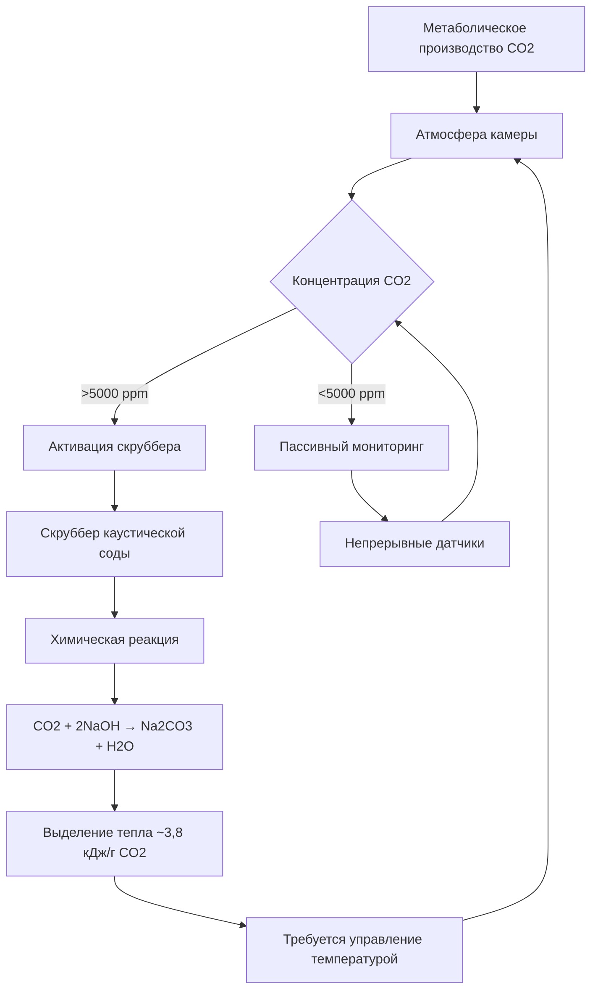
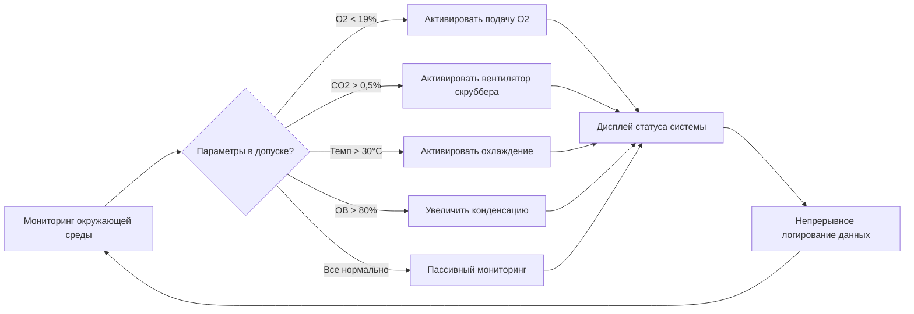

Убежища для шахтеров обеспечивают критическое жизнеобеспечение во время подземных аварий, когда шахтеры не могут эвакуироваться. Система экологического контроля должна поддерживать жизнь в течение длительного периода, обычно 96 часов в соответствии с нормативами MSHA, путем контроля состава атмосферы, температуры и влажности в герметичном помещении.

## Контроль состава атмосферы

Основная сложность экологического контроля убежища шахтера состоит в поддержании качества дыхаемого воздуха в герметичном помещении при непрерывном метаболическом потреблении кислорода и выделении углекислого газа.

### Требования к подаче кислорода

Среднее потребление кислорода человеком составляет 0,3–0,4 л/мин в состоянии покоя, при этом выделение метаболического тепла создает дополнительную тепловую нагрузку. Для убежища, предназначенного для $N$ человек на время $t$ (часов), минимальное требование по кислороду:

$$V_{O_2} = N \times 0.35 \frac{\text{л}}{\text{мин}} \times 60 \frac{\text{мин}}{\text{ч}} \times t \text{ (ч)}$$

MSHA 30 CFR 7.504 требует поддерживать концентрацию кислорода между 18,5% и 23% по объему. Для объема камеры $V_c$ (кубические метры) парциальное давление кислорода должно оставаться в безопасных пределах:

$$P_{O_2} = 0.185 \times P_{atm} \leq P_{O_2,actual} \leq 0.23 \times P_{atm}$$

Системы подачи кислорода включают:

**Баллоны сжатого газа**
- Высокое давление хранения (13 790–16 550 кПа)
- Регуляторы давления поддерживают подачу 345–690 кПа
- Дозирование потока обеспечивает контролируемый выпуск
- Типовая емкость: 5,7–8,5 м³ на баллон

**Химические генераторы кислорода**
- Супероксид калия (KO₂) или свечи хлората натрия
- Экзотермическая реакция выделяет O₂
- Механизм активации автономного действия
- Выделение тепла требует теплового управления

### Удаление углекислого газа

Метаболическое производство CO₂ в среднем составляет 0,25–0,3 л/мин на человека. Без удаления концентрация CO₂ быстро повышается в герметичных помещениях. MSHA ограничивает CO₂ до 1,0% (10 000 ppm) в течение 96 часов с абсолютным максимумом 2,5%.

Скорость генерации CO₂ создает увеличение концентрации:

$$\frac{dC_{CO_2}}{dt} = \frac{N \times R_{CO_2}}{V_c} \times 10^6 \text{ (ppm/ч)}$$

где $R_{CO_2}$ = 0,27 л/мин на человека и $V_c$ — объем камеры в литрах.

#### Удаление CO₂ с использованием каустической соды

Преобладающий метод удаления CO₂ использует каустическую соду (смесь гидроксида кальция и гидроксида натрия) в скубберах с насыпной загрузкой:

$$\text{CO}_2 + 2\text{NaOH} \rightarrow \text{Na}_2\text{CO}_3 + \text{H}_2\text{O} + 127 \text{ кДж/моль}$$

$$\text{Na}_2\text{CO}_3 + \text{Ca(OH)}_2 \rightarrow \text{CaCO}_3 + 2\text{NaOH}$$

Требуемая емкость скруббера для полного удаления CO₂ за время $t$:

$$m_{scrubber} = \frac{N \times R_{CO_2} \times t \times 60 \times \rho_{CO_2}}{E_{scrubber}}$$

где:
- $\rho_{CO_2}$ = 1,98 г/л (при STP)
- $E_{scrubber}$ = эффективность скруббера (0,85–0,95)
- Типовое потребление: 120 г каустической соды на человека в день

| Тип скруббера | Емкость (кг CO₂/кг среды) | Перепад давления (Па) | Выделение тепла (кДж/кг CO₂) | Время использования |
|---------------|---------------------------|-------------------|------------------------|--------------|
| Упакованное ложе каустической соды | 0,18–0,22 | 125–250 | 3800 | 500–700 ч |
| Гидроксид лития | 0,35–0,45 | 75–150 | 4200 | 300–500 ч |
| Молекулярное сито | 0,12–0,16 | 200–350 | N/A (регенерируемое) | Регенерируемое |

## Контроль температуры и влажности

Герметичное убежище испытывает тепловые нагрузки из нескольких источников:

**Источники тепловыделения:**
1. Метаболическое тепло: 100–120 Вт на человека в состоянии покоя
2. Тепло от реакции CO₂ скруббера: 3,8 кДж на грамм удаленного CO₂
3. Тепло от генератора кислорода (если химический): 200–500 Вт во время работы
4. Электрооборудование: 50–150 Вт непрерывно
5. Проникновение тепла через стены: $Q = UA\Delta T$

### Проектирование системы охлаждения

MSHA требует поддерживать температуру ниже 35°C по сухому термометру. Баланс общей тепловой нагрузки:

$$Q_{total} = Q_{metabolic} + Q_{scrubber} + Q_{equipment} + Q_{walls} - Q_{cooling}$$

Для установившихся условий $Q_{cooling}$ должна равняться всем тепловым поступлениям:

$$Q_{cooling} = N \times 120 \text{ Вт} + \dot{m}_{CO_2} \times 3800 \frac{\text{кДж}}{\text{кг}} + Q_{equip} + UA\Delta T$$

Сравнение методов охлаждения:

| Метод охлаждения | Емкость (Вт) | Продолжительность | Преимущества | Ограничения |
|----------------|--------------|----------|------------|-------------|
| Ледяное хранилище | 2000–5000 | 48–96 ч | Пассивное, надежное | Большое пространство, ограниченная продолжительность |
| Материал с фазовым переходом | 1500–4000 | 72–120 ч | Компактное, стабильная температура | Более высокая стоимость, медленный отклик |
| Расширение сжатого воздуха | 3000–8000 | 24–48 ч | Быстрое охлаждение | Ограниченная подача воздуха |
| Охладители Пельтье | 500–2000 | Неограниченная | Активное управление | Высокое потребление энергии |

Наиболее распространенный подход сочетает ледяное хранилище для базовой нагрузки с расширением сжатого воздуха для пиковых нагрузок. Требуемая масса ледяного хранилища:

$$m_{ice} = \frac{Q_{total} \times t \times 3600}{h_{fg,ice}}$$

где $h_{fg,ice}$ = 334 кДж/кг (скрытая теплота плавления).

### Управление влажностью

Метаболическое выделение водяного пара в среднем составляет 40–50 г/ч на человека. Удаление CO₂ с помощью скруббера также выделяет водяной пар из химической реакции. Без контроля относительная влажность превышает 90% в течение часов, вызывая дискомфорт и конденсацию.

Рекомендации MSHA предусматривают поддерживать ОВ ниже 85%. Баланс влаги:

$$\frac{dm_{vapor}}{dt} = N \times \dot{m}_{metabolic} + \dot{m}_{scrubber} - \dot{m}_{condensate}$$

Конденсирующие поверхности (холодные стены или выделенная осушка) удаляют избыток влаги. Для охлаждения на основе льда температура холодной поверхности $T_s$ должна оставаться ниже точки росы:

$$T_s < T_{dewpoint} = T_{db} - \frac{100 - RH}{5}$$

где $T_{db}$ — температура по сухому термометру (°C) и это приближение справедливо для типичных условий.

## Расчеты продолжительности жизнеобеспечения

MSHA 30 CFR 7.503 требует минимальной емкости жизнеобеспечения на 96 часов. Ограничивающий фактор определяет фактическую выживаемость:

**Продолжительность подачи кислорода:**

$$t_{O_2} = \frac{V_{O_2,stored}}{N \times 0.35 \times 60} \text{ (часов)}$$

**Продолжительность работы CO₂ скруббера:**

$$t_{CO_2} = \frac{m_{scrubber} \times E_{scrubber}}{N \times R_{CO_2} \times 60 \times \rho_{CO_2}} \text{ (часов)}$$

**Продолжительность емкости охлаждения:**

$$t_{cooling} = \frac{m_{ice} \times h_{fg,ice}}{Q_{total} \times 3600} \text{ (часов)}$$

Фактическая продолжительность жизнеобеспечения составляет:

$$t_{actual} = \min(t_{O_2}, t_{CO_2}, t_{cooling})$$

Коэффициенты безопасности 20–30% являются стандартной практикой для учета колебаний численности, метаболической скорости и условий окружающей среды.

## Системы мониторинга и управления

Непрерывный мониторинг обеспечивает остаться в безопасных пределах параметров окружающей среды. Требуемые датчики согласно MSHA:

- **Кислород:** электрохимические или парамагнитные датчики, точность ±0,5%
- **Углекислый газ:** NDIR датчики, точность ±0,1%
- **Оксид углерода:** электрохимические датчики, точность ±5 ppm
- **Температура:** RTD или термистор, точность ±0,5°C
- **Влажность:** емкостные или резистивные, точность ±3% ОВ

Автоматизированные управляющие последовательности активируют системы жизнеобеспечения на основе показаний датчиков, с возможностью ручного переопределения и резервными системами для критических функций.

Интеграция подачи кислорода, удаления CO₂, управления тепловыми процессами и управления влажностью создает полную систему жизнеобеспечения, способную поддерживать жильцов в течение длительных шахтных аварий, одновременно поддерживая условия в пределах физиологической толерантности, установленной нормами MSHA.
