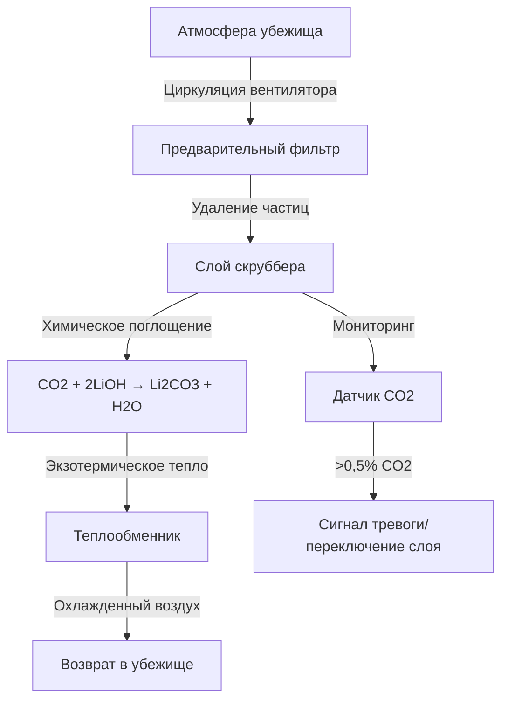

## Обзор

Системы жизнеобеспечения в убежищах шахт поддерживают пригодные для жизни атмосферные условия для заблокированных шахтеров во время чрезвычайных ситуаций. Инженерная задача включает балансировку подачи кислорода, удаления углекислого газа, теплового контроля и управления влажностью в условиях строго ограниченного объема и энергопотребления.

Нормативы MSHA (30 CFR 7.504) требуют, чтобы убежища поддерживали жизнь людей минимум 96 часов, что требует точных расчетов емкости расходных материалов и производительности систем экологического контроля.

## Расчеты подачи кислорода

### Метаболический спрос на кислород

Потребление кислорода человеком варьируется в зависимости от уровня активности и массы тела. В состоянии покоя в условиях чрезвычайной ситуации типичные показатели потребления:

$$\dot{V}_{O_2} = 0,25 \text{ л/мин на человека (STPD)}$$

Для периода убежища 96 часов с N занимающими помещение:

$$V_{O_2,total} = \dot{V}_{O_2} \times N \times t \times 60$$

$$V_{O_2,total} = 0,25 \times N \times 96 \times 60 = 1440N \text{ литров (STPD)}$$

**Пример:** Убежище на 15 человек требует 21 600 л кислорода в стандартных условиях.

### Сравнение методов подачи

| Метод | Плотность хранения | Преимущества | Ограничения |
|--------|----------------|------------|-------------|
| Сжатый газ (138 МПа) | 150 л/л баллона | Простой, надежный | Тяжелые баллоны, объемный |
| Химические генераторы (хлоратные свечи) | 600 л/кг | Высокая плотность, без давления | Выделение тепла (6,5 кДж/л O₂), ограниченное управление |
| Жидкий кислород | 860 л/л | Наибольшая плотность | Испарение, криогенная обработка |

### Требования по парциальному давлению

Дышащая атмосфера требует поддержания парциального давления кислорода:

$$P_{O_2} = 0,19 \text{ – } 0,23 \text{ атм}$$

В герметичном убежище истощение кислорода и накопление CO₂ влияют на общее давление. Уравнение материального баланса:

$$P_{total} = P_{O_2} + P_{N_2} + P_{CO_2} + P_{H_2O}$$

По мере того как метаболические процессы преобразуют O₂ в CO₂, дыхательный коэффициент (RQ ≈ 0,8) означает небольшое снижение общего количества молей, создавая незначительное падение давления.

## Удаление углекислого газа

### Механизмы химического поглощения

**Сода известь (Ca(OH)₂ + NaOH)**

Основная последовательность реакций:

$$\text{CO}_2 + 2\text{NaOH} \rightarrow \text{Na}_2\text{CO}_3 + \text{H}_2\text{O} + 48,1 \text{ кДж/моль}$$

$$\text{Na}_2\text{CO}_3 + \text{Ca(OH)}_2 \rightarrow 2\text{NaOH} + \text{CaCO}_3$$

**Гидроксид лития (LiOH)**

$$\text{CO}_2 + 2\text{LiOH} \rightarrow \text{Li}_2\text{CO}_3 + \text{H}_2\text{O} + 62,8 \text{ кДж/моль}$$

### Расчеты размера скруббера

Скорость производства CO₂ человеком в состоянии покоя:

$$\dot{V}_{CO_2} = RQ \times \dot{V}_{O_2} = 0,8 \times 0,25 = 0,20 \text{ л/мин на человека}$$

Общая масса CO₂ за 96-часовое пребывание:

$$m_{CO_2} = \dot{V}_{CO_2} \times N \times t \times 60 \times \frac{\rho_{CO_2}}{1000}$$

$$m_{CO_2} = 0,20 \times N \times 96 \times 60 \times 1,977 = 2276N \text{ граммов}$$

Где ρ_CO₂ = 1,977 г/л при STPD.

### Емкость абсорбента

**Сода известь:** Теоретическая емкость = 0,23 кг CO₂/кг абсорбента (достижимая: 0,15–0,18)

**Гидроксид лития:** Теоретическая емкость = 0,92 кг CO₂/кг абсорбента (достижимая: 0,70–0,75)

Для 15 человек за 96 часов (34,14 кг CO₂):

- Требуется соды извести: 190–228 кг
- Требуется гидроксида лития: 45–49 кг



## Контроль температуры и влажности

### Компоненты тепловой нагрузки

Общее явное тепло в убежище:

$$Q_{total} = Q_{metabolic} + Q_{scrubber} + Q_{equipment} + Q_{infiltration}$$

**Генерация метаболического тепла:**

$$Q_{metabolic} = N \times 100 \text{ Вт на человека (в покое)}$$

**Тепло реакции скраббирования:**

Для соды извести: 48,1 кДж/моль CO₂ × 0,20 л/мин × N × 0,0446 моль/л = 430N Вт

**Комбинированная тепловая нагрузка (15 человек):** 1500 + 6450 + оборудование ≈ 8500 Вт

### Методы охлаждения

| Метод | Холодопроизводительность | Применение в убежище |
|--------|-----------------|---------------------|
| Хранилище льда | 334 кДж/кг | Ограниченная длительность, простой |
| Материалы с фазовым переходом | 150–250 кДж/кг | Продолжительность, стабильная температура |
| Термоэлектрические охладители | 50–150 Вт/модуль | Зависит от электричества, компактный |
| Контур охлажденной воды | Переменная | Требуется внешний источник тепла |

### Управление влажностью

Метаболическое производство водяного пара:

$$\dot{m}_{H_2O} = 50 \text{ г/ч на человека}$$

Относительная влажность должна оставаться ниже 60% для теплового комфорта и выше 30% для дыхательного здоровья. Требуемая производительность удаления конденсата:

$$m_{H_2O,96h} = N \times 50 \times 96 = 4800N \text{ граммов}$$

Химические скрубберы производят дополнительную воду из реакций CO₂, увеличивая требования по осушению примерно на 40%.

## Системы мониторинга воздуха

### Критические параметры

Соответствующие MSHA убежища требуют непрерывного мониторинга:

| Параметр | Безопасный диапазон | Порог сигнала тревоги | Тип датчика |
|-----------|------------|----------------|-------------|
| Концентрация O₂ | 19–23% | <19,5% или >23% | Электрохимический |
| Концентрация CO₂ | <0,5% | >1,0% | NDIR |
| Концентрация CO | <25 ppm | >50 ppm | Электрохимический |
| Температура | 10–35°C | >35°C | Термопара |
| Относительная влажность | 30–60% | >70% | Емкостной |

### Динамика концентрации газа

Модель первого порядка накопления CO₂ в герметичном убежище:

$$\frac{dC}{dt} = \frac{\dot{V}_{CO_2} \times N}{V_{chamber}} - k \times C$$

Где k — коэффициент скорости удаления скруббера (мин⁻¹). В установившемся состоянии:

$$C_{ss} = \frac{\dot{V}_{CO_2} \times N}{k \times V_{chamber}}$$

## Удаление метаболического тепла

### Конвективный теплообмен

Охлаждение убежища зависит от принудительной конвекции к людям. Требуемая скорость воздуха для теплового комфорта при 29°C:

$$v_{air} = 0,25\text{–}0,50 \text{ м/с}$$

Коэффициент конвективного теплообмена:

$$h_c = 2,9 + 2,56v^{0,5}$$

Где v в м/с, h_c в Вт/(м²·K).

### Процесс потока системы охлаждения

```mermaid
flowchart LR
    A[Воздух убежища<br/>29°C, влажный] --> B[Вентилятор циркуляции<br/>509 CFM (865 м³/ч)]
    B --> C[Охлаждающая катушка<br/>тепловой накопитель PCM]
    C --> D[Разделитель<br/>конденсата]
    D --> E[Подогреватель<br/>контроль точки росы]
    E --> F[Возвратный воздух<br/>24°C, 50% ОВ]
    F --> A
    D --> G[Дренажный<br/>резервуар]
```

## Расчеты емкости занимающих помещение

Определение емкости убежища интегрирует несколько ограничений:

$$N_{max} = \min\left(\frac{V_{chamber}}{1,19 \text{ м}^3}, \frac{O_{2,stored}}{1440}, \frac{m_{scrubber}}{2,28 \text{ кг}}, \frac{Q_{cooling}}{530 \text{ Вт}}\right)$$

Ограничивающий фактор варьируется в зависимости от конструкции убежища. Хорошо спроектированные системы уравновешивают все параметры для достижения номинальной емкости без значительного перепроектирования.

**Требование MSHA:** Минимум 0,42 м³ на человека для неконтролируемых по температуре убежищ, 0,85 м³ для контролируемых по температуре убежищ (30 CFR 7.503).

### Пример проверки конструкции

Для убежища объемом 17 м³, рассчитанного на 15 человек:

- Проверка объема: 17/15 = 1,13 м³/человек ✓
- Подача O₂: 22 000 л ÷ 1440 = 15,3 человека ✓
- Емкость скруббера: 50 кг LiOH × 0,72 ÷ 2,28 = 15,8 человека ✓
- Холодопроизводительность: 9000 Вт ÷ 530 = 17,0 человека ✓

Все ограничения выполнены для 96-часового пребывания при номинальной емкости.

## Эксплуатационные соображения

Протоколы периодического контроля должны проверять:

1. Давление в баллоне сжатого газа (ежемесячно)
2. Состояние абсорбента скруббера (годовая замена или после использования)
3. Калибровку датчика (раз в полгода)
4. Заряд системы охлаждения (ежеквартально)
5. Уплотнительные прокладки и целостность (ежегодно)

Расходные материалы системы жизнеобеспечения имеют ограниченный срок службы — гидроксид лития деградирует при воздействии влаги, кислородные генераторы имеют срок службы 10–15 лет, а баллоны сжатого газа требуют гидростатического испытания каждые 5 лет в соответствии с нормативами DOT.

Интеграция подачи кислорода, удаления CO₂, теплового контроля и мониторинга создает надежную систему жизнеобеспечения, способную поддерживать жизнь шахтеров в течение длительных сценариев чрезвычайных ситуаций, при условии что инженерные расчеты точно отражают метаболические нагрузки и возможности системы соответствуют стандартам производительности MSHA.
