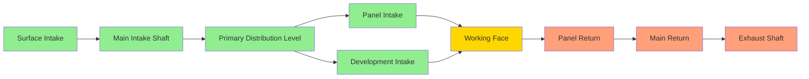
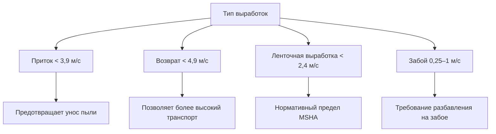

Горные выработки образуют сетевую систему, через которую вентиляционный воздух циркулирует для разбавления загрязняющих веществ, управления температурой и обеспечения пригодной для дыхания атмосферы в подземных операциях. Проектирование, обслуживание и эксплуатация этих выработок напрямую определяют эффективность и безопасность всей вентиляционной системы.

## Системы приточных и возвратных выработок

Подземная вентиляция шахт использует выделенные приточные и возвратные выработки для установления контролируемых схем воздушного потока. **Приточные выработки** доставляют свежий воздух от поверхностных вентиляторов или естественных отверстий в рабочие зоны, а **возвратные выработки** отводят загрязненный воздух обратно к выходам.

Разделение приточной и возвратной систем предотвращает короткие замыкания и сохраняет качество воздуха во всей шахте. Нормативы MSHA в соответствии с 30 CFR 75.323 предписывают, чтобы приточный воздух оставался изолированным от возвратного воздуха, кроме обозначенных точек смешивания. Физические барьеры, перемычки или достаточные целики обеспечивают это разделение.

### Стратегии конфигурации выработок

Параллельные системы выработок увеличивают суммарную пропускную способность при одновременном снижении общего сопротивления. Когда две идентичные выработки работают параллельно, суммарное сопротивление снижается до 50% от одной выработки, следуя соотношению параллельного сопротивления:

$$\frac{1}{R_{total}} = \frac{1}{R_1} + \frac{1}{R_2} + ... + \frac{1}{R_n}$$

## Размеры выработок и площадь поперечного сечения

Площадь поперечного сечения напрямую определяет как пропускную способность воздушного потока, так и сопротивление трению. Фундаментальное соотношение между количеством воздуха, скоростью и площадью имеет следующий вид:

$$Q = A \times V$$

Где:
- $Q$ = количество воздуха (CFM или м³/с)
- $A$ = площадь поперечного сечения (м² или м²)
- $V$ = средняя скорость воздуха (м/мин или м/с)

### Стандартные размеры входов шахты

| Тип входа | Ширина (м) | Высота (м) | Площадь (м²) | Типичное применение |
|-----------|-----------|-----------|------------|-------------------|
| Основной приток | 6,1 | 2,4 | 14,9 | Первичное распределение воздуха |
| Основной возврат | 6,1 | 2,4 | 14,9 | Первичный выброс |
| Панельный вход | 4,9 | 1,8 | 8,9 | Вентиляция участка |
| Разработка | 4,9 | 1,8 | 8,9 | Активная добыча |
| Маршрут эвакуации | 1,8 | 1,8 | 3,3 | Аварийный выход |

Эффективная площадь часто отличается от физической площади выработки из-за оборудования, железнодорожных путей, конвейерных конструкций и смыкания кровли. **k-фактор** (коэффициент препятствий) 0,70–0,85 учитывает эти сокращения:

$$A_{effective} = k \times A_{excavated}$$

## Сопротивление выработок и коэффициенты трения

Сопротивление выработок представляет собой противодействие потоку воздуха, вызванное трением поверхности и турбулентностью. Уравнение Аткинсона количественно определяет это сопротивление:

$$R = \frac{K \times L \times P}{A^3}$$

Где:
- $R$ = сопротивление выработок (в единицах Н·с²/м⁸ или фунт·мин²/фут⁶)
- $K$ = коэффициент трения (безразмерный)
- $L$ = длина выработок (м или м)
- $P$ = периметр (м или м)
- $A$ = площадь поперечного сечения (м² или м²)

Коэффициент трения $K$ инкапсулирует эффекты шероховатости поверхности и существенно варьируется в зависимости от типа выработок:

| Состояние поверхности | Коэффициент трения (K) | Типичное применение |
|-----------------------|----------------------|-------------------|
| Гладкая бетонная облицовка | 0,004–0,006 | Стволы, основные входы |
| Поверхность торкретирования | 0,008–0,012 | Восстановленные входы |
| Рисунок анкеровки | 0,012–0,018 | Современное крепление кровли |
| Шероховатая взорванная порода | 0,020–0,035 | Необлицованная разработка |
| Ребристость с опорами | 0,025–0,045 | Традиционные угольные шахты |
| Серьезное разрушение | 0,050+ | Требует обслуживания |

## Влияние шероховатости поверхности на воздушный поток

Шероховатость поверхности генерирует турбулентность в пограничном слое, увеличивая потери энергии. Соотношение между высотой шероховатости и коэффициентом трения следует уравнению Кольбрука-Уайта, адаптированному для горных выработок.

Выступающие анкеры, отслаивание, разрушение ребер и оборудование создают элементы шероховатости, которые выступают в воздушный поток. Элемент шероховатости всего лишь в 15 см может увеличить сопротивление на 30–50% по сравнению с гладкими поверхностями.

### Стратегии снижения шероховатости

**Применение торкретирования**: Напыленный бетон сглаживает неровные поверхности, снижая $K$ с 0,025 до 0,010, сокращая сопротивление на 60%.

**Восстановление выработок**: Удаление рыхлого материала, обрезка выступов и восстановление поверхности разрушенных участков восстанавливают характеристики расчетного потока.

**Стратегическое размещение облицовки**: Высокоскоростные выработки получают наибольшую пользу от сглаживания; удвоение скорости учетверачивает потери трения из-за квадратичной зависимости в соотношении перепада давления.

## Предельные скорости воздуха и контроль пыли

Скорость воздуха в горных выработках должна обеспечивать адекватную вентиляцию при одновременном предотвращении уноса пыли и опасностей взрыва угольной пыли. Нормативы MSHA устанавливают специфические ограничения по скорости:

**30 CFR 75.326**: Скорость воздуха в приточных выработках должна быть не менее 244 м/ч (40 фут/мин) там, где работают или передвигаются горняки.

**30 CFR 75.326(b)**: Скорость воздуха в ленточной выработке не должна превышать 2438 м/ч (500 фут/мин), если не применена каменная пыль или лента является негорючей.

### Соотношение скорость-пыль

Критическая скорость захвата пыли следует эмпирическим соотношениям, основанным на размере и плотности частиц:

$$V_{critical} = K_{dust} \sqrt{\frac{d_p (\rho_p - \rho_a)}{\rho_a}}$$

Где:
- $V_{critical}$ = скорость, вызывающая унос пыли (м/с)
- $K_{dust}$ = эмпирическая константа (3–7)
- $d_p$ = диаметр частицы (м)
- $\rho_p$ = плотность частицы (кг/м³)
- $\rho_a$ = плотность воздуха (кг/м³)

Для угольной пыли (частицы 10–100 мкм) скорости, превышающие 3,9–4,9 м/с (800–1000 фут/мин), вызывают значительный повторный унос осевшей пыли, создавая риск воздействия респирабельной пыли и опасность взрыва.

### Рекомендуемые диапазоны скорости

## Требования к обслуживанию выработок

Постоянное обслуживание сохраняет пропускную способность потока выработок и предотвращает прогрессирующее увеличение сопротивления. Давление грунта вызывает просадку кровли, вспучивание пола и смыкание боков, что снижает площадь поперечного сечения с течением времени.

Снижение площади напрямую влияет на сопротивление через кубическую зависимость в уравнении Аткинсона. Потеря площади на 20% увеличивает сопротивление на 95% ($R \propto A^{-3}$).

### Элементы программы обслуживания

**Регулярные циклы инспекции**: Ежемесячные обследования измеряют поперечные сечения, выявляют повреждения и документируют изменяющиеся условия.

**График расширения**: Удаление накопленного материала от вспучивания пола и просадки кровли восстанавливает расчетные размеры.

**Модернизация крепления кровли**: Дополнительная анкеровка или стоячая опора предотвращают прогрессирующее смыкание в высоконапряженных зонах.

**Съемки вентиляции**: Ежеквартальные измерения воздушного потока обнаруживают увеличение сопротивления до того, как оно скомпрометирует производительность системы.

## Маршруты аварийной эвакуации

Нормативы MSHA в соответствии с 30 CFR 75.380 требуют двух отдельных и независимых маршрутов эвакуации из каждой рабочей зоны. Эти маршруты должны оставаться проходимыми и надлежащим образом обозначенными во все времена.

Выработки маршрутов эвакуации служат двойным целям в качестве маршрутов вентиляции и путей аварийной эвакуации. Минимальные размеры высотой 1,5 м и шириной 1,2 м обеспечивают адекватный проход для эвакуации горняков, хотя большие размеры улучшают скорость эвакуации.

### Стандарты качества воздуха маршрута эвакуации

**30 CFR 75.325**: Воздух маршрута эвакуации должен содержать не менее 19,5% кислорода и не более 0,5% углекислого газа.

Во время чрезвычайных ситуаций качество воздуха маршрута эвакуации может ухудшиться из-за дыма, газов или нарушения вентиляционной системы. Убежище и автономные дыхательные аппараты (СДБА) обеспечивают жизнеобеспечение, когда воздух маршрута эвакуации становится непригодным для дыхания.

Физика миграции дыма в наклонных выработках следует схемам потока, управляемым плавучестью. Горячие газы сгорания поднимаются в восходящих выработках, но могут распространяться в любом направлении в горизонтальных входах в зависимости от перепадов давления вентиляции. Планирование маршрута эвакуации должно учитывать эти картины поведения дыма на основе геометрии шахты и конфигурации вентиляции.

## Заключение

Проектирование горных выработок интегрирует механику жидкостей, механику горных пород и соответствие нормативным требованиям для создания безопасных и эффективных вентиляционных систем. Надлежащие размеры, обработка поверхности, управление скоростью и постоянное обслуживание обеспечивают, чтобы выработки выполняли свою критическую роль в защите подземных горняков при поддержке производительных операций горнодобычи.
