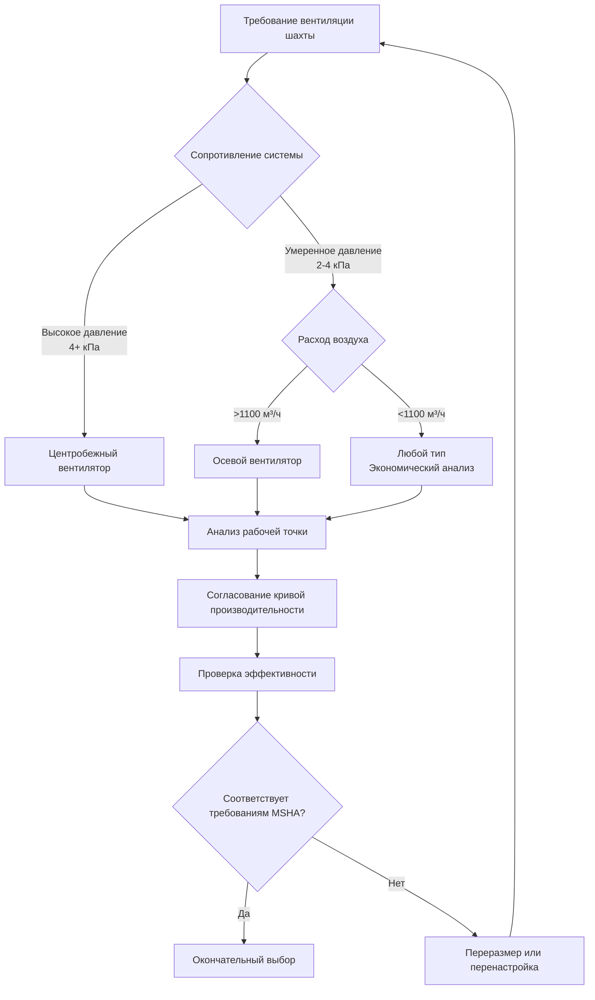

## Обзор

Основные вентиляторы шахтной вентиляции являются первичным средством поддержания дышащей атмосферы во всех подземных горнодобывающих операциях. Эти крупногабаритные машины перемещают сотни тысяч кубических метров в час против значительного статического давления, обычно находящегося в диапазоне 200–630 Па. Фундаментальная физика, управляющая работой основного вентилятора, существенно отличается от коммерческих приложений HVAC из-за экстремальных объемов воздушного потока, расширенных расстояний воздуховодов и строгих нормативных требований в соответствии с юрисдикцией MSHA (Mine Safety and Health Administration).

Основная функция вентилятора – преодолеть общее сопротивление сети шахтной вентиляции при доставке требуемого объемного воздушного потока. Это сопротивление возникает в результате потерь на трение вдоль воздушных путей, ударных потерь на пересечениях и препятствиях, а также изменений давления, связанных с перепадом высоты. Вентилятор должен генерировать достаточное полное давление для поддержания минимальных требований скорости – обычно 5 м/с минимума в выработках с персоналом – при одновременном обеспечении адекватной смены воздуха в рабочих секциях.

## Поверхностные установки вентиляторов

Поверхностные установки доминируют в приложениях основных вентиляторов благодаря доступности для обслуживания, снижению риска взрыва и упрощению нормативного соответствия. Расположение поверхностного вентилятора относительно шахтного ствола определяет фундаментальный режим работы.

### Конфигурации установки

Поверхностные вентиляторы подключаются к шахтным воздушным путям через вертикальные стволы или наклонные входы. Критическое различие заключается в том, нагнетает ли вентилятор воздух в шахту (нагнетание) или вытягивает воздух из шахты (отсос).

**Конфигурация нагнетания:**
- Вентилятор расположен у входного ствола
- Положительное давление по всей шахте
- Уравнение воздушного потока: $Q = A \cdot V = \rho A V / \rho_{std}$

**Конфигурация отсоса:**
- Вентилятор расположен у выходного ствола
- Отрицательное давление по всей шахте
- Доминирующая конфигурация для шахт с метаном

Конфигурация с отсосом обеспечивает превосходные характеристики безопасности. Любая утечка воздуха через трещины в породе или заброшенные выработки течет внутрь, предотвращая миграцию метана или других опасных газов на соседние территории. Кроме того, вентиляторы выхода предотвращают создание избыточного давления в запечатанных областях, снижая риск самовозгорания в угольных шахтах.

## Системы нагнетания и отсоса

Термодинамические и безопасные последствия конфигураций нагнетания и отсоса существенно влияют на проектирование системы.

### Эффекты давления и плотности

В системах нагнетания вся шахта работает при положительном давлении. Вентилятор получает поверхностный воздух при стандартной плотности $\rho_0$ и слегка сжимает его. Плотность воздуха по всей шахте составляет:

$$\rho_{mine} = \rho_0 + \frac{\Delta P_{fan}}{RT}$$

где $\Delta P_{fan}$ – скачок статического давления вентилятора, $R$ – удельная газовая постоянная (53,35 ft·lbf/lbm·°R для воздуха), и $T$ – абсолютная температура.

Системы отсоса поддерживают отрицательное давление по всей шахте. Впуск вентилятора получает воздух с плотностью:

$$\rho_{inlet} = \rho_0 - \frac{\Delta P_{system}}{RT}$$

Эта пониженная плотность на входе снижает требования к мощности вентилятора примерно на 2–5% по сравнению с системами нагнетания.

### Таблица сравнения

| Параметр | Система нагнетания | Система отсоса |
|-----------|---|---|
| Давление в шахте | Положительное по всей длине | Отрицательное по всей длине |
| Направление утечки | Наружу из шахты | Внутрь в шахту |
| Контроль газа | Удовлетворительный | Отличный |
| Риск запечатанной области | Повышенное давление | Пониженное давление |
| Условия на входе вентилятора | Стандартная плотность | Пониженная плотность |
| Требование мощности | Выше | Ниже (2–5%) |
| Предпочтение MSHA | Допустимо | Предпочтительно для газовых шахт |

## Выбор осевых и центробежных вентиляторов

Основные шахтные вентиляторы используют либо осевые, либо центробежные (радиальные) конструкции. Выбор зависит от рабочей точки системы на кривой производительности вентилятора.

### Осевые вентиляторы

Осевые вентиляторы перемещают воздух параллельно оси вала. Лопасти придают касательную скорость воздушному потоку, которая преобразуется в статическое давление через направляющие аппараты или диффузоры. Уравнение турбомашин Эйлера управляет передачей энергии:

$$H = \frac{u_2 V_{t2} - u_1 V_{t1}}{g}$$

где $H$ – напор, $u$ – скорость лопасти, $V_t$ – касательная скорость воздуха, и $g$ – ускорение силы тяжести.

**Характеристики осевого вентилятора:**
- Высокие расходы воздуха (280–2 800 м³/ч и более)
- Умеренный рост давления (2–4,5 кПа типично)
- Пиковая эффективность: 75–88%
- Компактный габарит установки
- Более низкая стоимость капитала
- Узкий стабильный диапазон работы

### Центробежные вентиляторы

Центробежные вентиляторы ускоряют воздух радиально наружу через ротор, преобразуя скоростное давление в статическое давление в корпусе спирали. Теоретический скачок давления связан со скоростью наконечника ротора:

$$\Delta P_{ideal} = \rho \frac{u_2^2}{2g_c}$$

где $u_2$ – скорость наконечника ротора и $g_c$ – размерная постоянная (32,174 lbm·ft/lbf·s²).

**Характеристики центробежного вентилятора:**
- Умеренные и высокие расходы воздуха (140–1 400 м³/ч типично)
- Высокое давление (4–8,8 кПа)
- Пиковая эффективность: 70–85%
- Больший габарит установки
- Более высокая стоимость капитала
- Широкий стабильный диапазон работы
- Превосходный запас прочности от помпажа

### Критерии выбора

## Законы вентиляторов и кривые производительности

Законы вентиляторов описывают, как параметры производительности масштабируются с изменениями скорости и размера. Эти соотношения подобия являются фундаментальными для испытания вентилятора и прогнозирования производительности в полевых условиях.

### Основные законы вентиляторов

Для заданного вентилятора при разных скоростях:

$$\frac{Q_2}{Q_1} = \frac{N_2}{N_1}$$

$$\frac{\Delta P_2}{\Delta P_1} = \left(\frac{N_2}{N_1}\right)^2$$

$$\frac{BHP_2}{BHP_1} = \left(\frac{N_2}{N_1}\right)^3$$

где $Q$ – объемный расход, $\Delta P$ – скачок давления, $BHP$ – тормозная мощность, и $N$ – частота вращения.

Для геометрически подобных вентиляторов при одинаковой скорости:

$$\frac{Q_2}{Q_1} = \left(\frac{D_2}{D_1}\right)^3$$

$$\frac{\Delta P_2}{\Delta P_1} = \left(\frac{D_2}{D_1}\right)^2$$

$$\frac{BHP_2}{BHP_1} = \left(\frac{D_2}{D_1}\right)^5$$

где $D$ – диаметр ротора или рабочего колеса.

### Взаимодействие системной кривой

Сеть шахтной вентиляции представляет сопротивление, которое варьируется с квадратом скорости воздушного потока:

$$\Delta P_{system} = R \cdot Q^2$$

где $R$ – коэффициент сопротивления системы (Па/(м³/ч)²). Рабочая точка возникает там, где кривая вентилятора пересекает системную кривую.

## Протоколы испытания вентиляторов

MSHA предписывает периодическое испытание основных вентиляторов шахтной вентиляции в соответствии с 30 CFR § 75.310. Испытание проверяет, что вентилятор может доставить требуемый воздушный поток против фактического сопротивления системы и устанавливает базовые показатели производительности для мониторинга деградации.

### Требования к измерениям при испытании

1. **Объемный расход:** Измеряется методом траверса согласно AMCA 203 или массивом трубок Пито
2. **Статическое давление:** Дифференциальное давление через вентилятор (напор минус вход)
3. **Скорость вентилятора:** Тахометр или измерение стробоскопом
4. **Входная мощность:** Трехфазный анализатор мощности на двигателе
5. **Плотность воздуха:** Температура и барометрическое давление на входе вентилятора

### Расчеты производительности

Статическое давление вентилятора (FSP):

$$FSP = SP_d - SP_i + VP_i$$

где $SP_d$ – статическое давление напора, $SP_i$ – статическое давление входа, и $VP_i$ – скоростное давление входа.

Статическая эффективность вентилятора:

$$\eta_s = \frac{Q \cdot FSP}{6356 \cdot BHP} \times 100\%$$

с $Q$ в м³/ч, $FSP$ в Па, и $BHP$ в киловаттах.

## Требования к резервной емкости

Нормативные требования MSHA требуют резервной емкости вентилятора, достаточной для поддержания минимальной вентиляции во время отказов основного вентилятора. Конкретные требования варьируются в зависимости от классификации шахты и проектирования системы вентиляции.

### Нормативно-правовая база (30 CFR § 75.311)

- Резервный вентилятор должен обеспечивать по крайней мере 50% емкости основного вентилятора в течение 15 минут
- Альтернатива: эквивалентная вентиляция через естественную вентиляцию или вспомогательные системы
- Автоматическое переключение требуется для механизированных секций добычи
- Ручной пуск допустим для немеханизированных областей с немедленной доступностью

### Конфигурации резервной системы

| Конфигурация | Емкость | Время активации | Применение |
|---|---|---|---|
| Параллельно установленный вентилятор | 100% основной вентилятор | <1 минута | Крупные операции |
| Основной вентилятор с пониженной скоростью | 50–100% нормального | <5 минут | Управление скоростью двигателя |
| Сеть вспомогательных вентиляторов | 40–60% основного вентилятора | 5–15 минут | Распределенные системы |
| Естественная вентиляция | 20–40% основного вентилятора | Немедленно | Только неглубокие шахты |

Конфигурация с параллельно установленным вентилятором обеспечивает наивысшую надежность, но требует удвоенных капиталовложений. Система должна приспосабливаться к одновременной работе обоих вентиляторов без условий помпажа или срыва потока.

---

**Связанные темы:** Системы вспомогательной вентиляции, анализ сети шахтной вентиляции, взрывозащитная конструкция вентиляторов, интеграция мониторинга метана
