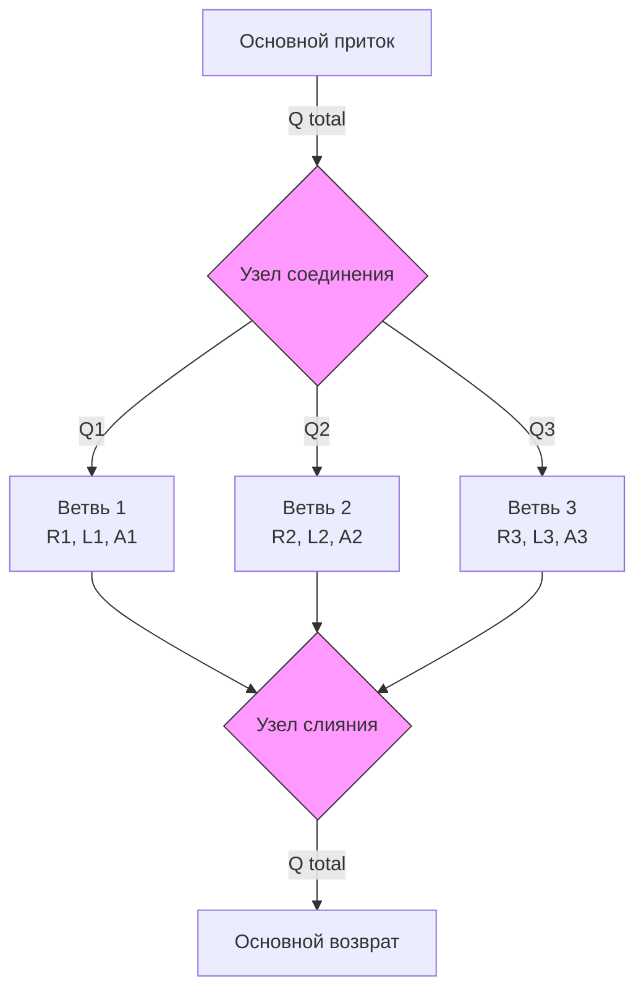
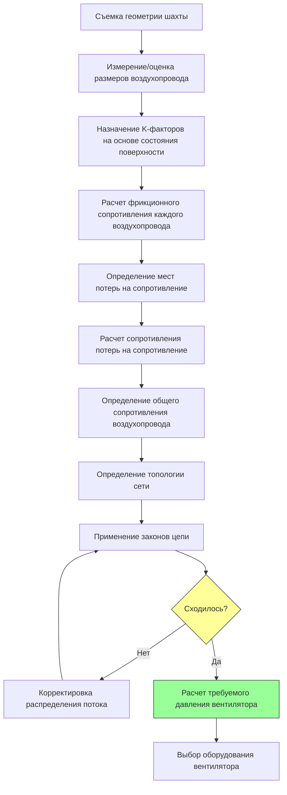

## Фундаментальная физика сопротивления воздухопроводов в шахтах

Сопротивление воздухопроводов в подземных шахтах определяет перепад давления, необходимый для перемещения воздуха через сеть вентиляции. В отличие от обычных HVAC систем с гладкими воздухопроводами, шахтные воздухопроводы демонстрируют сложные характеристики сопротивления из-за шероховатых поверхностей, неправильных сечений, препятствий и геометрических разрывов.

Общее сопротивление, встречаемое воздушным потоком, состоит из двух основных компонентов: **фрикционного сопротивления** вдоль поверхностей воздухопровода и **потерь на сопротивление** в местах разрывов, таких как повороты, соединения и препятствия.

## Уравнение Аткинсона

Уравнение Аткинсона представляет фундаментальное соотношение между перепадом давления и воздушным потоком в шахтных воздухопроводах:

$$P = RQ^2$$

Где:
- $P$ = перепад давления в воздухопроводе (Па)
- $R$ = сопротивление воздухопровода (Нс²/м⁸)
- $Q$ = объемный расход воздуха (м³/с)

Это соотношение квадратичного закона отражает турбулентный режим потока, который доминирует в системах вентиляции шахт. Величина сопротивления $R$ инкапсулирует физические характеристики воздухопровода.

### Расчет фрикционного сопротивления

Фрикционное сопротивление воздухопровода шахты вытекает из уравнения Дарси-Вейсбаха, адаптированного для условий шахты:

$$R_f = \frac{kPL}{A^3}$$

Где:
- $R_f$ = фрикционное сопротивление
- $k$ = коэффициент трения (K-фактор) (кг/м³)
- $P$ = периметр воздухопровода (м)
- $L$ = длина воздухопровода (м)
- $A$ = площадь поперечного сечения (м²)

Член $A^3$ в знаменателе демонстрирует, почему небольшие сокращения площади воздухопровода резко увеличивают сопротивление. Сокращение площади на 10% увеличивает сопротивление примерно на 37%.

### Определение коэффициента трения (K-фактора)

Коэффициент трения количественно оценивает шероховатость поверхности и интенсивность турбулентности. Типичные значения K-фактора для шахтных воздухопроводов:

| Тип воздухопровода | K-фактор (кг/м³) | K-фактор (lb/ft³) |
|-------------|------------------|-------------------|
| Гладкий облицованный бетоном штрек | 0.004 - 0.006 | 0.00025 - 0.00037 |
| Облицованный торкретобетоном штрек | 0.006 - 0.009 | 0.00037 - 0.00056 |
| Необлицованный скальный штрек (гладкий взрыв) | 0.009 - 0.015 | 0.00056 - 0.00094 |
| Необлицованный скальный штрек (шероховатый) | 0.015 - 0.030 | 0.00094 - 0.0019 |
| Штрек с деревянным креплением | 0.020 - 0.040 | 0.0012 - 0.0025 |
| Заполненный щебнем или разрушенный воздухопровод | 0.040 - 0.100 | 0.0025 - 0.0062 |

K-факторы должны определяться посредством полевых измерений или выбираться консервативно в зависимости от состояния воздухопровода согласно руководящим принципам MSHA (30 CFR Part 57).

## Потери на сопротивление в шахтных воздухопроводах

Потери на сопротивление возникают в местах разрывов воздушного потока, где кинетическая энергия преобразуется в турбулентность и тепло. Перепад давления потерь на сопротивление следует формуле:

$$P_s = X \cdot \frac{\rho v^2}{2}$$

Где:
- $P_s$ = перепад давления потерь на сопротивление (Па)
- $X$ = коэффициент потерь на сопротивление (безразмерный)
- $\rho$ = плотность воздуха (кг/м³)
- $v$ = скорость воздуха (м/с)

Это может быть выражено через расход воздуха и площадь:

$$P_s = X \cdot \frac{\rho Q^2}{2A^2}$$

### Обычные коэффициенты потерь на сопротивление

| Тип разрыва | Коэффициент X |
|-------------------|---------------|
| Гладкий поворот на 90° (r/d > 2) | 0.20 - 0.35 |
| Острый поворот на 90° (r/d < 1) | 1.10 - 1.30 |
| Соединение воздухопровода (прямое течение) | 0.20 - 0.40 |
| Соединение воздухопровода (поворот на 90°) | 1.00 - 1.50 |
| Внезапное расширение | $(1 - A_1/A_2)^2$ |
| Внезапное сужение | $0.5(1 - A_2/A_1)$ |
| Дверь в закрытом положении | 0.05 - 0.10 |
| Дверь открыта на 90° | 2.50 - 5.00 |
| Регулятор (частично закрыт) | 2.00 - 20.0 |

Эквивалентное сопротивление потерь на сопротивление для включения в уравнение Аткинсона:

$$R_s = \frac{X \rho}{2A^2}$$

## Анализ сети вентиляции

Системы вентиляции шахт включают сложные сети, где воздухопроводы соединяются в последовательных и параллельных конфигурациях. Методы анализа цепей определяют распределение воздушного потока и требования к давлению.

### Последовательные цепи воздухопроводов

Для воздухопроводов, соединенных последовательно, общее сопротивление равно сумме отдельных сопротивлений:

$$R_{total} = R_1 + R_2 + R_3 + ... + R_n$$

Одинаковый воздушный поток проходит через каждый сегмент, и перепады давления складываются:

$$P_{total} = R_{total}Q^2 = (R_1 + R_2 + R_3)Q^2$$

### Параллельные цепи воздухопроводов

Для воздухопроводов, соединенных параллельно, воздушный поток распределяется между ветвями, в то время как перепад давления остается равным на всех путях. Соотношение эквивалентного сопротивления:

$$\frac{1}{\sqrt{R_{eq}}} = \frac{1}{\sqrt{R_1}} + \frac{1}{\sqrt{R_2}} + \frac{1}{\sqrt{R_3}} + ... + \frac{1}{\sqrt{R_n}}$$

Воздушный поток распределяется обратно пропорционально квадратному корню сопротивления:

$$\frac{Q_1}{Q_2} = \sqrt{\frac{R_2}{R_1}}$$

Это означает, что воздушный поток преимущественно следует путями с низким сопротивлением. Ветвь с половиной сопротивления переносит только в 1.41 раза больше воздушного потока, а не вдвое больше.

## Процесс моделирования сети

Комплексный анализ сети вентиляции следует этому систематическому подходу:

Метод Харди Кросса или компьютерные решатели сетей итеративно балансируют сеть, регулируя потоки до тех пор, пока законы Кирхгофа не будут удовлетворены на всех узлах.

## Практический пример расчета

Рассмотрим штрек длиной 500 м со следующими характеристиками:
- Поперечное сечение: 4.5 м × 4.0 м (прямоугольное)
- K-фактор: 0.012 кг/м³ (необлицованная скала)
- Требуемый воздушный поток: 50 м³/с
- Один острый поворот на 90° (X = 1.2)

**Фрикционное сопротивление:**

$$A = 4.5 \times 4.0 = 18 \text{ м}^2$$
$$P = 2(4.5 + 4.0) = 17 \text{ м}$$
$$R_f = \frac{0.012 \times 17 \times 500}{18^3} = \frac{102}{5832} = 0.0175 \text{ Нс}^2/\text{м}^8$$

**Сопротивление потерь на сопротивление:**

Плотность воздуха при типичных условиях шахты: $\rho = 1.2$ кг/м³

$$R_s = \frac{1.2 \times 1.2}{2 \times 18^2} = \frac{1.44}{648} = 0.0022 \text{ Нс}^2/\text{м}^8$$

**Общее сопротивление и давление:**

$$R_{total} = 0.0175 + 0.0022 = 0.0197 \text{ Нс}^2/\text{м}^8$$
$$P = 0.0197 \times 50^2 = 49.25 \text{ Па}$$

## Нормативные соображения MSHA

Нормы Администрации по безопасности и охране здоровья в горной промышленности (MSHA) согласно 30 CFR Part 57 требуют точного определения сопротивления системы вентиляции для:

- Выбора вентилятора и проверки емкости давления
- Ежеквартальных съемок вентиляции с документированием распределения воздушного потока
- Планирования эвакуации при чрезвычайных ситуациях на основе моделирования распространения дыма
- Оценки возможности реверса воздуха

Расчеты сопротивления должны учитывать наихудшие сценарии, включая разрушение воздухопровода, размещение оборудования и сезонные вариации плотности воздуха.

## Стратегии оптимизации

Снижение сопротивления вентиляции шахты уменьшает требуемую мощность вентилятора (пропорциональной $Q \times P = RQ^3$) и эксплуатационные расходы:

1. **Расширение воздухопровода**: увеличение площади на 20% сокращает сопротивление примерно на 49%
2. **Обработка поверхности**: облицовка торкретобетоном может снизить K-факторы на 30-50%
3. **Обтекаемость**: установка направляющих лопаток на поворотах снижает потери на сопротивление на 70-80%
4. **Техническое обслуживание воздухопровода**: регулярная очистка и удаление мусора предотвращают увеличение сопротивления
5. **Переконфигурация сети**: параллельные воздухопроводы снижают эквивалентное сопротивление

Эти стратегии требуют капитальных инвестиций, но обеспечивают долгосрочную экономию за счет снижения потребления мощности вентилятора и улучшенной эффективности доставки воздушного потока.
