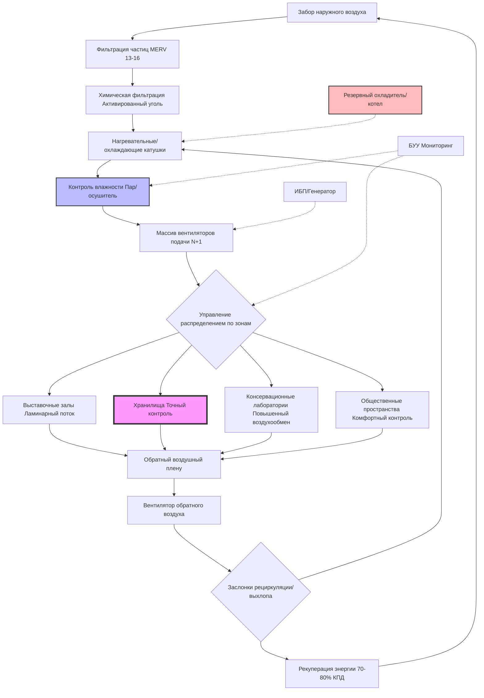

Системы климатического контроля для музеев, галерей, архивов и библиотек представляют уникальные инженерные задачи, которые балансируют требования сохранения артефактов с комфортом посетителей и энергоэффективностью. Эти объекты требуют исключительной точности в управлении температурой и влажностью, превосходного качества воздуха и резервирования систем для защиты бесценных коллекций.

## Основы управления окружающей средой

Среда сохранения материалов культурного наследия определяется строгими термогигрометрическими критериями, установленными на основе десятилетий исследований в области консервации. ASHRAE Handbook—HVAC Applications, Глава 24 (Музеи, Галереи, Архивы и Библиотеки) предоставляет комплексное руководство по проектированию на основе ISO 11799 и других международных стандартов.

### Технические характеристики температуры и влажности по типам коллекций

| Тип коллекции | Диапазон температуры | Относительная влажность | Сезонные колебания | Суточные колебания |
|---|---|---|---|---|
| Общие смешанные коллекции | 20-22°C | 45-55% | ±2°C | ±1°C |
| Картины на холсте | 20-21°C | 50-55% | ±1°C | ±1°C |
| Произведения на бумаге | 18-21°C | 45-50% | ±2°C | ±3% ОВ |
| Фотографии (Ч/Б) | 18-20°C | 30-40% | ±1°C | ±2% ОВ |
| Фотографии (цветные) | 2-18°C | 30-40% | ±2°C | ±5% ОВ |
| Металлы и доспехи | 15-20°C | 30-40% | ±2°C | ±5% ОВ |
| Органические материалы (текстиль, дерево) | 18-21°C | 50-55% | ±1°C | ±2% ОВ |
| Книги и рукописи | 18-21°C | 35-50% | ±2°C | ±5% ОВ |
| Пленка и магнитные носители | 2-10°C | 20-30% | ±1°C | ±2% ОВ |
| Археологические материалы | 15-21°C | 40-55% | ±2°C | ±5% ОВ |

### Требования стабильности влажности

Скорость изменения влажности критически влияет на гигроскопичные материалы. Критерий размерной стабильности органических материалов выражается как:

$$\frac{d\phi}{dt} \leq 5\% \text{ ОВ/ч}$$

Где $\phi$ представляет относительную влажность. Для особо чувствительных коллекций максимально допустимая скорость изменения снижается до:

$$\frac{d\phi}{dt} \leq 2\% \text{ ОВ/ч}$$

Требуемая емкость буферизации влаги системой HVAC может быть рассчитана с использованием:

$$m_w = \frac{V \cdot \rho_a \cdot \Delta\omega}{\eta_{humid}}$$

Где:
- $m_w$ = скорость добавления/удаления влаги (кг/ч)
- $V$ = объем помещения (м³)
- $\rho_a$ = плотность воздуха (кг/м³)
- $\Delta\omega$ = изменение коэффициента влажности (кг воды/кг сухого воздуха)
- $\eta_{humid}$ = эффективность системы увлажнения

## Архитектура системы HVAC музея

## Управление загрязняющими веществами и фильтрация

Материалы культурного наследия портятся в результате воздействия газообразных и твердых загрязняющих веществ. Скорость распада загрязняющих веществ следует кинетике первого порядка:

$$\frac{dC}{dt} = -k \cdot C \cdot P$$

Где:
- $C$ = концентрация загрязняющего вещества (мкг/м³)
- $k$ = константа распада, зависящая от материала (м³/мкг·ч)
- $P$ = фактор активности загрязняющего вещества

Целевые максимальные концентрации для сред сохранения:

| Загрязняющее вещество | Максимальная концентрация | Метод фильтрации |
|---|---|---|
| Твердые частицы (PM2,5) | <5 мкг/м³ | Фильтры MERV 14-16 |
| Диоксид серы (SO₂) | <1 мкг/м³ | Активированный уголь |
| Диоксид азота (NO₂) | <10 мкг/м³ | Перманганат калия |
| Озон (O₃) | <2 мкг/м³ | Активированный уголь |
| Формальдегид (HCHO) | <10 мкг/м³ | Активированный глинозем |
| Летучие органические соединения | <100 мкг/м³ | Активированный уголь |
| Уксусная кислота | <200 мкг/м³ | Карбонат натрия |

Эффективность воздухообмена для удаления загрязняющих веществ рассчитывается как:

$$\epsilon_p = \frac{C_o - C_s}{C_o - C_z} \times 100\%$$

Где $C_o$, $C_s$ и $C_z$ представляют концентрации загрязняющих веществ на улице, в подаваемом воздухе и в зоне соответственно.

## Балансирование сохранения и комфорта посетителей

Музейные системы HVAC должны примирять конкурирующие требования. Оптимальные условия сохранения (18-21°C, 45-50% ОВ) ниже типичных ожиданий комфорта (22-24°C, 40-60% ОВ). К стратегиям проектирования относятся:

**Зональное управление климатом**: Разделите среды галереи (приоритет сохранения) от вестибюлей и кафе (приоритет комфорта) с использованием воздушных шлюзов и перепадов давления 5-10 Па.

**Сезонная акклиматизация**: Допускайте контролируемые сезонные корректировки уставок температуры ±2°C для снижения теплового шока посетителей при сохранении стабильности влажности.

**Лучистое отопление/охлаждение**: Разместите лучистые панели в галереях с высокой плотностью посетителей для обеспечения комфорта при более низких температурах воздуха, снижая конвективный воздушный поток, который может повредить хрупкие объекты.

**Вентиляция, зависящая от занятости**: Внедрите управление спросом на основе CO₂ (DCV) для выполнения требований ASHRAE 62.1 (2,1 м³/(ч·чел) + 0,34 м³/(ч·м²)) без избыточной кондиционирования неиспользуемых пространств.

Индекс эффективной температуры для комфорта посетителей в музейных условиях составляет:

$$ET^* = T_a + 0.4(T_r - T_a) - 0.15(v - 0.1)$$

Где $T_a$ = температура воздуха, $T_r$ = средняя радиационная температура и $v$ = скорость воздуха (м/с).

## Резервирование систем и мониторинг

Защита коллекций требует безотказной работы. Критические элементы проектирования включают:

- **Резервирование N+1** для всего первичного оборудования обработки воздуха
- **Двухпроходное управление влажностью** (паровпрыск + осушение охлажденной водой)
- **Резервное питание** минимум на 48 часов непрерывной работы
- **Система управления зданием** с круглосуточным мониторингом и сигналами тревоги при отклонениях ±1°C и ±3% ОВ
- **Логирование данных** с интервалом 15 минут для температуры, влажности и точки росы

Требование надежности системы для помещений коллекций класса А обычно превышает 99,9% времени работы, что соответствует максимальному допустимому простою 8,76 часов в год.
