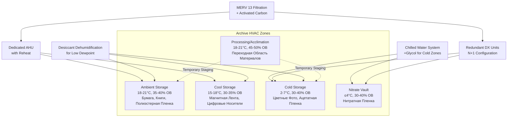

Среды хранения архивов требуют точного контроля HVAC для предотвращения деградации уникальных материалов. Скорость химической деградации удваивается при каждом увеличении температуры на 5,6°C и резко ускоряется при неправильных уровнях влажности. Проектирование HVAC-системы для архивов требует понимания специфических требований к хранению для различных типов носителей, внедрения надлежащих стратегий зонирования и поддержания жестких допусков окружающей среды.

## Условия хранения по типам носителей

Различные архивные материалы требуют отдельных параметров окружающей среды в зависимости от их химического состава и механизмов деградации.

### Основные категории коллекций

| Тип носителя | Температура | Относительная влажность | Макс. отклонение | Воздухообмены/час |
|------------|-------------|-------------------|---------------|------------------|
| Бумажные документы | 18-21°C | 30-40% ОВ | ±1,1°C, ±3% ОВ | 4-6 |
| Фотографии (черно-белые) | 18-21°C | 30-40% ОВ | ±1,1°C, ±3% ОВ | 4-6 |
| Цветные фотографии | 2-7°C | 30-40% ОВ | ±1,1°C, ±3% ОВ | 4-6 |
| Нитратная пленка | ≤4°C | 30-40% ОВ | ±1,1°C, ±3% ОВ | 8-10 |
| Ацетатная пленка | 2-7°C | 30-40% ОВ | ±1,1°C, ±3% ОВ | 4-6 |
| Полиэстерная пленка | 18-21°C | 30-40% ОВ | ±1,1°C, ±3% ОВ | 4-6 |
| Магнитная лента | 15-18°C | 25-35% ОВ | ±1,1°C, ±3% ОВ | 4-6 |
| Цифровые оптические носители | 15-21°C | 20-30% ОВ | ±1,7°C, ±5% ОВ | 2-4 |

### Механизмы деградации материалов

**Бумажные коллекции:**
Скорость гидролиза целлюлозы определяет долговечность бумаги. При 21°C и 50% ОВ бумага деградирует примерно в два раза быстрее, чем при 15°C и 35% ОВ. Бумаги, содержащие лигнин, желтеют в результате окисления, ускоряемого светом, высокой температурой и высокой влажностью. Кислотная бумага подвергается автокаталитической деградации, требующей более низкой температуры и влажности для сохранения.

**Фотографические материалы:**
Стабильность цветного красителя следует кинетике реакции Аррениуса. Холодное хранение при 2-7°C продлевает срок службы красителя в 5-10 раз по сравнению с хранением при комнатной температуре. Желатиновые эмульсии требуют контролируемую влажность для предотвращения хрупкости ниже 25% ОВ или грибкового роста выше 60% ОВ. Серебряно-желатиновые отпечатки допускают более широкие диапазоны температур, чем цветные материалы, но все же выигрывают от стабильных условий.

**Пленочные основы:**
Целлюлозонитратная пленка подвергается автокаталитическому разложению с выделением оксидов азота, требующему холодного изолированного хранения с высокими скоростями вентиляции. Целлюлозоацетатная пленка страдает от синдрома уксуса (выделение уксусной кислоты), ускоряемого повышенной температурой и влажностью. Полиэстеровые базовые пленки демонстрируют превосходную стабильность, но все еще требуют контроля окружающей среды для сохранения эмульсии.

**Магнитные носители:**
Осыпание оксида и гидролиз связующего происходят на магнитных лентах при высокой влажности. Хранение при низкой температуре (15-18°C) снижает скорость химической деградации. Относительная влажность ниже 25% вызывает проблемы с статическим электричеством, а выше 40% ускоряет гидролиз. Циклирование температуры вызывает изменения размеров, приводящие к механическому стрессу.

## Стратегия зонирования HVAC для архивов

## Проектирование системы холодного хранилища

Холодные хранилища для цветных фотографий и ацетатной пленки требуют специализированных подходов HVAC, отличных от стандартной холодильной техники.

**Контроль температуры:**
Поддерживайте температуру 2-7°C с помощью выделенных контуров охлажденной воды или систем прямого расширения. Избегайте температур ниже нуля, которые могут вызвать растрескивание эмульсии. Установите резервное охлаждение с автоматической переключением. Используйте растворы гликоля в системах охлажденной воды, обслуживающих холодные зоны, для предотвращения повреждения замерзанием при низких нагрузках.

**Управление влажностью:**
Низкие температуры снижают абсолютную емкость влаги, требуя тщательного контроля влажности. Рассчитайте температуру точки росы для предотвращения конденсации на холодных поверхностях. Используйте осушители с адсорбентом перед охлаждающими змеевиками для достижения низкой точки росы без чрезмерного охлаждения. Переподогрейте после охлаждения для достижения целевой относительной влажности при температуре хранения.

**Тепловая буферизация:**
Конструкция с высокой теплоемкостью снижает колебания температуры во время циклирования оборудования. Изолируйте холодные хранилища до RSI-5,3 минимум. Установите паровые барьеры на теплой стороне изоляции для предотвращения миграции влаги. Предусмотрите входные тамбуры с градиентами температуры/влажности для минимизации инфильтрации при доступе.

## Системы контроля влажности

Требования архивов к влажности требуют круглогодичного точного контроля независимо от наружных условий.

**Осушение:**
Стандартное осушение, основанное на охлаждении, не может достичь 30-40% ОВ при 18-21°C зимой. Осушители с адсорбентом, использующие колеса с силикагелем или молекулярным ситом, обеспечивают воздух с низкой точкой росы. Регенерируйте адсорбент, используя газовое тепло или утилизацию тепла. Рассчитайте требуемую депрессию точки росы на основе нагрузок наружного воздуха и скоростей инфильтрации.

**Увлажнение:**
Парогенераторы пар-в-пар обеспечивают чистое увлажнение без минеральных частиц. Избегайте увлажнителей с испаряемыми носителями, которые могут содержать микроорганизмы. Управляйте увлажнением на основе точки росы, а не относительной влажности, для предотвращения перерегулирования при изменении уставки температуры. Установите предельные гигростаты для предотвращения неконтролируемых условий.

**Стратегия управления:**
Реализуйте петли управления PI или PID с узкими мертвыми зонами (±2% ОВ). Разделите осушение перед охлаждением и увлажнение после нагрева для минимизации энергопотребления. Контролируйте абсолютную влажность (г/кг) для отслеживания добавления/удаления влаги независимо от изменений температуры.

## Фильтрация и качество воздуха

Твердые частицы, газообразные загрязнители и биологические загрязнители ускоряют деградацию материалов.

**Фильтрация частиц:**
Фильтры MERV 13 (85% эффективность при 1-3 мкм) удаляют большинство частиц, включая пыль, сажу и споры плесени. Более высокие рейтинги MERV увеличивают перепад давления и энергопотребление вентилятора. Мешочные фильтры обеспечивают большую площадь поверхности при приемлемом перепаде давления. Контролируйте дифференциальное давление и заменяйте фильтры до чрезмерного загрязнения.

**Газовая фильтрация:**
Активированный уголь адсорбирует летучие органические соединения, диоксид серы и оксиды азота. Перманганат калия на глиноземе, пропитанный глиноземом, нацелен на формальдегид и другие альдегиды. Подберите размер газофазной фильтрации на основе концентраций наружных загрязнителей и требуемой эффективности удаления. Заменяйте носитель на основе тестирования прорыва или запланированных интервалов.

**Скорости вентиляции:**
Минимизируйте наружный воздух для снижения нагрузок фильтрации и требований контроля влажности. Стандарт ASHRAE 62.1 не применяется к неоккупируемым помещениям хранения. Обеспечьте 4-6 воздухообменов в час для общих коллекций, 8-10 для хранилищ нитратной пленки. Используйте циркуляцию воздуха для предотвращения стратификации без чрезмерных скоростей, которые поднимают пыль.

**Положительное давление:**
Поддерживайте положительное давление 5-12 Па относительно соседних помещений для предотвращения инфильтрации неконтролируемого воздуха. Герметизируйте проемы и установите соответствующие уплотнители дверей. Уравновесьте потоки приточного и вытяжного воздуха с учетом путей инфильтрации.

## Мониторинг и сигнализация

Непрерывный мониторинг с быстрым реагированием сигнализации предотвращает повреждение коллекций при отказе оборудования.

Установите калиброванные датчики температуры и влажности каждые 93-186 м² в пределах зон хранения. Используйте калибровочные стандарты с прослеживаемостью до NIST ежегодно. Предусмотрите резервные датчики для критических коллекций. Реализуйте отслеживание системы автоматизации зданий с минимальным интервалом логирования 15 минут. Настройте сигналы тревоги для отклонений ±1,7°C и ±5% ОВ с эскалирующимися уведомлениями. Включите сигналы отказа электроэнергии, состояния оборудования и дифференциального давления фильтра. Поддерживайте резервное питание для критического оборудования HVAC, обслуживающего уникальные коллекции.
