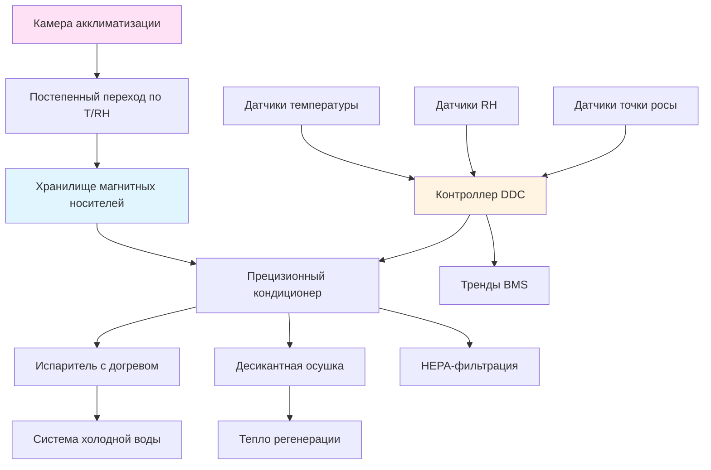

## Обзор

Хранение магнитных носителей требует точного контроля окружающей среды для предотвращения механизмов деградации, включая потерю магнитного сигнала, гидролиз связующего и деформацию подложки. Система HVAC должна поддерживать узкие диапазоны температуры и влажности с минимальными колебаниями для сохранения аналоговых видеолент, аудиокассет и магнитных дисководов, содержащих архивный контент.

Основными путями деградации магнитных носителей являются химические реакции, зависящие от температуры, и вызванная влажностью гидролизная деградация полиэфир-уретановых связующих. Повышенные температуры ускоряют окисление магнитных частиц и разрушение связующего, тогда как избыточная влажность вызывает синдром «липкой ленты» в ленточных носителях и коррозию в магнитных дисках.

## Стандарты условий хранения

### Требования SMPTE и ISO

SMPTE 2254 и ISO 18923 устанавливают параметры окружающей среды для сохранения магнитных носителей на основе исследований ускоренного старения и анализа химической кинетики.

**Краткосрочное хранение (до 10 лет):**
| Параметр | Спецификация | Допуск |
|------|---|---|
| Температура | 18-20°C | ±1°C |
| Относительная влажность | 30-40% | ±5% |
| Максимальная скорость изменения | 1°C/ч | Температура |
| Максимальная скорость изменения | 5%/ч | Влажность |

**Долгосрочное архивное хранение (50+ лет):**
| Параметр | Спецификация | Допуск |
|------|---|---|
| Температура | 10-13°C | ±1°C |
| Относительная влажность | 20-30% | ±3% |
| Максимальная скорость изменения | 0,5°C/ч | Температура |
| Максимальная скорость изменения | 3%/ч | Влажность |

Более низкие спецификации температуры и влажности для долгосрочного хранения значительно снижают скорости химических реакций. Уравнение Аррениуса предсказывает удвоение ожидаемого срока службы носителя при каждом снижении температуры хранения на 5,5°C в пределах стабильного диапазона.

### Требования к конкретным типам носителей

Различные формулы магнитных носителей демонстрируют разную чувствительность к условиям окружающей среды в зависимости от химии связующего и материалов подложки.

| Тип носителя | Температура | Относительная влажность | Критические аспекты |
|------|---|---|---|
| Видеолента (VHS, Betacam) | 18-20°C | 30-40% | Полиэфир-уретановое связующее подвержено гидролизу при RH выше 50% |
| Аудиолента (кассета на кассете) | 18-20°C | 25-35% | Ацетатная основа требует более низкой влажности, чем полиэстер |
| Компьютерная лента (LTO, DLT) | 17-20°C | 20-40% | Формуляции с металлическими частицами выдерживают более широкий диапазон RH |
| Магнитные диски (жесткие диски) | 18-21°C | 30-45% | Зазор головки чтения/записи чувствителен к экстремальным значениям влажности |
| Ленты DAT и Hi8 | 18-20°C | 30-40% | Металлизированные ленты более стабильны, но все же подвержены гидролизу |

## Проектирование системы контроля окружающей среды

### Конфигурация системы HVAC

**Охлаждение и осушение:**
Система должна обеспечивать независимый контроль температуры и влажности для поддержания узких рабочих диапазонов. Конфигурация испарителя с догревом, использующая холодную воду при 6-7°C, обеспечивает sensible cooling (охлаждение без осушения), в то время как низкотемпературное десикантное колесо удаляет влагу без чрезмерного охлаждения. Этот подход предотвращает циклирование и колебания температуры/влажности, характерные для обычных систем DX.

**Распределение воздуха:**
Ламинарный поток воздуха со скоростью 0,10-0,15 м/с (20-30 фт/мин) по полкам хранения предотвращает стратификацию и обеспечивает равномерные условия во всем хранилище. Распределители приточного воздуха не должны создавать высокоскоростные струи, которые нарушают осаждение частиц или вызывают локальные колебания влажности.

**Резервирование и мониторинг:**
Две независимые линии осушения с автоматическим переключением при отказе предотвращают отклонения влажности во время технического обслуживания или выхода оборудования из строя. Непрерывный мониторинг с точностью ±1°F (±0,6°C) и ±2% по влажности обеспечивает раннее предупреждение о деградации системы. Журналы данных с интервалом 5 минут создают аудиторские следы для страховых случаев и управления коллекциями.

## Механизмы деградации и методы предотвращения

**Синдром «липкой ленты» (Sticky-Shed Syndrome):**
Гидролиз полиэфир-уретанового связующего происходит при разрыве полимерных цепей молекулами воды, что приводит к осыпанию ленты и потере адгезии. Поддержание относительной влажности (RH) ниже 40% предотвращает поглощение влаги слоем связующего. Скорость реакции удваивается при каждом повышении температуры на 18°F (10°C).

**Деградация магнитного сигнала:**
Магнитные частицы постепенно теряют коэрцитивную силу из-за тепловых флуктуаций и окисления. Хранение при температуре 50–55°F (10–13°C) снижает тепловую энергию, доступную для переориентации магнитных доменов, продлевая сохранность сигнала с десятилетий до столетий.

**Деформация подложки:**
Полиэфирная и ацетатная основа ленты расширяется и сжимается при изменении влажности. Циклирование между высокой и низкой влажностью создает механические напряжения, коробление и межслойную адгезию. Поддержание стабильной влажности в пределах ±3% предотвращает изменения размеров, превышающие упругие пределы основы ленты.

## Протокол акклиматизации

Медиа, извлеченные из холодного хранилища, требуют постепенной термической и влажностной акклиматизации перед воспроизведением для предотвращения конденсации и термического шока. Перемещайте ленты из хранилища при 50°F (10°C) в камеру акклиматизации при 65°F (18°C) со скоростью не более 5°F (3°C) в час. Дайте 24 часа на полную акклиматизацию перед пропусканием через оборудование для воспроизведения. Это предотвращает конденсацию влаги на холодных магнитных поверхностях и осыпание оксидного слоя при резких перепадах температур.

## Проверка производительности системы

Ежеквартально проверяйте производительность системы HVAC с помощью калиброванных регистраторов данных, размещенных по всему объему хранилища. Убедитесь в равномерности температуры в пределах ±2°F (±1,1°C) и равномерности влажности в пределах ±5% между всеми точками измерения. Ежегодно тестируйте переключение на резервный осушитель и убедитесь, что время отклика соответствует допустимому риску для коллекции. Анализируйте трендовые данные на предмет дрейфа, частоты циклирования и отклонений уставок, превышающих пороги управления.
