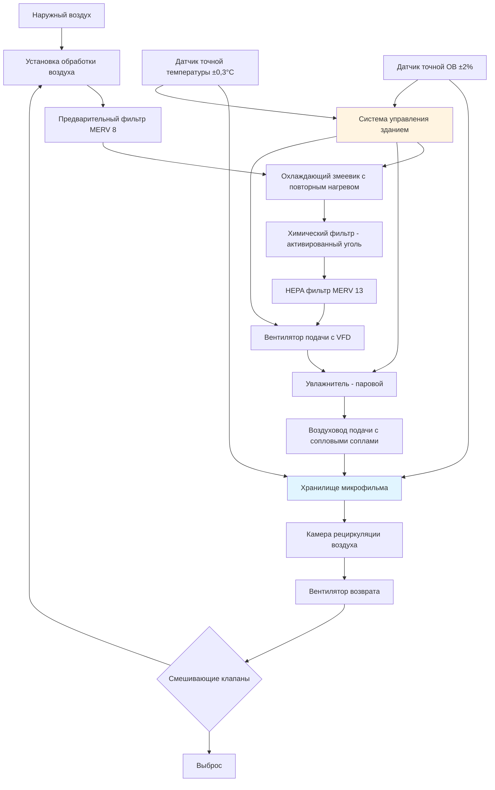

Сохранение микрофильма требует точного управления окружающей средой для предотвращения химической деградации, нестабильности размеров и ухудшения изображения. Различные типы микрофильма — галогенид серебра, диазо и везикулярные — требуют специфических условий температуры и влажности на основе их химического состава и характеристик долгосрочной стабильности.

## Требования к хранению микрофильма по типам

Три основных формата микрофильма проявляют различную чувствительность к окружающей среде, определяемую их химической структурой и механизмами деградации.

| Тип пленки | Диапазон температуры | Относительная влажность | Максимальная скорость изменения | Основной механизм деградации |
|-----------|-------------------|-------------------|------------------------|-------------------------------|
| Галогенид серебра (среднесрочное) | 18-21°C | 30-40% | ±1,1°C/час, ±3%/день | Окисление, красные пятна |
| Галогенид серебра (архивное) | ≤2°C | 30-40% | ±1,1°C/час, ±3%/день | Синдром уксуса на ацетатной основе |
| Диазо пленка | 18-21°C | 30-50% | ±1,1°C/час, ±3%/день | Выцветание красителя, гидролиз основы |
| Везикулярная пленка | 18-21°C | 30-50% | ±1,1°C/час, ±3%/день | Размягчение термопластического слоя |

### Микрофильм галогенида серебра

Пленка из галогенида серебра, наиболее стабильный формат для архивного сохранения, состоит из частиц металлического серебра, взвешенных в желатине на полиэстеровой или ацетатной основе. Для среднесрочного хранения (до 100 лет) поддерживайте 18-21°C при 30-40% ОВ. Архивное хранилище (500+ лет) требует ≤2°C при 30-40% ОВ для остановки процессов химической деградации.

Нижний предел влажности предотвращает хрупкость и растрескивание желатины. Верхний предел контролирует реакции окисления и предотвращает красные пятна — микроскопические частицы серебра, которые мигрируют на поверхность пленки. Пленки на ацетатной основе требуют холодного хранилища для предотвращения автокаталитической деацетилизации (синдром уксуса).

### Диазо микрофильм

Диазо пленка содержит азокрасители, которые образуют цветные изображения через химию диазотипии. Хранение при 18-21°C и 30-50% ОВ минимизирует выцветание красителя. Влажность ниже 30% вызывает хрупкость основы, а влажность выше 50% ускоряет гидролитическую деградацию молекул красителя.

Повышенные температуры экспоненциально увеличивают скорость выцветания красителя в соответствии с кинетикой Аррениуса. Каждое увеличение температуры на 5,6°C примерно удваивает скорость деградации.

### Везикулярный микрофильм

Везикулярная пленка записывает изображения как микроскопические пузырьки в термопластическом слое. Температуры хранения должны оставаться ниже 18-21°C для предотвращения размягчения пластиковой матрицы, которое вызовет слияние пузырьков и деградацию изображения. Контроль влажности при 30-50% ОВ предотвращает размерные изменения в основе пленки.

## HVAC система микрофильмового хранилища

## Требования к проектированию HVAC системы

### Контроль температуры

Точное охлаждение с возможностью повторного нагрева поддерживает уставку в пределах ±1,1°C. Используйте охлаждающие змеевики прямого расширения (DX) или охлаждаемую воду с модулирующим горячим водоснабжением или электрическим повторным нагревом. Датчики температуры с точностью ±0,3°C и разрешением 0,05°C обеспечивают точный контроль.

Температура подаваемого воздуха обычно работает на 2,8-4,4°C ниже уставки хранилища, чтобы обеспечить адекватное ощутимое охлаждение без чрезмерной скорости воздуха. Регуляторы частоты (VFD) на вентиляторах подачи модулируют расход воздуха в зависимости от теплонагрузки.

### Контроль влажности

Поддерживайте ОВ в пределах ±3% от уставки, используя точное паровое увлажнение. Осушение адсорбентом обеспечивает превосходный контроль по сравнению с методами переохлаждения и повторного нагрева. Установите датчики ОВ с точностью ±2%, калибруемыми раз в полгода.

Рассчитайте влажностную нагрузку от утечки воздуха, занятости и выделения газов пленкой. Пленки галогенида серебра выделяют пары уксусной кислоты, требующие непрерывной вентиляции.

### Распределение воздуха

Спроектируйте распределение воздуха для минимальной скорости в местах хранения пленки (<0,25 м/с) для предотвращения механических вибраций и локальной температурной стратификации. Используйте перфорированные диффузоры или ультразвуковые сопла для единообразных картин потока воздуха.

Поддерживайте положительное давление (+5-12 Па) относительно смежных помещений для предотвращения инфильтрации неконтролируемого воздуха и загрязняющих веществ.

### Требования к фильтрации

Внедрите трехуровневую фильтрацию в соответствии со стандартами ANSI/AIIM MS23 и MS45:

1. **Предварительная фильтрация**: фильтры MERV 8 удаляют крупные частицы
2. **Химическая фильтрация**: активированный уголь или среда перманганата калия удаляют окисляющие газы (O₃, NOₓ, SO₂)
3. **Тонкая фильтрация**: фильтры MERV 13 захватывают частицы >0,3 мкм

Окисляющие газы ускоряют деградацию серебристого изображения через окислительно-восстановительные реакции. Поддерживайте уровни газовых загрязняющих веществ ниже предельных значений ANSI IT9.11: <1 ppb для окисляющих газов.

### Воздухообмен

Обеспечьте минимум 4-6 воздухообменов в час (ACH) для хранилищ среднесрочного хранения. Архивное холодное хранилище требует 2-4 ACH. Более высокие показатели воздухообмена улучшают однородность температуры, но увеличивают потребление энергии и расходы на фильтрацию.

## Стратегии управления

### Мониторинг окружающей среды

Установите резервные датчики температуры и влажности с независимыми системами сигнализации. Регистрируйте данные об окружающей среде с интервалом минимум 15 минут. Настройте сигналы тревоги для:

- Отклонение температуры >±1,7°C от уставки
- Отклонение влажности >±5% от уставки
- Скорость изменения >1,1°C/час или 3%ОВ/день
- Отказ датчика или потеря связи

### Защита при отказах

Спроектируйте системы с отказоустойчивой эксплуатацией при механических сбоях:

- Двойные системы охлаждения с автоматическим переключением
- Аварийное осушение с использованием резервного адсорбента
- ИБП для управления и мониторинга
- Герметичное строительство хранилища для поддержания условий при кратковременных сбоях HVAC

## Энергетические соображения

Холодные хранилища для архивной пленки галогенида серебра потребляют 160-270 кДж/м²/год. Среднесрочное хранилище работает при 86-130 кДж/м²/год. Рекуперация тепла из вытяжного воздуха снижает операционные расходы на 20-30%.

Пароизоляция (коэффициент проницаемости <0,1) на всех поверхностях хранилища минимизирует миграцию влаги и снижает нагрузки на осушение. Значения изоляции RSI-5,3 для стен и RSI-7,0 для потолка ограничивают тепловой прирост в приложениях холодного хранилища.
