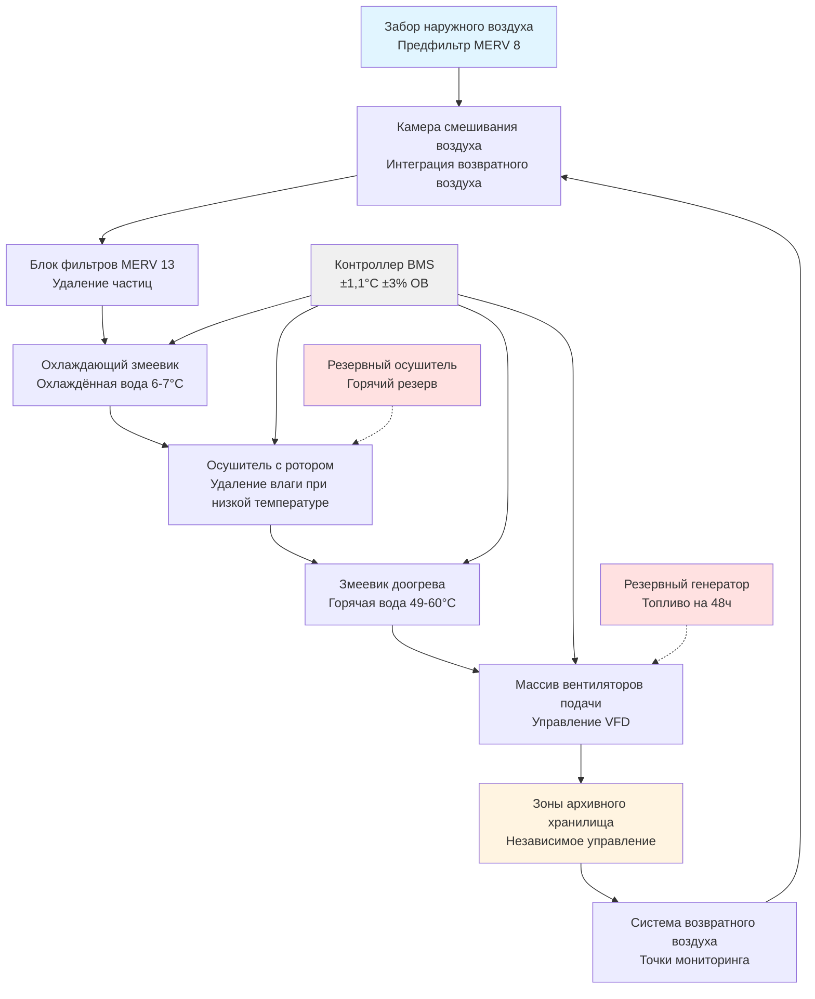

Бумажные документы являются наиболее распространённым архивным материалом, однако их консервация требует точного контроля окружающей среды. Химическая деградация целлюлозных материалов ускоряется экспоненциально при повышении температуры и колебаниях относительной влажности, что делает производительность систем HVAC критической для долговечности коллекций.

## Требования к температуре и относительной влажности

NARA (Национальный архив и администрация учёта документов) устанавливает базовые условия окружающей среды для коллекций на бумажной основе со специальными требованиями, варьирующимися в зависимости от состава материала и приоритета консервации.

### Стандартные условия хранения бумажных документов

| Тип материала | Диапазон температуры | Относительная влажность | Воздухообмены в час | Фильтрация |
|--------------|-------------------|-------------------|------------------|------------|
| Щелочная бумага | 18-21°C | 30-40% | 4-6 ACH | MERV 13 минимум |
| Кислотная бумага | 15-18°C | 30-35% | 4-6 ACH | MERV 13 минимум |
| Газетная бумага | 13-15°C | 25-35% | 6-8 ACH | MERV 13 минимум |
| Пергамент/Веллум | 15-18°C | 45-55% | 4-6 ACH | MERV 13 минимум |
| Мелованная бумага | 18-21°C | 35-45% | 4-6 ACH | MERV 13 минимум |

Более низкие температуры в пределах этих диапазонов продлевают срок консервации. На каждые 5,6°C снижения температуры хранения скорость химической деградации снижается примерно на 50%, в соответствии с уравнением Аррениуса для кинетики реакций.

## Чувствительность материала и механизмы деградации

Различные типы бумаги показывают отличающиеся чувствительности к условиям окружающей среды в зависимости от их химического состава и технологии производства.

### Матрица чувствительности к деградации

| Материал | Основной режим деградации | Температурная чувствительность | Чувствительность к влажности | Критический порог |
|----------|--------------------------|------------------------|----------------|-------------------|
| Кислотная бумага | Кислотный гидролиз | Высокая | Средняя | >24°C ускоряет разрушение |
| Щелочная бумага | Окисление | Средняя | Средняя | <20% ОВ вызывает хрупкость |
| Газетная бумага | Окисление лигнина | Очень высокая | Высокая | >21°C вызывает быстрое пожелтение |
| Пергамент | Высыхание/желатинизация | Средняя | Очень высокая | <40% ОВ вызывает растрескивание |
| Веллум | Деградация белков | Средняя | Очень высокая | >60% ОВ способствует плесени |
| Фотобумага | Деградация эмульсии | Высокая | Очень высокая | >50% ОВ риск посеребрения |

Кислотная бумага, производившаяся до 1850 года и между 1850-1990 годами, содержит лигнин и остаточные кислоты, которые катализируют цепные разрывы целлюлозы. Эти материалы получают выгоду от хранения при температурах на нижнем конце приемлемых диапазонов (15-18°C) для замедления автокаталитической деградации.

Пергамент и веллум, состоящие из коллагена белка, требуют более высокой относительной влажности (45-55%) для сохранения структурной целостности. При влажности ниже 40%, эти материалы теряют связанную воду, что приводит к изменениям размеров и растрескиванию.

## Конфигурация системы HVAC в архивах

Архивное хранилище требует выделенных систем HVAC с улучшенной осушкой, точным управлением и резервированием для предотвращения отклонений окружающей среды во время отказов оборудования.

## Критерии проектирования системы

### Требования к осушке

Поддержание 30-40% ОВ в архивном хранилище требует мощной осушки, особенно в период охлаждения, когда обычные охлаждающие змеевики не могут обеспечить достаточное удаление влаги без избыточного охлаждения.

**Осушители с ротором-осушителем** обеспечивают независимое управление влажностью без ограничений холодильной системы. Энергия регенерации (обычно 465-580 кДж на кг удалённой воды) требует рекуперации тепла или выделенных источников энергии.

**Конденсационные осушители** эффективно работают, когда точка росы помещения превышает температуру поверхности змеевика. Для 20°C при 35% ОВ (точка росы 7°C) температура подачи охлаждённой воды должна быть 6-7°C для обеспечения конденсации влаги.

### Точность контроля температуры

Стандарты NARA указывают допуск контроля температуры ±1,1°C для архивного хранилища. Достижение этого требует:

- Модуляции доогрева змеевиками горячей воды (предпочтительно) или управляемыми по SCR электрическими элементами
- Сброса температуры подачи воздуха в зависимости от нагрузки помещения
- Управления вентилятором VFD для минимизации турбулентности воздуха
- Предотвращения стратификации через надлежащее распределение воздуха

### Фильтрация и качество воздуха

Деградация бумаги ускоряется в присутствии твёрдых частиц и газообразных загрязнителей. Фильтрация MERV 13 удаляет 85-90% частиц размером 1,0-3,0 микрона, улавливая большинство пыли и спор плесени.

Фильтрация активированным углём устраняет газообразные загрязнители (NOx, SOx, формальдегид) в городской среде или пространствах с выделяющимися материалами.

## Рассмотрения конфигурации хранилища

**Документы больших размеров** (карты, архитектурные чертежи, постеры) требуют плоского хранения в неглубоких ящиках или свёрнутого хранения в климатизируемых шкафах. Свёрнутое хранение должно поддерживать постоянные условия для предотвращения дифференциального расширения по диаметру рулона.

**Плоское хранение** в металлических шкафах обеспечивает стабилизацию тепловой массы, но требует адекватной циркуляции воздуха. Внутренние части шкафов могут отставать от условий помещения на 2-4 часа при изменении уставок HVAC, требуя постепенных сезонных корректировок.

**Вертикальное размещение** увеличивает циркуляцию воздуха вокруг документов, но может создавать локальные вариации ОВ из-за близости к воздухораспределителям подачи HVAC или наружным стенам.

## Мониторинг и документирование

Непрерывный мониторинг окружающей среды калиброванными датчиками (точность ±0,11°C, ±2% ОВ) предоставляет данные для оценки консервации. Регистраторы данных должны записывать с интервалом минимум 15 минут, фиксируя суточные колебания и производительность HVAC.

Ежегодная проверка производительности системы HVAC включает:
- Измерение воздушного потока и подтверждение балансировки
- Тестирование ёмкости осушки
- Калибровку системы управления
- Оценку перепада давления на фильтрах
- Тестирование передачи аварийного питания

Отклонения окружающей среды, превышающие ±2,8°C или ±10% ОВ более 4 часов, требуют документирования и оценки состояния коллекции.
