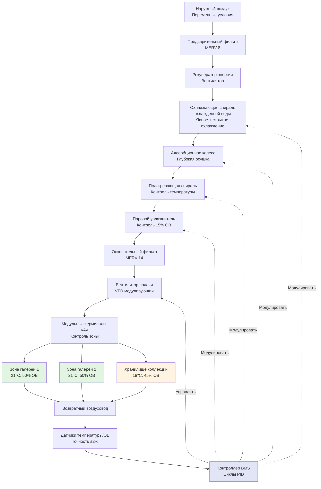

# Системы HVAC для сохранения произведений искусства

Среды для сохранения произведений искусства требуют максимального уровня точности контроля окружающей среды. Основные угрозы целостности произведений искусства включают колебания температуры, скачки влажности, загрязнение частицами и воздействие ультрафиолета. Системы HVAC для музеев, галерей и консервационных учреждений должны поддерживать стабильные условия в течение всего года, при этом приспосабливаясь к переменным нагрузкам от посетителей и экстремальным внешним погодным условиям.

## Требования к контролю окружающей среды

### Уставки температуры и влажности

ASHRAE Глава 24 (Музеи, галереи, архивы и библиотеки) и Институт консервации Getty устанавливают спецификации контроля окружающей среды на основе чувствительности коллекции. Фундаментальное требование сосредоточено на **стабильности, а не абсолютных значениях**.

| Параметр контроля | Класс AA (Точный) | Класс A (Точный) | Класс B (Общий) | Класс C (Без контроля) |
|---|---|---|---|---|
| Температура | 21°C ± 1°C | 15-25°C, ±2°C | 15-25°C, уставка может колебаться | Без контроля |
| Относительная влажность | 50% ± 5% ОВ | 50% ± 5% ОВ, сезонные корректировки | 25-75% ОВ | Без контроля |
| Скорость колебания ОВ | Макс. 5% ОВ/месяц | Макс. 10% ОВ/месяц | Предотвращение конденсации | Н/П |
| Краткосрочные колебания | ±5% ОВ в сутки | ±10% ОВ сезонно | Отсутствие резких изменений | Н/П |

Среды класса AA защищают наиболее чувствительные коллекции, требуя контроля ±5% ОВ и минимального дрейфа температуры. Этот уровень точности требует выделенного оборудования HVAC с улучшенными возможностями контроля влажности.

### Категории чувствительности произведений искусства

Различные материалы уникально реагируют на условия окружающей среды. Гигроскопический отклик — изменение размеров в ответ на изменение содержания влаги — определяет классификацию чувствительности.

| Категория материала | Основной риск | Рекомендуемый диапазон ОВ | Диапазон температуры | Примечания |
|---|---|---|---|---|
| Масляная живопись на холсте | Изменение натяжения холста, напряжение слоя краски | 45-55% ОВ ± 5% | 19-21°C ± 2°C | Избегать резких изменений |
| Живопись на деревянной панели | Изменение размеров, отказ соединений, отслаивание краски | 45-55% ОВ ± 3% | 18-21°C ± 1°C | Наиболее чувствительная категория |
| Металлические скульптуры | Коррозия (особенно «бронзовая болезнь») | <40% ОВ или >50% ОВ | 18-24°C | Избегать зоны конденсации 40-50% ОВ |
| Текстили и органические волокна | Рост плесени, деформация размеров | 45-55% ОВ ± 5% | 18-21°C | Поддерживать ниже 65% ОВ для предотвращения плесени |
| Фотография и кинопленка | Деградация эмульсии, деградация основы | 30-40% ОВ (холодное хранилище) | 2-10°C (архивы) | Холодное хранилище продлевает срок службы |
| Бумага и пергамент | Хрупкость (низкая ОВ), плесень (высокая ОВ) | 45-55% ОВ ± 5% | 18-21°C | Стабильные условия критичны |

### Соображения по проектированию системы

**Оборудование для контроля влажности**: Стандартные системы охлаждения DX обеспечивают неадекватный контроль влажности для сохранения произведений искусства. Прецизионные системы включают:

- Колеса адсорбционной осушки для контроля низкой точки росы
- Охлаждающие спирали охлажденной воды с подогревом для точного управления скрытой нагрузкой
- Ультразвуковую или паровую увлажнение для быстрого отклика без связи температуры
- Отдельные циклы управления явной и скрытой нагрузкой с независимыми алгоритмами PID

**Распределение воздуха**: Пространства галерей требуют безтягового подачи воздуха для предотвращения локализованных температурных градиентов. Параметры проектирования включают:

- Перепад температуры подаваемого воздуха: максимум 6-8°C для минимизации конвективных токов вблизи произведений искусства
- Скорость воздуха на поверхности произведения искусства: <0,15 м/с для предотвращения осаждения частиц
- Размещение возвратного воздуха: предпочтительны низкие возвраты для улавливания стратифицированных тепловых нагрузок от освещения и посетителей
- Фильтрация: MERV 13 минимум, MERV 14-16 для загрязненных урбанистических территорий

**Резервирование системы**: Коллекции с неповторимой ценностью требуют резервирования N+1 всех критических компонентов. Резервные системы должны поддерживать контроль в пределах класса A во время отказа основного оборудования.

## Архитектура системы климат-контроля галереи

## Реализация стратегии контроля

**Контроль пропорционально-интегрально-производный (PID)**: Стандартное двухпозиционное управление вводит колебания, несовместимые с требованиями сохранения. Алгоритмы PID непрерывно модулируют выходы охлаждения, осушки и увлажнения для поддержания уставок без переколебания.

**Сезонная адаптация**: Некоторые учреждения внедряют контролируемый сезонный дрейф ОВ (45% ОВ зимой, 55% ОВ летом) для снижения энергопотребления при сохранении критической краткосрочной стабильности ±5% ОВ. Этот подход требует постепенных переходов в течение 4-6 недель.

**Пороги тревоги**: Системы мониторинга окружающей среды запускают оповещения при превышении условиями:
- Температура: ±2°C от уставки более 30 минут
- Относительная влажность: ±7% ОВ от уставки более 2 часов
- Скорость изменения: >3% ОВ в час

**Плотность мониторинга**: ASHRAE рекомендует один датчик температуры/ОВ на 500-750 м² пространства галереи, расположенный на высоте произведения искусства (1,5 м над полом) вдали от приточных диффузоров и решеток возврата. Регистрация данных через 15-минутные интервалы обеспечивает разрешение диагностики для анализа производительности системы.

## Энергетические соображения и ограничения экономайзера

Контроль точной влажности конфликтует с экономайзерами наружного воздуха. Свободное охлаждение вводит изменчивость влажной нагрузки, которая ухудшает стабильность ОВ. Большинство систем HVAC музеев работают в замкнутом режиме с минимальным наружным воздухом исключительно для вентиляции. Рекуператоры энергии (ERV) восстанавливают 70-80% явной и скрытой энергии из воздуха на выходе, снижая нагрузки кондиционирования без компромисса точности контроля.

Реализация сред сохранения произведений искусства требует балансировки консервационной науки с инженерными основами. Инвестиции в прецизионное оборудование HVAC защищает коллекции стоимостью намного выше стоимости системы, делая надежность и точность приоритетными над соображениями первоначальной стоимости.
