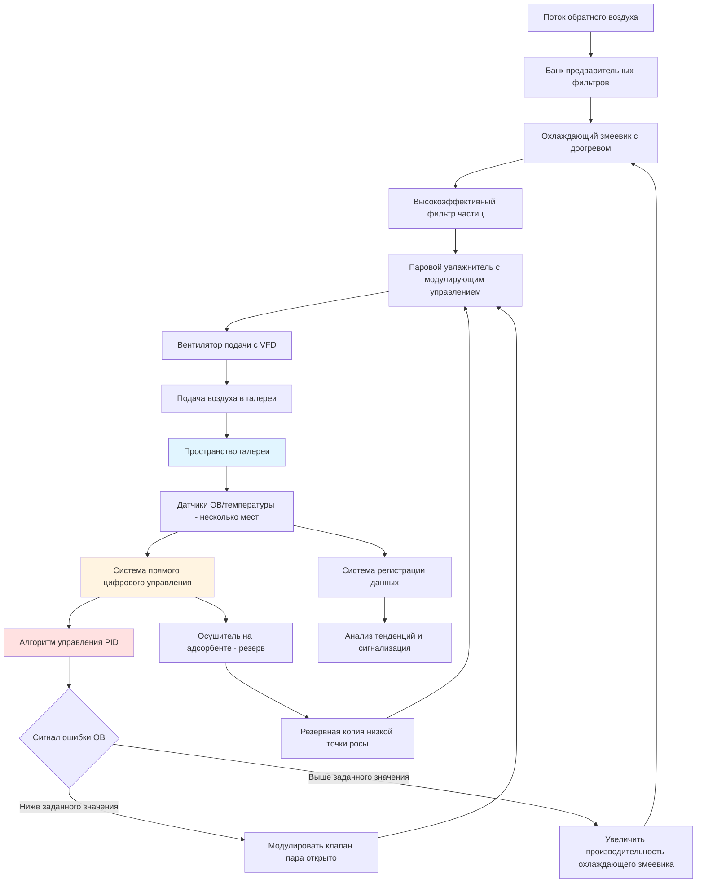

## Обзор

Стабильность влажности представляет собой критический параметр контроля в помещениях для сохранения произведений искусства. Физическое повреждение предметов коллекции вызывается колебаниями относительной влажности, а не абсолютными уровнями ОВ. Размерные изменения в гигроскопических материалах происходят при изменении содержания влаги в ответ на изменения окружающей ОВ. Величина и скорость этих колебаний определяют накопление напряжения и последующий механический отказ произведений искусства.

## Допустимые пределы колебаний влажности

Приемлемое изменение ОВ зависит от чувствительности материалов и стоимости коллекции. Консервационный институт Гетти и ASHRAE устанавливают многоуровневые спецификации на основе оценки риска.

### Стандартные классы контроля

| Класс | Колебание ОВ | Применение | Годовой дрейф |
|-------|----------------|-------------|--------------|
| AA (Высокоточный) | ±5% ОВ | Высокоценные коллекции, чувствительные материалы | ±5% ОВ |
| A (Плотный) | ±10% ОВ | Общие музейные коллекции | ±10% ОВ |
| B (Умеренный) | Не превышает 25-75% | Исторические здания без климатического контроля | Сезонные закономерности приемлемы |
| C (Профилактический) | Ниже 75% ОВ | Склады, контролируемое разрушение | Предотвращение роста плесени |

Требование стабильности ±5% ОВ для помещений класса AA требует высокоточного оборудования HVAC и надежных алгоритмов контроля. Кратковременные колебания в течение 24 часов вызывают больший ущерб, чем сезонные смещения, происходящие в течение месяцев. Напряжение материалов накапливается, когда циклы ОВ многократно пересекают критические пороги.

## Чувствительность материалов к изменениям влажности

Различные материалы коллекций проявляют различные реакции на колебания влажности. Гигроскопические материалы представляют наиболее высокий риск.

### Пороги повреждения материалов

| Категория материала | Критическое изменение ОВ | Временной интервал | Режим отказа |
|-------------------|-------------------|------------|--------------|
| Живопись на панелях (дерево) | >5% ОВ | <24 часов | Растрескивание, коробление, отслоение краски |
| Живопись на холсте | >10% ОВ | <48 часов | Провисание/натяжение холста |
| Слоновая кость, кость | >3% ОВ | <24 часов | Микротрещины, коробление |
| Бумага, пергамент | >8% ОВ | <48 часов | Волнистость, размерное изменение |
| Фотографии (альбумин) | >5% ОВ | <24 часов | Растрескивание эмульсии |
| Ткани (натуральные волокна) | >15% ОВ | <72 часов | Ослабление волокна, риск плесени |
| Лак, шеллак | >10% ОВ | <48 часов | Растрескивание, проверки |
| Металлы (железо, бронза) | >60% ОВ устойчивая | Дни-недели | Начало коррозии |

Живопись на деревянных панелях требует наиболее плотного контроля из-за анизотропных коэффициентов расширения. Размерные изменения поперек волокон создают внутреннее напряжение, которое разрушает слои краски и подготовку. Критический порог возникает при приблизительном изменении ОВ на 5% в течение 24 часов.

## Архитектура системы контроля влажности

Высокоточный контроль влажности требует специализированного оборудования с достаточной производительностью и характеристиками реакции.

### Компоненты стратегии управления

**Осушение на основе охлаждения**
Основной воздухообрабатывающий агрегат использует охлажденные водяные змеевики для конденсации влаги из потока воздуха. Управление по точке росы поддерживает точное удаление влаги независимо от нагрузки чувствительного охлаждения. Змеевики доогрева восстанавливают температуру подаваемого воздуха после избыточного охлаждения для осушения. Этот подход обеспечивает стабильный контроль, но требует значительного энергетического ввода.

**Паровое увлажнение**
Электродные или резистивные паровые генераторы впрыскивают чистый водяной пар в поток подаваемого воздуха. Модулирующие регулирующие клапаны регулируют расход пара в ответ на обратную связь датчика ОВ. Паровое увлажнение обеспечивает быструю реакцию и точный контроль без введения загрязнителей. Расстояние распределения должно быть достаточным для обеспечения полного впитывания пара до того, как воздух попадет в галереи.

**Системы резервного осушения на адсорбенте**
Низкотемпературные осушители на адсорбенте обеспечивают дополнительное удаление влаги в периоды высокой влажности. Эти системы достигают точек росы ниже 4°C, позволяя плотный контроль ОВ, когда наружные условия превышают производительность осушения на основе охлаждения. Циклы регенерации должны управляться во избежание введения тепла в кондиционированные помещения.

## Управление сезонным дрейфом

Постепенные сезонные изменения ОВ минимизируют напряжение на материалы коллекции по сравнению с быстрыми колебаниями. Подход контролируемого дрейфа позволяет ОВ медленно смещаться между зимним и летним заданными значениями.

### Приемлемые параметры дрейфа

- Максимальная скорость дрейфа: 2% ОВ в месяц
- Зимнее заданное значение: 40-45% ОВ (сезон отопления)
- Летнее заданное значение: 50-55% ОВ (сезон охлаждения)
- Переходный период: минимум 8 недель между сезонными заданными значениями
- Отсутствие суточных колебаний, превышающих ±3% ОВ в период дрейфа

Эта стратегия учитывает ограничения ограждающих конструкций зданий при сохранении стабильности материалов. Коллекции медленно уравновешиваются на новые уровни влажности без создания внутреннего напряжения. Подход снижает энергопотребление путем минимизации нагрузок увлажнения в зимний период и осушения в летний период.

## Контроль микроклимата

Локализованный контроль влажности внутри витрин и шкафов для хранения обеспечивает усиленную защиту чувствительных предметов. Микроклиматические системы создают стабильные среды независимо от условий в галереях.

### Технологии микроклимата

**Пассивная буферизация влажности**
Кассеты с силикагелем и материалы, буферирующие влажность, поглощают или выделяют влагу для стабилизации ОВ. Продукты Art Sorb и Rhapid Gel обеспечивают предсказуемую производительность в типичных диапазонах музейной ОВ. Расчеты количества материалов зависят от объема витрины, скорости воздухообмена и требуемого уровня стабильности. Пассивные системы требуют периодической регенерации или замены.

**Активная система кондиционирования витрины**
Маломасштабные системы HVAC кондиционируют воздух в герметичных витринах. Миниатюрные тепловые насосы с пропорциональным управлением обеспечивают точное поддержание ОВ. Эти системы исключают обслуживание материалов пассивного кондиционирования, но требуют электрических подключений и обслуживания механического оборудования.

## Мониторинг и проверка

Непрерывный мониторинг ОВ проверяет производительность системы управления и обеспечивает раннее предупреждение об отказах оборудования.

### Стратегия развертывания датчиков

- Плотность датчиков: минимум один датчик на 186 м² пространства галереи
- Высота размещения: уровень коллекции, как правило, 1,2-1,5 м над полом
- Частота калибровки: квартальная проверка по отношению к стандартам, прослеживаемым на NIST
- Интервал регистрации данных: 15-минутные интервалы для анализа тенденций
- Пороги сигнализации: ±2% ОВ от заданного значения для помещений класса AA

Анализ данных выявляет недостатки системы управления и утечку воздуха ограждающих конструкций здания. Психрометрический анализ условий подаваемого и обратного воздуха проверяет производительность и характеристики оборудования. Анализ долгосрочных тенденций выявляет сезонные закономерности и деградацию оборудования.

## Настройка системы управления

Алгоритмы управления PID требуют надлежащей настройки для достижения стабильного контроля ОВ без поиска или перерегулирования.

**Пропорциональная полоса:** диапазон 8-12% ОВ для увлажнения, диапазон 6-10% ОВ для осушения
**Время интегрирования:** 10-20 минут для исключения смещения без вызывания колебаний
**Время дифференцирования:** 2-5 минут для прогнозирования изменений нагрузки и улучшения реакции

Отдельные параметры настройки для увлажнения и осушения учитывают асимметричные характеристики реакции системы. Адаптивные алгоритмы управления регулируют параметры на основе наружных условий и нагрузки системы. Мертвые зоны предотвращают одновременное увлажнение и осушение, снижая потери энергии и циклирование оборудования.
