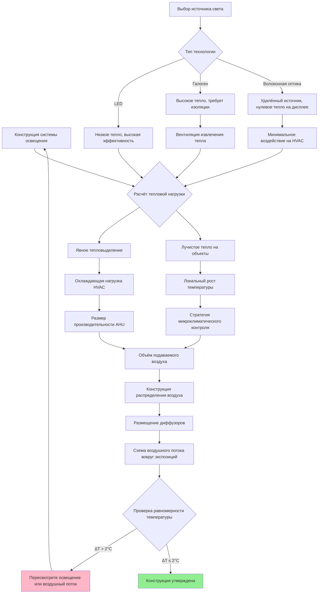

## Обзор

Воздействие света представляет собой один из основных факторов окружающей среды, вызывающих необратимый износ материалов коллекции. Процесс фотохимического разложения является кумулятивным и постоянным—каждый люкс-час воздействия способствует разрушению молекулярных связей в красителях, пигментах, волокнах бумаги и текстильных подложках. Конструкция системы HVAC должна учитывать тепловые нагрузки от освещения при поддержке точного экологического контроля, необходимого для снижения фотохимических реакций, ускоренных температурой.

## Классификация светочувствительности материалов

Различные материалы проявляют различную восприимчивость к фотохимическому повреждению в зависимости от их молекулярной структуры и концентрации хромофора. Следующие классификации определяют предельные значения освещённости:

| Категория материала | Максимальная освещённость | Годовой лимит воздействия | Содержание УФ | Примеры |
|---------------------|-------------------------|--------------------------|----------------|---------|
| Высокочувствительные | 50 люкс | 150 000 люкс-часов | <10 мкВт/люмен | Акварели, текстиль, окрашенная кожа, экспонаты из естественной истории, нестойкие чернила |
| Среднечувствительные | 150–200 люкс | 480 000 люкс-часов | <75 мкВт/люмен | Картины маслом, неокрашенная кожа, дерево, кость, слоновая кость, лаки |
| Низкая чувствительность | 200–300 люкс | Нет установленного лимита | <75 мкВт/люмен | Камень, керамика, стекло, металлы, эмаль, большинство неорганических материалов |
| Архивные документы | 50 люкс | 150 000 люкс-часов | <10 мкВт/люмен | Рукописи, гравюры, фотографии, синькопии, документы |

## Предельные значения люкс и расчёты воздействия

Общее фотохимическое повреждение накапливается как произведение освещённости (люкс) и времени воздействия (часы). Это соотношение позволяет рассчитать допустимую длительность экспонирования:

**Расчёт часов воздействия:**

```
Общее воздействие (люкс-часы) = Освещённость (люкс) × Время (часы)

Допустимые часы экспозиции = Годовой лимит воздействия ÷ Освещённость экспозиции
```

**Пример расчёта:**

Для акварели, выставленной при 50 люкс с годовым лимитом 150 000 люкс-часов:

```
Допустимые часы = 150 000 люкс-часов ÷ 50 люкс = 3 000 часов/год

Ежедневная экспозиция = 3 000 часов ÷ 365 дней = 8,2 часа/день максимум
```

Для непрерывной экспозиции (24 часа/день) максимальная освещённость составляет:

```
Максимальная освещённость = 150 000 люкс-часов ÷ (365 дней × 24 часа) = 17 люкс
```

Этот расчёт демонстрирует, почему графики ротации и сокращённые часы экспозиции необходимы для высокочувствительных материалов.

## Требования к УФ-фильтрации

Ультрафиолетовое излучение (длины волн 300–400 нм) вызывает непропорциональное повреждение относительно видимого света. Все источники света в музейных помещениях требуют УФ-фильтрации в соответствии со следующими стандартами:

**Предельные значения содержания УФ:**
- Высокочувствительные материалы: <10 мкВт/люмен
- Среднечувствительные материалы: <75 мкВт/люмен
- Метод измерения: в соответствии со стандартом CIE 157:2004

**Содержание УФ типичных источников (без фильтра):**
- Дневной свет: 300–400 мкВт/люмен
- Люминесцентные лампы: 50–200 мкВт/люмен
- LED (люминофор-преобразованный белый): 5–15 мкВт/люмен
- Лампы накаливания: 60–80 мкВт/люмен

**Стратегии фильтрации:**
1. Оконное остекление с УФ-поглощающими промежуточными слоями (блокирует >99% УФ)
2. УФ-фильтрующие оболочки для люминесцентных трубок
3. УФ-фильтрующий акрил или стекло для витрин
4. LED-источники с минимальным УФ-излучением (предпочтительное современное решение)

## Музейные стандарты освещения

**Рекомендации IESNA/ICOM:**
- Коэффициент равномерности освещённости: ≤3:1 на освещённой поверхности
- Индекс цветопередачи (CRI): ≥90 для точного восприятия цвета
- Коррелированная цветовая температура (CCT): 2700–3500K (тёплый) или 4000–5000K (нейтральный) в зависимости от предпочтений куратора
- Мерцание: <5% для комфорта посетителей и стабильности экспонатов

**Требования к измерениям:**
- Ежемесячный мониторинг люкса на поверхности объекта (не в окружающей среде)
- Измерения УФ-радиометром ежеквартально
- Документирование кумулятивного воздействия для планирования ротации
- Обследование уровней света при установке и ежегодно

## Координация освещения и HVAC

Тепловая нагрузка от светильников напрямую влияет на размер системы HVAC и точность, достижимую при контроле температуры. Это взаимодействие требует интегрированного проектирования:



## Расчёты тепловой нагрузки от освещения

Тепло, производимое системами освещения, должно быть точно количественно определено для обеспечения адекватности производительности системы HVAC:

**Формула прироста теплоты от освещения:**

```
Q_light = (Ватты_установленные × Коэффициент_использования × Коэффициент_балласта) × 3,412 кДж/ч/Вт
```

**Теплогенерация, специфичная для технологии:**

| Технология освещения | Световая отдача (лм/Вт) | Прирост теплоты (Вт/клм) | Доля лучистого тепла | Воздействие на HVAC |
|----------------------|------------------------|--------------------------|----------------------|-------------------|
| LED (современный) | 120–150 | 6,7–8,3 | 0,15–0,25 | Минимально, в основном конвективное |
| LED (старый) | 80–100 | 10–12,5 | 0,20–0,30 | Низкое, хорошо для тесного контроля |
| Люминесцентный T5 | 90–100 | 10–11,1 | 0,30–0,40 | Умеренное, требует вентиляции |
| Галоген | 15–25 | 40–67 | 0,65–0,80 | Высокое, требует извлечения тепла |
| Лампы накаливания | 10–17 | 59–100 | 0,70–0,90 | Серьёзное, избегается в музеях |

**Пример расчёта:**

Галерея: 500 м² при средней освещённости 200 люкс с использованием LED при 120 лм/Вт

```
Требуемые люмены = 500 м² × 200 люкс = 100 000 люмен
Мощность освещения = 100 000 лм ÷ 120 лм/Вт = 833 Вт
Прирост теплоты = 833 Вт × 3,412 кДж/ч/Вт = 2 842 кДж/ч
Прибавка охлаждающей нагрузки = 2 842 кДж/ч ÷ 12,656 кДж/ч/кВт = 0,22 кВт
```

Сравнение с галогеном при 20 лм/Вт:

```
Мощность освещения = 100 000 лм ÷ 20 лм/Вт = 5 000 Вт
Прирост теплоты = 5 000 Вт × 3,412 кДж/ч/Вт = 17 060 кДж/ч = 1,35 кВт
```

Эта шестикратная разница в охлаждающей нагрузке демонстрирует, почему LED-технология предпочтительна для музейных приложений.

## Стратегии интеграции освещения

**Системы LED-освещения:**
- Световая отдача: 120–150 лм/Вт снижает нагрузку HVAC на 70–85% в сравнении с галогеном
- Низкий выход УФ: <10 мкВт/люмен достижимо без фильтрации
- Возможность диммирования: Позволяет управлять часами воздействия
- Управление теплом: Конвективное тепло доминирует, минимальное лучистое нагревание объектов
- Срок службы: 50 000+ часов снижает нарушение из-за обслуживания

**Волоконно-оптическое освещение для витрин:**
- Удалённый источник света: Тепло, генерируемое вне объёма контролируемой витрины
- Нулевой УФ/ИК на конце волокна: Исключает необходимость фильтрации
- Точное управление пучком: Минимизирует освещённую площадь и общее воздействие
- Преимущество HVAC: Нет внутренней тепловой нагрузки в контролируемом микроклиматом объёме витрины
- Применение: Идеально для высокочувствительных объектов в герметичных витринах

**Требования к исключению дневного света:**
- Светочувствительные материалы: Обязательно полное исключение дневного света
- Оконные обработки: Непрозрачные рулонные шторы или затемняющие занавески
- Конструкция вестибюля: Предотвращает проникновение преходящего дневного света при открытии двери
- Аварийное освещение: Фотолюминесцентные маркеры вместо подсвеченных табличек выхода в чувствительных хранилищах

## Системы мониторинга уровня света

**Непрерывный мониторинг:**
- Логгеры данных люкса в репрезентативных местах объектов
- Интеграция с BMS для тренда и сигнализации
- Расчёт кумулятивного воздействия: Σ(люкс × часы) за период экспозиции
- Точки срабатывания сигнализации: 110% целевого люкса и 90% годового бюджета воздействия

**Периодическая проверка:**
- Обследования портативным люксметром ежеквартально
- Измерения УФ-радиометром при каждой замене лампы
- Карточки стандартного воздействия голубой шерсти для визуальной оценки повреждения
- Документирование всех показаний для консервационных записей

Интеграция конструкции освещения с производительностью системы HVAC обеспечивает минимизацию фотохимического разложения при поддержании тепловой стабильности. Точный контроль как освещённости, так и температуры представляет основу эффективной профилактической консервации в музейных помещениях.
