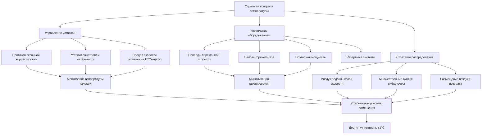

Стабильность температуры представляет наиболее критический параметр окружающей среды при сохранении произведений искусства. Тепловые колебания вызывают изменения размеров гигроскопичных материалов, генерируют внутренние напряжения в композитных объектах и ускоряют реакции химической деградации. Достижение стабильных температурных условий требует понимания характеристик отклика материалов, реализации надлежащих стратегий управления и выбора оборудования HVAC, способного обеспечить точную модуляцию мощности.

## Пределы контроля температуры

Справочник ASHRAE—HVAC Applications Глава 24 устанавливает классы точности для сред коллекций на основе чувствительности материалов. Наиболее строгая спецификация, класс AA, требует поддержания температуры ±1°C без более чем 3°C колебаний в течение 24 часов.

**Стандартные диапазоны температур по типам коллекций:**

| Категория коллекции | Диапазон температуры | Предел суточных колебаний | Предел годового смещения |
|---------------------|----------------------|--------------------------|-------------------------|
| Масляная живопись | 20-22°C | ±1°C | ±2°C |
| Произведения на бумаге | 18-21°C | ±1°C | ±2°C |
| Фотографии | 18-20°C | ±1°C | ±2°C |
| Текстиль | 18-21°C | ±1°C | ±2°C |
| Деревянные артефакты | 20-22°C | ±1°C | ±2°C |
| Смешанные материалы | 20-22°C | ±0,5°C | ±1,5°C |

Выбор уставки температуры балансирует требования сохранения материалов против энергопотребления. Более низкие температуры замедляют скорость химических реакций — каждое снижение на 10°C уменьшает скорость деградации вдвое — но увеличивают эксплуатационные затраты и сложность управления относительной влажностью.

## Тепловая чувствительность материалов

Гигроскопичные материалы проявляют связанный ответ на температуру и влажность. Изменения температуры изменяют содержание влаги в равновесии (EMC) при постоянной относительной влажности через соотношение Клаузиуса-Клапейрона. Увеличение на 3°C при 50% относительной влажности производит приблизительно 0,3% снижение содержания влаги в древесине, генерируя изменения размеров, которые нагружают суставы и клеевые соединения.

**Коэффициенты теплового расширения и ответ напряжения:**

| Материал | Коэффициент (м/м/°C) | Напряжение на 5°C | Критическое беспокойство |
|----------|----------------------|-------------------|-------------------------|
| Холст (основа) | 1,44×10⁻⁵ | Низкое | Связанный ответ относительной влажности |
| Древесина (радиальное) | 5,4-9×10⁻⁶ | Среднее | Напряжение, вызванное влажностью, преобладает |
| Древесина (тангенциальное) | 1,08-1,62×10⁻⁵ | Среднее | Напряжение, вызванное влажностью, преобладает |
| Слой лака | 7,2-10,8×10⁻⁵ | Высокое | Растрескивание дифференциального расширения |
| Акриловая краска | 9-14,4×10⁻⁵ | Очень высокое | Риск расслаивания |
| Желатина (фото) | 1,8-2,7×10⁻⁴ | Критическое | Скручивание и деформация |

Композитные объекты сталкиваются с наибольшим риском. Картина состоит из деревянного подрамника, загрунтованного холста, грунтовки, слоя краски и лака — каждый с отличными свойствами теплового и гигрического расширения. Температурные циклы создают дифференциальные изменения размеров, которые вызывают трещины, расслоения и конструктивный отказ.

## Стратегия контроля температуры

Точная стабильность температуры требует трех интегрированных подходов: использование тепловой массы, модуляция мощности оборудования и контролируемое распределение воздуха.

### Стабильность уставки

Поддерживайте постоянные уставки температуры на протяжении периодов занятости. Избегайте алгоритмов оптимального запуска/остановки, которые предварительно нагревают или охлаждают помещения. Экономия энергии за счет снижения температуры в незанятые периоды редко оправдывает тепловой цикл, наложенный на коллекции.

Если снижение температуры ночью требуется для экономии энергии, ограничьте снижение максимум 2-2,5°C и реализуйте медленные скорости восстановления. Запрограммируйте снижение температуры на начало через 4 часа после закрытия и восстановление на начало за 4-6 часов до открытия, позволяя постепенные изменения температуры со скоростями менее 0,5°C в час.

### Постепенные сезонные переходы

Приспособление к сезонному дрейфу температуры предотвращает чрезмерное энергопотребление при борьбе с наружными условиями. Повышайте летние уставки на 2-2,5°C выше зимних уровней, используя постепенные еженедельные корректировки максимум на 0,5-1°C. Этот сезонный плавающий режим предотвращает термический шок от резких изменений, сохраняя стабильность относительной влажности через координированную регулировку увлажнения/осушения.

Начинайте сезонные переходы за 2-3 недели до ожидаемых изменений наружной температуры. Мониторьте хранилище коллекций и зоны отображения отдельно — внутренние зоны с высокой тепловой массой отстают от периметральных пространств на несколько дней.

### Критерии выбора оборудования

Оборудование HVAC с переменной мощностью предотвращает температурные циклы, присущие однофазным системам. Компрессоры переменной скорости, байпас горячего газа или несколько поэтапных блоков обеспечивают модуляцию мощности от 10-100%, соответствуя нагрузкам здания без циклирования.

Выбирайте оборудование консервативно на уровне 80-90% рассчитанной пиковой нагрузки, чтобы способствовать более длительному времени работы и лучшему осушению. Установите резервные системы с автоматическим переключением — отказ оборудования в помещениях сохранения не может ждать обычных графиков ремонта.

Разместите несколько датчиков температуры в каждой климатической зоне. Размещайте датчики вдали от диффузоров подачи и источников тепла, используя алгоритмы усреднения или выбора медианы, чтобы предотвратить ложные сигналы управления от локализованных условий.

## Проверка и ввод в эксплуатацию

Вводите системы контроля температуры в эксплуатацию, используя 30-дневный мониторинг перед установкой коллекции. Проверьте стабильность управления при различных нагрузках занятости, прибылях тепла от освещения и наружных условиях. Документируйте максимальные отклонения температуры, частоту циклирования и пространственную однородность в контролируемой зоне.

Непрерывный мониторинг остается существенным после заселения. Превышения температуры за пределы пороговых значений ±1°C требуют немедленного расследования и исправления. Тенденции, указывающие на постепенный дрейф, увеличение частоты циклирования или растущие пространственные вариации, сигнализируют о предстоящей деградации оборудования, требующей профилактического вмешательства.
