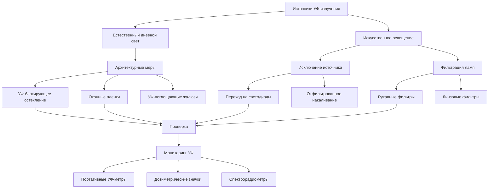

## Основы УФ-повреждений в коллекциях

Ультрафиолетовое излучение вызывает необратимую фотохимическую деградацию артефактов посредством передачи энергии на молекулярном уровне. Когда фотоны с длинами волн между 280-400 нм попадают на органические материалы, они разрывают химические связи в пигментах, красителях, целлюлозе и белках. Этот процесс проявляется в виде выцветания, охрупчивания, обесцвечивания и структурного ослабления.

Повреждающий эффект следует закону взаимности Бунзена-Роско: **Общее повреждение = Интенсивность × Время**. Кратковременное воздействие УФ-излучения высокой интенсивности вызывает такое же повреждение, как длительное воздействие при более низкой интенсивности. Этот принцип обусловливает консервационный стандарт, согласно которому УФ-излучение в выставочных помещениях должно приближаться к нулю для чувствительных материалов.

### Классификация УФ-волн

| УФ-диапазон | Диапазон длин волн | Основные источники | Характеристики проникновения |
|---------|------------------|-----------------|----------------------------|
| УФ-C | 100-280 нм | Бактерицидные лампы (отфильтрованы атмосферой) | Блокируется стеклом, высоко деструктивно |
| УФ-B | 280-315 нм | Дневной свет через окна | Частично пропускается обычным стеклом |
| УФ-A | 315-400 нм | Дневной свет, люминесцентные лампы | Легко пропускается, основная проблема консервации |

Консервационные стандарты ориентированы на исключение УФ-A и УФ-B-излучения, так как УФ-C-излучение не достигает помещений с коллекциями при нормальных обстоятельствах.

## Музейные стандарты УФ-защиты

**Справочник приложений ASHRAE** и рекомендации по консервации музеев устанавливают следующие пределы:

| Категория материалов | Максимальная интенсивность УФ | Эквивалентная спецификация |
|-------------------|----------------------|--------------------------|
| Высочувствительные (текстили, акварели, гравюры) | 0 мкВ/люмен | Нулевое обнаруживаемое УФ |
| Умеренно чувствительные (масляная живопись, дерево) | <10 мкВ/люмен | <75 мкВ/м² при 500 люкс |
| Низкая чувствительность (металлы, керамика, камень) | <75 мкВ/люмен | Стандартное музейное освещение допустимо |

Стандартное измерение использует **коэффициент содержания УФ**, выраженный в микроваттах УФ на люмен видимого света (мкВ/лм). Нефильтрованный дневной свет содержит 300-400 мкВ/лм, а нефильтрованные люминесцентные лампы содержат 100-200 мкВ/лм.

## Стратегии УФ-защиты

## Системы УФ-блокирующего остекления

Архитектурное стекло, разработанное для музеев, включает металлооксидные покрытия или ламинированные УФ-поглощающие прослойки.

### Сравнение характеристик остекления

| Тип остекления | Пропускание УФ (%) | Пропускание видимого света (%) | Долговечность | Коэффициент стоимости |
|--------------|---------------------|--------------------------------|------------|-------------|
| Стандартное прозрачное стекло | 60-75 | 88-90 | Постоянное | 1,0× |
| Стандартное ламинированное | 40-50 | 85-87 | Постоянное | 1,3× |
| УФ-фильтрующее ламинированное | <1 | 80-85 | Постоянное | 2,0× |
| Музейное стекло консервации | <0,1 | 75-82 | Постоянное | 3,5-5,0× |
| Акриловое УФ-фильтрующее | <1 | 90-92 | 10-15 лет (царапины) | 1,8× |

УФ-фильтрующее ламинированное стекло использует прослойки поливинилбутираля (ПВБ), легированные УФ-абсорбентами, такими как бензотриазолы или бензофеноны. Эти материалы поглощают УФ-фотоны посредством электронных переходов, преобразуя радиантную энергию в низкокачественное тепло, рассеиваемое через структуру стекла.

Высокопроизводительное музейное остекление сочетает подложки из низкожелезного стекла с несколькими функциональными покрытиями для достижения <0,1% пропускания УФ при сохранении пропускания видимого света >75% и нейтральной цветопередачи.

## УФ-поглощающие пленки и рукава

Применяемые пленки обеспечивают решения для модернизации существующего остекления и систем освещения.

### Применение оконных пленок

Полиэстеровые пленки с УФ-поглощающими добавками приклеиваются к существующим стеклянным поверхностям. Толщина пленки варьируется от 50-200 микрометров с адгезивными слоями, обеспечивающими оптический контакт.

**Требования к установке:**
- Температура стеклянной поверхности: 4-32°C при нанесении
- Внутреннее нанесение предпочтительно для долговечности
- Критическое уплотнение края для предотвращения проникновения влаги
- Ожидаемый срок службы: 10-20 лет в зависимости от солнечного облучения

**Характеристики производительности:**
- Эффективность блокирования УФ: >99% для длин волн <380 нм
- Снижение пропускания видимого света: 5-15%
- Вероятность отказа уплотнения края в условиях высокой влажности
- Риск растрескивания от теплового напряжения в двухслойных блоках (требуется одобрение производителя)

### Рукавные фильтры ламп

Трубчатые УФ-фильтрующие рукава надеваются на люминесцентные и компактные люминесцентные лампы. Материалы из поликарбоната или акрила, легированные УФ-абсорбентами, обеспечивают >99% УФ-фильтрации.

**Тепловые соображения:**
- Рукав снижает теплоотвод лампы на 3-7%
- Проверьте, что лампа работает в пределах максимальной номинальной температуры
- Лампы T5 высокой мощности требуют специальных высокотемпературных рукавов
- Снижает срок службы лампы на 5-10% из-за повышенной рабочей температуры

## Альтернативы светодиодного освещения

Технология светоизлучающих диодов исключает УФ-излучение у источника посредством своей фундаментальной физики. Светодиоды производят свет путем электролюминесценции в полупроводниковых переходах, генерируя фотоны с энергиями, определяемыми шириной запрещенной зоны полупроводника. Стандартные белые светодиоды используют синие излучатели (450-470 нм) с понижающей люминофором, производя нулевое УФ-излучение.

### Преимущества светодиодов для консервации

**Спектральная чистота:** спектры излучения светодиодов не содержат энергии ниже 400 нм, полностью исключая требования УФ-фильтрации.

**Сниженное инфракрасное излучение:** светодиоды излучают на 80-90% меньше инфракрасного излучения, чем источники накаливания, снижая радиативный нагрев артефактов.

**Управление тепловыми процессами:** выделение тепла происходит в переходе, а не на излучающей поверхности. Надлежащее тепловое управление поддерживает температуру поверхности артефакта в пределах ±1°C от окружающей среды.

**Возможность диммирования:** модуляция ширины импульса позволяет бесперебойное диммирование до 1% мощности, позволяя программы циркадного освещения без УФ-риска при любом уровне интенсивности.

### Соображения при внедрении светодиодов

| Параметр | Музейная спецификация | Влияние на консервацию |
|-----------|---------------------|------------------------|
| Индекс цветопередачи (CRI) | >90 предпочтительно, >95 для критических наблюдений | Влияет на точность восприятия цвета |
| Коррелированная цветовая температура (CCT) | 2700-4000 K типично | Более высокая CCT увеличивает фотохимический риск |
| Спектральное распределение мощности | Проверьте отсутствие УФ-содержания | Критично для требования нулевого УФ |
| Сохранение светового потока | L70 >50 000 часов | Влияет на долгосрочную согласованность уровня света |

## Мониторинг УФ и проверка

Постоянная проверка обеспечивает, что системы фильтрации поддерживают эффективность с течением времени.

**Портативные УФ-метры** измеряют мгновенную интенсивность УФ с помощью датчиков фотодиодов с УФ-пропускающими фильтрами. Точность измерения: ±5% для калибровочных приборов. Разместите датчик в плоскости артефакта, измеряйте в нескольких местах по всему выставочному пространству.

**Дозиметрические значки** обеспечивают измерение кумулятивного воздействия. Фоточувствительные материалы изменяют цвет пропорционально общему УФ-облучению. Разместите значки рядом с чувствительными артефактами, заменяйте ежеквартально для анализа тенденций.

**Спектрорадиометры** отображают полное спектральное распределение мощности от 280-780 нм. Приборы лабораторного класса проверяют нулевое содержание УФ для критически важных установок. Измерение требует темновой адаптации и нескольких периодов интеграции для низкоуровневой проверки.

### Протокол мониторинга

1. Установите базовые измерения при вводе в эксплуатацию
2. Ежеквартальная проверка для галерей с дневным светом
3. Ежегодная проверка только для искусственного освещения
4. Проверка после технического обслуживания после любых работ со светом или остеклением
5. Документируйте все измерения с местоположением, датой, временем и условиями окружающей среды

## Интеграция системы с HVAC

УФ-фильтрация интегрируется с системами экологического управления несколькими механизмами:

**Расчет солнечной нагрузки:** УФ-блокирующее остекление снижает общий прирост солнечного тепла на 2-4% по сравнению со стандартным стеклом. Отрегулируйте расчеты охлаждающей нагрузки для правильного выбора размера оборудования.

**Тепловыделение от освещения:** преобразование светодиодов снижает тепловыделение от освещения на 60-75% по сравнению с накаливанием, снижая охлаждающие нагрузки и позволяя уменьшить механические системы.

**Влияние нанесения пленки:** внутренние оконные пленки увеличивают температуру остекления на 5-11°C при солнечной нагрузке. Проверьте совместимость с двухслойными блоками для предотвращения отказа уплотнения.

**Интеграция мониторинга:** встройте УФ-датчики в системы автоматизации зданий для реального оповещения об отказах системы фильтрации.

## Цели нулевого УФ для чувствительных коллекций

Наиболее чувствительные материалы требуют полного исключения УФ-излучения. Достигните этого посредством:

- Только светодиодного освещения со спектрорадиометрической проверкой
- Полного исключения дневного света или музейного УФ-блокирующего остекления
- Ежеквартального мониторинга с пределом обнаружения <1 мкВ/люмен
- Избыточной защиты (архитектурная + фильтрация уровня лампы)
- Протоколов документирования для любого УФ-генерирующего оборудования

Этот подход увеличивает срок службы артефактов в 10-50 раз по сравнению с неконтролируемыми выставочными средами, оправдывая повышенные первоначальные инвестиции в системы освещения и остекления.
