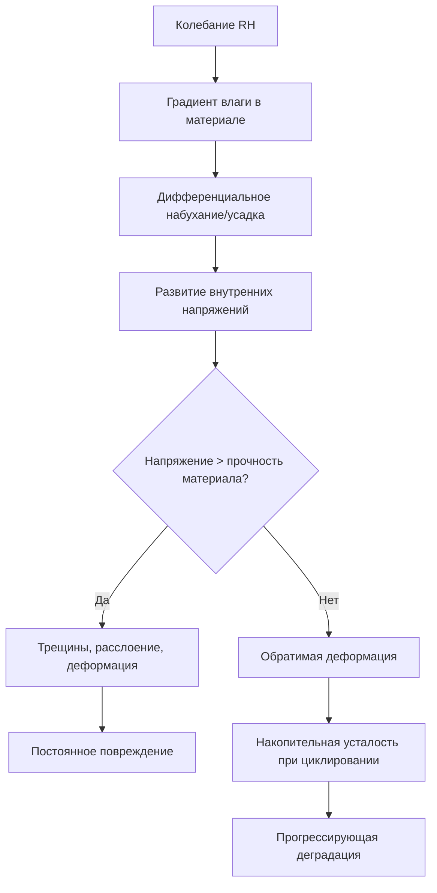
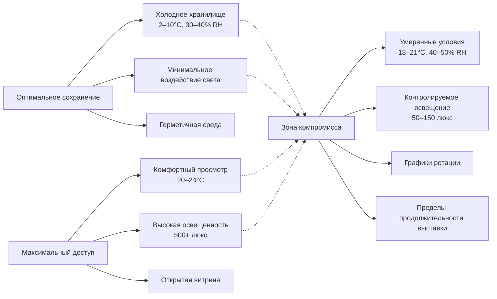

Коллекционные материалы проявляют значительно различающиеся реакции на условия окружающей среды в зависимости от молекулярной структуры, гигроскопических свойств и химической стабильности. Понимание физики взаимодействия материала и окружающей среды позволяет разработать точную конструкцию системы HVAC, которая сбалансирует требования сохранения с операционными ограничениями.

## Структура классификации материалов

Коллекции делятся на две основные категории в зависимости от механизмов взаимодействия с влагой:

**Органические материалы** содержат углеводородные полимеры (целлюлоза, белки, липиды) с гидроксильными группами, которые образуют водородные связи с молекулами воды. Эта молекулярная архитектура создает гигроскопическое поведение—материалы поглощают или десорбируют влагу для достижения равновесия с окружающей относительной влажностью.

**Неорганические материалы** включают металлы, керамику, стекло и камень. Эти материалы проявляют минимальное поглощение влаги, но остаются уязвимыми к конденсации на поверхности, коррозии и кристаллизации соли, когда гигротермальные условия превышают критические пороги.

## Физика гигроскопического равновесия

Содержание влаги в гигроскопических материалах следует изотермам сорбции, описываемым уравнением Guggenheim-Anderson-de Boer (GAB):

$$M = \frac{M_m \cdot C \cdot K \cdot a_w}{(1-K \cdot a_w)(1-K \cdot a_w + C \cdot K \cdot a_w)}$$

Где:
- $M$ = равновесное содержание влаги (кг воды/кг сухого материала)
- $M_m$ = содержание влаги в монослое
- $C$, $K$ = константы, специфичные для материала
- $a_w$ = активность воды (RH выраженная как доля)

Это соотношение демонстрирует, что содержание влаги изменяется нелинейно с RH. Небольшие колебания RH вызывают значительный обмен влагой, индуцируя изменения размеров через гигроскопическое расширение. Объемная деформация $\epsilon_v$ связана с изменением содержания влаги:

$$\epsilon_v = \beta \cdot \Delta M$$

Где $\beta$ представляет коэффициент гигроскопического расширения (обычно 0,001–0,01 на 1% изменения содержания влаги для древесины и бумаги).

## Требования к температуре и RH по типам материалов

Уставки окружающей среды сбалансированы между кинетикой деградации и стабильностью размеров:

| Категория материала | Диапазон температуры | Диапазон RH | Основная проблема | Механизм повреждения |
|-------------------|-------------------|----------|-----------------|------------------|
| Бумага, книги | 18–21°C | 30–50% | Кислотность, плесень | Гидролитическое разрыв цепей целлюлозы |
| Фотографии (ч/б) | 18–21°C | 30–40% | Окисление серебра | Электрохимическая коррозия с влагой |
| Цветные фотографии | 2–10°C | 30–40% | Выцветание красителя | Термически активируемая деградация хромофора |
| Масляные картины | 19–24°C | 45–55% | Натяжение холста | Несоответствие гигроскопического расширения (холст/краска) |
| Деревянные артефакты | 19–24°C | 45–55% | Изменение размеров | Влаго-индуцированное набухание перпендикулярно волокнам |
| Текстиль (натуральное волокно) | 18–21°C | 50–55% | Хрупкость волокна | Окислительная деградация, ускоренная низкой RH |
| Металлы | 18–24°C | <35% | Коррозия | Электрохимические реакции выше критической RH |
| Кость, слоновая кость | 18–24°C | 45–55% | Растрескивание | Потеря конструкционной воды при циклировании RH |
| Кожа | 18–21°C | 50–60% | Деградация | Кислотный гидролиз коллагена при низкой RH |
| Магнитные носители | 15–20°C | 30–40% | Гидролиз связующего | Влаго-катализируемое разрушение полимера |

Уравнение Arrhenius количественно определяет влияние температуры на скорости химической деградации:

$$k = A \cdot e^{-E_a/(R \cdot T)}$$

Где $k$ = константа скорости реакции, $E_a$ = энергия активации (50–100 кДж/моль для типичной деградации), $R$ = газовая постоянная, $T$ = абсолютная температура. Снижение температуры на 10°C обычно снижает скорость деградации вдвое для органических материалов.

## Стабильность установки RH в сравнении с диапазоном

Последние исследования в области консервации подчеркивают **стабильность RH** над абсолютными значениями в приемлемых диапазонах. Функция повреждения $D$ для гигроскопических материалов связана с амплитудой колебаний:

$$D \propto \sum_{i=1}^{n} |\Delta RH_i|^2 \cdot N_i$$

Где $\Delta RH_i$ представляет величину колебания, а $N_i$ количество циклов. Это квадратичное соотношение означает, что одно колебание RH на 20% вызывает в четыре раза больше повреждений, чем колебание на 10%.

**Рекомендуемые допуски управления:**

- Класс AA (строгий контроль): ±5% RH, ±2°C для очень уязвимых коллекций
- Класс A (точный контроль): ±5% RH, ±2°C допускаются сезонные корректировки
- Класс B (умеренный контроль): ±10% RH, корректировки для климатических зон
- Класс C (профилактический контроль): Предотвращение плесени (RH <65%), замораживания (T >10°C), высокие скорости деградации

## Пределы воздействия света

Фотохимическая деградация следует закону взаимности:

$$E_{total} = I \cdot t$$

Где $E_{total}$ = совокупное воздействие (люкс-часы), $I$ = освещенность (люкс), $t$ = время воздействия (часы). Повреждение зависит от общей дозы фотонов, позволяя компромиссы между интенсивностью и продолжительностью.

| Чувствительность материала | Максимальная освещенность | Годовое ограничение воздействия | Содержание УФ |
|---------------------|---------------------|----------------------|------------|
| Высокая (текстиль, акварели, окрашенные материалы) | 50 люкс | 150 000 люкс-часов | <75 мкВт/люмен |
| Средняя (масляные картины, неокрашенная кожа, древесина) | 150–200 люкс | 600 000 люкс-часов | <75 мкВт/люмен |
| Низкая (металлы, камень, керамика, стекло) | 300 люкс | Без ограничений | Не критично |

УФ-излучение (длина волны <400 нм) несет более высокую энергию фотона ($E = h \cdot c / \lambda$), вызывая в 100–1000 раз больше повреждений на фотон, чем видимый свет.

## Чувствительность к загрязняющим веществам

Газообразные загрязняющие вещества ускоряют деградацию через:

1. **Кислотное осаждение**: SO₂, NO₂, органические кислоты атакуют бумагу, текстиль (целевой <10 мкг/м³)
2. **Окисление**: O₃ деградирует резину, красители, пигменты (целевой <2 мкг/м³)
3. **Коррозия металлов**: H₂S, карбонилсульфиды, хлориды (целевой <0,1 мкг/м³)

Твёрдые частицы вызывают истирание и предоставляют ядра для образования гигроскопических солей. Требования к фильтрации HVAC:

- MERV 13 минимум для общих коллекций (85% эффективность при 0,3–1,0 мкм)
- MERV 14–16 для высокоценных коллекций
- Угольные или фильтры с перманганатом калия для удаления газов

## Компромиссы между сохранением и доступом

Фундаментальный конфликт между сохранением и доступом требует количественной оценки риска. Индекс сохранения (PI) рассчитывает ожидаемый срок службы:

$$PI = \frac{T_{half}}{N_{years}}$$

Где $T_{half}$ представляет время, необходимое для снижения прочности материала на 50% в измеренных условиях. PI, равный 100, указывает на условия, поддерживающие полезный срок службы 100 лет. Выставочные среды обычно достигают PI 50–150, тогда как холодное хранилище достигает PI >500.

**Стратегии смягчения доступа:**

1. **Ротация**: Выставление высокочувствительных предметов 3–6 месяцев в 5-летнем цикле
2. **Факсимиле**: Выставление воспроизведений чрезвычайно уязвимых материалов
3. **Зонирование окружающей среды**: Поддержание более строгих условий в хранилище, более свободных в галереях
4. **Адаптивное освещение**: Активируемое движением или синхронизированное освещение, снижающее совокупное воздействие
5. **Капсулирование**: Микросреды внутри витрин, поддерживающие оптимальные условия

Смешанные галереи требуют компромиссные уставки (обычно 20°C, 50% RH) с отдельными витринами, обеспечивающими специализированные микроклиматы для предметов, отличающихся по требованиям. Конструкция витрины должна учитывать тепловую инерцию, буферизацию влаги и герметичность для поддержания независимых условий в оболочке здания.
