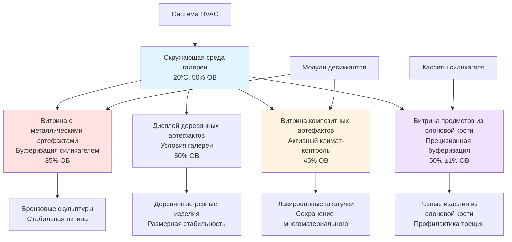

Музейные коллекции состоят из разнообразных типов материалов, каждый из которых имеет особые экологические требования, определяемые фундаментальными свойствами материалов. Системы HVAC должны обеспечивать расширение древесины под действием влаги, чувствительность металла к коррозии, размерную нестабильность слоновой кости и конфликтующие потребности композитных артефактов. Успешное сохранение достигается балансированием конкурирующих требований посредством стратегического зонирования, микроклиматического контроля и принципов материаловедения.

## Требования к окружающей среде для деревянных артефактов

Древесина демонстрирует выраженный размерный отклик на колебания относительной влажности из-за её клеточной структуры и гигроскопических компонентов. Влагосодержание (MC) древесины приводится в равновесие с окружающей относительной влажностью согласно сорбционным изотермам, специфичным для каждого вида.

### Механика размерных изменений

Древесина расширяется и сжимается перпендикулярно направлению волокон при изменении влагосодержания. Соотношение размерных изменений следует:

$$\Delta D = D_0 \cdot \alpha_t \cdot \Delta MC$$

Где:
- $\Delta D$ = размерное изменение (мм)
- $D_0$ = исходный размер (мм)
- $\alpha_t$ = коэффициент тангенциального усадки (0,15–0,35 для большинства твёрдых пород)
- $\Delta MC$ = изменение влагосодержания (процентные пункты)

Влагосодержание коррелирует примерно 1:1 с изменениями ОВ в диапазоне 30–70%, означая, что колебание 10% ОВ производит примерно 10 процентных пункта изменения MC и соответствующее размерное движение 1,5–3,5% в тангенциальном направлении.

**Целевые условия окружающей среды:**
- Температура: 18–21°C
- Относительная влажность: 45–55% ОВ
- Предел суточного колебания: ±3% ОВ, ±2°C
- Допуск сезонного дрейфа: ±5% ОВ в течение месяцев
- Скорость изменения: <3% ОВ в час

### Вариации по видам древесины

Различные виды древесины демонстрируют разную чувствительность к экологическим условиям:

| Вид древесины | Тангенциальная усадка | Радиальная усадка | Рейтинг стабильности | Оптимальный диапазон ОВ |
|--------------|---------------------|------------------|----------------------|-------------------------|
| Дуб | 8–10% | 4–5% | Умеренная | 45–55% |
| Красное дерево | 5–6% | 3–4% | Высокая | 40–55% |
| Сосна | 7–9% | 4–5% | Умеренная | 45–55% |
| Орех | 7–8% | 5–6% | Умеренно-высокая | 45–55% |
| Кедр | 5–7% | 3–4% | Высокая | 40–50% |
| Клён | 9–10% | 4–5% | Умеренная | 50–55% |

Полихромные деревянные объекты (окрашенные или позолоченные поверхности) требуют более жёсткого контроля влажности (±3% ОВ), так как жёсткие покрытия поверхности не могут приспосабливаться к размерным изменениям основы, приводя к расслоению краски и потере.

## Контроль коррозии металлических артефактов

Металлические артефакты требуют низкой относительной влажности для предотвращения реакций атмосферной коррозии. Критическая относительная влажность, ниже которой коррозия становится пренебрежимо малой, варьируется в зависимости от состава металла и загрязнения поверхности.

### Механизмы коррозии

Электрохимическая коррозия протекает, когда на поверхности металла образуется непрерывная водяная плёнка, обеспечивающая электролит для реакций окисления-восстановления:

**Анодная реакция (окисление):**
$$\text{M} \rightarrow \text{M}^{n+} + n\text{e}^-$$

**Катодная реакция (восстановление):**
$$\text{O}_2 + 2\text{H}_2\text{O} + 4\text{e}^- \rightarrow 4\text{OH}^-$$

Скорость коррозии следует соотношению Аррениуса с температурой и демонстрирует экспоненциальную зависимость от относительной влажности выше критических пороговых значений.

### Требования по типам металлов

| Тип металла | Критическая ОВ | Целевая ОВ | Температура | Продукты коррозии | Газовые угрозы |
|------------|-------------|-----------|-------------|-------------------|-----------------|
| Железо, сталь | 60% | <35% | 18–21°C | Ржавчина (Fe₂O₃·nH₂O) | O₂, влага |
| Медные сплавы (бронза) | 40% | 30–35% | 18–21°C | Куприт, малахит, бронзовая болезнь | Cl⁻, SO₂, H₂S |
| Серебро | 50% | <40% | 18–21°C | Сульфид серебра патина | H₂S, карбонил сульфид |
| Свинец | 60% | <50% | 18–21°C | Карбонат свинца, оксид свинца | Органические кислоты (уксусная, муравьиная) |
| Цинк | 60% | <40% | 18–21°C | Оксид цинка, карбонат цинка | Органические кислоты |
| Золото | Стабильно | 30–50% | 18–24°C | Минимальная коррозия | Нет значительных |
| Алюминий | 70% | <50% | 18–21°C | Оксид алюминия | Хлориды, щелочные пары |

**Профилактика бронзовой болезни:**

Бронзовая болезнь — циклический процесс коррозии, включающий хлорид закиси меди — требует ОВ ниже 40% для остановки прогрессирования. Последовательность реакций:

$$\text{CuCl} + \frac{1}{2}\text{O}_2 + \text{H}_2\text{O} \rightarrow \text{Cu}_2\text{Cl}(\text{OH})_3 + \text{HCl}$$

Высвобождённая HCl атакует смежный металл, увековечивая цикл. Активные образцы бронзовой болезни требуют изолированного хранения при <30% ОВ с поглотителями кислорода в герметичных микроклиматах.

## Сохранение слоновой кости и кости

Слоновая кость (слоновая, моржовая, нарваля) и кость состоят из органической матрицы коллагена, минерализованной гидроксиапатитом. Эта композитная структура проявляет экстремальную гигроскопическую чувствительность с размерными изменениями, превышающими древесину.

### Размерная нестабильность

Линейный коэффициент расширения слоновой кости приближается к 0,005–0,008 на %ОВ — означая, что колебание 10% ОВ производит 5–8% размерное изменение. Этот экстремальный отклик вызывает:
- Расслоение по слоям роста
- Коробление и скручивание
- Отказ суставов в композитных объектах
- Поверхностное растрескивание

**Спецификации окружающей среды:**
- Температура: 18–21°C
- Относительная влажность: 45–55% ОВ (компромисс)
- Допуск колебания: ±2% ОВ максимум (чрезвычайно жёсткий)
- Сезонные вариации: ±3% ОВ в течение 3 месяцев
- Акклиматизация: 2–4 недели для изменений ОВ >5%

### Рассмотрение исторического контекста

Предметы из слоновой кости акклиматизируются к долгосрочным условиям окружающей среды. Артефакт из слоновой кости, хранившийся при 40% ОВ в течение десятилетий, привести в равновесие к этому условию. Внезапное увеличение до 55% ОВ вызывает быстрое расширение и вероятный ущерб. Постепенные переходы в течение месяцев минимизируют стресс:

$$\frac{dRH}{dt} \leq 1\% \text{ ОВ в неделю}$$

## Толерантность стеклянных артефактов к окружающей среде

Стекло представляет один из наиболее стабильных материалов артефактов, переносящий широкие диапазоны окружающей среды без ухудшения в большинстве условий. Однако определённые стеклянные композиции демонстрируют специфические уязвимости.

### Стабильные стеклянные композиции

Содово-известковое стекло (окна, бутылки) и свинцовое стекло (хрусталь) демонстрируют исключительную стабильность:
- Допуск температуры: 10–30°C
- Допуск ОВ: 30–70%
- Минимальный требуемый контроль окружающей среды
- Основная озабоченность: физическая защита и накопление пыли

### Нестабильное стекло: Плачущее стекло и крайклинг

Богатое калием средневековое стекло и некоторые композиции XIX века подвергаются щелочному вымыванию при воздействии влаги, создавая отложения на поверхности и структурную деградацию.

**Плачущее стекло** образует гигроскопические щелочные капли на поверхностях при повышенной ОВ:
$$\text{K}_2\text{O (в стекле)} + \text{H}_2\text{O} \rightarrow 2\text{KOH (поверхность)}$$

**Крайклинг** производит сетевое растрескивание поверхности из внутреннего напряжения, так как вымытая щелочь создаёт градиенты плотности.

**Требования для нестабильного стекла:**
- Температура: 18–21°C
- Относительная влажность: <42% ОВ (критический порог)
- Колебание: ±3% ОВ
- Хранение: Высушенные микроклиматы с силикагелем
- Обращение: Обязательно перчатки для предотвращения дополнительного загрязнения

## Материалы из камня и керамики

Камень и обожжённая керамика в целом переносят широкие диапазоны окружающей среды благодаря их геологическому происхождению и процессам формирования при высокой температуре. Основные озабоченности включают загрязнение солью и тепловой шок, а не окружающую влажность.

### Спецификации окружающей среды

| Материал | Диапазон температур | Диапазон ОВ | Основные озабоченности |
|----------|------------------|----------|----------------------|
| Мрамор, известняк | 15–25°C | 40–60% | Выцветание соли, остатки кислотных дождей |
| Гранит, базальт | 10–30°C | 30–70% | Минимальная чувствительность, температурные градиенты |
| Песчаник | 15–25°C | 40–65% | Повреждение солью, рыхлые поверхности |
| Терракота (неглазурованная) | 18–24°C | 40–60% | Миграция растворимой соли |
| Глазурованная керамика | 15–25°C | 30–70% | Очень стабильна, растрескивание глазури при экстремумах |
| Фарфор | 15–25°C | 30–70% | Отличная стабильность |

### Профилактика повреждения солью

Растворимые соли (хлориды, сульфаты, нитраты) в пористом камне кристаллизуются, когда циклы ОВ пересекают точку дилигесценции — ОВ, при которой соли поглощают влагу и растворяются. Хлорид натрия делигесцирует при 75% ОВ; кристаллизация при сушке создаёт давления расширения, превышающие предел прочности камня на растяжение.

Профилактика требует поддержания ОВ постоянно выше или ниже точки делигесценции, избегая повторных циклов через переход. Для камня с загрязнением солью: поддерживайте <50% ОВ постоянно или >80% ОВ постоянно — избегайте опасной зоны 50–80%.

## Композитные артефакты Компромисс окружающей среды

Объекты, объединяющие несколько материалов, представляют наиболее сложные сценарии консервации. Японская лакированная шкатулка (деревянная основа, лаковое покрытие, металлические фитинги, инкрустированная раковина) требует балансирования гигроскопического расширения древесины, хрупкости лака, коррозионной тенденции металла и размерной чувствительности раковины.

### Подход компромисса

Рассчитайте взвешенную среднюю уставку на основе чувствительности материала:

$$RH_{setpoint} = \frac{\sum (RH_{optimal,i} \cdot w_i)}{\sum w_i}$$

Где коэффициент взвешивания $w_i$ равен обратной величине диапазона допуска материала (более чувствительные материалы получают более высокий вес).

**Пример расчёта** для объекта с:
- Деревянный корпус: 50% ОВ оптимум, ±5% допуск → $w = 1/5 = 0,20$
- Бронзовые фитинги: 35% ОВ оптимум, ±5% допуск → $w = 1/5 = 0,20$
- Инкрустация раковины: 50% ОВ оптимум, ±2% допуск → $w = 1/2 = 0,50$

$$RH_{setpoint} = \frac{(50 \times 0,20) + (35 \times 0,20) + (50 \times 0,50)}{0,20 + 0,20 + 0,50} = \frac{42}{0,90} = 47\% \text{ ОВ}$$

### Решения микроклимата

Витрины с активной или пассивной буферизацией влажности позволяют отдельным артефактам поддерживать оптимальные условия внутри галерей, установленных для различных требований:

**Расчёт ёмкости буферизации** для витрины:

$$m_{gel} = \frac{V_{case} \cdot \Delta RH \cdot \rho_{air} \cdot \omega}{BC}$$

Где:
- $m_{gel}$ = требуемая масса силикагеля (кг)
- $V_{case}$ = объём витрины (м³)
- $\Delta RH$ = желаемое различие ОВ от окружающей среды (%)
- $\rho_{air}$ = плотность воздуха (1,2 кг/м³)
- $\omega$ = поглощение влаги на % ОВ (≈0,0007 кг H₂O/кг воздуха при 20°C)
- $BC$ = ёмкость буферизации геля (0,10–0,15 кг H₂O/кг геля)

## Контроль окружающей среды для археологических материалов

Археологические материалы, извлеченные из погребальной среды, требуют специального рассмотрения. Объекты, привести в равновесие к специфическим условиям захоронения в течение веков, подвергаются шоку при воздействии стандартных музейных условий.

### Согласование с захоронённой средой

Водопропитанная древесина из кораблекрушений содержит 200–800% влагосодержание (по сухому весу). Немедленная сушка вызывает катастрофическое обрушение, так как пропитанные водой стенки клеток сжимаются. Сохранение требует:
- Постепенная замена воды консолидантами (полиэтиленгликоль)
- Контролируемая сушка в течение месяцев-лет
- Окончательное хранение при 55–65% ОВ для поддержания размерной стабильности

Археологические металлы часто содержат активные продукты коррозии, которые реагируют бурно с кислородом и влагой. Хлорсодержащая бронза требует:
- Первоначальное хранение при <15% ОВ для остановки активной коррозии
- Обработка десолинизации в контролируемом цикле влажности
- Долгосрочное хранение при <30% ОВ после стабилизации

### Протоколы акклиматизации

Объекты, переходящие от раскопок к музейному хранению, требуют постепенной регулировки окружающей среды:

| Исходная среда | Целевая музейная среда | Длительность перехода | Контролируемые параметры |
|------------------|--------------------------|----------------------|--------------------------|
| Водопропитанная анаэробная | 55% ОВ, 20°C | 6–24 месяцев | Вес, размеры, состояние поверхности |
| Пустынная/засушливая захоронение | 45% ОВ, 20°C | 3–6 месяцев | Размерная стабильность, кристаллизация соли |
| Умеренный грунт | 50% ОВ, 20°C | 1–3 месяца | Поверхностные наблюдения, уравнивание ОВ |
| Морская/прибрежная | 35% ОВ, 20°C | 3–12 месяцев | Мониторинг хлоридов, активность коррозии |

## Сравнительная таблица требований материалов

| Категория материала | Температура | Относительная влажность | Допуск | Основной механизм | Приоритет контроля |
|------------------|-------------|-------------------|----------|-------------------|-----------------|
| Древесина (необработанная) | 18–21°C | 45–55% | ±3% ОВ | Гигроскопическое расширение | Стабильность влажности |
| Древесина (полихромная) | 18–21°C | 50–55% | ±2% ОВ | Напряжение слоя краски | Жёсткая влажность |
| Железо/сталь | 18–21°C | <35% | ±5% ОВ | Электрохимическая коррозия | Низкая влажность |
| Бронза (стабильная) | 18–21°C | 30–35% | ±5% ОВ | Атмосферная коррозия | Низко-умеренная влажность |
| Бронза (активная коррозия) | 18–21°C | <30% | ±3% ОВ | Бронзовая болезнь | Очень низкая влажность |
| Серебро | 18–21°C | <40% | ±5% ОВ | Сульфидное потемнение | Удаление H₂S + низкая ОВ |
| Слоновая кость/кость | 18–21°C | 45–55% | ±2% ОВ | Экстремальный гигроскопический отклик | Очень жёсткая влажность |
| Стекло (стабильное) | 15–25°C | 30–70% | ±10% ОВ | Минимальная чувствительность | Минимальный контроль |
| Стекло (нестабильное) | 18–21°C | <42% | ±3% ОВ | Щелочное вымывание | Низкая влажность |
| Мрамор/известняк | 18–25°C | 40–60% | ±10% ОВ | Выцветание соли | Избегайте циклирования ОВ |
| Терракота | 18–24°C | 40–60% | ±8% ОВ | Миграция соли | Умеренная стабильность |
| Композитные объекты | 18–21°C | 40–50% | ±5% ОВ | Несколько механизмов | Уставка компромисса |
| Археологический (переменный) | По материалу | Согласованный захоронённый | ±3% ОВ | В зависимости от контекста | Постепенная акклиматизация |

## Стратегии проектирования системы HVAC

Размещение разнообразных требований материалов требует гибких стратегий HVAC:

**1. Зональный контроль температуры/влажности**
- Отдельные зоны для несовместимых типов материалов
- Галерея дерева/органических материалов: 50% ОВ
- Металлическая галерея: 35% ОВ
- Смешанные коллекции: 45% ОВ

**2. Аугментация микроклимата**
- Витрины с пассивной буферизацией силикагелем
- Активные системы микроклимата для критичных объектов
- Герметичные витрины, изолирующие чувствительные материалы

**3. Выбор прецизионного оборудования**
- Десиккантная осушка для глубокой осушки (<30% ОВ)
- Паровое увлажнение для точного добавления влаги
- Системы переменной ёмкости, предотвращающие перерегулирование
- Двухпутевые системы (отдельный скрытый/явный контроль)

**4. Мониторинг и сигнализация**
- Пороги тревоги по типам материалов
- Несколько датчиков на зону (пространственное усреднение)
- Обнаружение скорости изменения
- Исторические тренды для сезонной оптимизации

## Заключение

Успешный контроль окружающей среды для разнообразных музейных артефактов требует понимания фундаментальных свойств материалов, гигротермального поведения и механизмов деградации. Размерная нестабильность древесины, чувствительность металла к коррозии, экстремальная чувствительность слоновой кости и конфликтующие требования композитных объектов определяют сложные стратегии HVAC, включающие зональный контроль, системы микроклимата и прецизионное оборудование. Целевые условия 18–21°C со специфичными для материалов уставками ОВ (35% для металлов, 45–55% для органических материалов, <42% для нестабильного стекла), сбалансированные против жёстких допусков контроля (±2–5% ОВ), обеспечивают эффективное сохранение при одновременном размещении практических потребностей управления коллекциями.
