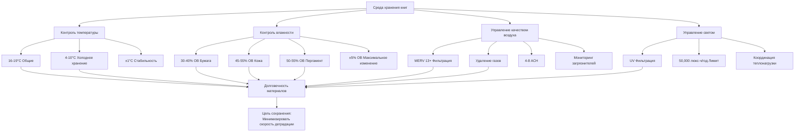

Книги и рукописи представляют одни из наиболее чувствительных к окружающей среде материалов в коллекциях культурного наследия, требующие точного управления HVAC для предотвращения необратимой деградации. Химический состав бумаги, переплетных материалов и чернил создает сложные проблемы сохранения, требующие интегрированных стратегий управления окружающей средой.

## Температура и влажность при сохранении бумаги

Деградация бумаги следует реакциям кинетики первого порядка, при этом температура оказывает доминирующее влияние на скорость детериорации. Взаимосвязь между температурой и скоростью химической реакции следует уравнению Аррениуса:

$$k = A \cdot e^{-E_a/(RT)}$$

где $k$ представляет константу скорости деградации, $A$ — предэкспоненциальный множитель, $E_a$ — энергия активации (обычно 80-100 кДж/моль для гидролиза целлюлозы), $R$ — газовая постоянная (8,314 Дж/моль·К), а $T$ — абсолютная температура в кельвинах.

Эта взаимосвязь демонстрирует, что снижение температуры на каждые 5°C примерно вдвое снижает скорость деградации для большинства механизмов детериорации бумаги. Оптимальные условия хранения поддерживают температуру между 16-19°C с относительной влажностью 30-40% для общих коллекций и 20-35% ОВ для архивных материалов.

Контроль влажности предотвращает множественные пути деградации. Избыточная влажность (выше 65% ОВ) способствует росту плесени, появлению лисьих пятен и волнистости, а низкая влажность (ниже 25% ОВ) вызывает охрупчивание, особенно в клееной бумаге. Равновесное содержание влаги (EMC) в бумаге следует формуле:

$$EMC = \frac{18.02 \cdot K \cdot h}{M_w \cdot (1 - K \cdot h)}$$

где $h$ — относительная влажность (десятичная дробь), $K$ — константа равновесия, а $M_w$ — молярная масса воды. Колебания, превышающие ±5% ОВ, вызывают изменения размеров, которые напрягают волокна и ускоряют механический отказ.

## Требования для кожаных и пергаментных переплетов

Кожаные переплеты требуют других условий, чем бумажные основы. Дубленая кожа содержит белки коллагена, восприимчивые к кислотному гидролизу от атмосферных загрязнителей и остатков дубления. Оптимальные условия для кожи поддерживают 45-55% ОВ и 16-18°C.

Ниже 40% ОВ кожа теряет пластифицирующую влагу, становясь хрупкой и склонной к красной гнили — порошкообразной деградации поверхности зерна. Содержание влаги в коже уравновешивается с окружающей ОВ по-другому, чем целлюлоза, создавая потенциальные конфликты в смешанных томах.

Пергамент (подготовленная животная шкура) проявляет экстремальное гигроскопичное поведение, с изменениями размеров, приближающимися к 2-3% на каждые 10% изменения ОВ. Условия хранения должны поддерживать исключительную стабильность, в идеале ±2% ОВ и ±1°C, с целевыми условиями при 50-55% ОВ и 16-18°C. Несвязанные листы пергамента требуют физического удержания или контролируемого утяжеления для предотвращения волнистости во время неизбежных колебаний окружающей среды.

## Факторы деградации кислотной бумаги

Бумага, изготовленная после 1850 года, часто содержит остаточные кислоты от квасцово-смоляного проклеивания или содержание лигнина в механических древесных целлюлозах. Эти кислоты катализируют расщепление цепочки целлюлозы посредством гидролиза:

$$\text{Целлюлоза-O-Целлюлоза} + H_2O \xrightarrow{H^+} \text{Целлюлоза-OH} + \text{HO-Целлюлоза}$$

Скорость деградации экспоненциально возрастает с температурой и влажностью. При 25°C и 50% ОВ кислотная бумага может потерять 50% стойкости на сгибание в течение 30-50 лет, в то время как идентичные условия продлевают этот период до 200-400 лет для щелочной бумаги.

Атмосферные загрязнители, особенно диоксид серы и оксиды азота, образуют кислоты при контакте с влагой в волокнах бумаги. Реакция $SO_2 + H_2O \rightarrow H_2SO_3$ с последующим окислением до серной кислоты создает локализованные снижения pH, которые распространяют деградацию. Фильтрация HVAC, удаляющая газообразные загрязнители, становится необходимой.

## Преимущества хранения при низкой температуре

Холодное хранение (ниже 10°C) обеспечивает наиболее эффективную стратегию продления долговечности бумаги. Теоретическое расширение срока службы следует формуле:

$$\frac{L_2}{L_1} = e^{\frac{E_a}{R} \left(\frac{1}{T_1} - \frac{1}{T_2}\right)}$$

Снижение температуры хранения с 20°C до 4°C продлевает жизнь бумаги в 8-12 раз, в зависимости от энергий активации механизма деградации. Замороженное хранение (-20°C) достигает практически неограниченного сохранения для кислотной бумаги, но требует тщательных протоколов для извлечения и повторного прогрева, чтобы предотвратить повреждение конденсацией.

Проблемы включают потребление энергии, необходимость в камерах акклиматизации и управление влажностью во время температурных циклов. Материалы должны нагреваться медленно (максимум 5°C/час) в контролируемой влажности, чтобы предотвратить конденсацию.

## Качество воздуха для сохранения бумаги

Фильтрация твердых частиц и газов составляет неотъемлемый компонент HVAC сохранения. Частицы пыли обеспечивают центры кристаллизации для гигроскопичных солей и переносят споры плесени, а кислые газы прямо атакуют волокна бумаги.

Эффективные системы используют:

- **Фильтрация частиц**: MERV 13 минимум (85% эффективен при 0,3-1,0 мкм)
- **Газовая фильтрация**: Активированный уголь или среда перманганата калия, удаляющая SO₂, NO₂, O₃
- **Снижение оксидантов**: Озон ниже 5 ppb
- **Удаление кислотного газа**: SO₂ ниже 1 мкг/м³, NO₂ ниже 10 мкг/м³

Интенсивность воздухообмена 4-8 ACH обеспечивает адекватное разбавление внутренне генерируемых загрязнителей (человеческие биоэффлюенты, выделение газов) при сохранении эффективности фильтрации.

## Интеграция светового воздействия с HVAC

Видимое и ультрафиолетовое излучение вызывает фотохимическую деградацию независимо от температуры, но тепловые эффекты от освещения требуют координации HVAC. Пределы общего лучистого воздействия для бумаги следуют формуле:

$$H = E \cdot t \leq 50,000 \text{ люкс-часов/год}$$

Системы LED-освещения, генерирующие минимальное инфракрасное излучение, снижают охлаждающие нагрузки при одновременном допуске более высоких уровней освещенности во время кратких периодов просмотра. Системы HVAC должны компенсировать теплопритоки от традиционного освещения:

- Накаливание: 90-95% энергии как тепло
- Люминесцентные: 70-75% энергии как тепло
- LED: 15-30% энергии как тепло

Стратегии интеграции включают элементы управления освещением, которые снижают освещенность при отсутствии людей, и схемы вентиляции с вытеснением, которые удаляют тепло от витрин до того, как оно повлияет на материалы коллекции.

## Экологические требования по типам материалов

| Тип материала | Температура | Относительная влажность | Максимальное изменение ОВ | Особые соображения |
|--------------|-------------|-------------------|----------------------|------------------------|
| Современная щелочная бумага | 16-19°C | 30-40% | ±5% ежедневно, ±10% сезонно | Стабильная, толерантная к стандартным условиям |
| Кислотная бумага (1850-1990) | 10-16°C | 30-35% | ±3% | Предпочтительно холодное хранение, рассмотреть дезакидификацию |
| Кожаные переплеты | 16-18°C | 45-55% | ±5% | Контролировать красную гниль, поддерживать гибкость |
| Пергамент/пергаментная бумага | 16-18°C | 50-55% | ±2% | Экстремальная гигроскопичная чувствительность |
| Мелованная бумага | 16-19°C | 35-45% | ±5% | Риск прилипания выше 50% ОВ |
| Фотографические отпечатки в книгах | 16-18°C | 30-40% | ±3% | Низкая влажность предотвращает ферротипию |
| Азиатская бумага (коза, гампи) | 18-21°C | 45-55% | ±5% | Более высокая влажность сохраняет проклеивание |
| Чертежи/диазотипы | 16-19°C | 30-40% | ±5% | Чувствительны к аммиаку, щелочным газам |

## Рекомендации по проектированию системы

Прецизионные системы HVAC для хранения редких книг используют:

1. **Резервное оборудование**: Двойные холодильные машины, увлажнители и воздухообработчики предотвращают отклонения во время технического обслуживания
2. **Цифровые элементы управления**: Управление ПИД-регулятором, поддерживающее ±1°C и ±3% ОВ
3. **Зонированное распределение**: Отдельное управление для читальных залов в сравнении с хранилищами
4. **Десиккантная осушка**: Обеспечивает низкую точку росы подаваемого воздуха для глубокой осушки
5. **Молекулярная фильтрация**: Химические картриджи, рассчитанные на 50-85% эффективность за один проход

Уравнение скорости деградации демонстрирует, что точность окружающей среды генерирует экспоненциальные преимущества консервации, оправдывая сложные стратегии управления для незаменимых материалов.
