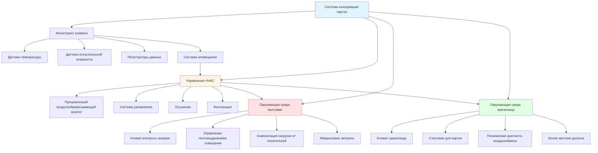

## Требования к холсту и панельным подложкам

Структурная подложка картин демонстрирует отчетливое гигроскопическое поведение, которое определяет спецификации климат-контроля. Холсты из льна, хлопка или синтетических волокон показывают ярко выраженный размерный ответ на изменения относительной влажности. Холсты из натуральных волокон расширяются и сжимаются перпендикулярно направлению переплетения в соответствии с:

$$\Delta L = L_0 \cdot \alpha_{RH} \cdot \Delta RH$$

где $\Delta L$ представляет изменение размера, $L_0$ — исходную длину, $\alpha_{RH}$ — коэффициент гигроскопического расширения (обычно 0,0015–0,0025 на процент относительной влажности для льна), а $\Delta RH$ — изменение относительной влажности.

Деревянные панельные подложки, включая традиционные подложки из дуба, тополя и красного дерева, реагируют еще более резко на колебания влажности. Тангенциальное расширение поперек годичных колец следует:

$$\Delta W = W_0 \cdot \beta_t \cdot \Delta MC$$

где $\beta_t$ представляет коэффициент тангенциального расширения (0,20–0,35 для большинства твердых пород) и $\Delta MC$ — изменение содержания влаги, которое примерно соотносится 1:1 с изменениями относительной влажности в диапазоне 40–60%.

Эти размерные вариации создают механическое напряжение на границе раздела между подложкой и слоями краски, делая стабильность влажности основной проблемой сохранения картин.

## Чувствительность слоя краски к влажности

Пленки краски состоят из сложных многослойных структур с материалами, демонстрирующими различные гигроскопические и механические свойства. Слои масляной краски претерпевают необратимые изменения при воздействии чрезмерной влажности:

- **Гидролиз связующего вещества**: Происходит выше 70% относительной влажности, особенно в состаренных пленках масляной краски
- **Высолы солей**: Растворимые соли мигрируют на поверхность, когда относительная влажность превышает 65%
- **Прорастание плесени**: Грибной рост инициируется выше 65% относительной влажности при достаточном количестве питательных веществ
- **Расслоение**: Отказ интерфейса между слоями грунтовки и подложкой при экстремальных значениях влажности

Акриловые дисперсионные краски демонстрируют зависимость температуры стеклования (Tg) от влажности. При повышенной относительной влажности пластификация снижает Tg, увеличивая липкость и накопление грязи. Ниже 35% относительной влажности акриловые пленки становятся хрупкими с пониженной гибкостью.

Критическим параметром является поддержание относительной влажности в диапазоне, при котором все слои — подложка, грунтовка, пленка краски и лак — остаются механически совместимыми и размерно стабильными.

## Температурные пределы для предотвращения растрескивания

Температура влияет на сохранение картин несколькими механизмами:

**Дифференциалы теплового расширения** между слоями создают напряжение. Коэффициент теплового расширения масляной краски ($\alpha_T \approx 40–60 \times 10^{-6}$ К$^{-1}$) отличается от холста ($\alpha_T \approx 10–15 \times 10^{-6}$ К$^{-1}$), вызывая сдвиговое напряжение на границе раздела:

$$\tau = E \cdot (\alpha_{paint} - \alpha_{canvas}) \cdot \Delta T$$

где $E$ представляет композитный модуль упругости, а $\Delta T$ — изменение температуры.

**Скорости химических реакций** примерно удваиваются каждые 10°C (соотношение Аррениуса), ускоряя окисление масла, образование кислоты и деградацию полимеров. Поддержание более низких температур в пределах комфортного диапазона значительно продлевает долговечность картины.

**Механические свойства** пленок краски деградируют при повышенных температурах. Масляные краски размягчаются выше 25°C, увеличивая уязвимость к повреждениям поверхности и отпечаткам от контакта.

## Ограничения скорости изменения

Постепенные переходы окружающей среды более эффективно предотвращают механические повреждения, чем поддержание жестких абсолютных допусков. Структура картины реагирует на изменения поверхностной относительной влажности в соответствии с кинетикой диффузии, создавая градиенты влажности в подложке, которые генерируют внутреннее напряжение.

Максимальные рекомендуемые скорости изменения:

- **Относительная влажность**: ±2% в час максимум, ±5% в день максимум
- **Температура**: ±2°C в час максимум, ±4°C в день максимум

Сезонный дрейф в пределах приемлемых диапазонов вызывает меньше повреждений, чем частые циклирования в пределах одного и того же общего диапазона. Годовая регулировка установки (например, 50% относительной влажности летом, 45% относительной влажности зимой) учитывает ограничения оболочки здания при предотвращении быстрых колебаний.

## Рассмотрение лаков и глазировки

Поверхностные покрытия реагируют независимо на условия окружающей среды, добавляя сложность к требованиям сохранения.

**Натуральные смоляные лаки** (дамар, мастика) демонстрируют низкие температуры стеклования (30–40°C) и размягчаются при типичных температурах галереи выше 22°C. Эти лаки накапливают грязь, желтеют с возрастом и требуют периодического снятия и замены — процедур, которые напрягают основную краску.

**Синтетические лаки** (акриловые, кетоновые смолы) демонстрируют превосходную стабильность с более высокой Tg (40–60°C), пониженную чувствительность к влажности и улучшенные оптические свойства. Однако они по-прежнему реагируют на экстремальные условия.

**Системы глазировки** на оформленных картинах создают изолированные микроклиматы. Герметичная глазировка предотвращает быстрые колебания относительной влажности, но может задерживать влагу, если картины попадают в более теплую среду, вызывая конденсацию. Вентилируемая глазировка позволяет уравновеситься с условиями галереи при обеспечении физической защиты.

## Условия выставки и хранения

Спецификации окружающей среды отличаются между выставочными и складскими контекстами в зависимости от продолжительности воздействия и требований доступности.

| Параметр | Условия выставки | Условия хранения |
|-----------|-------------------|-------------------|
| Температура | 19–22°C | 17–20°C |
| Относительная влажность | 45–55% | 45–50% |
| Допуск относительной влажности | ±5% сезонно | ±3% круглогодично |
| Кратность воздухообмена | 4–6 ACH | 2–3 ACH |
| Фильтрация | MERV 13 минимум | MERV 11 минимум |
| Воздействие света | <150 люкс видимого | Темнота |
| Содержание УФ | <75 мкВт/люмен | Нулевое |
| Газовая фильтрация | Требуется (кислотные газы) | Требуется (усиленная) |
| Температурный градиент | <3°C вертикально | <2°C вертикально |

**Окружающая среда выставки** уравновешивает сохранение с комфортом посетителей, требуя более высоких кратностей воздухообмена для управления нагрузками от посетителей и тепловыделением от освещения. Прецизионные системы HVAC поддерживают узкие допуски несмотря на переменные тепловые нагрузки.

**Условия хранения** приоритизируют максимальное сохранение за счет пониженных температур, более жесткого контроля влажности и исключения воздействия света. Более низкие метаболические скорости при 18°C в сравнении с 22°C снижают скорость ухудшения примерно на 30% на основе кинетики Аррениуса.

Картины, подлежащие ссуде или выставке, требуют периодов акклиматизации — минимум 24 часа в ящиках перед распаковкой при переходе между окружающей средой — чтобы позволить постепенное уравновешивание и предотвратить конденсацию или быстрые размерные изменения, которые могут вызвать расслоение краски или растрескивание.

Фундаментальный принцип, управляющий сохранением картин, — это стабильность окружающей среды. Стабильные условия в пределах умеренных диапазонов сохраняют картины более эффективно, чем идеальные условия с частыми вариациями.
