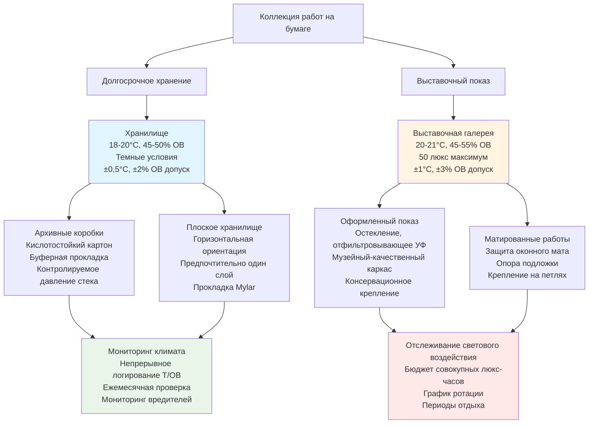

## Требования к температуре и влажности

Работы на бумаге, включая гравюры, рисунки, акварели и манускрипты, представляют одни из наиболее экологически чувствительных материалов в музейных коллекциях. Волокна бумаги подвергаются гигроскопическим изменениям размеров в ответ на колебания относительной влажности, делая точный экологический контроль необходимым для долгосрочного сохранения.

### Оптимальные экологические параметры

Стандартная консервационная практика устанавливает узкие экологические допуски для коллекций на бумажной основе:

| Тип материала | Температура | Относительная влажность | Уровень освещенности | Годовое воздействие |
|---------------|-------------|------------------------|----------------------|---------------------|
| Гравюры (стабильные носители) | 18-21°C | 45-55% ОВ | 50 люкс макс | 150 000 люкс-часов |
| Рисунки (графит) | 18-21°C | 45-55% ОВ | 50 люкс макс | 150 000 люкс-часов |
| Акварели | 18-20°C | 45-50% ОВ | 50 люкс макс | 50 000 люкс-часов |
| Пастельные рисунки | 18-21°C | 45-55% ОВ | 50 люкс макс | 100 000 люкс-часов |
| Исторические документы | 18-20°C | 40-50% ОВ | 50 люкс макс | 150 000 люкс-часов |
| Пергамент/веллум | 16-18°C | 50-60% ОВ | 50 люкс макс | 150 000 люкс-часов |

Уставки температуры остаются постоянными круглый год с максимальным суточным колебанием, не превышающим ±1°C. Контроль относительной влажности требует более жестких допусков, с суточными колебаниями, ограниченными ±3% ОВ, чтобы минимизировать механический стресс волокон бумаги.

## Размерная стабильность волокна бумаги

Бумага реагирует на изменения относительной влажности посредством гигроскопического расширения и сжатия волокон целлюлозы. Изменение размеров можно рассчитать по формуле:

$$\Delta L = L_0 \cdot \alpha_{RH} \cdot \Delta RH$$

где $\Delta L$ — изменение размеров, $L_0$ — исходный размер, $\alpha_{RH}$ — коэффициент гигроскопического расширения (обычно 0,0008-0,0015 на %ОВ для бумаги), а $\Delta RH$ — изменение относительной влажности.

Для размера 61 см, испытывающего колебание 10% ОВ:

$$\Delta L = 61 \text{ см} \cdot 0,0012 \cdot 10 = 0,73 \text{ см}$$

Это расширение/сжатие на 0,73 см создает значительный механический стресс, особенно в точках крепления и вдоль линий складок. Волокна бумаги расширяются в основном в поперечном направлении, а не в длину, с расширением поперек волокна примерно в 10 раз больше, чем расширение вдоль волокна.

### Механизмы повреждения при циклировании влажности

Повторяющееся циклирование влажности вызывает кумулятивное повреждение несколькими механизмами:

1. **Усталость волокна** — циклическое расширение/сжатие ослабляет водородные связи между волокнами целлюлозы
2. **Локальная концентрация напряжений** — различные скорости расширения создают силы сдвига в точках крепления
3. **Ускоренное старение** — механический стресс катализирует гидролитическую деградацию цепей целлюлозы
4. **Плоская деформация** — неравномерное поглощение влаги вызывает волнистость, рябь и размерную нестабильность
5. **Растрескивание материала** — жесткие слои материала (вязкие арабские привязи, пленки чернил) не могут компенсировать расширение подложки

Накопление повреждений следует:

$$D_{cumulative} = \sum_{i=1}^{n} k \cdot (\Delta RH_i)^2 \cdot t_i$$

где $k$ — материал-специфическая константа, $\Delta RH_i$ — величина каждого отклонения влажности, а $t_i$ — продолжительность воздействия.

## Предотвращение лисячьих пятен и биологического роста

Лисячьи пятна появляются как красновато-коричневые пятна, вызванные грибковым ростом или образованием оксида железа в волокнах бумаги. Профилактика требует как контроля влажности, так и управления качеством воздуха.

### Критические пороги влажности

Прорастание спор грибков начинается выше 65% ОВ при совпадении органических питательных веществ и подходящих температур. Рост плесени ускоряется экспоненциально выше 70% ОВ. Связь между относительной влажностью и скоростью роста плесени следует:

$$r_{mold} = r_0 \cdot e^{k(RH - RH_{critical})}$$

где $r_{mold}$ — скорость роста, $r_0$ — базовая скорость, $k$ — температуро-зависимая константа скорости, а $RH_{critical}$ обычно составляет 65% для бумажных материалов.

### Стратегии профилактики

Эффективное предотвращение лисячьих пятен и плесени требует:

- Поддержание ОВ ниже 60% непрерывно с допуском контроля ±3%
- Обеспечение минимум 2-4 воздухообменов в час с фильтрацией MERV 13
- Мониторинг диоксида серы, оксидов азота и загрязнения частицами
- Обеспечение того, чтобы температура поверхности всегда оставалась выше точки росы
- Внедрение обычных протоколов проверки коллекции
- Использование архивных материалов для жилья, которые не выделяют органические кислоты

## Соображения по креплению и матам

Системы крепления должны приспосабливаться к гигроскопическому расширению, одновременно предотвращая механические повреждения. Дифференциальное расширение между бумагой и креплениями создает стресс:

$$\sigma_{mount} = E_{paper} \cdot (\alpha_{paper} - \alpha_{mount}) \cdot \Delta RH$$

где $\sigma_{mount}$ — напряжение крепления, $E_{paper}$ — модуль упругости бумаги, а $\alpha$ представляет коэффициенты гигроскопического расширения.

### Лучшие практики крепления

Консервационные методы крепления минимизируют стресс посредством:

- **Крепление на петлях** — петли из пшеничного крахмала или метилцеллюлозы позволяют свободное движение
- **Плавающие крепления** — бумага подвешена с минимальными точками крепления
- **Оконные маты** — кислотостойкий картон rag отделяет произведение искусства от остекления
- **Фотоуголки** — гибкое крепление без контакта с клеем
- **Утопленные маты** — обеспечивают зазор циркуляции воздуха позади произведения искусства

Все материалы крепления должны пройти Photographic Activity Test ASTM D6819 и поддерживать pH 7,0-9,5 для предотвращения миграции кислоты.

## Хранение в сравнении с условиями экспозиции

Среда хранения и экспозиции существенно различаются по стабильности окружающей среды и продолжительности воздействия.

### Спецификации среды хранения

Объекты долгосрочного хранения поддерживают более жесткий экологический контроль:

- Температура: 18-20°C с суточным колебанием ±0,5°C
- Относительная влажность: 45-50% с суточным колебанием ±2% ОВ
- Воздухообмены: 4-6 ACH с минимальной фильтрацией MERV 14
- Освещение: Полная темнота, кроме периодов доступа
- Контроль частиц: ISO Class 8 (Class 100 000) чистота
- Пределы газообразных загрязнителей: SO₂ <2 мкг/м³, NO₂ <10 мкг/м³, O₃ <2 мкг/м³

Хранилища используют небуферизированный картон rag для кислотной исторической бумаги и буферизированную доску (3% карбонат кальция) для современной бумаги, чтобы нейтрализовать миграцию кислоты.

### Спецификации среды экспозиции

Выставочные галереи приспосабливают комфорт посетителей при одновременной защите коллекций:

- Температура: 20-21°C для баланса консервации с комфортом пассажиров
- Относительная влажность: 45-55% с допуском ±3% ОВ для нагрузки посетителей
- Световое воздействие: 50 люкс максимум с УФ <75 мкВт/люмен
- Продолжительность показа: Максимум 3-4 месяца в цикл выставки
- Период отдыха: Минимум 2-3 года в темном хранилище между выставками
- Микроклимат витрины: Герметичные витрины с буферизацией силикагелем

Совокупный бюджет светового воздействия регулирует графики ротации. Для акварелей, ограниченных 50 000 люкс-часов в год при 50 люкс, максимальное время выставки рассчитывается как:

$$t_{max} = \frac{E_{annual}}{I \cdot h_{daily}} = \frac{50\,000}{50 \cdot 8} = 125 \text{ дней}$$

Это позволяет примерно 4 месяца выставки в год перед требованием продленного темного хранилища для восстановления.

Системы экологического мониторинга непрерывно отслеживают температуру, относительную влажность, уровни освещенности и параметры качества воздуха. Логирование данных с интервалом 15 минут позволяет обнаружить отклонения до того, как произойдут необратимые повреждения, поддерживая упреждающее консервационное вмешательство и долгосрочное сохранение коллекции.
