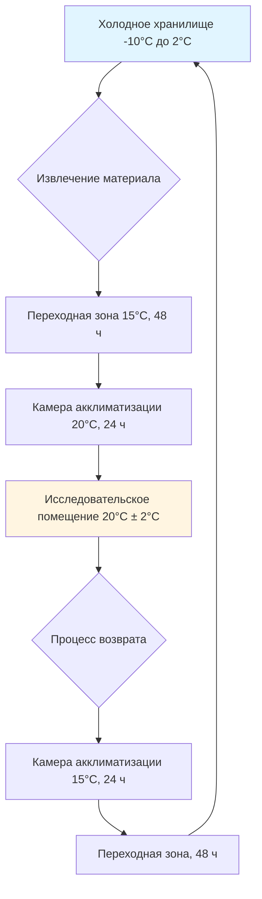

## Физико-химия деградации фотографических материалов

Фотографические материалы подвергаются химической деградации, обусловленной температурой, относительной влажностью и воздействием загрязняющих веществ. Скорость деградации следует зависимости Аррениуса:

$$k = A \cdot e^{-E_a/(RT)}$$

Где:
- $k$ = константа скорости реакции
- $A$ = предэкспоненциальный множитель
- $E_a$ = энергия активации (обычно 60-100 кДж/моль для выцветания краски)
- $R$ = универсальная газовая постоянная (8,314 Дж/моль·К)
- $T$ = абсолютная температура (К)

Эта экспоненциальная зависимость от температуры объясняет, почему снижение температуры хранения с 20°C до 2°C увеличивает срок службы цветной фотографии в 5-8 раз. Каждое снижение на 5-6°C примерно удваивает долговечность хромогенных цветных материалов.

## Требования холодного хранения цветных фотографий

Цветные фотографические материалы содержат органические красители, которые подвергаются окислению, восстановлению и гидролизу. Голубой, пурпурный и желтый красители изображения деградируют с разными скоростями, вызывая со временем цветовые сдвиги.

**Рекомендуемые условия хранения:**

| Тип материала | Температура | Относительная влажность | Расширение ожидаемого срока службы |
|--------------|-------------|-------------------|---------------------------|
| Цветные негативы (C-41) | -10°C до 2°C | 30-40% | 500+ лет |
| Цветные слайды (E-6) | -10°C до 2°C | 30-40% | 500+ лет |
| Цветные отпечатки (хромогенные) | 2°C до 8°C | 30-40% | 100-200 лет |
| Цифровые отпечатки (струйные) | 15°C до 20°C | 30-50% | 100-200 лет (зависит от чернил) |

### Рассмотрения проектирования HVAC хранилища холодного хранения

Хранилища холодного хранения требуют специализированных систем HVAC для поддержания точной температуры и влажности при предотвращении конденсации при извлечении материалов:

Температура точки росы должна быть рассчитана для предотвращения конденсации на холодных материалах:

$$T_d = T - \frac{100 - RH}{5}$$

Где $T_d$ — точка росы (°C), $T$ — температура окружающей среды (°C) и $RH$ — относительная влажность (%). Материалы при 2°C, перемещенные в среду 20°C, 60% RH, будут испытывать конденсацию. Переходные камеры разбивают температурный градиент на этапы ниже дифференциала точки росы.

## Требования для черно-белых фотографий

Фотографии на основе желатиновых галогенидов серебра демонстрируют различные механизмы деградации по сравнению с цветными материалами. Основные проблемы — это деградация желатины, окисление серебра и остаточные химические реакции.

**Оптимальные параметры хранения:**

- **Температура:** 15°C до 20°C
- **Относительная влажность:** 30-40%
- **Пределы загрязняющих веществ:** SO₂ < 1 мкг/м³, NO₂ < 5 мкг/м³, O₃ < 2 мкг/м³

### Чувствительность желатиновой эмульсии к влажности

Желатина гигроскопична и претерпевает изменения размеров при колебаниях влажности. Содержание влаги при равновесии (EMC) следует:

$$EMC = \frac{1800 \cdot h \cdot K}{(1-K \cdot h)(1 + K \cdot h - K)}$$

Где $h$ — относительная влажность (десятичная дробь), а $K$ — константа BET (зависит от температуры). При 30% RH желатина содержит примерно 10% влаги по массе; при 60% RH это увеличивается до 18%.

**Ущерб от циклирования влажности:**

| Диапазон колебаний RH | Изменение размеров желатины | Уровень риска |
|---------------------|---------------------------|------------|
| ± 3% RH | ± 0,15% линейно | Приемлемо |
| ± 5% RH | ± 0,25% линейно | Умеренный риск |
| ± 10% RH | ± 0,50% линейно | Высокий риск — растрескивание |
| ± 20% RH | ± 1,00% линейно | Серьезный — расслаивание |

Системы HVAC должны поддерживать влажность в пределах ±3% для предотвращения механического напряжения на слоях желатины.

## Опасности нитратной и ацетатной основы пленки

### Целлюлозная нитратная пленка

Целлюлозная нитратная пленка (производилась 1889-1951) представляет серьезную пожарную и химическую опасность. Разложение нитрата автокаталитично и экзотермично:

**Этапы разложения:**

**Критические требования хранения:**

- **Температура:** < 7°C — каждое снижение на 5°C замедляет разложение в 2 раза
- **Относительная влажность:** 30-40%
- **Изоляция:** Отдельное хранилище с взрывобезопасной HVAC
- **Вентиляция:** Минимум 10 ACH для удаления диоксида азота
- **Обнаружение:** Непрерывный мониторинг NO₂ (сигнал тревоги при 5 ppm)

Выделение тепла при продвинутом разложении может достигать 1500 кДж/кг, достаточного для самоподдерживающегося горения при температуре окружающей среды.

### Целлюлозный ацетат — синдром уксуса

Целлюлозная ацетатная пленка (безопасная пленка, 1948-настоящее время) подвергается кислотно-катализируемому гидролизу, выделяя уксусную кислоту (запах уксуса):

$$\text{Ацетат} + H_2O \rightarrow \text{Целлюлоза-OH} + \text{CH}_3\text{COOH}$$

Эта автокаталитическая реакция ускоряется по мере накопления уксусной кислоты. Температура хранения напрямую влияет на скорость:

| Температура хранения | Относительная скорость разложения | Ожидаемый срок службы |
|--------------------|---------------------------|-------------------|
| 25°C | 1,0× (базовое значение) | 40-60 лет |
| 15°C | 0,35× | 115-170 лет |
| 5°C | 0,13× | 310-460 лет |
| -10°C | 0,05× | 800-1200 лет |

Системы HVAC для ацетатной пленки должны включать фильтрацию активированным углем для удаления паров уксусной кислоты (предотвращение перекрестного загрязнения) и поддерживать RH ниже 40% для минимизации гидролиза.

## Чувствительность дагеротипов и ранних процессов

Дагеротипы (серебро, нанесенное на медь, 1839-1860-е годы) состоят из амальгамы ртути-серебра на полированной серебряной поверхности. Эта деликатная структура чрезвычайно чувствительна к:

- **Сернистые соединения:** Потускнение происходит при концентрациях S > 0,1 мкг/м³
- **Влажность:** Коррозия ускоряется выше 45% RH
- **Вибрация:** Частицы изображения могут отделиться от основы

**Требуемые условия окружающей среды:**

- Температура: 18°C до 20°C (± 1°C)
- Относительная влажность: 35-40% (± 2%)
- Удаление серы: фильтрация активированным углем + перманганатом калия
- Виброизоляция: хранение на плавающих полах или полках с виброизоляцией

## Цифровое сохранение в сравнении с аналоговым хранением

Файлы цифровых изображений требуют других климатических управлений, чем аналоговые фотографии. Магнитные и оптические носители имеют различные механизмы отказа:

| Носитель хранения | Температура | RH | Основной режим деградации | Оценка срока службы |
|---------------|-------------|-----|-------------------------|-------------------|
| Магнитная лента (LTO) | 16-20°C | 30-40% | Магнитный распад, гидролиз связующего | 30-50 лет |
| Оптический диск (DVD-R) | 18-20°C | 30-40% | Окисление красящего слоя | 20-100 лет (варьируется) |
| Жесткие диски | 20-25°C | 40-50% | Отказ подшипника, крах головки | 5-10 лет (в режиме ожидания) |
| Твердотельный (SSD) | -20 до 25°C | 30-50% | Утечка заряда | 5-10 лет (без питания) |

Цифровое сохранение требует стратегий миграции, а не только управления окружающей средой. Энергетический барьер для удержания заряда в памяти NAND-флэша составляет примерно 0,7 эВ, что приводит к значительной потере заряда при комнатной температуре в течение 5-10 лет.

## Итоговое резюме проектирования системы HVAC

Хранение фотографической коллекции требует нескольких климатических зон:

1. **Холодное хранилище (-10 до 2°C):** Цветные материалы, нитратная пленка
2. **Прохладное хранилище (7-15°C):** Ацетатная пленка, ценные черно-белые
3. **Стандартный архив (18-20°C):** Общие черно-белые коллекции, дагеротипы
4. **Цифровое хранилище (20-25°C):** Магнитные и оптические носители с активным мониторингом

Все зоны должны поддерживать стабильность ±2% RH, использовать многоступенчатую фильтрацию (MERV 13 для частиц + активированный уголь/перманганат калия) и обеспечивать изоляцию от вибрации, света и источников загрязнения. Понижение температуры не допускается из-за рисков конденсации и изменения размеров при тепловых циклах.
