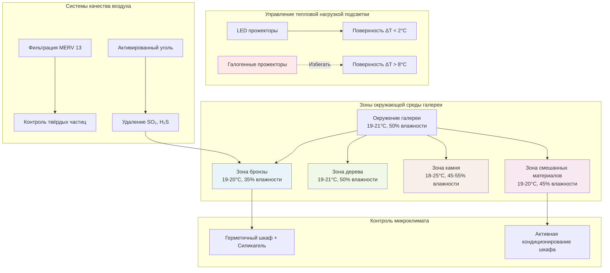

Коллекции скульптур представляют уникальные вызовы для HVAC из-за разнообразного состава материалов, трёхмерных форм с различными площадями поверхности и обычно большей тепловой массы по сравнению с двумерными произведениями искусства. Климатический контроль должен учитывать бронзу, мрамор, дерево, терракоту, полихромные поверхности и всё более распространённые смешанные медиа-ассамбляжи—каждый с отличными гигротермальными требованиями.

## Требования к окружающей среде для конкретных материалов

Бронзовые и металлические скульптуры требуют принципиально иных условий, чем органические материалы. Коррозия бронзы, включая разрушительную болезнь бронзы (преобразование хлорида меди), ускоряется при относительной влажности выше 40%. Оптимальное хранение поддерживает влажность 30-35% при 18-21°C. Скорость коррозии следует зависимости Аррениуса:

$$k = A \cdot e^{-\frac{E_a}{RT}}$$

где $k$ представляет скорость коррозии, $A$ — предэкспоненциальный множитель, $E_a$ — энергия активации (обычно 40-60 кДж/моль для коррозии меди), $R$ — газовая постоянная (8,314 Дж/моль·К), и $T$ — абсолютная температура.

Мраморные и каменные скульптуры переносят более широкие диапазоны окружающей среды благодаря своему геологическому происхождению и врождённой стабильности. Эти материалы выдерживают 18-25°C и 45-55% относительной влажности без изменения размеров. Однако проникновение влаги может мобилизировать растворимые соли, вызывая повреждение субфлоресценцией. Камень требует стабильных условий, а не жёстких допусков—колебания, превышающие ±5°C или ±10% влажности в течение 24 часов, представляют больший риск, чем абсолютные значения.

Деревянные скульптуры проявляют наивысшую чувствительность к изменениям размеров. Коэффициент тангенциального изменения размеров дерева колеблется от 0,15-0,35% на 1% изменения влажности:

$$\Delta L = L_0 \cdot \alpha \cdot \Delta RH$$

где $\Delta L$ — изменение размеров, $L_0$ — исходный размер, $\alpha$ — коэффициент гигроскопического расширения (0,002-0,004/% влажности для тангенциального направления), и $\Delta RH$ — изменение относительной влажности в процентных пункта. Резная дубовая скульптура шириной 60 см испытывает приблизительно 1,4 мм изменение размеров при колебании влажности на 10%, создавая концентрацию напряжений в стыках и полихромных интерфейсах.

## Спецификации окружающей среды для материалов скульптур

| Тип материала | Температура | Относительная влажность | Пределы суточных колебаний | Специальные требования |
|--------------|-------------|-------------------|------------------------|---------------------|
| Бронза (патинированная) | 18-21°C | 30-35% | ±2°C, ±5% влажности | Газовая фильтрация SO₂, H₂S |
| Бронза (активная коррозия) | 18-21°C | <30% | ±1°C, ±3% влажности | Высушенные витрины |
| Мрамор, известняк | 18-25°C | 45-55% | ±5°C, ±10% влажности | Избегать циклов конденсации |
| Дерево (необработанное) | 18-21°C | 45-55% | ±2°C, ±5% влажности | Требуется период акклиматизации |
| Дерево (полихромное) | 18-21°C | 50-55% | ±1°C, ±3% влажности | Повышенная влажность для слоя краски |
| Терракота (неглазурованная) | 18-24°C | 40-55% | ±5°C, ±10% влажности | Умеренная переносимость |
| Смешанные материалы | 18-21°C | 45-50% | ±2°C, ±5% влажности | Компромисс между материалами |
| Железо, сталь | 18-21°C | <35% | ±2°C, ±5% влажности | Поглотители кислорода при герметизации |

## Климатический контроль для скульптур из смешанных материалов

Современная скульптура часто объединяет несовместимые материалы—бронзу с деревом, стекло с органическими волокнами, металл с окрашенными поверхностями. Спецификации окружающей среды должны компромиссно разрешать противоречивые требования, одновременно минимизируя воздействие повреждающих условий на наименее стабильный компонент.

Для комбинаций бронзы и дерева поддерживайте 40-45% влажности при 19-20°C. Это представляет повышенную влажность для бронзы (приемлемо для стабильных патин без активной коррозии) и сниженную влажность для дерева (приближаясь к минимальному равновесному содержанию влаги). Рассчитайте точку компромиссного установления:

$$RH_{компромисс} = \frac{RH_{материал1} \cdot S_{материал1} + RH_{материал2} \cdot S_{материал2}}{S_{материал1} + S_{материал2}}$$

где $S$ представляет чувствительность материала (обратное допустимому диапазону колебаний). Материалы с более высокой чувствительностью утяжеляют компромисс в сторону их предпочтительных условий.

Микроклиматические витрины позволяют отдельным скульптурам поддерживать оптимальные условия в галереях, обслуживающих несколько типов материалов. Герметичный шкаф с буферизацией силикагелем поддерживает 35% влажности для бронзовой скульптуры, в то время как галерея работает при 50% влажности для деревянных работ. Требуемая буферная ёмкость:

$$m_{геля} = \frac{V_{шкафа} \cdot \Delta RH \cdot \rho_{воздуха} \cdot MR}{BC \cdot 100}$$

где $m_{геля}$ — масса силикагеля (кг), $V_{шкафа}$ — объём шкафа (м³), $\Delta RH$ — желаемое различие влажности от окружающей (процентные пункты), $\rho_{воздуха}$ — плотность воздуха (1,2 кг/м³), $MR$ — изменение смешивающего соотношения на % влажности (приблизительно 0,0007 кг воды/кг сухого воздуха при 20°C), и $BC$ — буферная ёмкость (обычно 0,10-0,15 кг воды/кг геля при 40% влажности).

## Соображения по влажности камня и металла

Управление влажностью каменной скульптуры сосредоточено на предотвращении повреждения замораживанием-оттаиванием и мобилизации соли, а не на размерной стабильности. Пористый известняк или песчаник может впитать 5-15% воды по весу. При хранении ниже 0°C образование льда создаёт давление расширения, превышающее 200 МПа, вызывая отслаивание и отшелушивание.

Болезнь бронзы возникает, когда хлорид меди (CuCl) окисляется до гидроксихлорида меди во влажном воздухе, выделяя соляную кислоту, которая дополнительно атакует металл. Критический порог относительной влажности зависит от уровней загрязнения, но обычно происходит при 40-45% влажности. Активная коррозия требует снижения ниже 30% влажности для остановки цикла реакции.

Скорости коррозии металлов следуют концентрациям загрязняющих веществ атмосферы. Диоксид серы создаёт серную кислоту на поверхностях бронзы; сероводород потускняет серебряные сплавы. Газовая фильтрация с использованием активированного угля, пропитанного перманганатом калия, удаляет эти загрязнители до уровня ниже 5 мкг/м³ (в сравнении с городскими наружными уровнями 20-100 мкг/м³).

## Тепловые нагрузки от подсветки дисплеев и эффекты микроклимата

Подсветка скульптур создаёт локализованные температурные градиенты, которые могут превышать ±10°C на освещённой поверхности по сравнению с окружающей галереей. Высокоинтенсивные прожекторы (100-200 люкс для светостойких материалов) генерируют значительное тепло. 50-ваттный галогенный прожектор на расстоянии 1 метра производит приблизительно 12 Вт/м² облучённости на поверхности скульптуры, создавая повышение температуры поверхности:

$$\Delta T_{поверхность} = \frac{q \cdot A_{освещённая}}{h \cdot A_{общая}}$$

где $q$ — падающий тепловой поток (Вт/м²), $A_{освещённая}$ — площадь освещения, $h$ — коэффициент конвективной теплопередачи (обычно 5-10 Вт/м²·К для внутреннего воздуха), и $A_{общая}$ — общая площадь поверхности скульптуры, доступная для конвективного охлаждения.

LED-подсветка снижает тепловые нагрузки на 70-80% по сравнению с галогенными источниками, обеспечивая эквивалентные уровни освещения. 7-ваттный LED прожектор заменяет 50-ваттный галогенный, производя только 2-3 Вт тепла. Это снижает повышение температуры поверхности с 8-10°C до 1-2°C, минимизируя тепловые напряжения в размерно-чувствительных материалах.

Климатический контроль скульптур требует интегрированного проектирования HVAC, учитывающего разнообразие материалов, эффекты тепловой массы, взаимодействия освещения и управление качеством воздуха. Проектирование системы должно обеспечить зональный контроль с стабильностью ±2°C и ±5% влажности для чувствительных материалов при сохранении энергоэффективности через оптимизированные уставки, дополнение микроклимата и внедрение LED-подсветки. Установка непрерывного мониторинга окружающей среды с автоматическим сигналом тревоги обеспечивает раннее обнаружение превышений, которые могут повредить незаменимые трёхмерные произведения искусства.
