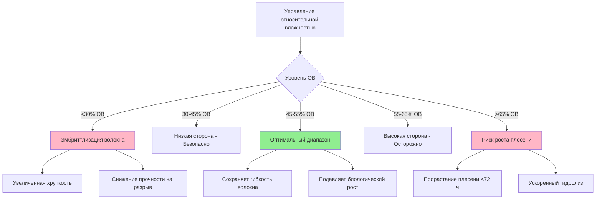
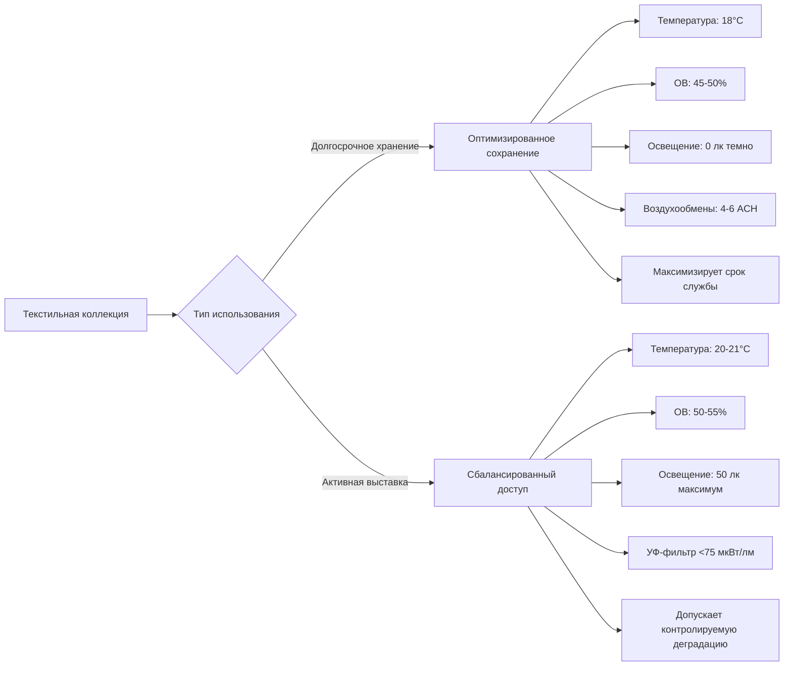

## Требования к климату для текстильных коллекций

Сохранение текстиля требует точного контроля окружающей среды для предотвращения деградации волокон, заражения насекомыми и химического разложения. Фундаментальная задача заключается в балансировании нескольких конкурирующих механизмов деградации, которые по-разному реагируют на температуру, влажность и воздействие света.

### Контроль температуры: 18-21°C

Рекомендуемый диапазон температур 18-21°C представляет оптимальный компромисс между замедлением химической деградации и предотвращением биологических угроз.

**Соотношение Аррениуса для химической деградации:**

Скорость химических реакций в деградации волокна следует уравнению Аррениуса:

$$k = A e^{-E_a/RT}$$

Где:
- $k$ = константа скорости реакции
- $A$ = предэкспоненциальный множитель
- $E_a$ = энергия активации (обычно 50-100 кДж/моль для гидролиза целлюлозы)
- $R$ = газовая постоянная (8,314 Дж/моль·К)
- $T$ = абсолютная температура (К)

Каждое увеличение температуры на 5,6°C примерно удваивает скорость химической деградации. Снижение температуры хранения с 24°C до 20°C продлевает срок службы материала примерно на 40%.

**Влияние температуры на скорости деградации:**

| Температура | Относительная скорость деградации | Активность насекомых | Стоимость энергии |
|-------------|----------------------------------|----------------------|-------------------|
| 16°C | 0,7× | Минимальная | Высокая |
| 18°C | 1,0× (базовая) | Низкая | Умеренная |
| 21°C | 1,4× | Умеренная | Стандартная |
| 24°C | 2,0× | Высокая | Низкая |

### Относительная влажность: 45-55%

Относительная влажность напрямую влияет на механические свойства волокна через циклы сорбции и десорбции влаги.

**Равновесное содержание влаги:**

Текстильные волокна — гигроскопические материалы с равновесным содержанием влаги (RMC), определяемым как:

$$RMC = \frac{m_{вода}}{m_{сухая}} \times 100\%$$

Для целлюлозных волокон (хлопок, лен): RMC ≈ 7-8% при 50% ОВ
Для белковых волокон (шерсть, шелк): RMC ≈ 11-13% при 50% ОВ

**Критические пороги ОВ:**

**Влажность и прочность на разрыв:**

Прочность волокна на разрыв варьируется с содержанием влаги:

$$\sigma_{разрыв} = \sigma_0 \left(1 - \alpha \cdot RMC\right)$$

Где $\alpha$ находится в диапазоне 0,02-0,05 в зависимости от типа волокна. При 50% ОВ хлопок сохраняет примерно 85-90% прочности на разрыв в сухом состоянии, сохраняя при этом гибкость.

### Механизмы деградации волокон

**Гидролитическая деградация:**

Цепи полимера целлюлозы подвергаются кислотно-катализируемому гидролизу:

$$\text{Скорость}_{гидролиз} \propto [H^+] \cdot e^{-E_a/RT} \cdot a_w$$

Где $a_w$ — активность воды (примерно равна ОВ/100). Деградация ускоряется экспоненциально выше 60% ОВ из-за увеличения доступности молекул воды.

**Фото-окислительная деградация:**

Воздействие света вызывает образование свободных радикалов и разрыв цепей:

$$\text{Повреждение} = \int_0^t E_v(\lambda) \cdot S(\lambda) \, d\lambda \, dt$$

Где:
- $E_v(\lambda)$ = спектральная облученность на длине волны $\lambda$
- $S(\lambda)$ = спектральная чувствительность материала
- Интегрирование проводится по времени воздействия $t$

**Сравнение деградации по типам волокон:**

| Тип волокна | Первичная деградация | Критическая ОВ | Чувствительность к свету | Рекомендуемая освещенность |
|------------|---------------------|-----------------|--------------------------|---------------------------|
| Хлопок/Лен | Кислотный гидролиз | >60% | Умеренная | 50 лк |
| Шелк | Фото-окисление | >65% | Очень высокая | 50 лк |
| Шерсть | Повреждение насекомыми | <40% (хрупкое) | Высокая | 50 лк |
| Синтетические | УФ деградация | Менее критичная | Переменная | 150 лк |

### Предотвращение насекомых через климат-контроль

**Подавление температурой:**

Скорости развития насекомых следуют моделям теплового суммирования:

$$D = \frac{K}{T - T_{пороговое}}$$

Где:
- $D$ = время развития (дни)
- $K$ = тепловая константа (градусо-дни)
- $T$ = температура окружающей среды
- $T_{пороговое}$ = минимальная температура развития

Для платяной моли (*Tineola bisselliella*): $T_{пороговое}$ ≈ 7°C, оптимальное развитие при 24-27°C.

Сохранение температуры 18-21°C значительно продлевает время поколения, снижая рост популяции на 60-70% по сравнению с хранением при 24°C.

### Условия для хранения и выставок

**Нагрузки окружающей среды на выставке:**

Установленные текстили сталкиваются с дополнительными нагрузками:

1. **Гравитационная нагрузка:** Вертикальные выставки испытывают растягивающее напряжение $\sigma = \rho g h$, где $\rho$ — плотность волокна, $g$ — ускорение свободного падения, $h$ — высота от точки опоры.

2. **Тепловое излучение от освещения:** Освещение выставки добавляет явную тепловую нагрузку:

$$q_{свет} = \frac{P_{лампа} \times f_{радиант}}{A_{выставка}}$$

Требуя локального охлаждения для поддержания установки температуры.

### Соображения по уходу за историческими костюмами

**Стабильность размеров:**

Костюмы, хранящиеся на манекенах, должны учитывать гигроскопичное расширение:

$$\frac{\Delta L}{L_0} = \beta \cdot \Delta RMC$$

Где $\beta$ — коэффициент гигроскопичного расширения (0,01-0,02 для текстилей). Колебания ОВ, превышающие ±5%, вызывают циклирование размеров, приводящее к механической усталости.

**Многоматериальные узлы:**

Исторические костюмы объединяют материалы с разными гигроскопичными свойствами. Дифференциальное расширение создает внутренние напряжения:

$$\sigma_{внутренняя} = E \cdot (\beta_1 - \beta_2) \cdot \Delta RMC$$

Где $E$ — модуль упругости. Это требует исключительно стабильного контроля ОВ (максимальное отклонение ±3%) для составных предметов одежды.

### Требования системы HVAC

**Параметры точного контроля:**

- Стабильность температуры: ±1,1°C
- Стабильность ОВ: ±3%
- Воздушная фильтрация: MERV 13 минимум (85% эффективность при 1-3 мкм)
- Газовая фильтрация: Активированный уголь для удаления летучих органических соединений
- Скорость воздушного потока: <0,25 м/с по поверхностям
- Наружный воздух: 10-15% для поддержания положительного давления

**Управление психрометрической нагрузкой:**

Общая нагрузка охлаждения включает:

$$q_{общая} = q_{явная} + q_{скрытая} = \dot{m}_{воздух} \left[c_p \Delta T + h_{fg} \Delta \omega\right]$$

Где $\omega$ — коэффициент влажности. Хранение текстиля требует коэффициента явного тепла (SHR) обычно 0,85-0,95 с точным осушением для независимого контроля температуры и влажности.

## Источники

- ASHRAE Handbook - HVAC Applications, Chapter 24: Museums, Galleries, Archives, and Libraries
- ISO 11799:2015 - Information and documentation — Document storage requirements for archive and library materials
- Canadian Conservation Institute Technical Bulletin 13: Relative Humidity - Its Importance, Measurement, and Control in Museums
