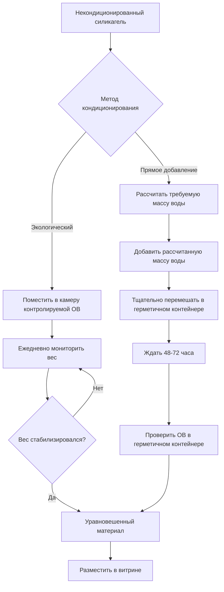
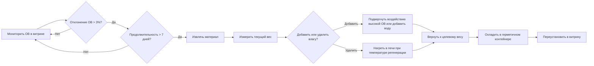

## Основы пассивной буферизации влажности

Пассивная буферизация влажности основана на гигроскопических материалах, которые поглощают и выделяют влагу в ответ на изменения относительной влажности окружающей среды. Физический механизм включает адсорбцию молекул воды на поверхностях материала и абсорбцию в пористые структуры через капиллярную конденсацию и молекулярную диффузию.

Эффективность буферизации зависит от трех критических факторов:

- **Емкость по влаге**: Общая масса воды, которую материал может удерживать на единицу массы сорбента
- **Кинетика сорбции**: Скорость, с которой происходит обмен влагой с окружающим воздухом
- **Характеристики изотермы**: Связь между равновесным содержанием влаги и относительной влажностью при постоянной температуре

### Теория изотермы влажности

Равновесное содержание влаги (EMC) гигроскопических материалов следует изотерме Брунауэра-Эммета-Теллера (BET) для многослойной адсорбции:

$$
\frac{w}{w_m} = \frac{C \cdot \phi}{(1-\phi)[1+(C-1)\phi]}
$$

Где:
- $w$ = равновесное содержание влаги (кг воды/кг сухого материала)
- $w_m$ = содержание влаги в монослое
- $C$ = константа BET, связанная с теплотой адсорбции
- $\phi$ = относительная влажность (десятичное выражение)

Для силикагеля и инженерных буферизирующих материалов модифицированная модель Guggenheim-Anderson-de Boer (GAB) обеспечивает лучшую точность во всем диапазоне относительной влажности:

$$
\frac{w}{w_m} = \frac{C \cdot K \cdot \phi}{(1-K\phi)(1-K\phi+CK\phi)}
$$

Где $K$ — дополнительный параметр, учитывающий свойства многослойности.

## Сравнение буферизирующих материалов

| Материал | Емкость при 50% ОВ | Диапазон буферизации | Требуемое кондиционирование | Температура регенерации | Коэффициент стоимости |
|----------|-------------------|-----------------|----------------------|-------------------|-------------|
| Обычный силикагель | 0,10-0,15 кг/кг | 30-70% ОВ | Да (предварительное уравновешивание) | 120-150°C | 1,0× |
| Art-Sorb | 0,25-0,35 кг/кг | 40-60% ОВ | Умеренное | 80-100°C | 3,5-4,0× |
| ProSorb | 0,30-0,40 кг/кг | 35-65% ОВ | Минимальное | 70-90°C | 4,0-4,5× |
| Индикаторный силикагель | 0,08-0,12 кг/кг | 20-60% ОВ | Да | 120°C | 1,2× |
| Молекулярное сито | 0,15-0,20 кг/кг | 10-40% ОВ | Обширное | 200-250°C | 2,5× |

## Процесс кондиционирования силикагеля

Кондиционирование подготавливает буферизирующий материал к целевой относительной влажности путем установления равновесного содержания влаги. Процесс требует контролируемого воздействия окружающей среды или прямого добавления влаги.

### Расчет кондиционирования

Масса воды, необходимая для кондиционирования силикагеля до целевой ОВ:

$$
m_{water} = m_{gel} \cdot (w_{target} - w_{initial})
$$

Где:
- $m_{water}$ = масса воды для добавления (кг)
- $m_{gel}$ = масса сухого силикагеля (кг)
- $w_{target}$ = EMC при целевой ОВ из изотермы
- $w_{initial}$ = текущее содержание влаги

Для Art-Sorb, кондиционированного до 50% ОВ, начиная с сухого состояния:

$$
m_{water} = 10 \text{ кг} \times (0,30 - 0,02) = 2,8 \text{ кг воды}
$$

## Требования к емкости буферизации

Требуемая масса буферизирующего материала зависит от объема витрины, скорости воздухообмена и внешних колебаний влажности. Фундаментальное уравнение емкости:

$$
M_{buffer} = \frac{V \cdot \rho_{air} \cdot N \cdot \Delta\omega \cdot t}{\Delta w \cdot \varepsilon}
$$

Где:
- $M_{buffer}$ = требуемая масса буфера (кг)
- $V$ = внутренний объем витрины (м³)
- $\rho_{air}$ = плотность воздуха (1,2 кг/м³)
- $N$ = воздухообмены в день (0,1-1,0 для типичных витрин)
- $\Delta\omega$ = разница в коэффициенте влажности между витриной и помещением (кг/кг)
- $t$ = период времени без регенерации (дни)
- $\Delta w$ = диапазон емкости по влаге материала (кг/кг)
- $\varepsilon$ = коэффициент эффективности буферизации (0,6-0,8)

### Практическое правило определения размеров

Для стандартных музейных витрин упрощенный подход, основанный на объемном соотношении:

$$
R_{buffer} = \frac{M_{buffer}}{V} = \frac{k \cdot ACH \cdot \Delta RH}{100 \cdot \Delta w}
$$

Где:
- $R_{buffer}$ = масса буфера на единицу объема (кг/м³)
- $k$ = эмпирическая константа (0,05-0,15)
- $ACH$ = воздухообмены в час
- $\Delta RH$ = допустимое отклонение ОВ (%)

Для хорошо герметизированной витрины (0,1 ACH) с целевым управлением ±5% ОВ с использованием Art-Sorb:

$$
R_{buffer} = \frac{0,10 \times 0,1 \times 10}{100 \times 0,25} = 0,004 \text{ кг/м³}
$$

Умножьте на коэффициент безопасности 5-10 для учета сезонных вариаций и старения материала.

## Производительность Art-Sorb и ProSorb

Art-Sorb и ProSorb — это инженерные материалы на основе силиката кальция с превосходной емкостью и более крутыми наклонами изотермы, чем обычный силикагель. Более крутой наклон означает большее поглощение влаги на единицу изменения ОВ, обеспечивая более эффективную буферизацию.

### Ключевые характеристики производительности

**Art-Sorb**
- Оптимальный диапазон: 45-55% ОВ
- Емкость: 0,30 кг/кг при 50% ОВ
- Наклон: $dw/d\phi \approx 0,8$ при 50% ОВ
- Регенерация: 80-100°C в течение 8-12 часов

**ProSorb**
- Оптимальный диапазон: 40-60% ОВ
- Емкость: 0,35 кг/кг при 50% ОВ
- Наклон: $dw/d\phi \approx 0,9$ при 50% ОВ
- Регенерация: 70-90°C в течение 6-10 часов

Эффективность буферизации пропорциональна наклону изотермы:

$$
\frac{dm_{water}}{dRH} = M_{buffer} \cdot \frac{dw}{d\phi} \cdot \frac{1}{100}
$$

Более крутой наклон означает, что материал выделяет больше влаги при заданном падении ОВ, обеспечивая более сильное буферизирующее действие.

## Циклы регенерации

Буферизирующие материалы требуют периодической регенерации, когда внешние условия постоянно отличаются от целевой ОВ. Частота регенерации зависит от:

- Скорости воздухообмена в витрине
- Разницы между окружающей и целевой ОВ
- Использования емкости материала
- Сезонных закономерностей влажности

### Критерии решения о регенерации

Непрерывно мониторьте ОВ в витрине. Проводите регенерацию, когда:

1. ОВ в витрине отклоняется более чем на ±3% от целевого значения в течение >7 дней
2. Материал достигает 80% емкости в любом направлении
3. Сезонное изменение вызывает сдвиг окружающей ОВ >15%

## Рассмотрение объема витрины

Витрины большего объема требуют пропорционально большего количества буферизирующего материала, но получают преимущества от тепловой и влажностной инертности. Соотношение объема к площади поверхности влияет на требования буферизации:

$$
\frac{V}{A} = \frac{L \cdot W \cdot H}{2(LW + LH + WH)}
$$

Меньшие коэффициенты V/A (тонкие витрины) испытывают более быстрое внешнее уравновешивание и требуют более высокой массы буфера на единицу объема. Для витрин с V/A < 0,1 м увеличьте массу буфера на 30-50%.

## Стандарты консервации и руководства

Справочник музеев Национальной службы парков и ASHRAE Chapter 24 рекомендуют:

- Артефакты класса A: ±5% ОВ, ±2°C
- Артефакты класса B: ±10% ОВ, ±5°C
- Органические материалы: оптимально 45-55% ОВ
- Металлы: <35% ОВ для предотвращения коррозии
- Фотографические материалы: предпочтительно 30-40% ОВ

Выбор буферизирующего материала должен соответствовать чувствительности артефактов и возможности системы HVAC галереи поддерживать стабильные условия окружающей среды.

## Лучшие практики реализации

1. **Рассчитайте требуемую массу** на основе объема витрины, ACH и целевой стабильности
2. **Кондиционируйте материал** до точной целевой ОВ перед установкой
3. **Распределите равномерно** по всему объему витрины для однородной буферизации
4. **Непрерывно мониторьте** с использованием регистраторов данных (минимум точность ±2% ОВ)
5. **Планируйте регенерацию** на основе сезонных закономерностей и данных производительности витрины
6. **Документируйте производительность** для уточнения массы буфера для каждого типа витрины

Пассивная буферизация влажности обеспечивает надежное управление микроклиматом при правильном проектировании и обслуживании. Физико-основанный подход обеспечивает сохранение артефактов при одновременном снижении зависимости от активных систем HVAC в микроокружении витрины.
