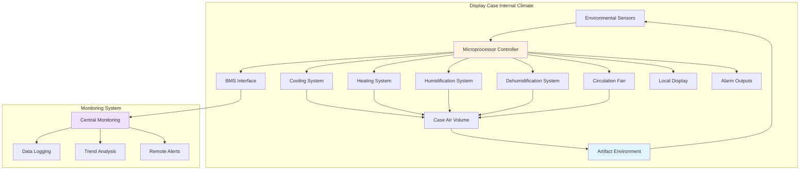

## Методология климатического контроля

Системы климатического контроля внутри витрин устанавливают независимые условия окружающей среды, изолированные от условий окружающей галереи. Эти системы защищают экспонаты от колебаний температуры и относительной влажности, которые происходят в окружающем пространстве.

Существуют два фундаментальных подхода: **пассивный контроль** с использованием гигроскопических буферных материалов и **активный контроль** с использованием механического оборудования кондиционирования. Выбор зависит от чувствительности экспоната, качества конструкции витрины, условий в галерее и рабочих ограничений.

## Пассивный климатический контроль

Пассивные системы полагаются на **гигроскопические материалы** для модерирования колебаний относительной влажности без механического оборудования. Силикагель остается основным буферным агентом, кондиционированным до целевого уровня ОВ перед установкой.

**Принцип работы:** Силикагель поглощает влагу, когда окружающая ОВ превышает его точку равновесия, и высвобождает влагу, когда ОВ падает ниже этого уровня. Емкость буферизации зависит от количества геля, его типа и величины внешних колебаний ОВ.

**Расчет емкости буферизации:**
- **Стандартное требование:** 1 кг силикагеля на 0,1 м³ объема витрины для контроля ±5% ОВ
- **Усиленное требование:** 2-3 кг на 0,1 м³ для более жесткого контроля или сложных условий

| Тип силикагеля | Диапазон ОВ | Емкость буферизации | Рекондиционирование |
|---|---|---|---|
| Стандартная плотность | 40-60% ОВ | Стандартная | Печь при 105°C |
| Art-Sorb | 30-70% ОВ | Усиленная | Камера контролируемой ОВ |
| Индикаторный гель | 40-60% ОВ | Стандартная | Визуальный контроль |
| Молекулярное сито | <30% ОВ | Высокая (сухая) | Регенерация при 250°C |

**Преимущества:**
- Нулевое энергопотребление
- Отсутствие риска механического отказа
- Бесшумная работа
- Простое техническое обслуживание

**Ограничения:**
- Ограниченная продолжительность буферизации (требует периодического рекондиционирования)
- Невозможность контроля температуры
- Неэффективность против больших или продолжительных изменений ОВ
- Требует отличной герметичности витрины (частота воздухообмена <0,5 в день)

## Активный климатический контроль

Активные системы используют **механическое оборудование кондиционирования** для поддержания точной температуры и влажности в объеме витрины. Эти системы функционируют как миниатюрные системы HVAC, предназначенные для отдельных витрин или групп витрин.

### Кондиционирующие блоки, установленные на витринах

Компактные кондиционирующие блоки устанавливаются непосредственно на витрины, обычно в основании или на задней панели. Эти блоки содержат:
- **Охлаждающий змеевик** (на основе хладагента или термоэлектрический)
- **Нагревательный элемент** (электрическое сопротивление)
- **Увлажнитель** (паровпрыск или испарительный)
- **Осушитель** (сбор конденсата)
- **Вентилятор циркуляции воздуха**
- **Микропроцессорный контроллер**

**Определение размера мощности:** Блоки варьируются от 50 до 500 ватт охлаждающей мощности в зависимости от объема витрины, внешней нагрузки и желаемых условий.

| Тип блока | Охлаждающая мощность | Объем витрины | Энергопотребление | Уровень шума |
|---|---|---|---|---|
| Микроблок | 50-100 Вт | <0,5 м³ | 75-150 Вт | 25-30 дБА |
| Компактный блок | 100-250 Вт | 0,5-2,0 м³ | 150-300 Вт | 30-35 дБА |
| Стандартный блок | 250-500 Вт | 2,0-5,0 м³ | 300-600 Вт | 35-40 дБА |
| Система для нескольких витрин | 500-2000 Вт | >5,0 м³ | 600-2400 Вт | 40-45 дБА |

### Системы подачи кондиционированного воздуха

Центральные системы подают предварительно кондиционированный воздух в несколько витрин через распределительную воздуховодную сеть. Подаваемый воздух попадает в витрину, циркулирует через объем экспонирования и возвращается в центральный блок через канал возврата воздуха.

**Параметры проектирования:**
- **Температура подаваемого воздуха:** ±0,5°C от уставки
- **ОВ подаваемого воздуха:** ±2% от уставки
- **Частота воздухообмена:** 2-6 воздухообменов в час
- **Скорость воздуха:** <0,15 м/с на поверхностях экспонатов
- **Диффузия подачи:** Перфорированные панели или щелевые диффузоры

**Преимущества центрального блока:**
- Единое место расположения оборудования для обслуживания
- Выше эффективность в большом масштабе
- Лучшая стабильность управления
- Сокращенный объем внутривитринного оборудования

**Ограничения:**
- Высокая стоимость установки
- Требования к пространству для воздуховодов
- Единая точка отказа, влияющая на несколько витрин
- Невозможность различных уставок для разных витрин

## Архитектура системы управления

## Датчики окружающей среды

Точность датчиков и их размещение прямо влияют на качество управления. **Датчики температуры и ОВ** должны соответствовать спецификациям консервационного класса.

**Требования к датчикам согласно рекомендациям IPI:**
- **Точность температуры:** ±0,3°C
- **Точность ОВ:** ±2% в диапазоне 20-80% ОВ
- **Время отклика:** <60 секунд до 90% скачка
- **Частота калибровки:** Ежегодная проверка по стандартам NIST
- **Размещение:** Середина высоты внутри витрины, минимум 150 мм от экспонатов

**Интеграция передовых датчиков:**
- Расчет точки росы для контроля риска конденсации
- Прогностические алгоритмы для сезонной подстройки кондиционирования
- Многоточечное измерение для больших витрин (>2 м³)
- Измерение температуры поверхности экспоната (бесконтактный ИК)

## Независимое управление витриной

Автономные системы управления обеспечивают независимую работу независимо от системы HVAC галереи. Эта автономность гарантирует защиту экспонатов во время обслуживания или отказа системы галереи.

**Алгоритмы управления:**
- **ПИД-петли управления** для регулирования температуры и ОВ
- **Полосы мертвой зоны:** ±1°C и ±3% ОВ для минимизации переключений
- **Пределы скорости изменения:** Максимум 2°C/час и 5% ОВ/день
- **График снижения:** Сниженное кондиционирование в закрытые часы, если уместно

**Условия сигнализации, вызывающие уведомления:**
- Отклонение температуры >2°C от уставки в течение >30 минут
- Отклонение ОВ >5% от уставки в течение >2 часов
- Отказ оборудования или потеря связи датчика
- Обнаружена конденсация на смотровом стекле
- Прерывание питания, превышающее длительность резервной копии

## Критерии выбора системы

| Фактор | Пассивная система | Активная система |
|---|---|---|
| Начальная стоимость | Низкая ($500-2000) | Высокая ($5000-25000) |
| Эксплуатационные расходы | Минимальные | $200-1000/год |
| Точность управления | ±5-10% ОВ | ±2% ОВ, ±1°C |
| Требование герметичности витрины | Критическое (<0,5 ACH50) | Умеренное (<2 ACH50) |
| Техническое обслуживание | Квартальное кондиционирование геля | Ежемесячная замена фильтра/ежегодное обслуживание |
| Контроль температуры | Нет | Да |
| Допуск условий галереи | Должны быть стабильными | Могут значительно отличаться |
| Чувствительность экспоната | Низкая-средняя | Высокая-экстремальная |

**Структура решения:**
- **Используйте пассивные системы** для умеренно чувствительных материалов в стабильных условиях галереи с хорошо герметичными витринами
- **Используйте активные системы** для высокочувствительных материалов, нестабильных условий галереи или когда требуется точный контроль температуры
- **Гибридный подход:** Пассивная буферизация, дополненная активным осушением, решает сезонные проблемы с высокой ОВ

Активные системы обеспечивают высший контроль окружающей среды при повышенных затратах и сложности. Надлежащая спецификация, установка и техническое обслуживание гарантируют долгосрочное сохранение экспонатов в контролируемом микроклимате.
