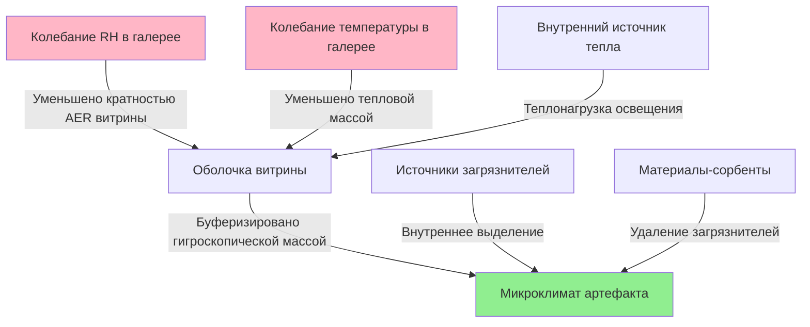

Герметичные витрины функционируют как устройства пассивного контроля климата, изолирующие чувствительные артефакты от колебаний условий окружающей среды в галерее. Эффективность этой защитной стратегии зависит от физики переноса влаги, путей утечки воздуха и гигротермической буферной способности материалов витрины и её содержимого.

## Фундаментальные принципы массопереноса

Скорость инфильтрации воздуха из галереи в герметичную витрину определяет, насколько быстро внешние условия влияют на внутренний микроклимат. Кратность воздухообмена (AER) количественно описывает это явление:

$$\text{AER} = \frac{Q}{V} \quad [\text{ч}^{-1}]$$

где $Q$ — объёмный расход воздуха через пути утечек (м³/ч) и $V$ — внутренний объём витрины (м³). Эффективная герметичная витрина обеспечивает AER < 0,1 ч⁻¹, что означает менее 10% обмена внутреннего объёма воздуха в час.

Утечка воздуха через отверстия в витрине следует отношению истечения из отверстия, управляемому разностью давлений:

$$Q = C_d A \sqrt{\frac{2\Delta P}{\rho}}$$

где $C_d$ — коэффициент расхода (типично 0,6–0,7 для отверстий с острыми кромками), $A$ — общая площадь утечки (м²), $\Delta P$ — разность давлений на оболочке витрины (Па), и $\rho$ — плотность воздуха (кг/м³).

## Испытание кратности воздухообмена

Метод импульсного вымывания газа-трассера обеспечивает количественное измерение герметичности витрины. После введения измеримого газа-трассера (типично SF₆ или CO₂) в герметичную витрину концентрация убывает по кинетике первого порядка:

$$C(t) = C_0 e^{-\lambda t}$$

где $C(t)$ — концентрация трассера в момент времени $t$, $C_0$ — начальная концентрация, и $\lambda$ — постоянная кратности воздухообмена (ч⁻¹). AER определяется из наклона убывания на полулогарифмическом графике концентрации в зависимости от времени.

**Требования к протоколу испытания:**
- Минимальная длительность испытания: 24 часа для герметичных витрин (AER < 0,1 ч⁻¹)
- Интервалы отбора проб: каждые 2–4 часа в начале, затем более длинные интервалы
- Стабильность температуры: ±1°C в течение периода испытания
- Минимум 5 точек данных на кривой убывания
- Поправка на фоновую концентрацию трассера, если применимо

## Анализ путей утечки

Типичные места утечки в музейных витринах включают:

| Место | Типичный расход утечки | Стратегия снижения |
|-------|------------------------|-------------------|
| Дверные уплотнители | 30–60% от общего | Двойные силиконовые уплотнители |
| Люки доступа | 15–25% | Непрерывная самоклеящаяся пена |
| Проходы (кабели, освещение) | 10–30% | Щеточные втулки или герметичные каналы |
| Стыки материалов | 10–20% | Герметизация углов гибким герметиком |
| Отверстия под крепежи | 5–15% | Уплотнительные шайбы под все сквозные болты |

Перепады давления возникают по трём механизмам:
1. **Эффект стека**: $\Delta P = \rho g h (\frac{1}{T_{\text{внеш}}} - \frac{1}{T_{\text{внутр}}})$ для вертикальных витрин
2. **Механическое нагнетание**: Дисбаланс подачи/вытяжки HVAC галереи
3. **Тепловое расширение**: Расширение внутреннего воздуха от теплонагрузки освещения

## Выбор материала уплотнителя

Эффективные уплотнительные материалы должны поддерживать упругое сжатие в течение десятилетий, оставаясь химически инертными. Герметизирующая способность зависит от контактного напряжения и устойчивости к остаточному сжатию.

| Материал | Остаточное сжатие (70 ч @ 23°C) | Риск газовыделения | Срок службы |
|----------|--------------------------------|-------------------|-------------|
| Силиконовый каучук | 8–15% | Очень низкий (использовать пероксидно-вулканизированный) | 30+ лет |
| EPDM | 15–25% | Низкий после периода старения | 20–30 лет |
| Неопрен | 25–40% | Умеренный (пластификаторы) | 10–20 лет |
| ПВХ пена | 40–60% | Высокий (избегать для коллекций) | 5–10 лет |

Требуемая сила сжатия уплотнителя на единицу длины следует:

$$F = w \cdot \sigma_c \cdot t$$

где $w$ — ширина уплотнителя, $\sigma_c$ — напряжение сжатия (типично 20–40 кПа для силикона), и $t$ — сжатая толщина. Дверные защелки должны поддерживать эту силу несмотря на изменения размеров из-за движения древесины или теплового расширения.

## Управление внутренними загрязнителями

Даже герметичные витрины накапливают внутренние загрязнители от:
- **Выделение органических кислот**: Дерево, шерсть, кожа, некоторые клеи
- **Формальдегид**: Фанера, МДФ, некоторые покрытия
- **Сернистые соединения**: Шерсть, резиновые компоненты, некоторые краски
- **Твёрдые частицы**: Строительный мусор, волокна

Накопление концентрации в герметичной витрине следует:

$$C(t) = \frac{ER}{V \cdot \lambda}(1 - e^{-\lambda t})$$

где $ER$ — внутренний уровень выделения (мкг/ч) и $V \cdot \lambda$ — эффективная кратность вентиляции. При равновесии ($t \to \infty$) концентрация достигает $C_{\infty} = \frac{ER}{V \cdot \lambda}$.

**Стратегии контроля загрязнителей:**
- Использовать только состаренные, низкоэмиссионные материалы для внутренних поверхностей
- Указывать порошковое покрытие металла или инертные пластики вместо дерева, где возможно
- Если требуется дерево, герметизировать все поверхности паронепроницаемым барьером (ламинат из алюминиевой фольги или эпоксидное покрытие)
- Включить пассивные сорбенты (активированный уголь, цеолиты) размером в соответствии с объёмом витрины и ожидаемой нагрузкой загрязнителей
- Протестировать материалы с использованием теста Одди или аналогичной оценки коррозионности перед установкой

## Стратегия витрины в галерее

Буферная эффективность герметичной витрины зависит от гигроскопической массы материалов внутри относительно кратности воздухообмена:

$$\tau = \frac{M \cdot \mu}{V \cdot \lambda \cdot \rho_{\text{воздуха}}}$$

где $\tau$ — постоянная времени для выравнивания влаги, $M$ — гигроскопическая масса (кг), $\mu$ — ёмкость сорбции влаги (кг влаги/кг материала на 1% RH изменения), и $\rho_{\text{воздуха}}$ — содержание влаги на единицу объёма при данных условиях.

**Требования конструкции для эффективной буферизации:**
- AER < 0,1 ч⁻¹ поддерживает RH в пределах ±5% в течение 1–2 недель при умеренных колебаниях в галерее
- Гигроскопический буферный материал (силикагель, арт-сорб): 10–20 кг на м³ объёма витрины
- Тепловая масса: минимум 50 кг на м³ для стабилизации температуры
- Источники света внешние по отношению к витрине или LED с минимальным тепловыделением
- Разность температур витрина–галерея: поддерживать < 2°C для минимизации риска конденсации

Ёмкость буферизации влаги определяет, как долго витрина поддерживает стабильное RH при смене условий в галерее:

$$\Delta RH_{\text{витрина}} = \frac{V \cdot \lambda \cdot \Delta RH_{\text{галерея}} \cdot t}{M \cdot \mu}$$

Хорошо спроектированная герметичная витрина с адекватной буферной массой может поддерживать внутреннее RH в пределах ±5% в течение 500–1000 часов даже когда RH в галерее варьирует на ±15%.

## Проверка производительности

**Критерии приёмки:**
- Кратность воздухообмена: < 0,1 ч⁻¹ (превосходно), 0,1–0,5 ч⁻¹ (приемлемо), > 0,5 ч⁻¹ (неадекватно)
- Стабильность внутреннего RH: < 5% вариации в течение 30 дней при RH в галерее варьирующем ±10%
- Уровни внутренних загрязнителей: соответствие рекомендациям IPI или Image Permanence Institute для конкретных материалов коллекции
- Стабильность температуры: в пределах 2°C от галереи, нет потенциала конденсации

Эти количественные показатели позволяют объективно оценить производительность герметичной витрины и информируют решения о том, когда пассивный контроль достаточен в сравнении с необходимостью активного кондиционирования.
